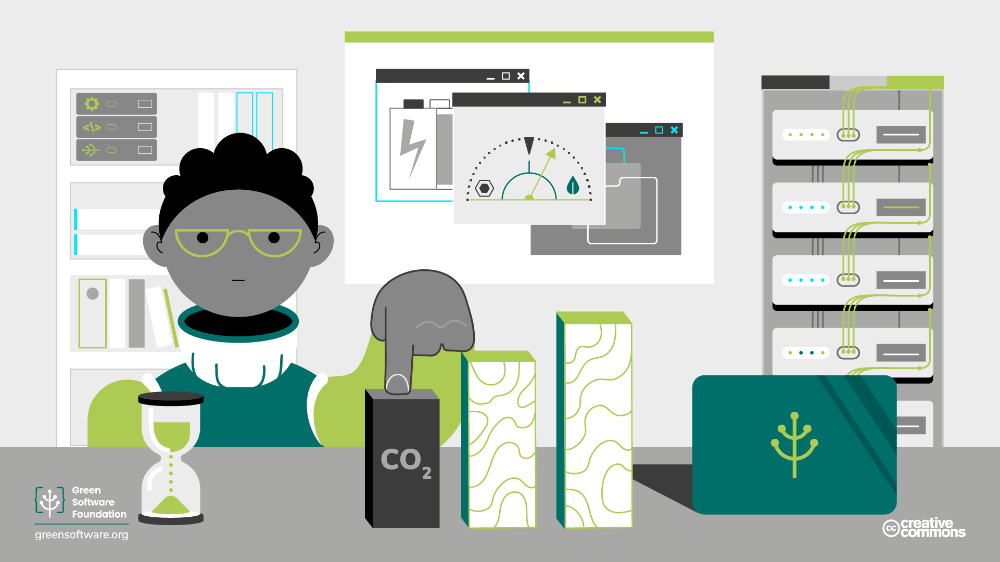

import Quiz from "/src/components/Quiz";

# Efficienza del carbonio

:::tip Principio

_Emettere la minor quantità di carbonio possibile._

:::

## Introduzione

Capire l'impatto dei gas serra sull'ambiente è fondamentale per comprendere l'impronta di carbonio del software. Imparerete a conoscere i diversi tipi di gas a effetto serra presenti nell'ambiente, a capire come vengono emessi e misurati e a capire cosa fanno le diverse organizzazioni nel mondo per controllare e ridurre queste emissioni.

Scoprirete il protocollo GHG e cosa significa per i professionisti del software verde.

## Concetti chiave

### Riscaldamento globale vs cambiamento climatico

Il [riscaldamento globale](https://climate.nasa.gov/global-warming-vs-climate-change/) è il riscaldamento a lungo termine del sistema climatico terrestre osservato a partire dal periodo preindustriale (tra il 1850 e il 1900) a causa delle attività umane, principalmente la combustione di combustibili fossili. [I cambiamenti climatici](https://climate.nasa.gov/global-warming-vs-climate-change/) sono variazioni a lungo termine delle temperature e dei modelli meteorologici. Questi cambiamenti possono essere naturali, ma dal 1800 le attività umane sono state il principale motore del cambiamento climatico.

### Clima vs meteo

Il meteo si riferisce alle condizioni dell'atmosfera in un breve periodo di tempo. Il clima si riferisce alle condizioni dell'atmosfera in un lungo periodo di tempo. Qualsiasi cambiamento nelle condizioni a lungo termine dell'atmosfera causerà anche cambiamenti nelle condizioni a breve termine. Un paragone ovvio è che se la temperatura media dell'atmosfera aumenta, aumenterà anche la temperatura media del tempo in una determinata stagione. Alcuni esempi di cambiamenti misurabili delle condizioni meteorologiche dovuti al cambiamento climatico sono:

- Cambiamenti nel ciclo dell'acqua, comprese le precipitazioni
- Scioglimento dei ghiacci
- Riscaldamento della terra, dell'aria e dell'oceano
- Cambiamenti delle correnti oceaniche, dell'acidità e della salinità

Questi cambiamenti possono portare a inondazioni, sia nelle zone costiere che, a causa dell'aumento delle precipitazioni, siccità, incendi e condizioni meteorologiche estreme più frequenti.

### Gas serra ed effetto serra

I gas serra sono un gruppo di gas che intrappolano il calore della radiazione solare nell'atmosfera terrestre. Questi gas agiscono come una coperta, aumentando la temperatura sulla superficie della Terra. Si tratta di un fenomeno naturale che è stato accelerato dalle emissioni di carbonio prodotte dall'uomo. Ora il clima globale sta cambiando a una velocità superiore a quella a cui animali e piante possono adattarsi.

I gas serra e l'effetto serra sono fondamentali per tutta la vita sulla Terra e spesso provengono da fonti naturali come animali, vulcani e altre attività geologiche. L'effetto serra consente alla Terra di mantenere una temperatura più elevata rispetto a quella che avrebbe senza di essi, catturando più calore dalla radiazione solare. Come molti altri processi naturali della Terra, l'effetto serra è un equilibrio finemente regolato che può essere alterato da molteplici fattori.

### Carbonio e CO2eq

Il carbonio è spesso usato come termine ampio per riferirsi all'impatto di tutti i tipi di emissioni e attività sul riscaldamento globale. CO2eq/CO2-eq/CO2e, che sta per equivalenza di carbonio, è un termine di misura utilizzato per misurare questo impatto. Ad esempio, una tonnellata di metano ha lo stesso effetto riscaldante di circa 80 tonnellate di CO2, quindi la normalizziamo a 80 tonnellate di CO2eq. Si può abbreviare ulteriormente a solo carbonio, termine spesso usato per indicare tutti i gas serra.

## Monitoraggio del cambiamento climatico

A causa degli effetti del cambiamento climatico e di un numero sempre crescente di eventi meteorologici distruttivi, la comunità globale si è impegnata ad affrontare questi problemi e ad adottare misure per controllare e limitare il riscaldamento globale al fine di mitigare e invertire gli effetti del cambiamento climatico.

L'[**Accordo di Parigi sul clima**] (https://unfccc.int/process-and-meetings/the-paris-agreement/the-paris-agreement) è un trattato internazionale concordato nel 2015 da 196 parti e dalle Nazioni Unite per ridurre l'aumento della temperatura terrestre. L'accordo prevede di contenere l'aumento della temperatura media globale entro i 2°C rispetto ai livelli preindustriali, con un limite inferiore preferibile di 1,5°C. L'accordo viene rivisto ogni cinque anni e mobilita finanziamenti ai Paesi in via di sviluppo per mitigare gli impatti del cambiamento climatico e per prepararsi e adattarsi agli effetti ambientali causati dal cambiamento climatico. Inoltre, ogni parte è tenuta ad aggiornare i propri progressi attraverso un contributo determinato a livello nazionale (NDC). L'accordo è attualmente firmato da 193 parti.

La [**Convenzione quadro delle Nazioni Unite sul clima (UNFCCC)**](https://unfccc.int/process-and-meetings/the-convention/what-is-the-united-nations-framework-convention-on-climate-change) è un gruppo creato per raggiungere la stabilizzazione delle concentrazioni di gas a effetto serra nell'atmosfera a un livello tale da prevenire pericolose interferenze con il sistema climatico.

La [**COP (Conferenza delle Parti)**](https://unfccc.int/process/bodies/supreme-bodies/conference-of-the-parties-cop) è un evento annuale che coinvolge tutte le parti della Convenzione quadro delle Nazioni Unite sui cambiamenti climatici. Nel corso della conferenza vengono esaminati e valutati i progressi compiuti da ciascuna parte nell'affrontare il riscaldamento globale, come concordato nell'ambito dell'Accordo sul clima di Parigi. La COP è anche un'occasione per le parti di riunirsi e prendere decisioni che ridurranno gli effetti del riscaldamento globale. Tra i temi comuni vi sono le strategie di riduzione delle emissioni di carbonio, il finanziamento di strategie a basse emissioni di carbonio e la conservazione degli habitat naturali.

L'[**IPCC (Gruppo intergovernativo di esperti sul cambiamento climatico)**](https://www.ipcc.ch/about/), creato dalle Nazioni Unite nel 1988, ha l'obiettivo di fornire ai governi a tutti i livelli informazioni scientifiche da utilizzare per sviluppare politiche climatiche. I rapporti dell'IPCC sono anche un input fondamentale per i negoziati internazionali sul cambiamento climatico. L'IPCC è un'organizzazione di governi membri delle Nazioni Unite o dell'Organizzazione meteorologica mondiale (WMO). Attualmente l'IPCC conta 195 membri.

Le nostre attività emetteranno sempre carbonio, ma essere efficienti in termini di carbonio significa ridurre al minimo la quantità di carbonio emessa per unità di lavoro. Il nostro obiettivo è garantire che per ogni grammo di carbonio che emettiamo nell'atmosfera, estraiamo il massimo valore possibile.

Nel settore del software, il ruolo che svolgiamo nella soluzione del problema del clima è la **costruzione di applicazioni efficienti dal punto di vista delle emissioni di carbonio**. Essere efficienti dal punto di vista delle emissioni di carbonio significa costruire applicazioni che aggiungano lo stesso valore per voi o per i vostri utenti, ma che emettano meno carbonio.

## Sintesi

- I gas serra sono un gruppo di gas che contribuiscono al riscaldamento globale. Il carbonio è spesso usato come termine ampio per riferirsi all'impatto di tutti i tipi di emissioni e attività sul riscaldamento globale. CO2eq è un termine di misura utilizzato per misurare questo impatto.
- La comunità internazionale, in gruppi come l'UNFCCC, si è riunita per limitare l'impatto del riscaldamento globale riducendo le emissioni, con l'obiettivo di raggiungere un limite inferiore "preferibile" di 1,5°C. Questo obiettivo è stato concordato dall'IPCC delle Nazioni Unite nel 2015 nell'[Accordo sul clima di Parigi] (https://unfccc.int/process-and-meetings/the-paris-agreement/the-paris-agreement) e viene monitorato in occasione dei regolari eventi della COP.
- Tutto ciò che facciamo emette carbonio nell'atmosfera e il nostro obiettivo è emettere la minor quantità di carbonio possibile. Questo costituisce il primo principio del software verde: l'efficienza del carbonio, emettendo la minor quantità di carbonio possibile per unità di lavoro.

## Quiz (in inglese)

<Quiz
  QuizList={[
    {
      question: "What are GHGs?",
      answers: [
        { text: "Greenhouse gases", isCorrect: true },
        { text: "Global Heating gases", isCorrect: false },
        { text: "Government Health Gateway", isCorrect: false },
      ],
    },
    {
      question: "How can we abbreviate carbon equivalent?",
      answers: [
        { text: "CO2eq or CO2e", isCorrect: false },
        { text: "carbon or CO2e", isCorrect: false },
        { text: "CO2eq or carbon", isCorrect: false },
        { text: "CO2eq or CO2e or carbon", isCorrect: true },
      ],
    },
    {
      question: "What is the IPCC?",
      answers: [
        { text: "International Panel on Climate Change", isCorrect: false },
        { text: "Intergovernmental Panel on Climate Change", isCorrect: true },
        { text: "International Proposal on Climate Change", isCorrect: false },
      ],
    },
    {
      question: "What is COP?",
      answers: [
        { text: "Carbon Offsetting Project", isCorrect: false },
        { text: "Conference on Pollution", isCorrect: false },
        { text: "Conference of the Parties", isCorrect: true },
      ],
    },
    {
      question:
        "What was the agreed preferred limit to the temperature rise in the Paris Climate Agreement?",
      answers: [
        { text: "1.5ºC", isCorrect: true },
        { text: "2ºC", isCorrect: false },
        { text: "2.5ºC", isCorrect: false },
      ],
    },
    {
      question: "Which of the following statements is true?",
      answers: [
        {
          text: "Short term changes in the weather indicate long term changes to the climate",
          isCorrect: false,
        },
        {
          text: "Long term climate changes affect short-term weather conditions",
          isCorrect: true,
        },
      ],
    },
    {
      question:
        "What has been the key driver of climate change in recent years?",
      answers: [
        { text: "Naturally occurring changes", isCorrect: false },
        { text: "Human activity", isCorrect: true },
        { text: "A combination of the above", isCorrect: false },
      ],
    },
    {
      question: "What do we need greenhouse gases for?",
      answers: [
        {
          text: "Capturing more heat from the Sun to sustain life on Earth",
          isCorrect: true,
        },
        {
          text: "Reflecting heat away from the Earth",
          isCorrect: false,
        },
        { text: "Nothing, they’re always damaging", isCorrect: false },
      ],
    },
  ]}
/>
