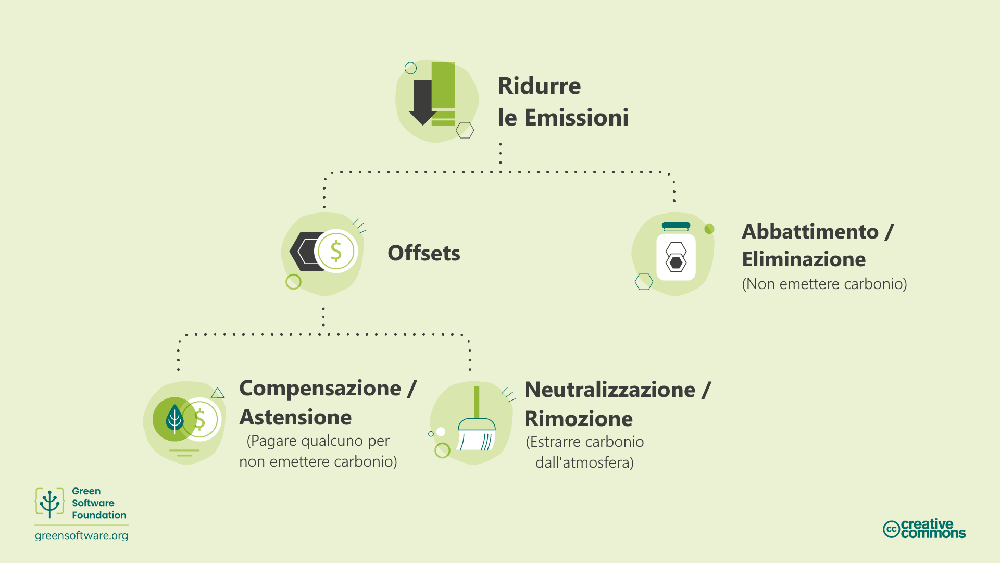
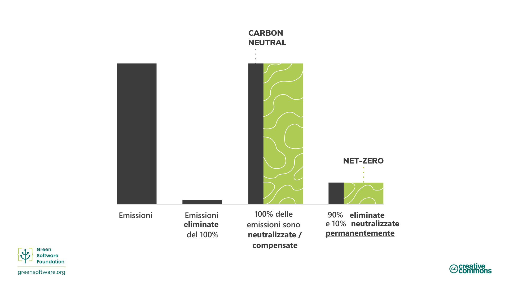
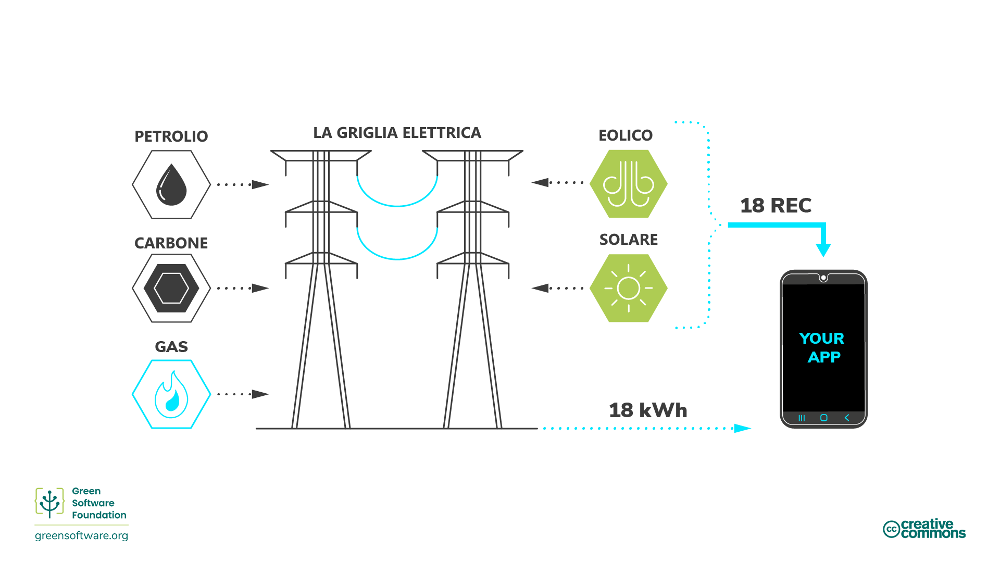
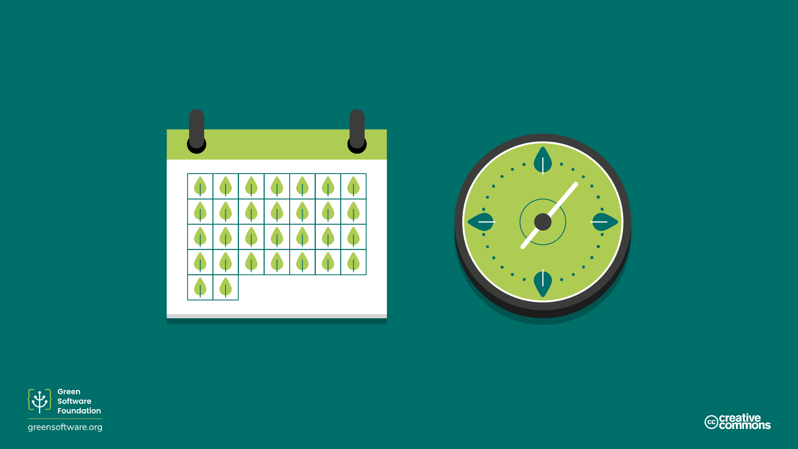
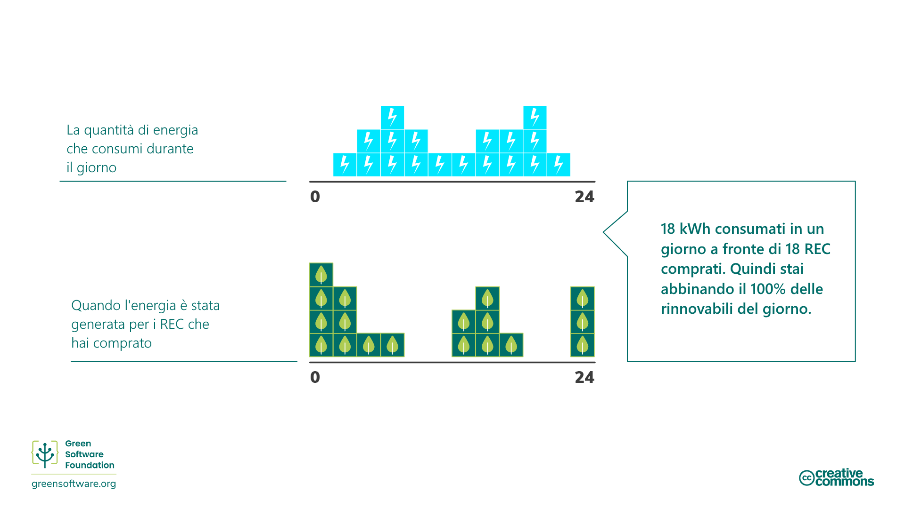
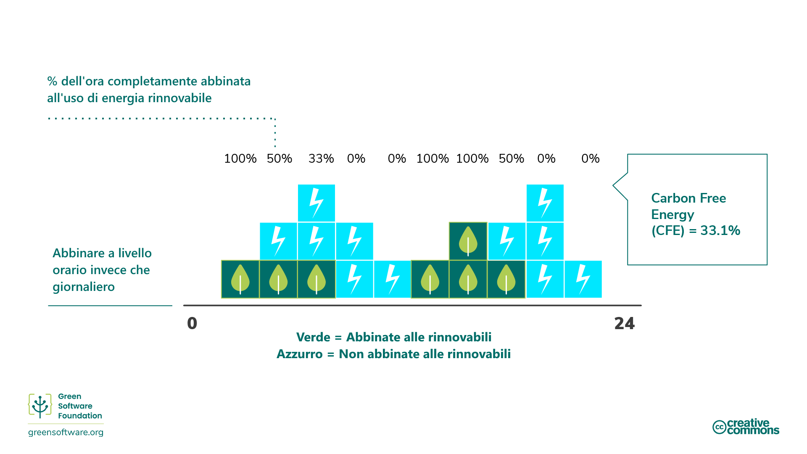
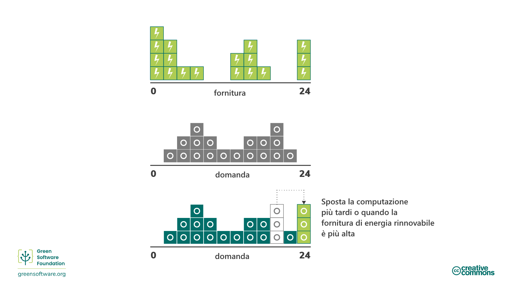

import Quiz from "/src/components/Quiz";

# Impegni climatici

:::tip Principio

_Comprendere l'esatto meccanismo di riduzione del carbonio._

:::

## Introduzione

Negli ultimi anni, molti attori economici hanno cercato di raggiungere diversi obiettivi climatici assumendo vari impegni.

I termini "net zero", "carbon neutral", "carbon negative" e "climate neutral" sono stati usati in modo intercambiabile con l'obiettivo primario di eliminare, ridurre e prevenire le emissioni di carbonio. Con la crescita dell'interesse per questi obiettivi, è essenziale avere una comprensione comune del loro significato e di come raggiungerli attraverso le strategie e le procedure di misurazione che abbiamo imparato.

## Metodologie di riduzione delle emissioni di carbonio

Esistono molti modi per ridurre le emissioni, ma è importante capire l'esatto meccanismo di riduzione quando si pensa agli obiettivi di riduzione.

### Abbattimento / Eliminazione del carbonio

La [Science Based Targets Initiative](https://sciencebasedtargets.org/) fa riferimento a un meccanismo chiamato [abbattimento](https://sciencebasedtargets.org/resources/legacy/2020/09/foundations-for-net-zero-executive-summary.pdf), che significa eliminare le fonti di emissioni di CO2 associate alle operazioni e alla [catena del valore](https://www.cisl.cam.ac.uk/education/graduate-study/pgcerts/value-chain-defs) di un'azienda in modo che non entrino nell'atmosfera. La catena del valore descrive l'intera gamma di attività necessarie per creare un prodotto o un servizio, dalla concezione alla distribuzione. Ciò include l'aumento dell'efficienza energetica per eliminare alcune delle emissioni associate alla produzione di energia.

L'abbattimento non è sufficiente da solo, poiché ci saranno sempre delle emissioni che non potranno essere eliminate a causa di vincoli tecnologici o economici, ma deve costituire il fulcro della strategia di ogni organizzazione, poiché è un'area in cui quasi tutte le aziende possono migliorare.

Per bilanciare queste emissioni residue, dobbiamo considerare altri meccanismi come le compensazioni, gli indennizzi o le neutralizzazioni.

### Offsets (Compensazioni)

Le [compensazioni](https://www.offsetguide.org/understanding-carbon-offsets/what-is-a-carbon-offset/) sono investimenti diretti in progetti di riduzione delle emissioni attraverso l'acquisto di crediti di carbonio sul mercato volontario del carbonio (VCM). Il VCM è un mercato decentralizzato in cui attori privati acquistano e vendono volontariamente crediti di carbonio che rappresentano rimozioni o riduzioni certificate di gas serra dall'atmosfera.

Per compensare le emissioni, è necessario acquistare un volume equivalente di crediti di carbonio per compensare quelle emesse, dove 1 credito di carbonio corrisponde a 1 tonnellata di CO2 assorbita o ridotta.

Da questi progetti possono derivare diversi benefici, dalla protezione dell'ecosistema al rafforzamento delle comunità locali. Tuttavia, per garantire che questi programmi siano implementati correttamente e abbiano l'effetto desiderato sull'ambiente e sull'obiettivo di raggiungere il _world net zero_, esistono standard globali che devono essere rispettati, come il Verified Carbon Standard (VCS) e il Gold Standard (GS).

#### SCI e offset

Le compensazioni di carbonio presentano alcune limitazioni e per questo motivo non vengono considerate nel punteggio SCI di un'organizzazione. Ad esempio, immaginiamo due applicazioni, entrambe in esecuzione su una piattaforma cloud che è compensata al 100% con le emissioni di anidride carbonica e alimentata al 100% da energia rinnovabile. L'applicazione A ha investito molto tempo e risorse per assicurarsi di utilizzare le risorse in modo efficiente, mentre l'applicazione B utilizza le risorse in modo molto inefficiente. Affinché lo SCI sia una metrica utile, l'applicazione A deve ottenere un punteggio migliore rispetto all'applicazione B.

Se lo SCI considerasse le compensazioni, entrambe le applicazioni otterrebbero un punteggio pari a 0. Questo non ci direbbe nulla sull'efficienza dell'uso delle risorse. Sebbene l'applicazione B stia emettendo più molecole di carbonio nell'atmosfera, dato che il suo punteggio è 0 e il punteggio più basso è 0, perché dovrebbe investire ulteriormente per migliorare la sua efficienza in termini di carbonio?

Le organizzazioni devono avere dei piani per eliminare e neutralizzare le emissioni e lo SCI le aiuta ad eliminare le emissioni dovute al software. Questo rende lo SCI un componente essenziale di qualsiasi strategia net-zero.

### Compensazione/Astensione dal carbonio

Le [compensazioni] (https://www.abatable.com/blog/carbon-removal-vs-carbon-avoidance-projects) sono azioni che le aziende intraprendono per aiutare la società a evitare o ridurre le emissioni al di fuori della loro catena del valore. Si tratta essenzialmente di investire in progetti di abbattimento di altre organizzazioni.

Questo include azioni quali:

- **Conservazione** - I crediti vengono creati in base al carbonio non rilasciato attraverso la protezione di vecchi alberi.
- **Progetti comunitari** - Questi progetti aiutano le comunità di tutto il mondo, soprattutto quelle non sviluppate, introducendo metodi di vita sostenibili.
- **Spreco di energia** - Questi progetti catturano il metano/gas di discarica nei villaggi più piccoli, i rifiuti umani o agricoli e li convertono in elettricità.

### Neutralizzazione / Rimozione del carbonio

Le [Neutralizzazioni](https://www.abatable.com/blog/carbon-removal-vs-carbon-avoidance-projects) sono azioni che le aziende intraprendono per rimuovere il carbonio dall'atmosfera all'interno o all'esterno della loro catena del valore. Le neutralizzazioni si riferiscono alla rimozione e allo stoccaggio permanente del carbonio atmosferico per controbilanciare l'effetto del rilascio di CO2 nell'atmosfera. Ciò include azioni quali:

- **Aumentare i pozzi di carbonio naturali** che rimuovono la CO2 dall'atmosfera. Ad esempio, il ripristino delle foreste, poiché la fotosintesi rimuove naturalmente la CO2. L'espansione delle foreste comporta delle sfide, in quanto è essenziale non avere un impatto sulle dinamiche dei terreni agricoli e dell'approvvigionamento alimentare altrove. I moderni metodi di coltivazione possono anche prolungare il tempo in cui il carbonio rimane immagazzinato nel suolo.
- La **cattura diretta dell'aria** è il processo di cattura della CO2 dall'aria e di stoccaggio permanente, nel sottosuolo o in prodotti a lunga durata come il cemento.

L'efficacia di questi metodi viene solitamente misurata in base alla capacità di rimuovere il carbonio alla scala e alla velocità necessarie.

Quando si tratta di progetti di rimozione del carbonio, la durata è un fattore critico. La durata di un progetto descrive quanto a lungo l'anidride carbonica sarà tenuta lontana dall'atmosfera.

La durata a breve termine è fino a 100 anni, quella a medio termine è da 100 a 1.000 anni e quella a lungo termine è superiore a 1.000 anni.

- Le soluzioni che si basano sul ciclo naturale del carbonio della Terra hanno una durata a breve termine misurata in decenni. Ad esempio, i progetti forestali hanno una durata compresa tra 40 e 100 anni.
- Le soluzioni ingegnerizzate, come la cattura diretta dell'aria, hanno spesso una durata a lungo termine che si misura in millenni. Ad esempio, la cattura diretta dell'aria ha una durata di 10.000 anni.
- I progetti a lungo termine sono in genere ordini di grandezza più costosi di quelli a breve termine. Una volta emesso, il carbonio rimane nell'atmosfera per 5.000 anni. Per essere considerato net-zero, il carbonio emesso deve essere eliminato in modo permanente.

Un progetto di rimozione del carbonio a breve termine lo rimuoverà solo per 100 anni, dopodiché tornerà nell'atmosfera a riscaldare il nostro pianeta. Questo è uno dei motivi per cui l'abbattimento è preferibile alla neutralizzazione. Non rilasciare mai il carbonio è molto meglio che rilasciarlo e poi cercare di tenerlo fuori dall'atmosfera per 5.000 anni.

## Impegni per il clima

Esistono diverse strategie di impegni per il clima che un'organizzazione può intraprendere, dalla neutralità del carbonio alla riduzione a zero. Comprendere i diversi significati e le implicazioni di ciascuna di esse può aiutarvi a decidere la strategia giusta per la vostra organizzazione.

### Carbon Neutral

Per raggiungere il pareggio del carbonio, un'organizzazione deve misurare le proprie emissioni, quindi abbinare il totale alle emissioni compensate attraverso progetti di riduzione del carbonio. Ciò può includere progetti di rimozione delle emissioni di carbonio (neutralizzazione) e progetti di astensione dalle emissioni di carbonio (compensazione).

Il pareggio del carbonio è definita da uno standard riconosciuto a livello internazionale: [PAS 2060] (https://info.eco-act.com/hubfs/0%20-%20Downloads/PAS%202060/PAS%202060%20factsheet%20EN.pdf). Sebbene questo standard raccomandi a un'organizzazione di fissare obiettivi di abbattimento, non richiede la riduzione delle emissioni. Quindi, per essere considerata neutrale, un'organizzazione può limitarsi a misurare e compensare senza investire risorse nell'eliminazione delle proprie emissioni di carbonio.

Per essere carbon neutral, è necessario coprire le emissioni dirette (ambito 1 e 2). L'aspettativa generale è che le organizzazioni misurino e compensino i loro ambiti 1 e 2 e i viaggi di lavoro dall'ambito 3. Tuttavia, non esiste un requisito specifico per misurare e compensare le emissioni. Tuttavia, non esiste un requisito specifico per includerlo.

La neutralità rispetto al carbonio è un primo passo significativo per qualsiasi organizzazione, poiché incoraggia la misurazione. Tuttavia, non ci sono abbastanza compensazioni di carbonio nel mondo per compensare le emissioni di tutte le organizzazioni. Pertanto, qualsiasi strategia che non preveda l'abbattimento delle emissioni non sarà in grado di raggiungere l'obiettivo di 1,5 gradi fissato dall'Accordo sul clima di Parigi. È qui che entra in gioco il net zero.

### Net Zero

Net zero significa ridurre le emissioni secondo i più recenti dati scientifici sul clima e bilanciare le emissioni residue attraverso l'eliminazione del carbonio (neutralizzazione). Il Net Zero, per definizione, richiede una riduzione delle emissioni in linea sul percorso dei 1.5°C. Tutte le aziende devono farlo per ottenere emissioni globali net zero entro il 2050.

L'elemento critico che differenzia l'obiettivo net zero da quello neutro è l'attenzione all'abbattimento delle emissioni piuttosto che alle neutralizzazioni e alle compensazioni. Un obiettivo net zero mira a eliminare le emissioni e a utilizzare la compensazione solo per le emissioni residue che non è possibile eliminare.

Lo [standard per il net zero](https://sciencebasedtargets.org/resources/files/foundations-for-net-zero-full-paper.pdf) è stato sviluppato dalla [Science Based Targets initiative](https://sciencebasedtargets.org/) (SBTi). Secondo i loro calcoli, c'è una probabilità del 66% di limitare il riscaldamento globale a 1,5°C se raggiungiamo un livello di abbattimento di circa il 90% di tutte le emissioni di gas serra entro la metà del secolo. Quindi, per raggiungere l'obiettivo del net zero, un'organizzazione deve eliminare il 90% delle proprie emissioni entro il 2050. Le emissioni rimanenti possono essere compensate solo utilizzando neutralizzazioni e rimozioni permanenti di carbonio.

Una strategia a zero emissioni significa che la quantità effettiva di carbonio nell'atmosfera rimane costante.

Inoltre, per essere un obiettivo net zero, è necessario coprire le emissioni dirette e indirette, cioè quelle della catena di approvvigionamento (ambiti 1, 2 e 3). Pertanto, l'intera catena del valore deve essere inclusa nell'ambito del vostro obiettivo net zero. Si tratta di un aspetto significativo, poiché l'ambito 3 spesso rappresenta la maggior parte delle emissioni.

#### SCI come parte di una strategia Net-Zero

L'SCI è una metrica specificamente progettata per favorire l'eliminazione delle emissioni. L'unico modo per ridurre il punteggio è investire tempo e risorse in azioni che eliminino le emissioni. Le uniche attività che SCI riconosce come azioni di eliminazione sono quelle di rendere l'applicazione più efficiente dal punto di vista energetico, più efficiente dal punto di vista dell'hardware o di consumare fonti energetiche a più basso contenuto di carbonio. Le compensazioni sono una componente essenziale di qualsiasi strategia climatica; tuttavia, le compensazioni non sono azioni di eliminazione e quindi non sono incluse nella metrica dello SCI.

Qualsiasi strategia net-zero deve prevedere piani per eliminare e neutralizzare le emissioni. SCI aiuta le organizzazioni ad eliminare le emissioni dovute al software. Questo rende SCI un componente essenziale di qualsiasi strategia net-zero.

### 100% rinnovabile

Quando le organizzazioni si pongono l'obiettivo del 100% di energia rinnovabile, possono distinguere tra essere **abbinati** e **alimentati** da fonti rinnovabili.

Con **alimentato da** si intende alimentato direttamente da una fonte di energia rinnovabile, ad esempio una diga idroelettrica. In questo scenario, gli elettroni che confluiscono nel dispositivo possono provenire solo da quella fonte, per cui si può affermare con certezza di essere alimentati al 100% da fonti rinnovabili.

Per la maggior parte delle persone, viviamo in una rete interconnessa, con molti produttori che immettono elettricità e molti consumatori che la prelevano. Ciò significa che gli elettroni che entrano nel dispositivo sono una miscela di tutti gli elettroni che entrano nella rete. Ad esempio, supponiamo che la rete abbia solo il 5% di energia eolica. Il dispositivo riceve il 5% di elettroni generati dal vento e il 95% di elettroni generati da combustibili fossili.

Non è possibile tracciare i singoli elettroni. Una volta che gli elettroni di un parco eolico sono sulla rete, si mescolano tutti con gli elettroni di un impianto a combustibile fossile. Non c'è quindi modo per un consumatore di insistere che gli elettroni che utilizza provengano solo da fonti rinnovabili.

#### Certificati di energia rinnovabile (REC)

Per risolvere questo problema, un impianto rinnovabile vende due cose. Il primo è la sua elettricità, che vende alla rete. Il secondo è un REC, un [Renewable Energy Certificates] (https://www.epa.gov/green-power-markets/renewable-energy-certificates-recs). 1 REC equivale a 1kWh di energia.

Se si vuole essere alimentati al 100% da energia rinnovabile e si è in rete, la soluzione è acquistare un numero di REC sufficiente a coprire la quantità di elettricità consumata. Ad esempio, se si consumano 100 kWh di elettricità al giorno, per essere abbinati al 100% alle energie rinnovabili si devono acquistare 100 REC.

Quando le organizzazioni si prefiggono obiettivi 100% rinnovabili, l'acquisto di REC sul mercato è la soluzione che spesso adottano per rispettare i loro impegni.

#### PPA

Accanto ai REC si può anche sentire il termine PPA. Un PPA è un [Power Purchase Agreement] (https://ppp.worldbank.org/public-private-partnership/sector/energy/energy-power-agreements/power-purchase-agreements), un altro modo per acquistare REC. Se si stima di aver bisogno di 500MWh di elettricità all'anno per un determinato centro dati, si potrebbe firmare un PPA per acquistare 500MWh all'anno da un impianto rinnovabile. In questo modo si otterrebbero tutti i REC associati a questa centrale.

I PPA sono in genere contratti a lungo termine. Un impianto rinnovabile può trovare finanziamenti con uno di questi accordi, poiché ha già un acquirente per la sua elettricità per molti anni.

I PPA incoraggiano una cosa chiamata **addizionalità**. L'acquisto di un PPA stimola la creazione di nuovi impianti rinnovabili. I PPA sono una soluzione che ci porta verso un futuro in cui tutti hanno accesso al 100% di energia rinnovabile.

### Corrispondenza oraria 24/7

Quando si parla di 100% di energia rinnovabile, la domanda cruciale è: qual è la granularità della corrispondenza? Si sommano e si mettono in rete i dati annuali, mensili, settimanali, giornalieri o orari? Questa domanda è essenziale perché, per una vera transizione verso le energie rinnovabili, è necessario che il 100% dell'energia provenga da fonti energetiche a basso contenuto di carbonio, come le energie rinnovabili, per il 100% del tempo. Questa corrispondenza a grana fine è spesso chiamata _[24/7 hourly matching](https://www.epa.gov/green-power-markets/247-hourly-matching-electricity)_.

La corrispondenza oraria 24/7 è una delle tante strategie che dobbiamo adottare per accelerare la transizione verso una rete al 100% alimentata da fonti rinnovabili. Ad esempio, [Google](https://sustainability.google/progress/energy/) e [Microsoft](https://blogs.microsoft.com/blog/2021/07/14/made-to-measure-sustainability-commitment-progress-and-updates/) si sono entrambe impegnate a realizzare la corrispondenza oraria 24/7 entro il 2030.

#### Corrispondenza giornaliera e oraria

Immaginate che un'organizzazione abbia una curva di domanda come questa, ogni quadrato blu rappresenta 1kWh:

Hanno acquistato REC da un parco eolico che ha generato elettricità con una curva, quindi ogni quadrato verde rappresenta 1 REC. La corrispondenza per giorno significa che l'organizzazione ha consumato 18 kWh e ha acquistato 18 REC. Di conseguenza, la compensazione è pari a zero. Quindi possono dire di essere **abbinati al 100% con energia rinnovabile ogni giorno**.

Tuttavia, se si considera il dato in termini di ore (ogni quadrato è di 2 ore), la situazione appare un po' diversa:

La quantità totale di energia consumata è ancora di 18kWh. Tuttavia, ci sono solo alcune ore del giorno in cui l'energia rinnovabile è al 100% per quell'ora. Quindi, per alcune ore, abbiamo molta più energia rinnovabile di quella necessaria. Al contrario, per la maggior parte delle ore abbiamo una quantità di energia rinnovabile inferiore al fabbisogno.

Nell'esempio di cui sopra, sono **soddisfatti al 100% dall'energia rinnovabile su base oraria solo per 6 ore al giorno**.

#### Energia priva di carbonio (CFE)

Il numero che utilizziamo per descrivere il successo dell'abbinamento orario 24/7 è la percentuale di energia priva di carbonio.

L'energia priva di carbonio è definita come [la percentuale media di energia priva di carbonio consumata in una particolare località su base oraria](https://cloud.google.com/sustainability/region-carbon#understanding).

Quindi, per l'esempio precedente, se misurato utilizzando la corrispondenza giornaliera, siamo al 100% di energia rinnovabile. Tuttavia, siamo solo al 33,1% se la misurazione avviene su base oraria. **La percentuale di CFE è quindi del 33,1%**.

#### Carbon Awareness come parte di una strategia di abbinamento orario 24/7

L'informatica consapevole delle emissioni di carbonio consiste nel rispondere ai segnali di intensità di carbonio elettrico e nel modificare il **comportamento** del software, in modo che emetta meno anidride carbonica. La consapevolezza del carbonio aiuta anche un'organizzazione a raggiungere l'obiettivo di corrispondenza oraria 24/7 e ad aumentare la percentuale di CFE.

Un esempio di modifica del comportamento è lo spostamento dell'elaborazione in un momento in cui è disponibile più energia rinnovabile. Ad esempio, ritardare l'avvio di un'esecuzione di addestramento di un modello di apprendimento automatico, o anche ritardare la ricarica di un computer portatile, in un momento in cui l'intensità di carbonio dell'elettricità è inferiore e l'offerta di energia rinnovabile è maggiore.

:::tip
L'informatica consapevole delle emissioni di carbonio aiuta le organizzazioni ad aumentare la loro percentuale di CFE.
:::

## Sintesi

- Esistono diverse metodologie comunemente applicate per contribuire alla lotta globale contro il cambiamento climatico. Queste rientrano nelle categorie generali di eliminazione delle emissioni di carbonio (note anche come "abbattimento"), astensione dalle emissioni di carbonio (note anche come "compensazione") o rimozione delle emissioni di carbonio (note anche come "neutralizzazione").
- L'abbattimento comprende l'aumento dell'efficienza energetica per eliminare alcune delle emissioni associate alla produzione di energia. L'abbattimento è il modo più efficace per combattere il cambiamento climatico, anche se la completa eliminazione del carbonio non è possibile.
- La compensazione comprende l'adozione di fonti di energia rinnovabili, pratiche di vita sostenibili, riciclaggio, piantagione di alberi, ecc.
- Le neutralizzazioni si riferiscono alla rimozione e allo stoccaggio permanente del carbonio atmosferico per controbilanciare l'effetto del rilascio di CO2 nell'atmosfera. Le neutralizzazioni tendono a rimuovere il carbonio dall'atmosfera nel breve e medio termine.
- Un'organizzazione può definirsi Carbon Neutral quando le sue emissioni totali corrispondono al totale delle emissioni compensate attraverso progetti di riduzione del carbonio.
- L'obiettivo di Net Zero è eliminare le emissioni e compensare solo le emissioni residue che non è possibile eliminare per raggiungere l'obiettivo di 1.5°C stabilito dall'Accordo sul clima di Parigi.
- SCI è accuratamente progettato in modo che l'eliminazione delle emissioni, attraverso l'efficienza energetica, l'efficienza hardware e la consapevolezza delle emissioni di carbonio sia l'unico modo per ridurre il punteggio. Insieme a una strategia di neutralizzazione separata, può costituire la base di una strategia net-zero per un'organizzazione.
- Quando le organizzazioni si pongono l'obiettivo del 100% di energia rinnovabile, possono essere "abbinate a" o "alimentate da" fonti rinnovabili, dove "alimentate da" significa che gli elettroni che fluiscono nel dispositivo possono provenire solo da fonti rinnovabili. Questo può essere ottenuto acquistando REC come parte di un PPA.
- L'abbinamento orario 24/7 è una delle tante strategie che dobbiamo adottare per accelerare la transizione verso una rete al 100% alimentata da fonti rinnovabili.

## Quiz (in inglese)

<Quiz
  QuizList={[
    {
      question: "What are neutralisations?",
      answers: [
        {
          text: "Actions that remove carbon from the atmosphere",
          isCorrect: true,
        },
        {
          text: "Actions that reduce carbon emissions",
          isCorrect: false,
        },
        {
          text: "Actions that support climate initiatives",
          isCorrect: false,
        },
      ],
    },
    {
      question: "What is a critical consideration for neutralizations?",
      answers: [
        {
          text: "Volume of neutralization",
          isCorrect: false,
        },
        {
          text: "Durability of neutralization",
          isCorrect: true,
        },
        {
          text: "Cost of neutralization",
          isCorrect: false,
        },
      ],
    },
    {
      question:
        "What approach can you take to neutralize carbon emissions from energy consumption?",
      answers: [
        {
          text: "Enhance natural carbon sinks",
          isCorrect: false,
        },
        {
          text: "Direct air capture",
          isCorrect: false,
        },
        {
          text: "Both of the above",
          isCorrect: true,
        },
      ],
    },
    {
      question: "What is responsible for setting the standard for net zero?",
      answers: [
        {
          text: "SBTi",
          isCorrect: true,
        },
        {
          text: "STBi",
          isCorrect: false,
        },
        {
          text: "STIB",
          isCorrect: false,
        },
      ],
    },
    {
      question: "What is the net-zero global target?",
      answers: [
        {
          text: "Eliminate 100% of emissions by 2050",
          isCorrect: false,
        },
        {
          text: "Eliminate 90% of emissions by 2050",
          isCorrect: true,
        },
        {
          text: "Eliminate 80% of emissions by 2050",
          isCorrect: false,
        },
      ],
    },
    {
      question: "What is the primary goal with abatement/elimination?",
      answers: [
        {
          text: "Offset your carbon emissions using a financial contract",
          isCorrect: false,
        },
        {
          text: "Not emitting carbon into the atmosphere in the first place",
          isCorrect: true,
        },
        {
          text: "Reduce emissions related to a company’s operations by improving energy efficiency",
          isCorrect: false,
        },
      ],
    },
    {
      question: "Which measurement protocol or method incorporates offsets?",
      answers: [
        {
          text: "GHG protocol",
          isCorrect: true,
        },
        {
          text: "SCI",
          isCorrect: false,
        },
      ],
    },
    {
      question: "What is the minimum criteria for being carbon neutral?",
      answers: [
        {
          text: "Emissions from scopes 1-3 must be offset by neutralizations or compensations",
          isCorrect: false,
        },
        {
          text: "Emissions from scopes 1 and 2 must be offset by neutralizations or compensations",
          isCorrect: true,
        },
        {
          text: "Emissions from scopes 1-2 and business travel from scope 3 must be offset by neutralizations or compensations",
          isCorrect: false,
        },
      ],
    },
  ]}
/>
