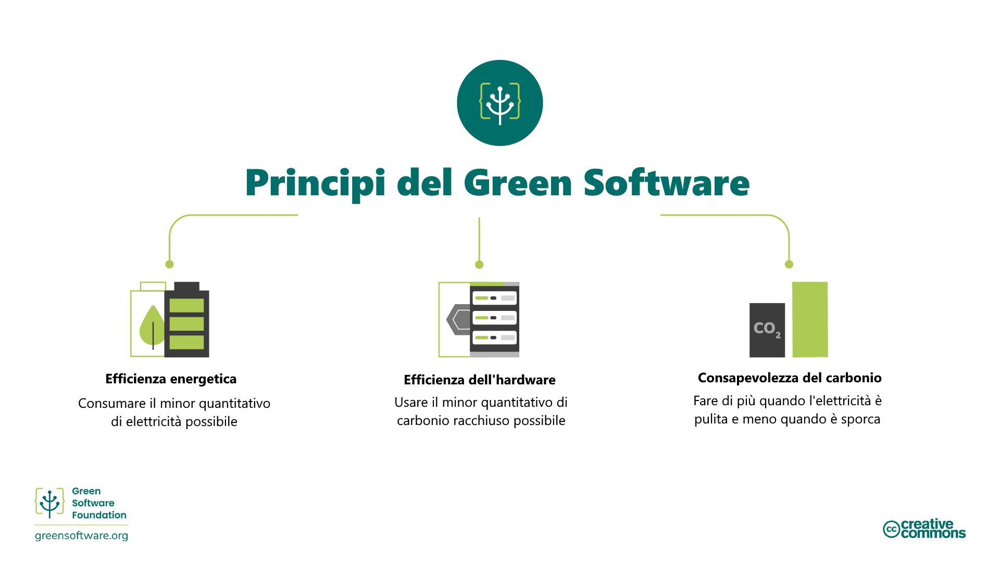
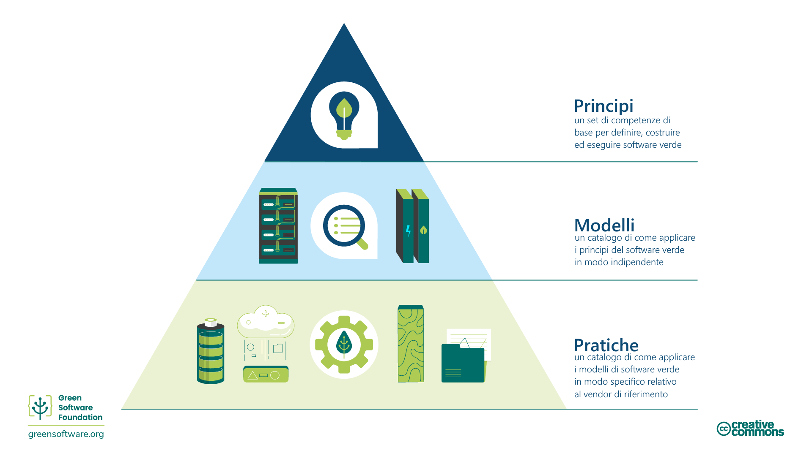

# Introduzione

## Cos'è il software verde?

Il software verde (Green Software) è una disciplina emergente che si colloca all'intersezione tra scienza del clima, progettazione del software, mercati dell'elettricità, hardware e progettazione dei datacenter.

Il software verde è un software efficiente dal punto di vista delle emissioni di carbonio, ovvero che emette la minor quantità possibile di emissioni di carbonio. Solo tre attività riducono le emissioni di carbonio del software: l'efficienza energetica, la consapevolezza delle emissioni di carbonio e l'efficienza dell'hardware. Questa formazione spiegherà tutti questi concetti, come applicarli ai vostri processi e come misurarli, oltre ad alcune delle linee guida e delle organizzazioni internazionali che guidano e monitorano questo settore.

## Chi dovrebbe leggere questa guida?

Chiunque sia coinvolto nel processo di costruzione, distribuzione o gestione del software. Studiando questi principi, un professionista del software verde può prendere decisioni che hanno un impatto significativo sull'inquinamento da carbonio delle proprie applicazioni.

## Storia

Nel 2019 sono stati pubblicati gli otto principi originali dell'ingegneria del software verde. Questo aggiornamento del 2022 dei principi ha tenuto conto dei feedback ricevuti nel corso degli anni, unificando alcuni principi e aggiungendone uno nuovo, relativo alla comprensione degli impegni climatici.

## Come essere un professionista del software verde

La seguente formazione copre 6 aree chiave che un professionista del software verde dovrebbe conoscere:

1. **Efficienza del carbonio**: Emettere la minor quantità possibile di carbonio.
2. **Efficienza energetica**: Utilizzare la minor quantità di energia possibile.
3. **Consapevolezza del carbonio**: Fare di più quando l'elettricità è più pulita e fare di meno quando l'elettricità è più sporca.
4. **Efficienza dell'hardware**: Utilizzare la minor quantità possibile di carbonio racchiuso.
5. **Misurazione**: Ciò che non si può misurare, non si può migliorare.
6. **Impegni per il clima**: Comprendere l'esatto meccanismo di riduzione delle emissioni di carbonio.

Ciascuno di questi capitoli introdurrà alcuni nuovi concetti e spiegherà in dettaglio perché sono importanti in termini di clima e come potete applicarli alle vostre pratiche di software verde.

## Principi, modelli e pratiche.

Le aree e i contenuti principali di questo corso descrivono i **principi** del software verde, un insieme di competenze fondamentali necessarie per definire, eseguire e costruire software verde.

Un [**pattern**] di software verde (https://patterns.greensoftware.foundation/) è un esempio specifico di applicazione di uno o più principi in un esempio del mondo reale. Mentre i principi descrivono la teoria alla base del software verde, i pattern sono i consigli pratici che i professionisti del software possono utilizzare oggi nelle loro applicazioni. I pattern sono neutrali rispetto ai fornitori.

Una **pratica** di software verde è un modello applicato a un prodotto di un fornitore specifico e informa i professionisti su come utilizzare quel prodotto in modo più sostenibile.

Le pratiche dovrebbero fare riferimento a modelli che dovrebbero fare riferimento a principi.

La Green Software Foundation pubblica anche un [catalogo di modelli di software verde neutrali rispetto ai fornitori](https://patterns.greensoftware.foundation/) in varie categorie.
 

