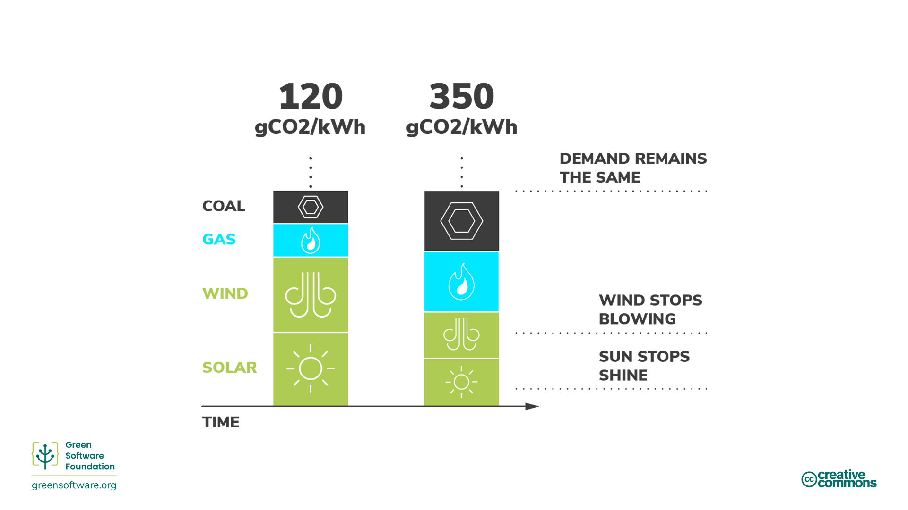

import Quiz from "/src/components/Quiz";

# Carbon Awareness

:::tip Principle

_Do more when the electricity is cleaner and do less when the electricity is dirtier._

:::

## Introduction

Not all electricity is produced in the same way. In different locations and times, electricity is generated using a variety of sources with varying carbon emissions. Some sources, such as wind, solar, or hydroelectric, are clean, renewable sources that emit little carbon. On the other hand, fossil fuel sources emit carbon at varying degrees to produce electricity. For example, both gas and coal emit more carbon than renewable sources, but gas-burning power plants emit less carbon than coal-burning power plants.

Carbon awareness is the idea of doing more when more energy comes from low carbon sources and doing less when more energy comes from high carbon sources.

## Key concepts

### Carbon intensity

Carbon intensity measures how much carbon (CO2e) is emitted per kilowatt-hour (KWh) of electricity consumed. The standard unit of carbon intensity is gCO2eq/kWh, or grams of carbon per kilowatt hour.

If your computer is plugged directly into a wind farm, its electricity would have a carbon intensity of 0 gCO2eq/kWh since a wind farm emits no carbon to produce that electricity. However, most people can't plug directly into wind farms; instead, they plug into power grids supplied with electricity from various sources.

Once on a grid, you can't control which sources supply the electricity you are using; you simply get a mix of everything. So, your carbon intensity will be a mix of all the current power sources in a grid, both the lower- and the higher-carbon sources.

### Variability of carbon intensity

Carbon intensity varies by location since some regions have an energy mix containing more clean energy sources than others.

Carbon intensity also changes over time due to the inherent variability of renewable energy caused by the unpredictability of weather conditions. For example, when it's cloudy or the wind isn't blowing, carbon intensity increases since more of the electricity in your mix comes from sources that emit carbon.

### Dispatchability & curtailment

Electricity demand varies during the day, and supply always needs to be able to meet that demand. A brownout (a dip in the voltage level of the power line) occurs if a utility doesn't produce enough electricity to meet demand. Conversely, if a utility produces more electricity than is required, then to stop infrastructure burning out, breakers trip and we have blackouts.

There needs to be a balance between the demand and supply of electricity at all times and the responsibility for this usually falls to the utility provider.

In the case of fossil fuels such as coal, it is easier to control the power produced for this supply; this is called **dispatchability**. However, in the case of renewable power sources such as wind farms, the power produced cannot easily be controlled (we can't control how much the wind blows). If the power source produces more electricity than is needed, that electricity is thrown away; this is called **curtailment**.

### Marginal carbon intensity

If you suddenly need to access more power - for example, you need to turn on a light - that energy comes from the marginal power plant. The marginal power plant is dispatchable, which means marginal power plants are often powered by fossil fuels.

Marginal carbon intensity is the carbon intensity of the power plant that would have to be employed to meet any new demand.

Fossil-fueled power plants rarely scale down to 0. They have a minimum functioning threshold, and some don't scale; they are considered a consistent, always-on baseload. Because of this, we sometimes have the scenario where we curtail (throw away) renewable energy while still consuming energy from fossil fuel power plants.

In these situations, the marginal carbon intensity will be 0 gCO2eq/kWh since we know that any new demand will match the renewable energy we are curtailing.

### Energy markets

The exact market model varies around the world but broadly follows the same model.

When the demand for electricity goes down, utilities need to **reduce** the supply to balance supply and demand. They can do this in one of two ways:

1. **Buy less energy from fossil fuel plants.**

Energy from fossil fuel plants is usually the most expensive so this is the preferred method. This directly translates to burning fewer fossil fuels.

2. **Buy less energy from renewable sources**.
   Renewable sources are the cheapest, so they prefer not to do this. If a renewable source doesn't manage to sell all of its electricity, it has to throw the rest away.

Reducing the amount of electricity consumed in your applications can help decrease the energy's carbon intensity seeing as the first thing to be scaled back are fossil fuels.

When the demand for electricity goes up, utilities need to increase the supply to balance supply and demand. They can do this in one of two ways:

1. **Buy more energy from renewable sources that are currently being curtailed**

If you are curtailing, it means you have excess energy you could dispatch. Renewable energy is already the cheapest, so curtailed renewable energy will be the cheapest dispatchable energy source. Renewable plants will then sell the energy they would have had to curtail.

2. **Buy more energy from fossil fuel plants**.

Fossil fuels are inherently dispatchable; they can quickly increase energy production by burning more. However, coal costs money, so this is the least preferred solution.

Energy markets are some of the most complex markets in the world so the above explanation is a simplification. But what's important to understand is that our goal is to increase investment into lower carbon energy sources, like renewables, and decrease investment into higher carbon sources, like coal. The best way to ensure money flows in the right direction is to make sure you use electricity with the least carbon intensity.

## How to be more carbon aware

:::tip

Using electricity when the carbon intensity is low is the best way to ensure investment flows towards low-carbon emitting plants and away from high-carbon emitting plants.

:::

There is a global transformation happening right now. All around the world, electricity grids are changing from primarily burning fossil fuels to sourcing energy from lower carbon sources like wind and solar. This is one of our best hopes for meeting our global reduction targets. As green software practitioners, let's see some of the ways we can help accelerate that transition.

The primary driver for the transition is economic rather than any sustainability target. Renewables are winning because they are cheaper and getting even more affordable over time. So, to help accelerate the transition, we need to make renewable plants more profitable and fossil fuel plants less profitable. The best way to do that is to use more electricity when it's coming from lower-carbon sources like renewables and less electricity when it's coming from higher-carbon sources.

Carbon intensity is lower when more energy comes from lower-carbon sources and higher when it comes from higher-carbon sources.

### Demand shifting

Being carbon aware means responding to shifts in carbon intensity by increasing or decreasing your demand. If your work allows you to be flexible with when and where you run workloads, you can shift accordingly - consuming electricity when the carbon intensity is lower and pausing production when it is higher. For example, training a Machine Learning model at a different time or region with much lower carbon intensity.

[Studies](https://ieeexplore.ieee.org/document/6128960) show these actions can result in 45% to 99% carbon reductions depending on the number of renewables powering the grid.

Demand shifting can be further broken down into spatial and temporal shifting.

#### Spatial shifting

Spatial shifting means moving your computation to another physical location where the current carbon intensity is lower. It might be a region that naturally has lower carbon sources of energy. For example, moving to different hemispheres depending on the season for more sunlight hours.

#### Temporal shifting

If you can't shift your computation spatially to another region, another option you have is to shift to another time. Perhaps later in the day or night when it's sunnier or windier and, therefore, the carbon intensity is lower. This is called temporal demand shifting. We can predict future carbon intensity reasonably well through advances in weather forecasting.

Some of the biggest technology companies have recognised the importance of carbon awareness and are using advanced modeling techniques to implement demand shifting.

- **Google Carbon Aware Data Centers** - Google launched a project to [make some of the cloud workloads carbon aware](https://blog.google/outreach-initiatives/sustainability/carbon-aware-computing-location/). They created models to predict tomorrow's carbon intensity and workload. They then shaped large-scale workloads so more would happen when and where the carbon intensity is lowest, but in such a way that they could still handle the expected load.
- **Microsoft Carbon Aware Windows** - [Microsoft announced a project to make Windows 11 more sustainable](https://www.techradar.com/news/windows-11-is-getting-an-eco-friendly-update-but-could-microsoft-do-more). Initially, this means running Windows updates when the carbon intensity is lower.

### Demand shaping

Demand shifting is the strategy of moving computation to regions or times when the carbon intensity is lowest. Demand shaping is a similar strategy. However, instead of moving demand to a different region or time, we shape our computation to match the existing supply.

- If carbon intensity is low, increase the demand; do more in your applications.
- If carbon intensity is high, decrease demand; do less in your applications.

Demand shaping for carbon-aware applications is all about the supply of carbon. When the carbon cost of running your application becomes high, shape the demand to match the supply of carbon. This can happen automatically, or the user can make a choice.

Eco mode is an example of demand shifting. Eco modes are found in everyday appliances like cars or washing machines. When activated, some amount of performance is sacrificed in order to consume fewer resources (gas or electricity). Because there is this trade-off with performance, eco modes are always presented to a user as a choice.

Software applications can also have eco modes that can - either automatically or with user consent - make decisions to reduce carbon emissions.

One example of this is video conferencing software that adjusts streaming quality automatically. Rather than streaming at the highest quality possible at all times, it reduces the video quality to prioritize audio when the bandwidth is low.

Another example is TCP/IP. The transfer speed increases in response to how much data is broadcast over the wire.

A third example is progressive enhancement with the web. The web experience improves depending on the resources and bandwidth available on the end user’s device.

Demand shaping is related to a broader concept in sustainability, which is to reduce consumption. We can achieve a lot by becoming more efficient with resources, but we also need to consume less at some point.

As Green Software practitioners, we would consider canceling a process when the carbon intensity is high instead of demand shifting - reducing the demands of our application and the expectations of our end users.

## Summary

- Carbon awareness means understanding that the energy you consume does not always have the same impact in terms of carbon intensity.
- Carbon intensity varies depending on the time and place it is consumed.
- The nature of fossil fuels and renewable energy sources means that consuming energy when carbon intensity is low increases the demand for renewable energy sources and increases the percentage of renewable energy in the supply.
- Demand shifting means moving your energy consumption to different locations or times of days where the carbon intensity is lower.
- Demand shaping means adapting your energy consumption around carbon intensity variability in order to consume more in periods of low intensity and less in periods of high intensity.

## Quiz

<Quiz
  QuizList={[
    {
      question: "What is carbon intensity?",
      answers: [
        {
          text: "The amount of carbon produced using clean energy sources",
          isCorrect: false,
        },
        {
          text: "The amount of carbon produced per kilowatt hour",
          isCorrect: true,
        },
        { text: "0gCO2eq/kWh", isCorrect: false },
      ],
    },
    {
      question: "What is the standard unit of carbon intensity?",
      answers: [
        { text: "gCO2eq/kWh", isCorrect: false },
        { text: "gCO2e/kWh", isCorrect: false },
        { text: "Either of the above", isCorrect: true },
      ],
    },
    {
      question: "What two variables affect carbon intensity?",
      answers: [
        { text: "Location and time", isCorrect: true },
        { text: "Supply and demand", isCorrect: false },
        { text: "Time and demand", isCorrect: false },
      ],
    },
    {
      question:
        "Which of the following is not true about marginal power plants?",
      answers: [
        { text: "They are dispatchable", isCorrect: false },
        { text: "They usually burn fossil fuels", isCorrect: false },
        {
          text: "They are located in places where clean energy sources are not available",
          isCorrect: true,
        },
      ],
    },
    {
      question: "What is curtailment?",
      answers: [
        { text: "Surplus energy supply", isCorrect: false },
        {
          text: "Energy that is thrown away due to oversupply",
          isCorrect: true,
        },
        { text: "Reducing supply to match demand", isCorrect: false },
      ],
    },
    {
      question: "Which of the following is not an example of demand shifting?",
      answers: [
        {
          text: "Consuming more electricity when the carbon intensity is lower",
          isCorrect: false,
        },
        { text: "Switching to renewable energy", isCorrect: true },
        {
          text: "Pausing production when carbon intensity is higher",
          isCorrect: false,
        },
      ],
    },
    {
      question: "What are the two types of demand shifting?",
      answers: [
        { text: "Temporal and permanent", isCorrect: false },
        { text: "Spatial and temporal", isCorrect: true },
        { text: "Curtailment and dispatchability", isCorrect: false },
      ],
    },
    {
      question: "What is demand shaping?",
      answers: [
        {
          text: "Do more when carbon intensity is low, do less when carbon intensity is high",
          isCorrect: true,
        },
        {
          text: "Do more when carbon intensity is high, do less when carbon intensity is low",
          isCorrect: false,
        },
        {
          text: "Do more when costs are low, do less when costs are high",
          isCorrect: false,
        },
      ],
    },
    {
      question: "Which of the following is an example of carbon awareness?",
      answers: [
        {
          text: "Creating a piece of software that produces very low emissions",
          isCorrect: false,
        },
        {
          text: "Canceling a process when you know carbon intensity is high",
          isCorrect: true,
        },
        {
          text: "Using cloud servers instead of in-house servers",
          isCorrect: false,
        },
      ],
    },
  ]}
/>
