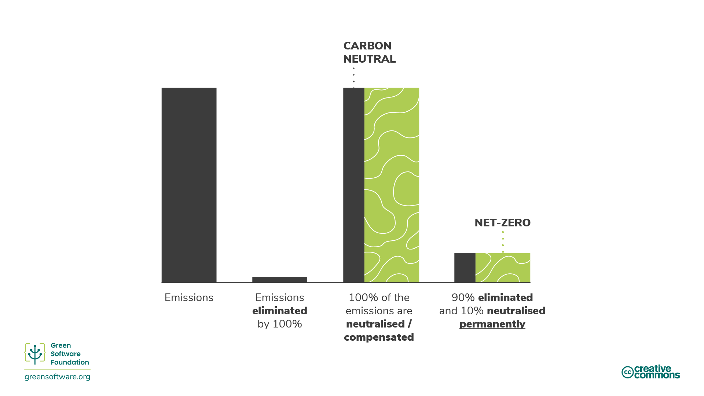

# Climate Commitments

:::tip Principle

*Understand the exact mechanism of carbon reduction.*

:::

## Introduction

In recent years, many economic actors have sought to reach different climate goals by making various commitments.

The terms "net zero", "carbon neutral", "carbon negative" and "climate neutral" have been used interchangeably with the primary objective to remove, reduce and prevent carbon emissions. As interest in these targets grows, it is essential to have a common understanding of what they mean and how to achieve them through the strategies and measurement procedures we have learnt.

## Carbon reduction methodologies

There are many ways to reduce emissions but it's important to understand the exact mechanism of the reduction when thinking about reduction targets.

### Abatement / Carbon Elimination

The [Science Based Targets Initiative](https://sciencebasedtargets.org/) refers to a mechanism called **abatement**, which means eliminating sources of CO2 emissions associated with a company's operations and value chain so that they do not enter the atmosphere. This includes increasing energy efficiency to eliminate some of the emissions associated with energy generation.

Abatement is not enough on its own as there will always be some emissions that can't be eliminated due to technological or economic constraints, but it must form the core of every organization’s strategy as it is an area where almost every company can improve on. 

To balance those residual emissions, we need to look at other mechanisms such as offsets, compensations or neutralizations.

### Offsets

Offsets are direct investments in emission-reduction projects through the purchase of carbon credits on the voluntary carbon market (VCM). The VCM is a decentralized market where private actors voluntarily buy and sell carbon credits that represent certified removals or reductions of GHGs from the atmosphere. 

To offset emissions, you need to purchase the equivalent volume of carbon credits to compensate for those emitted, where 1 carbon credit corresponds to 1 tonne of CO2 absorbed or reduced.

Various positive benefits can stem from these projects, from ecosystem protection to empowering local communities. However, to ensure these programs are implemented correctly and have the desired effect on the environment and the aim to reach world net zero, there are global standards that they must meet such as Verified Carbon Standard (VCS) and Gold Standard (GS).

#### SCI and Offsets

There are some limitations to carbon offsets and that is why they are not considered in an organization’s SCI score. For example, imagine two applications, both running on a cloud platform that is 100% carbon offset and matched 100% by renewable energy. Application A has invested significant time and resources into making sure it is using resources efficiently, whereas application B uses resources very inefficiently. For the SCI to be a helpful metric, application A needs to score better than application B.

If the SCI considered offsets, both applications would score 0. This wouldn’t tell us anything about how efficiently they are using resources. Although application B is emitting more carbon molecules into the atmosphere, since its score is 0 and the lowest score is 0, why would it make further investments into improving its carbon efficiency?

Organizations need to have plans for how to both eliminate as well as neutralize emissions and the SCI helps them to drive the elimination of emissions due to software. This makes the SCI an essential component of any net-zero strategy.

### Compensating / Carbon Avoidance

Compensations are actions that companies take to help society avoid or reduce emissions outside of their value chain. This is essentially investing in other organizations' abatement projects.

This includes actions such as:

* **Conservation** - Credits are created based on carbon not released through protecting old trees.
* **Community Projects** - These projects help communities worldwide, mainly undeveloped ones, by introducing sustainable living methods.
* **Waste to energy** - These projects capture methane/landfill gas in smaller villages, human or agriculture waste, and convert it into electricity.

### Neutralizing / Carbon Removal

Neutralizations are actions that companies take to remove carbon from the atmosphere within or beyond their value chain. Neutralizations refer to the removal and permanent storage of atmospheric carbon to counterbalance the effect of releasing CO2 into the atmosphere. This includes actions such as:

* **Enhancing natural carbon sinks** that remove CO2 from the atmosphere. For example, forest restoration, since photosynthesis removes CO2 naturally. Forest expansion comes with challenges as it's essential not to impact the dynamics of farmland and food supply elsewhere. Modern farming methods can also prolong the time carbon remains stored in soil.
* **Direct air capture** is the process of capturing CO2 from the air and storing it permanently, either underground or in long-lived products like concrete.

The effectiveness of these methods is typically measured based on whether they can deliver carbon removal at the scale and speed needed.

When it comes to carbon removal projects, durability is a critical consideration. The durability of a project describes how long the carbon dioxide will be kept from the atmosphere.

Short-term durability is up to 100 years, medium-term is 100 to 1,000 years, and long-term is more than 1,000 years.

* Solutions that rely on Earth's natural carbon cycle have short-term durability measured in decades. For example, forestry projects have a durability of 40 to 100 years.
* Engineered solutions such as direct air capture often have long-term durability measured in millennia. For example, direct air capture has a durability of 10,000 years.
* Long-term projects are typically orders of magnitude more expensive than short-term projects. Once emitted, carbon remains in the atmosphere for 5,000 years. To be considered net zero, carbon that has been emitted needs to be permanently removed.

A short-term carbon removal project will only remove carbon for 100 years, after which it's back in the atmosphere warming up our planet. This is one of the reasons why abatement is preferred to neutralization. Never releasing carbon is far better than releasing carbon and then trying to keep it out of the atmosphere for 5,000 years.

## Climate commitments

There are many different climate reduction strategies that an organization can commit to, from carbon neutral to net zero. Understanding the different meanings and implications of each one can help you decide on the right strategy for your organization.

### Carbon Neutral

To achieve carbon neutrality, an organization must measure its emissions, then match the total to its emissions offsets through carbon reduction projects. This can include carbon removal projects (neutralizations) and carbon avoidance projects (compensations).

Carbon neutrality is defined by an internationally recognized standard: [PAS 2060](https://info.eco-act.com/hubfs/0%20-%20Downloads/PAS%202060/PAS%202060%20factsheet%20EN.pdf). Although this does recommend an organization sets abatement targets, it doesn't demand they reduce their emissions. So to be considered carbon neutral, an organization can just measure and offset without investing resources in eliminating their carbon emissions.

To be carbon neutral, you must cover direct emissions (scope 1 and 2). The general expectation is that organizations measure and offset their scopes 1 and 2, and business travel from scope 3. However, there is no specific requirement to include that.

Carbon neutral is a significant first step for any organization since it encourages measurement. However, there are not enough carbon offsets in the world to offset the emissions of all the organizations. Therefore, any strategy that doesn't include abatement will not scale or help the world achieve the 1.5 degree target set by the Paris Climate Agreement. This is where net zero comes into play.

### Net Zero

Net zero means reducing emissions according to the latest climate science and balancing remaining residual emissions through carbon removals (neutralizations). Net zero, by definition, requires emissions reductions in line with a 1.5°C pathway. All businesses must do this to achieve net-zero global emissions by 2050.

The critical differentiator between net zero and carbon neutral is net zero's focus on abatement rather than neutralizations and compensations. A net-zero target aims to eliminate emissions and only to use offsetting for the residual emissions that you cannot eliminate

The [standard for net zero](https://sciencebasedtargets.org/resources/files/foundations-for-net-zero-full-paper.pdf) is being developed by the [Science Based Targets initiative](https://sciencebasedtargets.org/) (SBTi). They calculate that there is a 66% probability of limiting global warming to 1.5°C if we reach a level of abatement of about 90% of all GHG emissions by mid-century. So, to meet a net-zero target, an organization needs to eliminate 90% of its emissions by 2050. The remaining emissions can only be offset using neutralizations and permanent carbon removals. 

A net-zero strategy would mean that the actual amount of carbon in the atmosphere remains constant.

Also, to be a net-zero target, you must cover direct and indirect, i.e. supply chain emissions (scopes 1,2 and 3). Therefore, your entire value chain needs to be included in the scope of your net-zero target. This is significant since scope 3 often represents the majority of emissions.

#### SCI as part of a Net-Zero strategy

The SCI is a metric specifically designed to drive the elimination of emissions. The only way to reduce your score is to invest time and resources into actions that eliminate emissions. The only activities the SCI recognizes as elimination actions are making your application more energy-efficient, more hardware efficient, or consuming lower-carbon energy sources. Offsets are an essential component of any climate strategy; however, offsets are not eliminations and therefore are not included in the SCI metric.

Any net-zero strategy needs to have plans for how to both eliminate as well as neutralize emissions. The SCI helps organizations drive the elimination of emissions due to software. This makes the SCI an essential component of any net-zero strategy.

### 100% Renewable

When organizations set a target of 100% renewable power, they might distinguish between being **matched by** vs. **powered by** renewables.

**Powered by** means you are directly powered by a renewable power source, say a hydro dam. In that scenario, the electrons flowing into your device can only come from that source, so you can confidently say that you are 100% powered by renewables.

For most people, we live on an interconnected grid, with many producers pumping electricity in and many consumers taking electricity out. This means the electrons coming into your device are a mixture of all the electrons going into the grid. For example, suppose the grid only has 5% of wind supply. You are getting 5% of wind-generated electrons and 95% fossil fuel-generated electrons.

You can't track individual electrons. Once the electrons from a wind farm are on a grid, they all mix with the electrons from a fossil fuel plant. So there is no way for a consumer to insist the electrons that it uses only come from renewable sources.

#### Renewable Energy Credits (REC)

<!--  -->

To solve this problem, a renewable plant sells two things. The first is its electricity, which it sells into a grid. The second is a REC, a Renewable Energy Credit. 1 REC equals 1kWh of energy.

If you want to be 100% matched by renewable energy and are on the grid, the solution is to buy enough RECs to cover the amount of electricity you consume. For instance, if you consume 100 kWh of electricity every day, then to be 100% matched by renewables, you buy 100 RECs.

When organizations set 100% renewable targets purchasing RECs on the market is the solution they often employ to meet their commitments.

#### PPAs

You might also hear the term PPA used alongside RECs. A PPA is a Power Purchase Agreement, which is another way to purchase RECs. If you estimate you need 500MWh of electricity per year for a particular data center, you might sign a PPA to purchase 500MWh per year from a renewable plant. You would then get all the RECs associated with this power plant.

PPAs are typically very long-term contracts. A renewable plant can find financing with one of these agreements since it already has had a buyer for its electricity for many years.

PPAs encourage something called **additionality**. Purchasing a PPA drives the creation of new renewable plants. PPAs are a solution that gets us towards a future where everyone has access to 100% renewable energy.

### 24/7 Hourly Matching

When it comes to 100% renewable claims, the critical question is, what is the granularity of matching? Do you sum up and net off yearly, monthly, weekly, daily, or hourly? That question is essential because to truly transition to renewable energy, we need 100% of the power to come from low-carbon energy sources like renewables 100% of the time. This fine granular matching is often called *[24/7 hourly matching](https://www.epa.gov/green-power-markets/247-hourly-matching-electricity)*.

24/7 hourly matching is one of the many strategies we need to employ to help accelerate the transition to a 100% renewable-powered grid. For example, [Google](https://sustainability.google/progress/energy/) and [Microsoft](https://blogs.microsoft.com/blog/2021/07/14/made-to-measure-sustainability-commitment-progress-and-updates/) have both committed to 24/7 hourly matching by 2030.

#### Daily vs hourly matching

Imagine an organization has a demand curve like this, each blue square represents 1kWh:

They have purchased RECs from a wind farm that generated electricity with a curve, so each green square represents 1 REC. Matching by day means the organization consumed 18 kWh and bought 18 RECs. As a result, they netted off to zero. So they can say they are **100% matched by renewable energy daily.**

However, if we looked at it in hourly buckets (each square here is 2 hrs in length), then it seems a bit different: 

The total amount of energy consumed is still 18kWh. However, there are only a few hours in the day where we are 100% matched by renewable energy for that hour. So for some hours, we have way more renewable energy than we need. Conversely, we have way less renewable energy than we require for most hours.

In the above example, they are **100% matched by renewable energy on an hourly basis for only 6 hrs of the day**.

#### Carbon-free energy

The number we use to describe how successful we are at 24/7 hourly matching is the carbon-free energy percentage.

Carbon-free energy is defined as [the average percentage of carbon-free energy consumed in a particular location on an hourly basis](https://cloud.google.com/sustainability/region-carbon#understanding).

So for the previous example, if measured using daily matching, we are 100% matched with renewable energy. However, we are only 33.1% matched if measured using hourly matching. **The CFE percentage is, therefore, 33.1%**. 

#### Carbon Awareness as part of a 24/7 Hourly Matching Strategy

Carbon aware computing involves responding to electrical carbon intensity signals and changing the **behavior** of software, so it emits less carbon. Carbon awareness also helps an organization meet their 24/7 hourly matching target and  increase its CFE percentage.

One example of a behavior change is shifting compute to a time when more renewable energy is available. For example, delaying the start of a training run of a machine learning model, or even delaying charging of a laptop, to when the carbon intensity of electricity is lower, and the supply of renewable energy is higher.

:::tip
Carbon aware computing helps organizations increase their CFE percentage.
:::

## Summary

* There are a number of methodologies commonly applied to help in the overall fight against climate change. These fall into the general categories of carbon elimination (also known as ‘abatement’), carbon avoidance (a.k.a. ‘compensating’), or carbon removal (a.k.a. ‘neutralizing’).
* Abatement includes increasing energy efficiency to eliminate some of the emissions associated with energy generation. Abatement is the most effective way to fight climate change although complete carbon elimination is not possible.
* Compensating includes the adoption of renewable energy sources, sustainable living practices, recycling, planting trees etc.
* Neutralizations refer to the removal and permanent storage of atmospheric carbon to counterbalance the effect of releasing CO2 into the atmosphere. Neutralizations tend to remove the carbon from the atmosphere in the short and medium-term.
* An organization can call itself Carbon Neutral when its total emissions are matched by the total of its emissions offsets through carbon reduction projects
* Net zero aims to eliminate emissions and only offset the residual emissions that you cannot eliminate to reach the 1.5°C target set by the Paris Climate Agreement. 
* The SCI is carefully designed so that eliminating emissions, through energy efficiency, hardware efficiency and carbon awareness  is the only way to reduce the score. Together with a separate neutralization strategy, it can form the basis of a net-zero strategy for an organization.
* When organizations set a target of 100% renewable power, they can either be “matched by” vs. “powered by” renewables, where “powered by” means the electrons flowing into your device can only come from renewable sources. This can be achieved by purchasing RECs as part of a PPA.
* 24/7 hourly matching is one of the many strategies we need to employ to help accelerate the transition to a 100% renewable-powered grid.

## Quiz

1. What are neutralisations?
- Actions that remove carbon from the atmosphere*
- Actions that reduce carbon emissions
- Actions that support climate initiatives
2. What is a critical consideration for neutralizations?
- Volume of neutralization
- Durability of neutralization*
- Cost of neutralization
3. What approach can you take to neutralize carbon emissions from energy consumption?
- Enhance natural carbon sinks
- Direct air capture
- Both of the above*
4. What is responsible for setting the standard for net zero?
- SBTi*
- STBi
- STIB
5. What is the net-zero global target?
- Eliminate 100% of emissions by 2050
- Eliminate 90% of emissions by 2050*
- Eliminate 80% of emissions by 2050
6. What is the goal with abatements?
- Eliminate all emissions related to a company’s operations 
- Reduce emissions related to a company’s operations by improving energy efficiency*
- Reduce carbon emissions related to a company’s embodied carbon
7. Which measurement protocol or method incorporates offsets?
- GHG protocol*
- SCI
8. What is the minimum criteria for being carbon neutral?
- Emissions from scopes 1-3 must be offset by neutralizations or compensations
- Emissions from scopes 1 and 2 must be offset by neutralizations or compensations*
- Emissions from scopes 1-2 and business travel from scope 3 must be offset by neutralizations or compensations
