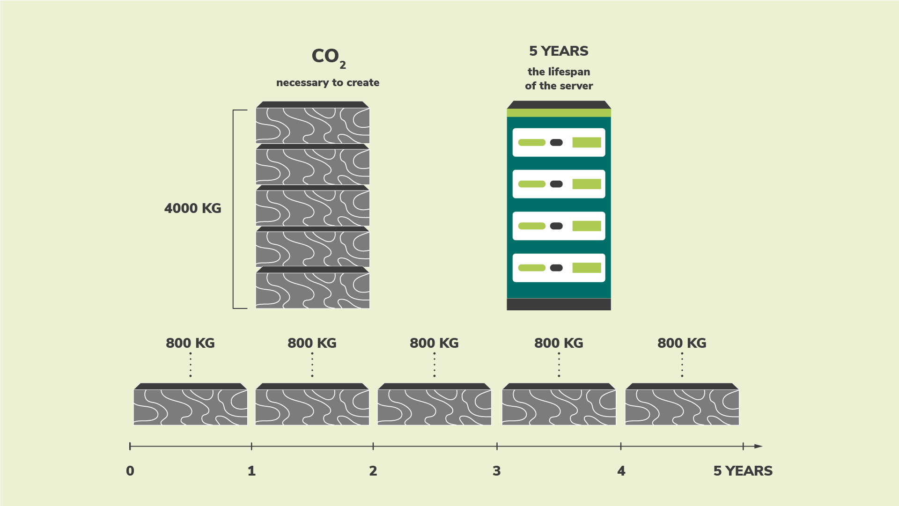
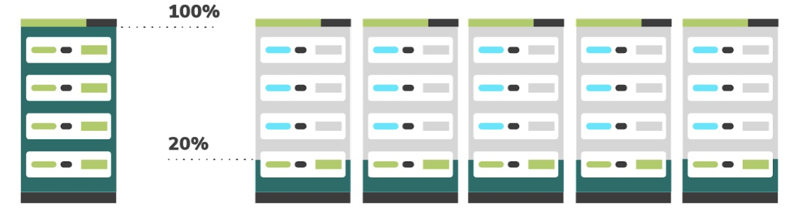
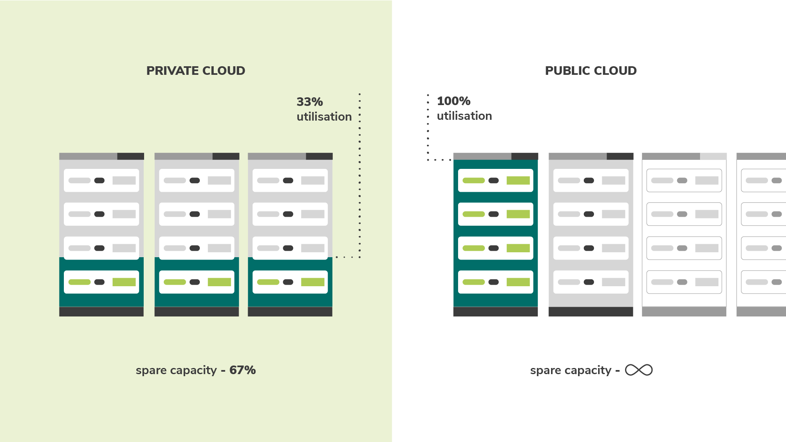

# Hardware Efficiency

:::tip Principle

*Use the least amount of embodied carbon possible.*

:::

## Introduction

The hardware used in the process of creating your software is an important element to consider for a Green Software practitioner.

You will see how embodied carbon is a hidden cost when it comes to hardware and the different measures you can take to reduce the impact that the creation, destruction and running of this hardware involves. For example, extending its lifetime or switching to cloud servers.

## Key concepts

### Embodied carbon

The device you are using to read this on produced carbon when it was manufactured and, once it reaches the end of life, disposing of it may release more. Embodied carbon (also referred to as "embedded carbon") is the amount of carbon pollution emitted during the creation and disposal of a device.

When calculating the total carbon pollution for computers running software, both the carbon pollution associated with running the computer as well as the embodied carbon of the computer must be accounted for.

Embodied carbon varies significantly between end-user devices. For some devices, the carbon emitted during manufacturing is much higher than that emitted during usage, as illustrated by a [study](https://www.ifi.uzh.ch/dam/jcr:fa4e956e-7a53-4038-98a5-00e09e2f4303/Study_Digitalization_Climate_Protection_Summary_Oct2017.pdf) from University of Zurich. As a result, the embodied carbon cost can sometimes be much higher than the carbon cost of the electricity powering it.

By thinking in terms of embodied carbon, any device, even one not consuming electricity, is responsible for the release of carbon over its lifetime.

### Amortization

A way to account for embodied carbon is to amortize the carbon over the expected life span of a device. For example, suppose it took 4000kg CO2eq to build a server, and we expect it to last four years. Amortization means that we can say the server emits 1000kg CO2eq/year. 

## How to improve hardware efficiency

If we take into account the embodied carbon, it is clear that by the time we come to buy a computer, it's already emitted a good deal of carbon. Computers also have a limited lifespan, which means they eventually are unable to handle modern workloads and need to be replaced. In these terms, hardware is a proxy for carbon, and since our goal is to be carbon efficient, we must also be hardware efficient.

There are two main approaches to hardware efficiency:

* For end-user devices, it's **extending the lifespan** of the hardware.
* For cloud computing, it's **increasing the utilization** of the device.

### Extending the lifespan of hardware

In the example we saw previously, if we can add just one more year to the lifespan of our server, then the amortized carbon drops from 1000kg CO2eq/year to 800kg CO2eq/year.

Hardware is retired when it breaks down or struggles to handle modern workloads. Of course, hardware will always break down eventually but, as developers, we can use software to build applications that run on older hardware and extend their lifetime.

### Increasing device utilization

In the cloud space, hardware efficiency most often translates to an increase in the utilization of servers. It’s better to use one server at 100% utilization than 5 servers at 20% utilization because of the cost of embodied carbon. In the same way that owning one car and using it every day of the week is much better than owning five and using a different one each day of the week, it is much more efficient to use servers at their full capacity rather than employing several at below capacity. Although emissions are the same, the embodied carbon that is used is much lower.

The most common reason for having under-utilized servers is so that peak capacity is accounted for. Running servers at 20% means that you know you will be able to handle peaks in demand without impacting performance. However, in the meantime, all that spare capacity just sitting there idle represents wasted embodied carbon. Being hardware efficient means making sure that every hardware device is being utilized as much as possible for as long as possible.

This is one of the main advantages of the public cloud; you know that when you do need to scale up, the space will be there to take up the slack. With multiple organizations making use of the public cloud, spare capacity can always be made available to whoever needs it, so that no servers are sitting idle.

It’s important to note that simply moving operations to the public cloud will not automatically reduce your emissions. It simply gives you the space to be able to re-architect your software so that a reduction is possible.

## Summary

* Embodied carbon is the amount of carbon pollution emitted during the creation and disposal of a device.
* When calculating your total carbon pollution, you must consider both that which is emitted when running the computer as well as the embodied carbon associated with its creation and disposal.
* Extending the lifetime of a device has the effect of amortizing the carbon emitted so that its CO2eq/year is reduced.
* Cloud computing is more energy efficient then an on-premise server as it can apply demand shifting as well as demand shaping.

## Quiz

1. What is embodied carbon?
2. What accounts for the total carbon pollution of a computer?
3. What are the two key ways of being more efficient with hardware?
4. How does hardware efficiency affect the carbon pollution of a device?
5. What is the amortized carbon of a device with an embodied carbon of 1000kg CO2eq and a lifespan of 5 years?
6. What are some of the differences between having your servers on a public cloud compared to a private cloud?
7. Why is it so important to include embodied carbon when calculating emissions for hardware?
