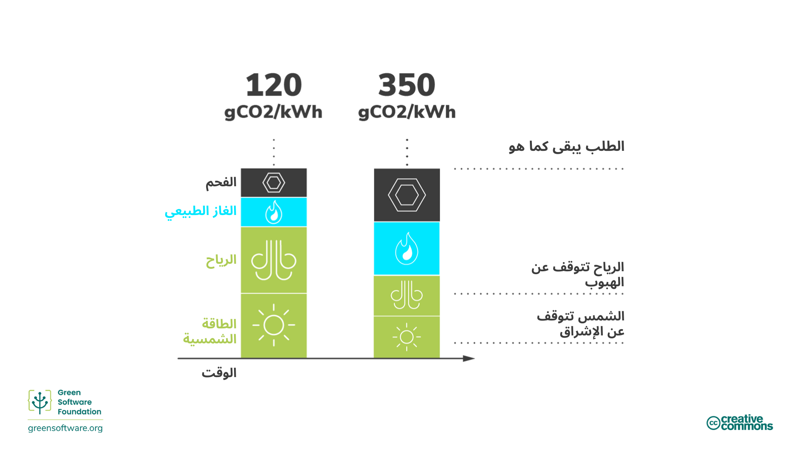
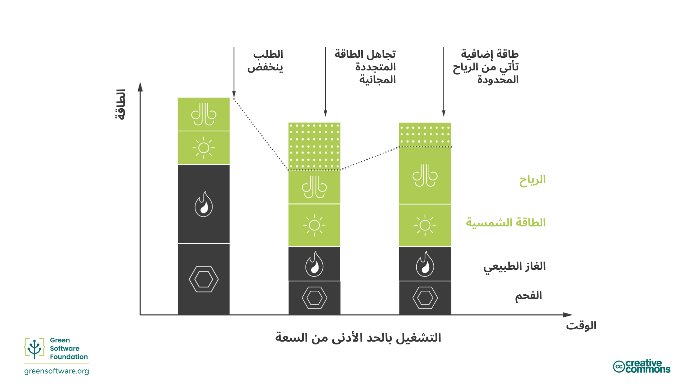
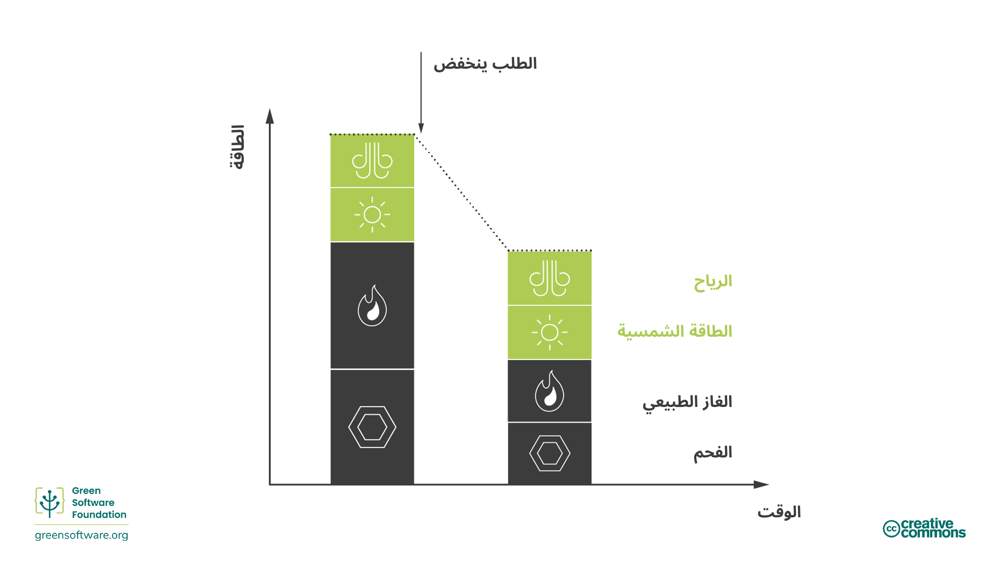
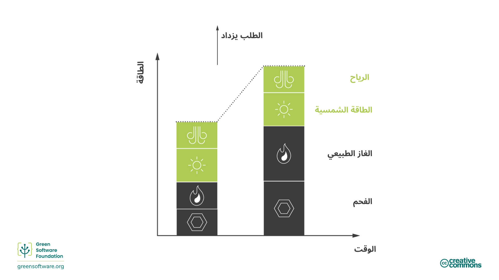

import Quiz from "/src/components/Quiz";

:::note
هذه ترجمة مقدمة من مساهمين وهي محدودة الدعم وقد لا تتوافق تمامًا مع أحدث إصدار باللغة الإنجليزية من الدورة.
:::

:::tip المبدأ

_أنجز المزيد عندما تكون الكهرباء أنظف وقلّل عندما تكون الكهرباء أكثر تلوثاً._

:::

## المقدمة

لا تُنتَج الكهرباء بنفس الطريقة في جميع الأماكن. في مواقع وأوقات مختلفة، تُولّد الكهرباء باستخدام مصادر متنوعة ذات انبعاثات كربونية مختلفة. بعض المصادر، مثل الرياح والطاقة الشمسية والطاقة الكهرومائية، هي مصادر نظيفة ومتجددة تطلق كمية قليلة من الكربون. من ناحية أخرى، تطلق مصادر الوقود الأحفوري الكربون بدرجات متفاوتة لإنتاج الكهرباء. على سبيل المثال، ينبعث من الغاز والفحم كربون أكثر من المصادر المتجددة، لكن محطات الطاقة التي تعمل بالغاز تطلق كربوناً أقل من محطات الطاقة التي تعمل بالفحم.

الوعي بالكربون هو فكرة إنجاز المزيد عندما تأتي طاقة أكثر من مصادر منخفضة الكربون والقيام بأقل عندما تأتي طاقة أكثر من مصادر عالية الكربون.

## المفاهيم الأساسية

### شدة الكربون

تقيس شدة الكربون كمية الكربون (CO2e) المنبعثة لكل كيلوواط ساعة (kWh) من الكهرباء المستهلكة. الوحدة القياسية لقياس شدة الكربون هي gCO2eq/kWh، أي غرام كربون لكل كيلوواط ساعة.

إذا كان حاسوبك موصولاً مباشرة بمزرعة رياح، فستكون كهربائه بشدة كربون تبلغ 0 gCO2eq/kWh لأن مزرعة الرياح لا تطلق كربوناً لإنتاج تلك الكهرباء. ومع ذلك، لا يستطيع معظم الناس الاتصال مباشرة بمزارع الرياح؛ بدلاً من ذلك، يوصلون أجهزتهم بشبكات كهربائية تُزوَّد بكهرباء من مصادر مختلفة.

بمجرد الاتصال بالشبكة، لا يمكنك التحكم في المصادر التي تزود الكهرباء التي تستخدمها؛ ستحصل ببساطة على مزيج من كل شيء. لذا، ستكون شدة الكربون لديك مزيجاً من جميع مصادر الطاقة الحالية على الشبكة، من المصادر منخفضة الكربون والمصادر عالية الكربون.

### تباين شدة الكربون

تختلف شدة الكربون حسب الموقع الجغرافي لأن بعض المناطق لديها مزيج طاقة يحتوي على مصادر طاقة نظيفة أكثر من غيرها.

تتغير شدة الكربون أيضاً مع الوقت بسبب التقلبية الكامنة في الطاقة المتجددة الناتجة عن عدم القدرة على التنبؤ بظروف الطقس. على سبيل المثال، عندما تكون السماء ملبدة بالغيوم أو لا تهب الرياح، تزداد شدة الكربون لأن جزءاً أكبر من الكهرباء في مزيجك يأتي من مصادر  تصدر الكربون.

### القابلية للضبط والتقليص

يتغير الطلب على الكهرباء خلال اليوم، و يجب دائما أن يكون العرض قادرا على تلبية هذا الطلب. يحدث انخفاض الجهد (انخفاض في مستوى الجهد على خط الطاقة) إذا لم تُنتِج الشركة الكهربائية كهرباء كافية لتلبية الطلب. وعلى العكس من ذلك، إذا أنتجت الشركة الكهربائية كهرباء أكثر مما هو مطلوب، فلمنع البنية  التحتية من الاحتراق، تتوقف القواطع ويحدث انقطاع.

يجب أن يكون هناك توازن بين الطلب والعرض من الكهرباء في جميع الأوقات وعادة ما تقع هذه المسؤولية على عاتق مزود الخدمة الكهربائية.

في حالة الوقود الأحفوري مثل الفحم، يكون من الأسهل التحكم في الطاقة المُنتَجة لهذا الإمداد؛ وهذا يُسمى **بالقابلية للضبط**. ومع ذلك، في حالة مصادر الطاقة المتجددة مثل مزارع الرياح، لا يمكن التحكم بسهولة في الطاقة المُنتَجة (لا يمكننا التحكم في قوة الرياح). إذا أنتجت مصدر الطاقة كهرباء أكثر مما هو مطلوب، يتم التخلص من تلك الكهرباء؛ وهذا يُسمى **التقليص أو الاقتطاع**.

### شدة الكربون الحدية

إذا احتجت فجأة إلى الوصول إلى طاقة إضافية - على سبيل المثال، تحتاج إلى تشغيل ضوء - فتأتي تلك الطاقة من محطة الطاقة الحدية. ومحطة الطاقة الحدّية تكون قابلة للتحكم في إنتاجها، مما يعني أن محطات الطاقة الحدّية تعمل غالبًا بالوقود الأحفوري.

شدة الكربون الحدية هي شدة الكربون لمحطة الطاقة التي يجب توظيفها لتلبية أي طلب جديد.

نادراً ما تنخفض محطات الطاقة التي تعمل بالوقود الأحفوري إلى الصفر. فهي تمتلك حدًا أدنى للتشغيل،  وبعضها لا يتوسع؛ لذلك تُعتبَر حمولة أساسية ثابتة تعمل باستمرار. وبسبب ذلك، يحدث أحيانًا أن نقوم بتقليص (رمي) طاقة متجددة فائضة في الوقت نفسه الذي نستمر فيه باستهلاك طاقة من محطات الوقود الأحفوري.

في هذه الحالات، ستكون شدة الكربون الحدية 0 gCO2eq/kWh لأننا نعلم أن أي طلب جديد على الطاقة سيُطابق الطاقة المتجددة التي نقوم بتقليصها.

### أسواق الطاقة

يختلف نموذج السوق الدقيق حول العالم لكنه يتبع بشكل عام نفس النمط.

عندما ينخفض الطلب على الكهرباء، تحتاج شركات المرافق إلى **تقليل** العرض لموازنة العرض والطلب. يمكنهم القيام بذلك بإحدى طريقتين:

1. **شراء طاقة أقل من محطات الوقود الأحفوري.**

الطاقة من محطات الوقود الأحفوري عادة ما تكون الأغلى ثمناً، لذا هذه هي الطريقة المفضلة. هذا يترجم مباشرة إلى حرق وقود أحفوري أقل.

2. **شراء طاقة أقل من المصادر المتجددة** .المصادر المتجددة هي الأرخص، لذا يفضلون عدم فعل ذلك.  إذا لم يتمكن مصدر متجدد من بيع كل الكهرباء التي ينتجها، فيجب عليه التخلص من الباقي.

يمكن لتقليل كمية الكهرباء المستهلكة في تطبيقاتك أن يساعد في خفض شدة الكربون للطاقة نظراً لأن أول شيء يتم تقليله هو الوقود الأحفوري.

عندما يرتفع الطلب على الكهرباء، تحتاج شركات المرافق إلى زيادة العرض لموازنة العرض والطلب. يمكنهم القيام بذلك بإحدى طريقتين:

1. **شراء مزيد من الطاقة من المصادر المتجددة التي يتم قصها حالياً**

إذا كنت تقوم بالتقليص، فهذا يعني أن لديك طاقة فائضة كان بإمكانك توزيعها. الطاقة المتجددة هي الأرخص بالفعل، لذا فإن الطاقة المتجددة "المُقلّصة" (التي تم خفض إنتاجها) ستكون أرخص مصدر للطاقة "القابلة للتوزيع" (التي يمكن التحكم فيها). ستقوم محطات الطاقة المتجددة بعد ذلك ببيع الطاقة التي كان عليها تقليصها.

2. **شراء مزيد من الطاقة من محطات الوقود الأحفوري**.

الوقود الأحفوري "قابل للتوزيع" بطبيعته؛ إذ يمكنه زيادة إنتاج الطاقة بسرعة عن طريق حرق المزيد. ومع ذلك، فإن الفحم يكلف المال، لذا فهذا هو الحل الأقل تفضيلاً.

أسواق الطاقة هي من أعقد الأسواق في العالم، لذا التوضيح أعلاه هو تبسيط. لكن ما من المهم أن نفهمه هو أن هدفنا هو زيادة الاستثمار في مصادر طاقة منخفضة الكربون، مثل الطاقة المتجددة، وتقليل الاستثمار في مصادر عالية الكربون، مثل الفحم. أفضل طريقة للتأكد من أن الأموال تتدفق في الاتجاه الصحيح هي التأكد من أنك تستخدم الكهرباء بأقل شدة كربون.

## كيفية أن تصبح أكثر وعياً بالكربون

:::tip

استخدام الكهرباء عندما تكون شدة الكربون منخفضة هو أفضل طريقة للتأكد من أن الاستثمار يتدفق نحو محطات الطاقة منخفضة الانبعاثات ويبتعد عن محطات الطاقة عالية الانبعاثات.

:::

هناك تحول عالمي يحدث الآن. في جميع أنحاء العالم، تتغير شبكات الكهرباء من حرق الوقود الأحفوري بشكل أساسي إلى مصادر منخفضة الكربون مثل الرياح والطاقة الشمسية. هذه واحدة من أفضل آمالنا لتحقيق أهدافنا العالمية للتقليص. بصفتنا ممارسي البرمجيات الخضراء، دعونا نرى بعض الطرق التي يمكننا من خلالها تسريع هذا التحول.

المحرك الأساسي لعملية التحول هو الاقتصاد وليس أي هدف من أهداف الاستدامة. تفوز مصادر الطاقة المتجددة لأنها أرخص وتزداد قدرتها على تحمل التكاليف بمرور الوقت. وللمساعدة في تسريع عملية التحول، نحتاج إلى جعل محطات الطاقة المتجددة أكثر ربحية ومحطات الوقود الأحفوري أقل ربحية. وأفضل طريقة للقيام بذلك هي استخدام المزيد من الكهرباء عندما تأتي من مصادر منخفضة الكربون مثل مصادر الطاقة المتجددة، واستخدام كهرباء أقل عندما تأتي من مصادر عالية الكربون.

تكون شدة الكربون أقل عندما تأتي طاقة أكثر من مصادر منخفضة الكربون وأعلى عندما تأتي من مصادر عالية الكربون.

### تحويل الطلب

أن تكون واعياً بالكربون يعني الاستجابة لتحولات شدة الكربون بزيادة أو تقليل طلبك. إذا كان عملك يسمح لك بالمرونة فيما يتعلق بموعد وأين تشغّل عبء العمل، يمكنك التحويل وفقاً لذلك - استهلاك الكهرباء عندما تكون شدة الكربون أقل وإيقاف الإنتاج عندما تكون أعلى. على سبيل المثال، تدريب نموذج تعلم آلي في وقت أو منطقة مختلفة بشدة كربون أقل بكثير.

[الدراسات](https://ieeexplore.ieee.org/document/6128960) تُظهر أن هذه الإجراءات يمكن أن تؤدي إلى تخفيضات كربونية بنسبة 45% إلى 99% اعتماداً على عدد مصادر الطاقة المتجددة التي تزود الشبكة.

يمكن تقسيم تحويل الطلب بشكل أكبر إلى تحويل مكاني وتحويل زمني.

#### التحويل المكاني

التحويل المكاني يعني نقل الحسابات الخاصة بك إلى موقع فعلي آخر حيث تكون شدة الكربون الحالية أقل. قد تكون منطقة بها بشكل طبيعي مصادر طاقة منخفضة الكربون. على سبيل المثال، الانتقال إلى نصفي كرات أرضية مختلفة حسب الموسم للحصول على ساعات ضوء شمسية أكثر.

#### التحويل الزمني

إذا لم تستطع نقل الحسابات الخاصة بك مكانياً إلى منطقة أخرى، فخيار آخر لديك هو التحويل إلى وقت آخر. ربما في وقت لاحق من اليوم أو الليل عندما يكون هناك مزيد من أشعة الشمس أو الرياح، وبالتالي تكون شدة الكربون أقل. هذا يُسمى تحويل الطلب الزمني. يمكننا التنبؤ بشدة الكربون في المستقبل بشكل معقول من خلال التطورات في التنبؤ بالطقس.

أدركت بعض أكبر شركات التكنولوجيا أهمية الوعي بالكربون وتستخدم تقنيات نمذجة متقدمة لتنفيذ تحويل الطلب.

- **مراكز البيانات الواعية بالكربون من Google** - أطلقت Google مشروعاً لـ [جعل بعض عبء العمل السحابي واعياً بالكربون](https://blog.google/outreach-initiatives/sustainability/carbon-aware-computing-location/). فقد أنشأوا نماذج لتوقع شدة الكربون وأحمال العمل ليوم الغد. ثم قاموا بتهيئة أحمال العمل واسعة النطاق بحيث تتم أكبر كمية منها عندما وأين تكون شدة الكربون أقل، وذلك بطريقة تتيح لهم التعامل مع الحمل المتوقع.
- **نظام Windows الواعي بالكربون من Microsoft** - [أعلنت Microsoft عن مشروع لجعل Windows 11 أكثر استدامة](https://www.techradar.com/news/windows-11-is-getting-an-eco-friendly-update-but-could-microsoft-do-more). في البداية، هذا يعني تشغيل تحديثات Windows عندما تكون شدة الكربون أقل.

### تشكيل الطلب

تحويل الطلب هو استراتيجية نقل الحسابات إلى مناطق أو أوقات عندما تكون شدة الكربون أقل. تشكيل الطلب هو استراتيجية مماثلة. ومع ذلك، بدلاً من نقل الطلب إلى منطقة أو وقت مختلف، نشكّل الحسابات لتطابق العرض الموجود.

- إذا كانت شدة الكربون منخفضة، زد الطلب؛ أنجز المزيد في تطبيقاتك.
- إذا كانت شدة الكربون عالية، قلّل الطلب؛ أنجز أقل في تطبيقاتك.

يتعلق تشكيل الطلب بالتطبيقات الواعية بالكربون بكل شيء عن عرض الكربون. عندما يصبح التكلفة الكربونية لتشغيل تطبيقك عالية، شكّل الطلب ليطابق عرض الكربون. هذا يمكن أن يحدث تلقائياً، أو يمكن للمستخدم أن يتخذ قراراً.

الوضع الاقتصادي هو مثال على تشكيل الطلب. توجد أوضاع اقتصادية في الأجهزة اليومية مثل السيارات أو الغسالات. عند تفعيله، يتم التضحية ببعض الأداء من أجل استهلاك موارد أقل (غاز أو كهرباء). لأن هناك مقايضة مع الأداء، تُقدَّم الأوضاع الاقتصادية دائماً للمستخدم كخيار.

يمكن لتطبيقات البرمجيات أيضاً أن تملك أوضاع اقتصادية يمكنها - إما تلقائياً أو بموافقة المستخدم - اتخاذ قرارات لتقليل الانبعاثات الكربونية.

أحد الأمثلة على ذلك هو برنامج المؤتمرات بالفيديو الذي يضبط جودة البث تلقائياً. بدلاً من البث بأعلى جودة ممكنة في جميع الأوقات، يقلل جودة الفيديو لإعطاء الأولوية للصوت عندما يكون عرض النطاق الترددي منخفضاً.

مثال آخر هو بروتوكول TCP/IP. تزداد سرعة النقل استجابة لكمية البيانات المُرسلة عبر السلك.

مثال ثالث هو التحسين التدريجي على الويب. تتحسن تجربة الويب حسب الموارد وعرض النطاق الترددي المتاح على جهاز المستخدم النهائي.

يرتبط تشكيل الطلب بمفهوم أوسع في الاستدامة، وهو تقليل الاستهلاك. يمكننا تحقيق الكثير بأن نصبح أكثر كفاءة في استخدام الموارد، لكننا بحاجة أيضاً إلى استهلاك أقل في مرحلة ما.

وبصفتنا ممارسين للبرمجيات الخضراء، سنفكر في إلغاء عملية عندما تكون كثافة الكربون مرتفعة بدلا من تغيير الطلب - مما يقلل من متطلبات تطبيقنا وتوقعات المستخدمين النهائيين.

## الملخص

- الوعي بالكربون يعني فهم أن الطاقة التي تستهلكها لا تملك دائماً نفس التأثير من حيث شدة الكربون.
- تختلف شدة الكربون بناءً على الوقت والمكان الذي تُستهلك فيه.
- طبيعة الوقود الأحفوري ومصادر الطاقة المتجددة تعني أن استهلاك الطاقة عندما تكون شدة الكربون منخفضة يزيد الطلب على مصادر الطاقة المتجددة ويزيد نسبة الطاقة المتجددة في العرض.
- تحويل الطلب يعني نقل استهلاك الطاقة الخاص بك إلى  مواقع أو أوقات مختلفة من اليوم حيث تكون كثافة الكربون أقل.
- تشكيل الطلب يعني تكييف استهلاك الطاقة الخاص بك مع تقلب شدة الكربون من أجل استهلاك أكثر في فترات الشدة المنخفضة وأقل في فترات الشدة العالية.

## الاختبار

<Quiz
  QuizList={[
    {
      question: "ما هي شدة الكربون؟",
      answers: [
        {
          text: "كمية الكربون المُنتَجة باستخدام مصادر الطاقة النظيفة",
          isCorrect: false,
        },
        {
          text: "كمية الكربون المُنتَجة لكل كيلوواط ساعة",
          isCorrect: true,
        },
        { text: "0 gCO2eq/kWh", isCorrect: false },
      ],
    },
    {
      question: "ما هي الوحدة القياسية لقياس شدة الكربون؟",
      answers: [
        { text: "gCO2eq/kWh", isCorrect: false },
        { text: "gCO2e/kWh", isCorrect: false },
        { text: "أي من الاثنين أعلاه", isCorrect: true },
      ],
    },
    {
      question: "ما هما المتغيران اللذان يؤثران على شدة الكربون؟",
      answers: [
        { text: "الموقع والوقت", isCorrect: true },
        { text: "العرض والطلب", isCorrect: false },
        { text: "الوقت والطلب", isCorrect: false },
      ],
    },
    {
      question: "أي من التالي ليس صحيحاً بشأن محطات الطاقة الحدية؟",
      answers: [
        { text: "إنها محطات قابلة للاستجابة السريعة", isCorrect: false },
        { text: "عادة ما تحرق الوقود الأحفوري", isCorrect: false },
        {
          text: "تقع في مواقع حيث لا توجد مصادر طاقة نظيفة",
          isCorrect: true,
        },
      ],
    },
    {
      question: "ما هو التقليص؟",
      answers: [
        { text: "فائض عرض الطاقة", isCorrect: false },
        {
          text: "طاقة يتم التخلص منها بسبب الإنتاج الزائد",
          isCorrect: true,
        },
        { text: "تقليل العرض لمطابقة الطلب", isCorrect: false },
      ],
    },
    {
      question: "أي من التالي ليس مثالاً على الحوسبة الواعية بالكربون؟",
      answers: [
        {
          text: "استهلاك كهرباء أكثر عندما تكون شدة الكربون منخفضة",
          isCorrect: false,
        },
        { text: "التحول إلى الطاقة المتجددة", isCorrect: true },
        {
          text: "إيقاف الإنتاج عندما تكون شدة الكربون أعلى",
          isCorrect: false,
        },
      ],
    },
    {
      question: "ما هما نوعا تحويل الطلب؟",
      answers: [
        { text: "الزمني والدائم", isCorrect: false },
        { text: "المكاني والزمني", isCorrect: true },
        { text: "الإرسال والتقليص", isCorrect: false },
      ],
    },
    {
      question: "ما هو تشكيل الطلب؟",
      answers: [
        {
          text: "أنجز المزيد عندما تكون شدة الكربون منخفضة، وأنجز أقل عندما تكون شدة الكربون عالية",
          isCorrect: true,
        },
        {
          text: "أنجز المزيد عندما تكون شدة الكربون عالية، وأنجز أقل عندما تكون شدة الكربون منخفضة",
          isCorrect: false,
        },
        {
          text: "أنجز المزيد عندما تكون التكاليف منخفضة، وأنجز أقل عندما تكون التكاليف عالية",
          isCorrect: false,
        },
      ],
    },
    {
      question: "أي من التالي مثال على الوعي بالكربون؟",
      answers: [
        {
          text: "إنشاء برنامج ينتج انبعاثات منخفضة جدا",
          isCorrect: false,
        },
        {
          text: "إلغاء عملية عندما تعلم أن شدة الكربون عالية",
          isCorrect: true,
        },
        {
          text: "استخدام خوادم سحابية بدلاً من الخوادم الداخلية",
          isCorrect: false,
        },
      ],
    },
  ]}
/>