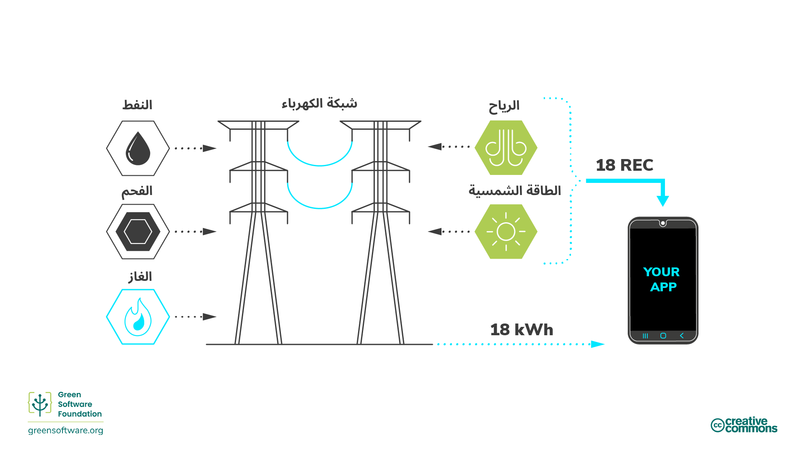
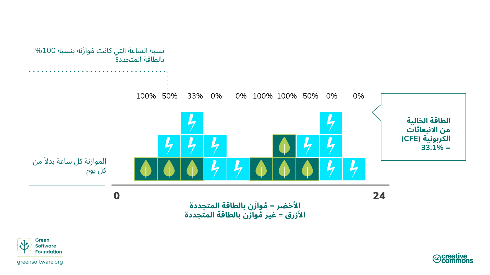
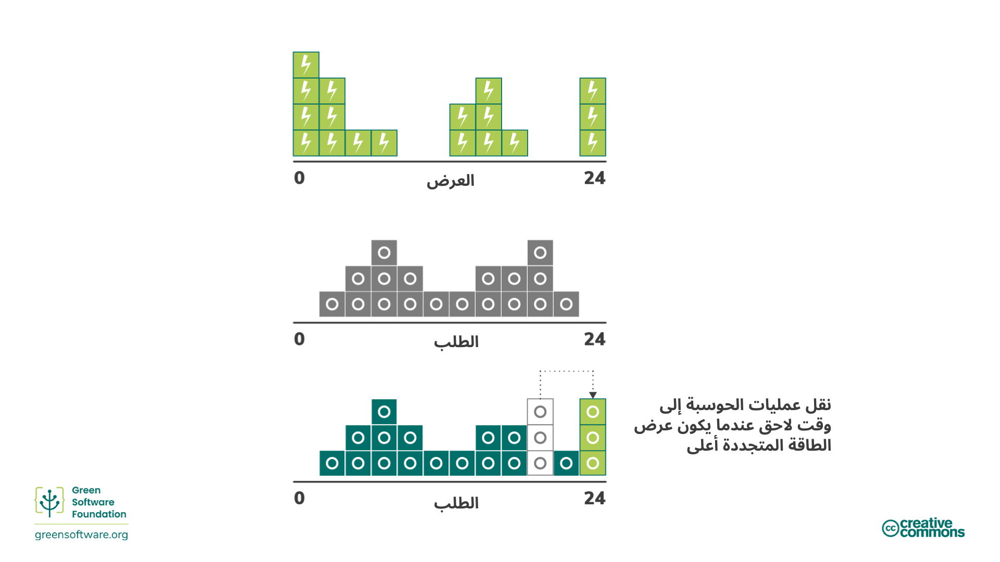

import Quiz from "/src/components/Quiz";

:::note
هذه ترجمة مقدمة من مساهمين وهي محدودة الدعم وقد لا تتوافق تمامًا مع أحدث إصدار باللغة الإنجليزية من الدورة.
:::

:::tip المبدأ

_فهم الآلية الدقيقة لتقليل انبعاثات الكربون._

:::

## المقدمة

في السنوات الأخيرة، سعت العديد من الجهات الفاعلة اقتصادياً إلى تحقيق أهداف مناخية محددة من خلال التعهد بالتزامات متنوعة.

استُخدمت المصطلحات "صافي الصفر" و"الحياد الكربوني" و"السلبية الكربونية" و"الحياد المناخي" بشكل متبادل مع الهدف الأساسي وهو إزالة انبعاثات الكربون وتقليلها ومنعها. ومع تزايد الاهتمام بهذه الأهداف، من الضروري التوصل إلى فهم مشترك لمعناها وكيفية تحقيقها من خلال الاستراتيجيات وإجراءات القياس التي تعلّمناها.

## منهجيات تقليل الكربون

توجد طرق عديدة لتقليل الانبعاثات، لكن من المهم فهم الآلية الدقيقة للتقليل عند التفكير في أهداف الخفض.

### الخفض الجذري / منع الانبعاثات عند المصدر

تُشير [مبادرة الأهداف القائمة على العلم](https://sciencebasedtargets.org/) إلى آلية تُسمى [الخفض الجذري](https://sciencebasedtargets.org/resources/legacy/2020/09/foundations-for-net-zero-executive-summary.pdf)، والتي تعني الحد من مصادر انبعاثات ثاني أكسيد الكربون المرتبطة بعمليات الشركة و[سلسلة القيمة](https://www.cisl.cam.ac.uk/education/graduate-study/pgcerts/value-chain-defs) الخاصة بها بحيث لا تصل إلى الغلاف الجوي. تشير سلسلة القيمة إلى النطاق الكامل للأنشطة اللازمة لإنشاء منتج أو خدمة، من التصور إلى التوزيع. ويشمل ذلك زيادة كفاءة الطاقة للحد من بعض الانبعاثات المرتبطة بتوليد الطاقة.

الخفض الجذري وحده ليس كافياً حيث ستكون هناك دائماً بعض الانبعاثات التي لا يمكن الحد منها بسبب القيود التكنولوجية أو الاقتصادية، لكنه يجب أن يشكل جوهر استراتيجية أي مؤسسة لأنه مجال يمكن لكل شركة تقريباً التحسين فيه.

لموازنة تلك الانبعاثات المتبقية، نحتاج إلى النظر في آليات أخرى كالتعويضات وتجنب الانبعاثات والتحييد.

### التعويضات

[التعويضات](https://www.offsetguide.org/understanding-carbon-offsets/what-is-a-carbon-offset/) هي استثمارات مباشرة في مشاريع خفض الانبعاثات من خلال شراء أرصدة تعويض كربوني في سوق الكربون الطوعي (VCM). سوق الكربون الطوعي هو سوق لامركزي حيث يقوم الفاعلون الخاصون طوعياً بشراء وبيع أرصدة الكربون التي تمثل عمليات إزالة أو خفض معتمدة لغازات الدفيئة من الغلاف الجوي.

لتعويض الانبعاثات، تحتاج إلى شراء حجم مكافئ من أرصدة الكربون للموازنة مع تلك المنبعثة، حيث يُعادل رصيد كربون واحد طناً واحداً من ثاني أكسيد الكربون الممتص أو المُخفَّض.

يمكن أن تنشأ فوائد إيجابية متنوعة من هذه المشاريع، من حماية النظام البيئي إلى تمكين المجتمعات المحلية. ومع ذلك، لضمان تنفيذ هذه البرامج بشكل صحيح وتحقيق التأثير المطلوب على البيئة والهدف للوصول إلى صافي صفر عالمي، توجد معايير عالمية يجب أن تستوفيها مثل معيار الكربون المُحقق (VCS) والمعيار الذهبي (GS).

#### مؤشر SCI والتعويضات

هناك بعض القيود على تعويضات الكربون ولهذا السبب لا يتم احتسابها في قيمة SCI للمؤسسة. على سبيل المثال، تخيل تطبيقين، كلاهما يعمل على منصة سحابية مُعوَّضة بنسبة 100% من الكربون ومُوازَنة بنسبة 100% بالطاقة المتجددة. استثمر التطبيق أ وقتاً وموارد كبيرة للتأكد من استخدامه للموارد بكفاءة، بينما يستخدم التطبيق ب الموارد بشكل غير فعّال للغاية. لكي يكون مؤشر SCI مقياساً مفيداً، يحتاج التطبيق أ إلى تحقيق قيمة أفضل من التطبيق ب.

إذا أخذ مؤشر SCI التعويضات في الاعتبار، فستكون قيمة كلا التطبيقين 0. هذا لن يخبرنا بأي شيء عن مدى كفاءة استخدامهما للموارد. على الرغم من أن التطبيق ب يطلق المزيد من جزيئات الكربون في الغلاف الجوي، وبما أن قيمته 0 وأقل قيمة هي 0، فلماذا سيقوم بمزيد من الاستثمارات لتحسين كفاءته الكربونية؟

تحتاج المؤسسات إلى خطط لكيفية خفض الانبعاثات وتحييدها، ويساعد مؤشر SCI في دفع عملية خفض الانبعاثات الناتجة عن البرمجيات. وهذا ما يجعل مؤشر SCI عنصراً محورياً في أي استراتيجية للوصول إلى صافي الصفر.

### تجنب الانبعاثات

[تجنب الانبعاثات](https://www.abatable.com/blog/carbon-removal-vs-carbon-avoidance-projects) هو الإجراءات التي تتخذها الشركات لمساعدة المجتمع على تجنب أو تقليل الانبعاثات خارج سلسلة قيمتها. وهذا يعني في الأساس الاستثمار في مشاريع خفض لمؤسسات أخرى.

يشمل ذلك إجراءات مثل:

- **الحفظ** - يتم إنشاء أرصدة ناتجة عن الكربون الذي لم يُطلق من خلال حماية الأشجار القديمة.
- **المشاريع المجتمعية** - تساعد هذه المشاريع المجتمعات حول العالم، خاصة النامية منها، من خلال تقديم أساليب معيشة مستدامة.
- **تحويل النفايات إلى طاقة** - تقوم هذه المشاريع بالتقاط الميثان/غاز المكبات في القرى الصغيرة، والنفايات البشرية أو الزراعية، وتحويلها إلى كهرباء.

### التحييد / سحب الكربون   

[التحييد](https://www.abatable.com/blog/carbon-removal-vs-carbon-avoidance-projects) هو الإجراءات التي تتخذها الشركات لسحب الكربون من الغلاف الجوي داخل أو خارج سلسلة قيمتها. يشير التحييد إلى سحب الكربون الجوي وتخزينه بشكل دائم لمعادلة تأثير إطلاق ثاني أكسيد الكربون في الغلاف الجوي. يشمل ذلك إجراءات مثل:

- **تعزيز أحواض الكربون الطبيعية** التي تسحب ثاني أكسيد الكربون من الغلاف الجوي. على سبيل المثال، استعادة الغابات، حيث يزيل التمثيل الضوئي ثاني أكسيد الكربون بشكل طبيعي. يأتي توسيع الغابات مع تحديات لأنه من الضروري عدم التأثير على ديناميكيات الأراضي الزراعية وإمدادات الغذاء في أماكن أخرى. يمكن أيضاً لأساليب الزراعة الحديثة إطالة الوقت الذي يبقى فيه الكربون مخزناً في التربة.
- **الالتقاط المباشر من الهواء** هو عملية التقاط ثاني أكسيد الكربون من الهواء وتخزينه بشكل دائم، إما تحت الأرض أو في منتجات طويلة العمر مثل الخرسانة.

تُقاس فعالية هذه الطرق عادةً بناءً على ما إذا كانت قادرة على تحقيق سحب الكربون بالمستوى والوتيرة المطلوبين.

عندما يتعلق الأمر بمشاريع سحب الكربون، تُعد مدة الاستبقاء اعتباراً بالغ الأهمية. تصف مدة استبقاء المشروع المدة التي سيُحفظ فيها ثاني أكسيد الكربون بعيداً عن الغلاف الجوي.

الاستبقاء قصير الأمد يصل إلى 100 عام، والمتوسط الأمد من 100 إلى 1000 عام، والطويل الأمد أكثر من 1000 عام.

- الحلول التي تعتمد على دورة الكربون الطبيعية للأرض لها استبقاء قصير الأمد يُقاس بالعقود. على سبيل المثال، مشاريع الغابات لها مدة استبقاء من 40 إلى 100 عام.
- الحلول الهندسية مثل الالتقاط المباشر من الهواء غالباً ما يكون لها استبقاء طويل الأمد يُقاس بآلاف السنين. على سبيل المثال، الالتقاط المباشر من الهواء له مدة استبقاء 10,000 عام.
- المشاريع طويلة الأمد عادةً أغلى بكثير من المشاريع قصيرة الأمد. بمجرد انبعاثه، يبقى الكربون في الغلاف الجوي لمدة 5,000 عام. حتى يُعد صافي صفر، يجب سحب الكربون المنبعث بشكل دائم.

مشروع سحب الكربون قصير الأمد سيسحب الكربون لمدة 100 عام فقط، وبعدها يعود إلى الغلاف الجوي ويُسهم في تسخين كوكبنا. هذا أحد الأسباب التي تجعل الخفض الجذري مفضلاً على التحييد. تجنب إطلاق الكربون من الأساس أفضل بكثير من إطلاق الكربون ثم محاولة إبقائه خارج الغلاف الجوي لمدة 5,000 عام.

## الالتزامات المناخية

هناك العديد من استراتيجيات خفض الانبعاثات المناخية المختلفة التي يمكن لأي مؤسسة الالتزام بها، من الحياد الكربوني إلى صافي الصفر. فهم المعاني والآثار المختلفة لكل منها يمكن أن يساعدك في تحديد الاستراتيجية المناسبة لمؤسستك.

### الحياد الكربوني

لتحقيق الحياد الكربوني، يجب على المؤسسة قياس انبعاثاتها، ثم موازنة الإجمالي بتعويضات انبعاثاتها من خلال مشاريع خفض الكربون. يمكن أن يشمل ذلك مشاريع سحب الكربون (التحييد) ومشاريع تجنب الانبعاثات.

يُعرَّف الحياد الكربوني بمعيار معترف به دولياً: [PAS 2060](https://info.eco-act.com/hubfs/0%20-%20Downloads/PAS%202060/PAS%202060%20factsheet%20EN.pdf). على الرغم من أن هذا يوصي بأن تحدد المؤسسة أهداف خفض، إلا أنه لا يتطلب منها تقليل انبعاثاتها. لذا حتى تُعد محايدة كربونياً، يمكن للمؤسسة الاكتفاء بالقياس والتعويض دون استثمار الموارد في خفض انبعاثاتها الكربونية.

لتكون محايداً كربونياً، يجب أن تغطي الانبعاثات المباشرة (النطاق 1 و2). التوقع العام هو أن تقيس المؤسسات وتعوض نطاقيها 1 و2، والسفر التجاري من النطاق 3. ومع ذلك، لا يوجد متطلب محدد لتضمين ذلك.

الحياد الكربوني هو خطوة أولى مهمة لأي مؤسسة لأنه يشجع على القياس. ومع ذلك، لا توجد تعويضات كربون كافية في العالم لموازنة انبعاثات جميع المؤسسات. لذلك، أي استراتيجية لا تتضمن الخفض الجذري لن تتوسع أو تساعد العالم على تحقيق هدف 1.5 درجة الذي حددته اتفاقية باريس للمناخ. هنا يأتي دور صافي الصفر.

### صافي الصفر

صافي الصفر يعني خفض الانبعاثات وفقاً لأحدث العلوم المناخية وموازنة الانبعاثات المتبقية من خلال عمليات سحب الكربون (التحييد). صافي الصفر، بحكم التعريف، يتطلب خفضاً في الانبعاثات يتماشى مع مسار 1.5 درجة مئوية. يجب على جميع الشركات القيام بذلك لتحقيق صافي صفر انبعاثات عالمياً بحلول عام 2050.

الفرق الجوهري بين صافي الصفر والحياد الكربوني هو تركيز صافي الصفر على الخفض الجذري بدلاً من التحييد وتجنب الانبعاثات. يهدف صافي الصفر إلى الحد من الانبعاثات واستخدام التعويض فقط للانبعاثات المتبقية التي لا يمكنك الحد منها.

[معيار صافي الصفر](https://sciencebasedtargets.org/resources/files/foundations-for-net-zero-full-paper.pdf) تقوم بتطويره [مبادرة الأهداف القائمة على العلم](https://sciencebasedtargets.org/) (SBTi). يحسبون أن هناك احتمال 66% للحد من الاحترار العالمي إلى 1.5 درجة مئوية إذا وصلنا إلى مستوى خفض حوالي 90% من جميع انبعاثات غازات الدفيئة بحلول منتصف القرن. لذا، لتحقيق هدف صافي الصفر، تحتاج المؤسسة إلى خفض 90% من انبعاثاتها بحلول عام 2050. الانبعاثات المتبقية يمكن موازنتها فقط باستخدام التحييد وعمليات سحب الكربون الدائمة.

استراتيجية صافي الصفر تعني أن الكمية الفعلية للكربون في الغلاف الجوي تبقى ثابتة.

أيضاً، لكي يكون هدف صافي الصفر، يجب أن تغطي الانبعاثات المباشرة وغير المباشرة، أي انبعاثات سلسلة التوريد (النطاقات 1 و2 و3). لذلك، يجب تضمين سلسلة قيمتك بالكامل في نطاق هدف صافي الصفر الخاص بك. هذا مهم لأن النطاق 3 غالباً ما يمثل غالبية الانبعاثات.

#### مؤشر SCI كجزء من استراتيجية صافي الصفر

مؤشر SCI هو مقياس مصمم خصيصاً لدفع عملية خفض الانبعاثات. الطريقة الوحيدة لتقليل قيمتك هي استثمار الوقت والموارد في إجراءات تخفض الانبعاثات. الأنشطة الوحيدة التي يعترف بها مؤشر SCI كإجراءات خفض هي جعل تطبيقك أكثر كفاءة في استخدام الطاقة، وأكثر كفاءة في استخدام الأجهزة، أو استهلاك مصادر طاقة منخفضة الكربون. التعويضات عنصر مهم في أي استراتيجية مناخية؛ ومع ذلك، التعويضات ليست عمليات خفض وبالتالي لا يتم تضمينها في مقياس SCI.

أي استراتيجية صافي صفر تحتاج إلى خطط لكيفية خفض الانبعاثات وتحييدها. يساعد مؤشر SCI المؤسسات في دفع عملية خفض الانبعاثات الناتجة عن البرمجيات. وهذا ما يجعل مؤشر SCI عنصراً محورياً في أي استراتيجية صافي صفر.

### 100% طاقة متجددة

عندما تحدد المؤسسات هدف 100% طاقة متجددة، قد تميز بين أن تكون **مُوازَنة بـ** مقابل **مُغذّاة مباشرة بـ** الطاقة المتجددة.

**مُغذّاة مباشرة بـ** تعني أنك تعمل مباشرة على مصدر طاقة متجددة، مثل سد كهرومائي. في تلك الحالة، لا يمكن لمصدر الكهرباء المتدفقة إلى جهازك أن يأتي إلا من ذلك المصدر، لذا يمكنك القول بثقة أنك مُغذّى بنسبة 100% بالطاقة المتجددة.

بالنسبة لمعظم الناس، نعيش على شبكة مترابطة، مع العديد من المنتجين الذين يضخون الكهرباء والعديد من المستهلكين الذين يسحبون الكهرباء. هذا يعني أن مصدر الكهرباء القادمة إلى جهازك هو مزيج من جميع المصادر الداخلة إلى الشبكة. على سبيل المثال، لنفترض أن الشبكة لديها 5% فقط من إمدادات الرياح. أنت تحصل على 5% من الكهرباء المولدة من الرياح و95% من الكهرباء المولدة من الوقود الأحفوري.

لا يمكنك تتبع التيار الكهربائي بشكل فردي. بمجرد أن تصبح الكهرباء من مزرعة رياح على الشبكة، فإنها تختلط مع الكهرباء من محطة الوقود الأحفوري. لذا لا توجد طريقة للمستهلك للإصرار على أن الكهرباء التي يستخدمها تأتي فقط من مصادر متجددة.

#### شهادات الطاقة المتجددة (REC)

<!--  -->

لحل هذه المشكلة، يبيع مصنع الطاقة المتجددة شيئين. الأول هو كهربائه، التي يبيعها إلى الشبكة. والثاني هو شهادة الطاقة المتجددة REC، [شهادات الطاقة المتجددة](https://www.epa.gov/green-power-markets/renewable-energy-certificates-recs). شهادة REC واحدة تساوي 1 كيلوواط ساعة من الطاقة.

إذا كنت تريد أن تكون مُوازَناً بنسبة 100% بالطاقة المتجددة وأنت على الشبكة، الحل هو شراء ما يكفي من شهادات REC لتغطية كمية الكهرباء التي تستهلكها. على سبيل المثال، إذا كنت تستهلك 100 كيلوواط ساعة من الكهرباء يومياً، فلتكون مُوازَناً بنسبة 100% بالطاقة المتجددة، تشتري 100 شهادة REC.

عندما تحدد المؤسسات أهداف 100% طاقة متجددة، فإن شراء شهادات REC من السوق هو الحل الذي تستخدمه غالباً للوفاء بالتزاماتها.

#### اتفاقيات شراء الطاقة (PPA)

قد تسمع أيضاً مصطلح PPA يُستخدم بجانب شهادات REC. اتفاقية شراء الطاقة PPA هي [اتفاقية شراء الطاقة](https://ppp.worldbank.org/public-private-partnership/sector/energy/energy-power-agreements/power-purchase-agreements)، وهي طريقة أخرى لشراء شهادات REC. إذا قدّرت أنك تحتاج 500 ميغاواط ساعة من الكهرباء سنوياً لمركز بيانات معين، قد توقع اتفاقية PPA لشراء 500 ميغاواط ساعة سنوياً من مصنع طاقة متجددة. ستحصل بعد ذلك على جميع شهادات REC المرتبطة بمصنع الطاقة هذا.

عادةً ما تكون اتفاقيات PPA عقوداً طويلة الأجل جداً. يمكن لمصنع الطاقة المتجددة إيجاد التمويل مع إحدى هذه الاتفاقيات لأنه بالفعل لديه مشترٍ لكهربائه لسنوات عديدة.

تشجع اتفاقيات PPA شيئاً يُسمى **الإضافية**. شراء اتفاقية PPA يدفع إلى إنشاء مصانع طاقة متجددة جديدة. اتفاقيات PPA هي حل يقودنا نحو مستقبل يتمتع فيه الجميع بالوصول إلى 100% طاقة متجددة.

### المطابقة الساعية 24/7

عندما يتعلق الأمر بادعاءات 100% طاقة متجددة، السؤال الحاسم هو، ما هي دقة الموازنة؟هل تقوم بجمع وصافي الانبعاثات سنويًا، شهريًا، أسبوعيًا، يوميًا، أم ساعيًا؟ هذا السؤال مهم لأنه للانتقال الحقيقي إلى الطاقة المتجددة، نحتاج إلى 100% من الطاقة القادمة من مصادر طاقة منخفضة الكربون 100% من الوقت. هذه الموازنة الدقيقة تُسمى غالباً _[المطابقة الساعية 24/7](https://www.epa.gov/green-power-markets/247-hourly-matching-electricity)_.

المطابقة على أساس ساعي 24/7 هي إحدى الاستراتيجيات العديدة التي نحتاج إلى توظيفها للمساعدة في تسريع الانتقال إلى شبكة تعمل بنسبة 100% بالطاقة المتجددة. على سبيل المثال، التزمت كل من [Google](https://sustainability.google/progress/energy/) و[Microsoft](https://blogs.microsoft.com/blog/2021/07/14/made-to-measure-sustainability-commitment-progress-and-updates/) بالمطابقة على أساس ساعي 24/7 بحلول عام 2030.

#### الموازنة اليومية مقابل الساعية

تخيل مؤسسة لديها منحنى استهلاك مثل هذا، كل مربع أزرق يمثل 1 كيلوواط ساعة:

اشترت شهادات REC من مزرعة رياح ولّدت كهرباء وفق منحنى، لذا كل مربع أخضر يمثل شهادة REC واحدة. الموازنة باليوم تعني أن المؤسسة استهلكت 18 كيلوواط ساعة واشترت 18 شهادة REC. نتيجة لذلك، أصبح صافي استهلاكهم صفراً . لذا يمكنها القول أنها **مُوازَنة بنسبة 100% بالطاقة المتجددة يومياً.**

ومع ذلك، إذا نظرنا إليها في فترات زمنية ساعية (كل مربع هنا هو ساعتين في الطول)، يبدو الأمر مختلفاً قليلاً:

إجمالي كمية الطاقة المستهلكة لا يزال 18 كيلوواط ساعة. ومع ذلك، لا يوجد سوى بضع ساعات في اليوم حيث تكون المؤسسة مُوازَنة بنسبة 100% بالطاقة المتجددة لتلك الساعة. لذا لبعض الساعات، لديها طاقة متجددة أكثر بكثير مما تحتاج. وعلى العكس، لمعظم الساعات، لديها طاقة متجددة أقل بكثير مما تحتاج.

في المثال أعلاه، تكون المؤسسة **مُوازَنة بنسبة 100% بالطاقة المتجددة على أساس ساعي لمدة 6 ساعات فقط من اليوم**.

#### الطاقة الخالية من الكربون

الرقم الذي نستخدمه لوصف مدى نجاحنا في المطابقة على أساس ساعي 24/7 هو نسبة الطاقة الخالية من الكربون (CFE).

تُعرَّف الطاقة الخالية من الكربون بأنها [متوسط نسبة الطاقة الخالية من الكربون المستهلكة في موقع معين على أساس ساعي](https://cloud.google.com/sustainability/region-carbon#understanding).

لذا في المثال السابق، إذا قيست باستخدام الموازنة اليومية، تكون المؤسسة مُوازَنة بنسبة 100% بالطاقة المتجددة. ومع ذلك، تكون مُوازَنة بنسبة 33.1% فقط إذا قيست باستخدام الموازنة الساعية. **نسبة CFE هي، بالتالي، 33.1%**.

#### الوعي بالكربون كجزء من استراتيجية المطابقة الساعية 24/7

تتضمن الحوسبة الواعية بالكربون الاستجابة لإشارات كثافة الكربون الكهربائية وتغيير **سلوك** البرمجيات، بحيث تُصدر كربوناً أقل. تساعد الحوسبة الواعية بالكربون أيضاً المؤسسة على تحقيق هدف المطابقة على أساس ساعي 24/7 وزيادة نسبة CFE لديها.

أحد أمثلة تغيير السلوك هو ترحيل عمليات المعالجة إلى وقت تكون فيه الطاقة المتجددة أكثر توفراً. على سبيل المثال، تأخير بدء تشغيل تدريب نموذج تعلم آلي، أو حتى تأخير شحن جهاز كمبيوتر محمول، إلى وقت تكون فيه كثافة الكربون للكهرباء أقل، وإمدادات الطاقة المتجددة أعلى.

:::tip
تساعد الحوسبة الواعية بالكربون المؤسسات على زيادة نسبة CFE لديها.
:::

## الملخص

- هناك عدد من المنهجيات المطبقة بشكل شائع للمساعدة في المكافحة الشاملة لتغير المناخ. تندرج هذه ضمن الفئات العامة للخفض الجذري (المعروف أيضاً بـ "منع الانبعاثات عند المصدر")، وتجنب الانبعاثات، أو سحب الكربون (المعروف أيضاً بـ "التحييد").
- يشمل الخفض الجذري زيادة كفاءة الطاقة للحد من بعض الانبعاثات المرتبطة بتوليد الطاقة. الخفض الجذري هو الطريقة الأكثر فعالية لمكافحة تغير المناخ على الرغم من أن الحد الكامل من الكربون غير ممكن.
- يشمل تجنب الانبعاثات تبني مصادر الطاقة المتجددة وممارسات المعيشة المستدامة وإعادة التدوير وزراعة الأشجار إلخ.
- يشير التحييد إلى سحب الكربون الجوي وتخزينه بشكل دائم لمعادلة تأثير إطلاق ثاني أكسيد الكربون في الغلاف الجوي. يميل التحييد إلى سحب الكربون من الغلاف الجوي على المدى القصير والمتوسط.
- يمكن للمؤسسة أن تُعد محايدة كربونياً عندما يتم موازنة إجمالي انبعاثاتها بإجمالي تعويضات انبعاثاتها من خلال مشاريع خفض الكربون.
- يهدف صافي الصفر إلى خفض الانبعاثات وتعويض الانبعاثات المتبقية التي لا يمكنك خفضها فقط للوصول إلى هدف 1.5 درجة مئوية الذي حددته اتفاقية باريس للمناخ.
- تم تصميم مؤشر SCI بعناية بحيث يكون خفض الانبعاثات، من خلال كفاءة الطاقة وكفاءة الأجهزة والحوسبة الواعية بالكربون هي الطريقة الوحيدة لتقليل القيمة. مع استراتيجية تحييد منفصلة، يمكن أن يشكل أساساً لاستراتيجية صافي صفر للمؤسسة.
- عندما تحدد المؤسسات هدف 100% طاقة متجددة، يمكن أن تكون إما "مُوازَنة بـ" مقابل "مُغذّاة مباشرة بـ" الطاقة المتجددة، حيث "مُغذّاة مباشرة بـ" تعني أن مصدر الكهرباء المتدفقة إلى جهازك يمكن أن يأتي فقط من مصادر متجددة. يمكن تحقيق ذلك بشراء شهادات REC كجزء من اتفاقية PPA.
- المطابقة على أساس ساعي 24/7 هي إحدى الاستراتيجيات العديدة التي نحتاج إلى توظيفها للمساعدة في تسريع الانتقال إلى شبكة تعمل بنسبة 100% بالطاقة المتجددة.

## الاختبار

<Quiz
  QuizList={[
    {
      question: "ما هو التحييد؟",
      answers: [
        {
          text: "إجراءات تسحب الكربون من الغلاف الجوي",
          isCorrect: true,
        },
        {
          text: "إجراءات تخفض انبعاثات الكربون",
          isCorrect: false,
        },
        {
          text: "إجراءات تدعم المبادرات المناخية",
          isCorrect: false,
        },
      ],
    },
    {
      question: "ما هو الاعتبار الحاسم للتحييد؟",
      answers: [
        {
          text: "حجم التحييد",
          isCorrect: false,
        },
        {
          text: "مدة استبقاء التحييد",
          isCorrect: true,
        },
        {
          text: "تكلفة التحييد",
          isCorrect: false,
        },
      ],
    },
    {
      question:
        "ما النهج الذي يمكنك اتباعه لتحييد انبعاثات الكربون من استهلاك الطاقة؟",
      answers: [
        {
          text: "تعزيز أحواض الكربون الطبيعية",
          isCorrect: false,
        },
        {
          text: "الالتقاط المباشر من الهواء",
          isCorrect: false,
        },
        {
          text: "كلاهما مما سبق",
          isCorrect: true,
        },
      ],
    },
    {
      question: "ما الجهة المسؤولة عن وضع معيار صافي الصفر؟",
      answers: [
        {
          text: "SBTi",
          isCorrect: true,
        },
        {
          text: "STBi",
          isCorrect: false,
        },
        {
          text: "STIB",
          isCorrect: false,
        },
      ],
    },
    {
      question: "ما هو الهدف العالمي لصافي الصفر؟",
      answers: [
        {
          text: "خفض 100% من الانبعاثات بحلول عام 2050",
          isCorrect: false,
        },
        {
          text: "خفض 90% من الانبعاثات بحلول عام 2050",
          isCorrect: true,
        },
        {
          text: "خفض 80% من الانبعاثات بحلول عام 2050",
          isCorrect: false,
        },
      ],
    },
    {
      question: "ما هو الهدف الأساسي من الخفض الجذري؟",
      answers: [
        {
          text: "تعويض انبعاثاتك الكربونية باستخدام عقد مالي",
          isCorrect: false,
        },
        {
          text: "تجنب إطلاق الكربون في الغلاف الجوي من الأساس",
          isCorrect: true,
        },
        {
          text: "تقليل الانبعاثات المتعلقة بعمليات الشركة من خلال تحسين كفاءة الطاقة",
          isCorrect: false,
        },
      ],
    },
    {
      question: "أي بروتوكول أو طريقة قياس تتضمن التعويضات؟",
      answers: [
        {
          text: "بروتوكول GHG",
          isCorrect: true,
        },
        {
          text: "SCI",
          isCorrect: false,
        },
      ],
    },
    {
      question: "ما هو الحد الأدنى من المعايير لتكون محايداً كربونياً؟",
      answers: [
        {
          text: "يجب موازنة الانبعاثات من النطاقات 1-3 بالتحييد أو تجنب الانبعاثات",
          isCorrect: false,
        },
        {
          text: "يجب موازنة الانبعاثات من النطاقين 1 و2 بالتحييد أو تجنب الانبعاثات",
          isCorrect: true,
        },
        {
          text: "يجب موازنة الانبعاثات من النطاقين 1-2 والسفر التجاري من النطاق 3 بالتحييد أو تجنب الانبعاثات",
          isCorrect: false,
        },
      ],
    },
  ]}
/>
