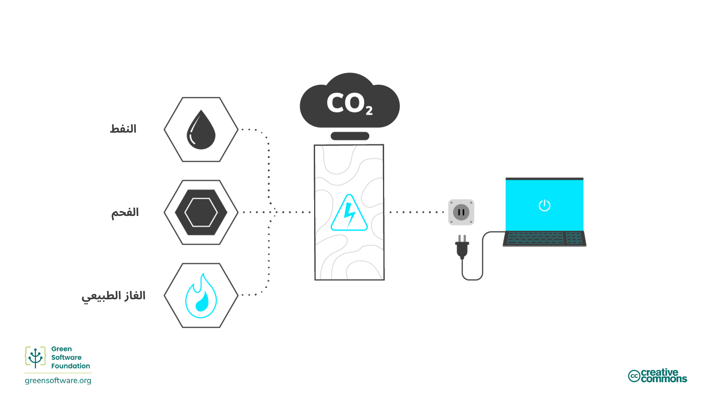
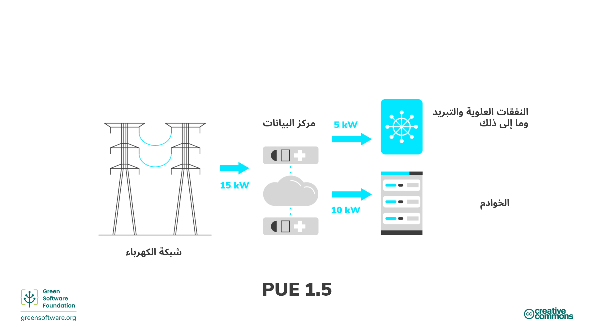

import Quiz from "/src/components/Quiz";

:::note
هذه ترجمة مقدمة من مساهمين وهي محدودة الدعم وقد لا تتوافق تمامًا مع أحدث إصدار باللغة الإنجليزية من الدورة.
:::

:::tip المبدأ

_استخدم أقل قدر ممكن من الطاقة._

:::

## المقدمة

الطاقة هي القدرة على القيام بالعمل. توجد أشكال عديدة للطاقة مثل الحرارية والكهربائية والكيميائية، ويمكن تحويل نوع منها إلى آخر. على سبيل المثال، نحول الطاقة الكيميائية من الفحم إلى طاقة كهربائية؛ أي أن الكهرباء طاقة ثانوية محولة من نوع طاقة آخر. وبهذه الطريقة، يمكننا اعتبار الطاقة مقياسًا لكمية الكهرباء المستهلكة.

جميع البرمجيات، من التطبيقات على الهواتف الذكية إلى تدريب نماذج التعلم الآلي في مراكز البيانات، تستهلك الكهرباء. واحدة من أفضل الطرق لتقليل استهلاك الكهرباء والانبعاثات الكربونية الناتجة عن البرمجيات هي جعل التطبيقات أكثر كفاءة في استهلاك الطاقة. ومع ذلك، مسؤوليتنا لا تنتهي هنا.

يتحمل ممارسو البرمجيات الخضراء مسؤولية الطاقة التي تستهلكها منتجاتهم، ويصممونها لتستهلك أقل قدر ممكن. يجب أن نتأكد من أنه في كل خطوة من خطوات العملية، يكون هناك أقل قدر ممكن من الفاقد وأن معظم الطاقة ينتقل إلى الخطوة التالية.

الخطوة الأخيرة في هذه السلسلة تمثلها المستخدم النهائي لمنتجك وليس المنتج نفسه. هذا يعني أن هدفنا ليس فقط كتابة أكثر كود كفاءة في استهلاك الطاقة أو جعل البرمجيات "صديقة للبيئة"، بل التفكير في المستخدم النهائي والتأكد من عدم إنتاجه انبعاثات غير ضرورية.

قد يعني ذلك تجميع المهام معًا للاستفادة من تناسبية الطاقة أو تغيير طريقة استخدام المستخدم لتطبيقك. دعونا نلقي نظرة على بعض هذه المفاهيم وبعض الطرق التي يمكنك من خلالها أن تصبح أكثر كفاءة في استهلاك الطاقة في كل مرحلة حتى المستخدم النهائي.

## المفاهيم الأساسية

### الوقود الأحفوري ومصادر الطاقة عالية الكربون

يتم إنتاج معظم الكهرباء من خلال حرق الوقود الأحفوري، [وغالبا ما يكون الفحم](https://ourworldindata.org/grapher/electricity-prod-source-stacked). الوقود الأحفوري يتكون من النباتات والحيوانات المتحللة الموجودة في قشرة الأرض، ويحتوي على الكربون والهيدروجين اللذين يمكن حرقهما للحصول على الطاقة. الفحم والنفط والغاز الطبيعي هي أمثلة على الوقود الأحفوري.

يعتقد معظم الناس أن الكهرباء نظيفة؛ أيدينا لا تتسخ عند توصيل قابس بالجدار، وأجهزة اللابتوب لا تحتاج إلى أنابيب عادم. ومع ذلك، بما أن معظم الكهرباء تأتي من حرق الوقود الأحفوري وأن إمدادات الطاقة هي [السبب الأهم لانبعاثات الكربون](https://www.eea.europa.eu/data-and-maps/daviz/change-of-co2-eq-emissions-2#tab-chart_4)، يمكننا رسم خط مباشر بين الكهرباء والانبعاثات الكربونية. وبهذه الطريقة، يمكن اعتبار الكهرباء بديلًا للكربون.

إذا كان هدفنا أن نكون فعالين من حيث الكربون، فهذا يعني أيضًا أن نكون موفرين للطاقة لأن الطاقة بديل للكربون؛ أي استخدام أقل قدر ممكن من الطاقة لكل وحدة عمل.

### مصادر الطاقة منخفضة الكربون

تأتي الطاقة النظيفة من مصادر متجددة خالية من الانبعاثات لا تلوث الغلاف الجوي عند استخدامها وتوفر الطاقة من خلال ممارسات كفاءة الطاقة. هناك تداخل بين الطاقة النظيفة والخضراء والمتجددة. إليك كيفية التمييز بينها:

- **الطاقة النظيفة**: لا تنتج انبعاثات كربونية (مثل الطاقة النووية).
- **الطاقة الخضراء**: مصادر من الطبيعة.
- **الطاقة المتجددة**: مصادر لن تنتهي (مثل الطاقة الشمسية والرياح).

### قياس الطاقة

- تُقاس الطاقة بالجول (J)، وهي وحدة الطاقة في [النظام الدولي للوحدات](https://en.wikipedia.org/wiki/International_System_of_Units).
- تُقاس القدرة بالواط (W)، حيث 1 واط يعادل جول واحد في الثانية.
- الكيلوواط (kW) معدل يعادل 1000 جول في الثانية.
- الكيلوواط ساعة (kWh) هو مقياس للطاقة (J) يعادل كيلوواط واحد من الطاقة المستدام لمدة ساعة واحدة.

## كيفية تحسين كفاءة الطاقة

بعد أن فهمنا كيفية إنتاج الطاقة والتكلفة المرتبطة بها من حيث الانبعاثات، بناءً على استخدام مصادر الطاقة منخفضة أو عالية الكربون، دعنا ننظر إلى بعض الطرق التي يمكن لممارسي البرمجيات الخضراء من خلالها تحسين كفاءة الطاقة. فهم فعالية استهلاك الطاقة (PUE) وتناسبية الطاقة يعني أنك تستطيع اتخاذ قرارات أفضل بشأن كيفية استخدام الطاقة بأكثر كفاءة وبأقل قدر من الهدر.

### فعالية استهلاك الطاقة (PUE)

تستخدم صناعة مراكز البيانات مقياس [فعالية استهلاك الطاقة](https://datacenters.lbl.gov/sites/default/files/WP49-PUE%20A%20Comprehensive%20Examination%20of%20the%20Metric_v6.pdf) (PUE)، الذي طورته مجموعة Green Grid عام 2006، **لقياس كفاءة الطاقة في مركز البيانات**. تحديدًا، يتعلق الأمر بكمية الطاقة التي تستهلكها معدات الحوسبة مقارنة بالتبريد والنفقات العلوية الأخرى. عندما تكون PUE قريبة من 1.0، فإن الحوسبة تستهلك معظم الطاقة. عندما تكون 2.0، فهذا يعني أن هناك حاجة إلى واط إضافي من طاقة تكنولوجيا المعلومات لتبريد وتوزيع الطاقة على معدات تكنولوجيا المعلومات مقابل كل واط من طاقة تكنولوجيا المعلومات يستخدمها.

طريقة أخرى للتفكير في PUE هي كمضاعف لاستهلاك الطاقة في تطبيقك. على سبيل المثال، إذا كان تطبيقك يستهلك 10 كيلوواط ساعة وكانت PUE لمركز البيانات 1.5، فإن الاستهلاك الفعلي من الشبكة هو 15 كيلوواط ساعة: 5 كيلوواط ساعة تذهب للنفقات التشغيلية لمركز البيانات و 10 كيلوواط ساعة تذهب للخوادم التي تشغل تطبيقك.

### تناسبية الطاقة

[تناسبية الطاقة](https://research.google/pubs/pub33387/)، التي اقترحها مهندسو Google لأول مرة عام 2007،** تقيس العلاقة بين استهلاك الطاقة من قبل الحاسوب ومعدل إنجاز العمل المفيد** (الاستخدام).

يقيس الاستخدام مقدار موارد الحاسوب المستخدمة، وعادة ما يُعطى كنسبة مئوية. الحاسوب المستخدم بالكامل الذي يعمل بأقصى سعة له يحصل على نسبة عالية، بينما الحاسوب الخامل  بدون استخدام له نسبة أقل.

العلاقة بين الطاقة والاستخدام ليست متناسبة. رياضيًا، التناسب بين متغيرين يعني أن نسبتهما متكافئة. على سبيل المثال، عند 0% من الاستخدام، قد يسحب الحاسوب 100 واط؛ وعند 50%، يستهلك 180 واط؛ وعند 100%، يستهلك 200 واط. العلاقة بين استهلاك الطاقة والاستخدام ليست خطية ولا لا تمرّ بنقطة الأصل.

وبسبب ذلك، كلما زاد استخدام الحاسوب، أصبح أكثر كفاءة في تحويل الكهرباء إلى عمليات حسابية مفيدة. إحدى الطرق لتحسين كفاءة الأجهزة هي تشغيل عبء العمل على أقل عدد ممكن من الخوادم، مع تشغيل الخوادم بأعلى معدل استخدام ممكن، مما يزيد من كفاءة الطاقة.

#### استهلاك الطاقة الساكنة

استهلاك الطاقة الساكنة للحاسوب هو **مقدار الكهرباء المسحوبة عند وضع الخمول**. يختلف استهلاك الطاقة الساكنة حسب التكوين ومكونات الأجهزة، لكن جميع المكونات لها بعض استهلاك الطاقة الثابتة. وهذا أحد الأسباب التي تجعل أجهزة الحاسوب المحمولة وأجهزة المستخدم النهائي تحتوي على أوضاع توفير الطاقة. إذا كان الجهاز في حالة خمول، فسوف يفعّل في النهاية وضع السبات ويضع القرص والشاشة في وضع السكون أو حتى يغير تردد وحدة المعالجة المركزية. توفر هذه الأوضاع توفيرًا في الطاقة، لكنها تحمل مقايضات أخرى، مثل إعادة التشغيل الأبطأ عند استيقاظ الجهاز.

عادة ما لا تكون الخوادم مهيأة لتوفير طاقة عدواني. تتطلب العديد من حالات الاستخدام على الخوادم السعة الكاملة بأسرع وقت ممكن لأن الخادم يحتاج للاستجابة للمتطلبات المتغيرة بسرعة، مما يؤدي إلى وضع العديد من الخوادم في حالة خمول خلال فترات الطلب المنخفض. للخادم الخامل تكلفة كربون من الكربون المدمج وكذلك من استخدامه غير الفعال.

## الملخص

- الكهرباء بديل للكربون، لذا فإن بناء تطبيق موفر للطاقة يعادل بناء تطبيق فعال من حيث الكربون.
- البرمجيات الخضراء تتحمل مسؤولية استهلاكها للكهرباء، وهي مصممة لتستهلك أقل قدر ممكن.
- قياس استهلاك الطاقة للتطبيق هو خطوة في الاتجاه الصحيح للبدء في التفكير حول كيفية عمل التطبيق بكفاءة أكبر. ومع ذلك، فهم استهلاك الطاقة في تطبيقك ليس القصة الكاملة. معدات الحوسبة التي يعمل عليها تطبيقك تستهلك بعض الكهرباء للنفقات التشغيلية، وهو ما يُعرّف باسم فعالية استهلاك الطاقة (PUE) في البيئة السحابية.
- تناسبية الطاقة تضيف طبقة أخرى من التعقيد لأن الأجهزة تصبح أكثر كفاءة في تحويل الكهرباء إلى عمليات مفيدة كلما زاد استخدامها.
- فهم هذا يمنح ممارسي البرمجيات الخضراء رؤية أفضل حول كيفية تصرف تطبيقاتهم فيما يتعلق باستهلاك الطاقة في العالم الحقيقي.

## الاختبار

<Quiz
  QuizList={[
    {
      question: "لماذا نقول أحيانًا إن الكهرباء بديل للكربون؟",
      answers: [
        { text: "الكهرباء شكل من أشكال الطاقة وجميع أشكال الطاقة تنتج الكربون", isCorrect: false },
        { text: "استخدام الكهرباء ينتج عنه انبعاثات كربونية", isCorrect: false },
        { text: "يتم حرق الوقود الأحفوري لإنتاج الكهرباء", isCorrect: true },
      ],
    },
    {
      question: "ما هي بعض الأمثلة على الوقود الأحفوري؟",
      answers: [
        { text: "الكربون والهيدروجين", isCorrect: false },
        { text: "الفحم والنفط والغاز الطبيعي", isCorrect: true },
        { text: "كلاهما أعلاه", isCorrect: false },
      ],
    },
    {
      question: "ما هي الطاقة النظيفة؟",
      answers: [
        { text: "الطاقة التي تأتي من مصادر متجددة", isCorrect: false },
        { text: "طاقة لا تنتج انبعاثات كربونية", isCorrect: true },
        { text: "كلا الخيارين أعلاه", isCorrect: false },
      ],
    },
    {
      question: "ما الذي يقيسه مؤشر PUE (فعالية استهلاك الطاقة)؟",
      answers: [
        { text: "كفاءة الطاقة في مراكز البيانات", isCorrect: true },
        { text: "استهلاك الطاقة لتطبيق", isCorrect: false },
        { text: "كمية الطاقة المستخدمة في النفقات العلوية مع تلك التي تستهلكها الخوادم", isCorrect: false },
      ],
    },
    {
      question: "أي من التالي يُقاس بتناسبية الطاقة؟",
      answers: [
        { text: "العلاقة بين الطاقة المستخدمة في النفقات العلوية وما يذهب نحو تشغيل الخوادم لتطبيق", isCorrect: false },
        { text: "نسبة الموارد المتاحة للحاسوب المستخدمة", isCorrect: false },
        { text: "العلاقة بين الطاقة المستهلكة من قبل الحاسوب ومعدل إنجاز العمل المفيد", isCorrect: true },
      ],
    },
    {
      question: "ما هي وحدة الطاقة في النظام الدولي؟",
      answers: [
        { text: "واط", isCorrect: false },
        { text: "كيلوواط", isCorrect: false },
        { text: "جول", isCorrect: true },
      ],
    },
    {
      question: "أي تطبيق يستهلك أكبر قدر من الطاقة؟",
      answers: [
        { text: "تطبيق يستهلك 20 كيلوواط ساعة في مركز بيانات بمعدل PUE=1", isCorrect: true },
        { text: "تطبيق يستهلك 15 كيلوواط ساعة في مركز بيانات بمعدل PUE=1.2", isCorrect: false },
        { text: "تطبيق يستهلك 10 كيلوواط ساعة في مركز بيانات بمعدل PUE=1.5", isCorrect: false },
      ],
    },
    {
      question: "ما هو استهلاك الطاقة الساكنة؟",
      answers: [
        { text: "تكلفة الكربون للتطبيقات في حالة الاستعداد", isCorrect: false },
        { text: "الكهرباء المسحوبة من قبل الحاسوب في حالة الخمول", isCorrect: true },
        { text: "الكهرباء التي يستهلكها التطبيق في وضع الاقتصاد في الطاقة", isCorrect: false },
      ],
    },
  ]}
/>