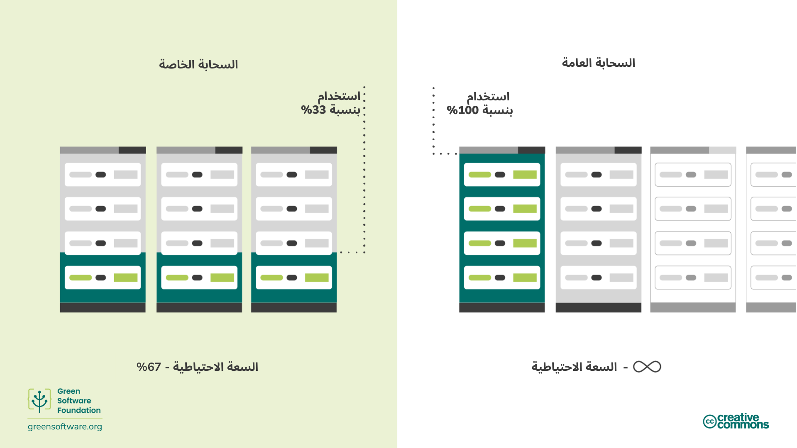

import Quiz from "/src/components/Quiz";

:::note
هذه ترجمة مقدمة من مساهمين وهي محدودة الدعم وقد لا تتوافق تمامًا مع أحدث إصدار باللغة الإنجليزية من الدورة.
:::

:::tip المبدأ

_استخدم أقل قدر ممكن من الكربون المُضمَّن._

:::

## المقدمة

تُعدّ الأجهزة المستخدمة في عملية إنشاء البرمجيات عنصرًا مهمًا يجب أن يأخذه ممارسو البرمجيات الخضراء في الحسبان.

سيوضّح هذا القسم كيف يُمثّل الكربون المُضمَّن تكلفة خفية مرتبطة بالأجهزة، كما يستعرض التدابير المختلفة التي يمكن اتخاذها للحد من الأثر الناتج عن تصنيع الأجهزة وتشغيلها والتخلّص منها، مثل إطالة عمرها الافتراضي أو الانتقال إلى الخوادم السحابية.

## المفاهيم الأساسية

### الكربون المُضمَّن

الجهاز الذي تستخدمه لقراءة هذا النص قد نتج عن تصنيعه انبعاثات كربونية، وعند وصوله إلى نهاية عمره الافتراضي قد يؤدي التخلّص منه إلى إطلاق المزيد من الانبعاثات.

يشير الكربون المُضمَّن إلى كمية الانبعاثات الكربونية الناتجة عن تصنيع الجهاز والتخلّص منه.

عند حساب إجمالي الانبعاثات الكربونية للحواسيب التي تشغّل البرمجيات، يجب احتساب كلٍ من الانبعاثات الناتجة عن تشغيل الجهاز والكربون المُضمَّن المرتبط بتصنيعه والتخلّص منه.

تختلف كمية الكربون المُضمَّن اختلافًا كبيرًا بين أجهزة المستخدم النهائي. ففي بعض الأجهزة، تكون الانبعاثات الناتجة عن التصنيع أعلى بكثير من تلك الناتجة عن الاستخدام، كما أظهرت [دراسة](https://www.ifi.uzh.ch/dam/jcr:fa4e956e-7a53-4038-98a5-00e09e2f4303/Study_Digitalization_Climate_Protection_Summary_Oct2017.pdf) لجامعة زيورخ. ونتيجة لذلك، قد تكون تكلفة الكربون المُضمَّن أعلى من تكلفة الانبعاثات الناتجة عن الكهرباء التي تشغّل الجهاز.

وعند التفكير من منظور الكربون المُضمَّن، فإن أي جهاز — حتى وإن لم يستهلك كهرباء — يكون مسؤولًا عن إطلاق انبعاثات كربونية على مدى عمره الافتراضي.

### الاستهلاك الزمني للانبعاثات

إحدى طرق احتساب الكربون المُضمَّن هي توزيع الانبعاثات زمنيًا على العمر الافتراضي المتوقع للجهاز. فعلى سبيل المثال، إذا تطلّب تصنيع خادم واحد 4000 كجم من ثاني أكسيد الكربون المكافئ، وكان عمره الافتراضي المتوقع أربع سنوات، فإن ذلك يعني أن الانبعاثات السنوية الموزّعة زمنيًا تبلغ 1000 كجم من ثاني أكسيد الكربون المكافئ سنويًا.

## كيفية تحسين كفاءة الأجهزة

عند أخذ الكربون المُضمَّن في الاعتبار، يتّضح أنه عند شراء أي حاسوب يكون قد أطلق بالفعل قدرًا كبيرًا من الانبعاثات. كما أن للأجهزة عمرًا افتراضيًا محدودًا، وبعد فترة تصبح غير قادرة على التعامل مع أحمال العمل الحديثة، ما يستدعي استبدالها.

وبهذا المعنى، تمثّل الأجهزة عبئًا كربونيًا، ولتحقيق الكفاءة الكربونية يجب السعي أيضًا إلى تحقيق كفاءة في استخدام الأجهزة.

هناك نهجان رئيسيان لتحسين كفاءة الأجهزة:

- إطالة العمر الافتراضي لأجهزة المستخدم النهائي.
- رفع معدل استخدام الأجهزة في الحوسبة السحابية.

### إطالة العمر الافتراضي للأجهزة

في المثال السابق، إذا أُضيف عام واحد فقط إلى العمر الافتراضي للخادم، فإن الانبعاثات السنوية الموزّعة زمنيًا تنخفض من 1000 إلى 800 كجم من ثاني أكسيد الكربون المكافئ.

تُستبعد الأجهزة عادةً عندما تتعطّل أو تصبح غير قادرة على التعامل مع أحمال العمل الحديثة. ورغم أن الأجهزة ستتعطّل في نهاية المطاف، إلا أنه يمكن للمطوّرين تصميم برمجيات تعمل على أجهزة أقدم، مما يساهم في إطالة عمرها الافتراضي.

### رفع معدل استخدام الأجهزة

في بيئات الحوسبة السحابية، تعني كفاءة الأجهزة غالبًا رفع معدل استخدام الخوادم. فمن الأفضل تشغيل خادم واحد بنسبة استخدام 100% بدلًا من تشغيل خمسة خوادم بنسبة 20% لكلٍ منها، نظرًا لتكلفة الكربون المُضمَّن. 

وكما أن امتلاك سيارة واحدة واستخدامها يوميًا أكثر كفاءة من امتلاك خمس سيارات واستخدام واحدة فقط كل يوم، فإن تشغيل عدد أقل من الخوادم بكامل طاقتها أكثر كفاءة من تشغيل عدد كبير منها بطاقة منخفضة. ورغم أن الانبعاثات التشغيلية قد تكون متقاربة، فإن كمية الكربون المُضمَّن المستخدمة تكون أقل بكثير.

يعود السبب الأكثر شيوعًا لانخفاض معدل استخدام الخوادم إلى الاستعداد لذُروة الطلب. إذ يضمن تشغيل الخوادم بنسبة منخفضة القدرة على استيعاب الزيادات المفاجئة في الطلب دون التأثير على الأداء، لكن السعة الاحتياطية غير المستخدمة تمثّل كربونًا مُضمَّنًا مهدورًا.

تُعدّ السحابة العامة من أبرز الحلول لهذه المشكلة، إذ تتيح التوسّع السريع عند الحاجة. ومع استخدام عدة مؤسسات للبنية التحتية نفسها، يمكن استغلال السعة الاحتياطية بشكل مشترك، ما يمنع بقاء الخوادم معطّلة دون استخدام.

ومع ذلك، فإن مجرد نقل الأنظمة إلى السحابة العامة لا يؤدي تلقائيًا إلى تقليل الانبعاثات، بل يوفّر الفرصة لإعادة تصميم البرمجيات بطريقة تجعل تقليل الانبعاثات ممكنًا.

## الملخّص

- الكربون المُضمَّن هو الانبعاثات الناتجة عن تصنيع الجهاز والتخلّص منه.
- يجب احتساب كلٍ من الانبعاثات التشغيلية والكربون المُضمَّن عند قياس الأثر الكربوني للأجهزة.
- إطالة العمر الافتراضي للأجهزة تؤدي إلى تقليل الانبعاثات السنوية الموزّعة زمنيًا.
- تُعدّ الحوسبة السحابية أكثر كفاءة من الخوادم المحلية نظرًا لقدرتها على إدارة الطلب بمرونة أعلى.

## الاختبار

<Quiz
  QuizList={[
    {
      question: "ما هو الكربون المُضمَّن؟",
      answers: [
        {
          text: "الكربون الذي انبعث أثناء إنشاء الجهاز",
          isCorrect: false,
        },
        {
          text: "الانبعاثات الناتجة عن تصنيع الجهاز والتخلّص منه",
          isCorrect: true,
        },
        {
          text: "انبعاثات الكربون المرتبطة بتصريف الجهاز",
          isCorrect: false,
        },
      ],
    },
    {
      question: "ما الذي يمثل إجمالي تلوث الكربون للحاسوب؟",
      answers: [
        {
          text: "الكربون المُضمَّن للجهاز",
          isCorrect: false,
        },
        {
          text: "الانبعاثات المُنتجة عند تشغيل الجهاز",
          isCorrect: false,
        },
        {
          text: "كلاهما",
          isCorrect: true,
        },
      ],
    },
    {
      question:
        "ما هي طريقتان أساسيتان لتحقيق كفاءة أعلى مع الأجهزة؟",
      answers: [
        {
          text: "إطالة عمرها وتقليل استخدامها",
          isCorrect: false,
        },
        {
          text: "إطالة عمرها وزيادة استخدامها",
          isCorrect: true,
        },
        {
          text: "تقليل عمرها وزيادة استخدامها",
          isCorrect: false,
        },
      ],
    },
    {
      question:
        "كيف تؤثر كفاءة الأجهزة على الانبعاثات الكربونية للجهاز؟",
      answers: [
        {
          text: "تلغيه",
          isCorrect: false,
        },
        {
          text: "تزيده",
          isCorrect: false,
        },
        {
          text: "تقلله",
          isCorrect: true,
        },
      ],
    },
    {
      question:
        "ما هي الانبعاثات السنوية الموزّعة زمنيًا للجهاز الذي يحتوي على كربون مُضمَّن قدره 1000 كجم ثاني أكسيد الكربون المكافئ وعمر افتراضي مدته 5 سنوات؟",
      answers: [
        {
          text: "200 كجم ثاني أكسيد الكربون المكافئ/سنة",
          isCorrect: true,
        },
        {
          text: "20 كجم ثاني أكسيد الكربون المكافئ/سنة",
          isCorrect: false,
        },
        {
          text: "200 كجم ثاني أكسيد الكربون المكافئ",
          isCorrect: false,
        },
      ],
    },
    {
      question:
        "ما هي بعض الفروقات بين استخدام خوادمك على سحابة عامة مقابل سحابة خاصة؟",
      answers: [
        {
          text: "على السحابة العامة، يمكنك التوسّع بسرعة",
          isCorrect: false,
        },
        {
          text: "على السحابة الخاصة، تحتاج إلى امتلاك خوادم تعمل بأقل من السعة لتلبية ذُروة الطلب",
          isCorrect: false,
        },
        {
          text: "كلاهما صحيح",
          isCorrect: true,
        },
      ],
    },
    {
      question:
        "لماذا من المهم جدًا إدراج الكربون المُضمَّن عند حساب الانبعاثات للأجهزة؟",
      answers: [
        {
          text: "الكربون المُضمَّن أحيانًا يمثل انبعاثات أكثر من الانبعاثات من الكهرباء التي تشغّل الجهاز",
          isCorrect: true,
        },
        {
          text: "الكربون المُضمَّن يمثل نسبة صغيرة لكن مهمة من إجمالي الانبعاثات من جهاز",
          isCorrect: false,
        },
        {
          text: "الكربون المُضمَّن هو المصدر الوحيد للانبعاثات الذي يجب أخذه في الحسبان عند حساب إجمالي الانبعاثات لجهاز",
          isCorrect: false,
        },
      ],
    },
  ]}
/>
