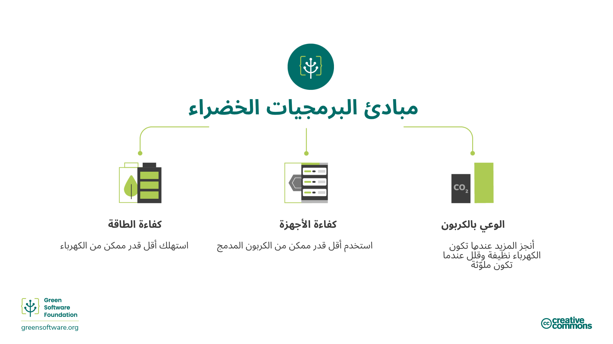
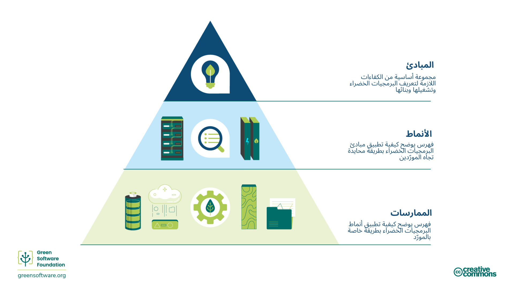

:::note
هذه ترجمة مقدمة من مساهمين وهي محدودة الدعم وقد لا تتوافق تمامًا مع أحدث إصدار باللغة الإنجليزية من الدورة.
:::

## ما هي البرمجيات الخضراء؟

البرمجيات الخضراء هي تخصص ناشئ يقع عند تقاطع علوم المناخ، وتصميم البرمجيات، وأسواق الكهرباء، وتصميم الأجهزة ومراكز البيانات.

البرمجيات الخضراء هي برمجيات كفوءة من حيث الكربون، أي أنها تُصدر أقل قدر ممكن من انبعاثات الكربون.  
هناك ثلاث أنشطة فقط تقلل من انبعاثات الكربون الناتجة عن البرمجيات: كفاءة الطاقة، والوعي بالكربون، وكفاءة الأجهزة.  
سيشرح هذا التدريب جميع هذه المفاهيم، كيفية تطبيقها في عملياتك، وكيفية قياسها، بالإضافة إلى بعض الإرشادات والمنظمات الدولية التي توجه وتراقب هذا المجال.

##  من يجب أن يقرأ هذا؟

كل من يشارك في عملية  بناء أو نشر أو إدارة البرمجيات.
من خلال دراسة هذه المبادئ، يمكن لممارس البرمجيات الخضراء اتخاذ قرارات تُحدث تأثيرًا ملموسًا في التلوث الكربوني لتطبيقاتهم.

##  التاريخ

في عام 2019، تم إصدار المبادئ الثمانية الأصلية لهندسة البرمجيات الخضراء.وفي تحديث عام 2022، تم أخذ الملاحظات التي تم تلقيها على مر السنين بعين الاعتبار، حيث تم دمج بعض المبادئ وإضافة مبدأ جديد يتعلق بفهم الالتزامات المناخية.

## كيف تكون ممارسًا للبرمجيات الخضراء

يغطي هذا التدريب المجالات الأساسية الستة التي يجب أن يعرفها ممارس البرمجيات الخضراء:

1. **كفاءة الكربون**: إصدار أقل قدر ممكن من الكربون.
2. **كفاءة الطاقة**: استخدام أقل قدر ممكن من الطاقة.
3. **الوعي بالكربون**: القيام بالمزيد عندما تكون الكهرباء أنظف، والتقليل عندما تكون الكهرباء أكثر تلوثًا.
4. **كفاءة الأجهزة**: استخدام أقل قدر ممكن من الكربون المدمج في الأجهزة.
5. **القياس**: ما لا يمكنك قياسه، لا يمكنك تحسينه.
6. **الالتزامات المناخية**: فهم الآلية الدقيقة لتقليل الكربون.

سيقدم كل فصل من هذه الفصول مفاهيم جديدة ويشرح بالتفصيل سبب أهميتها من الناحية المناخية، وكيف يمكنك تطبيقها في ممارسات البرمجيات الخضراء الخاصة بك.

## المبادئ، الأنماط، والممارسات

تصف المجالات والمحتويات الأساسية لهذه الدورة **مبادئ البرمجيات الخضراء**، وهي مجموعة من الكفاءات الجوهرية اللازمة  لتعريف وتشغيل وبناء البرمجيات الخضراء.

يُعد [**النمط**](https://patterns.greensoftware.foundation/) في البرمجيات الخضراء مثالًا محددًا على كيفية تطبيق مبدأ واحد أو أكثر في مثال واقعي.  
فبينما تصف المبادئ النظرية التي تقوم عليها البرمجيات الخضراء، تمثل الأنماط الإرشادات العملية التي يمكن لممارسي البرمجيات استخدامها في تطبيقاتهم اليوم.  
الأنماط محايدة بالنسبة للموردين (Vendor-neutral).

أما **الممارسة** في البرمجيات الخضراء فهي تطبيق لنمط معين على منتج تابع لمورد محدد، وتُعلم الممارسين بكيفية استخدام هذا المنتج بطريقة أكثر استدامة.  

يجب أن تشير الممارسات إلى الأنماط، والتي بدورها تشير إلى المبادئ.

كما تنشر مؤسسة البرمجيات الخضراء أيضًا [دليلًا لأنماط البرمجيات الخضراء المحايدة من حيث الموردين](https://patterns.greensoftware.foundation/) عبر فئات متعددة.

