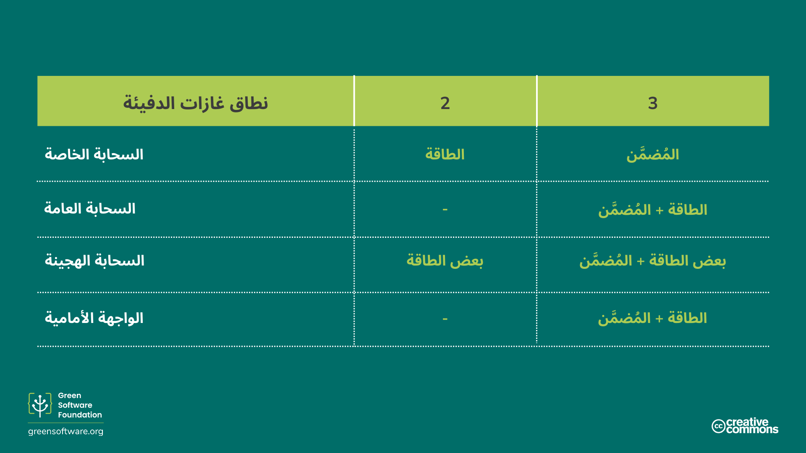
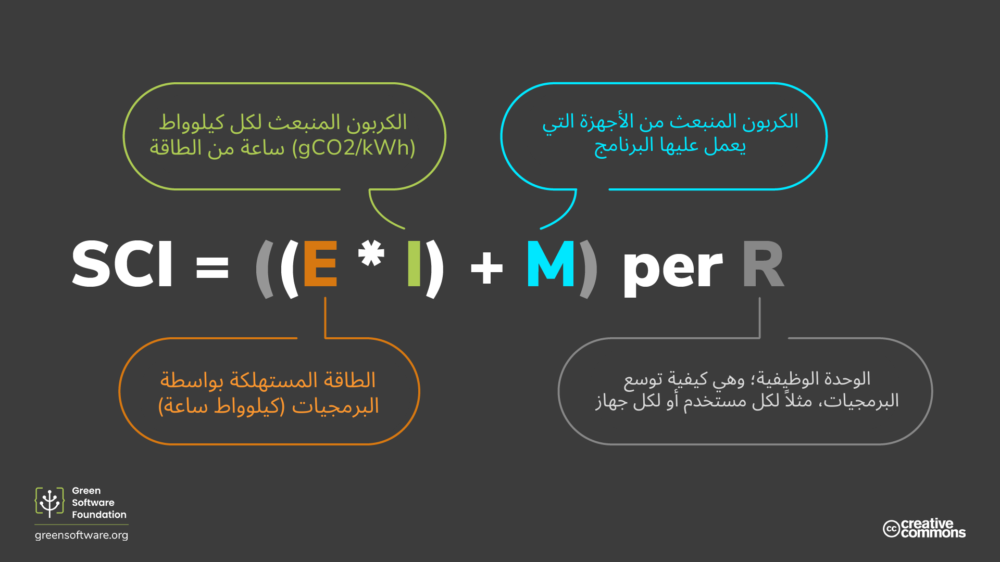

import Quiz from "/src/components/Quiz";

:::note
هذه ترجمة مقدمة من مساهمين وهي محدودة الدعم وقد لا تتوافق تمامًا مع أحدث إصدار باللغة الإنجليزية من الدورة.
:::

:::tip المبدأ

_ما لا يمكن قياسه لا يمكن تحسينه._

:::

## المقدمة

يُعدّ بروتوكول غازات الدفيئة (GHG) أكثر المنهجيات استخدامًا من قِبل المؤسسات لقياس إجمالي انبعاثاتها الكربونية. ويساعد فهم نطاقات هذا البروتوكول وكيفية قياس البرمجيات وفقًا لمعايير الصناعة على تحديد مدى تطبيق مبادئ البرمجيات الخضراء، ومعرفة مقدار الجهد المطلوب لتحقيق التحسين.

ولتكميل بروتوكول غازات الدفيئة، يمكن استخدام مواصفة كثافة الكربون في البرمجيات (SCI). ففي حين يُعدّ بروتوكول GHG مقياسًا عامًا مناسبًا لجميع أنواع المؤسسات، صُمّم SCI خصيصًا لقياس معدل انبعاثات البرمجيات وتحفيز العمل على إزالة تلك الانبعاثات.

يقيس بروتوكول GHG الانبعاثات الكلية، بينما يُعدّ SCI أداة لتمكين إزالة الانبعاثات الناتجة عن البرمجيات.

سنستعرض فيما يلي كلتا منهجيتَي القياس ونوضح كيفية إجراء الحساب في كل حالة.

## بروتوكول غازات الدفيئة

يُعدّ [بروتوكول غازات الدفيئة](https://ghgprotocol.org) المعيار الأكثر استخدامًا والمعترف به دوليًا في محاسبة انبعاثات غازات الدفيئة. وتشير الإحصاءات إلى أن [92%](https://ghgprotocol.org/about-us) من شركات قائمة فورتشن 500 تعتمد عليه عند حساب والإفصاح عن انبعاثاتها الكربونية.

يقسّم البروتوكول الانبعاثات إلى ثلاثة نطاقات:

- **النطاق 1**: الانبعاثات الناتجة عن العمليات المملوكة أو الخاضعة لسيطرة المؤسسة، مثل احتراق الوقود في الموقع أو مركبات الأسطول.
- **النطاق 2**: الانبعاثات غير المباشرة المرتبطة بإنتاج الطاقة المشتراة، مثل الكهرباء والحرارة.
- **النطاق 3**: الانبعاثات غير المباشرة الأخرى الناتجة عن جميع الأنشطة ذات الصلة، بما في ذلك سلسلة التوريد، سفر الموظفين لأغراض العمل، والطاقة التي يستهلكها العملاء عند استخدام المنتج.

يُعرف النطاق 3 أيضًا باسم انبعاثات سلسلة القيمة، وغالبًا ما يكون المصدر الأكبر للانبعاثات والأكثر تعقيدًا في الحساب. فهو يشمل جميع الأنشطة اللازمة لتقديم منتج أو خدمة، من مرحلة التصوّر حتى التوزيع. فعلى سبيل المثال، ينتج عن استخراج ومعالجة كل مادة خام تُستخدم في تصنيع حاسوب محمول انبعاثات كربونية، كما تُحتسب ضمن سلسلة القيمة الانبعاثات الناتجة عن استخدام الحاسوب بعد بيعه للعميل.

ومن خلال هذا النهج، يمكن جمع انبعاثات غازات الدفيئة الناتجة عن جميع المؤسسات والأفراد للوصول إلى إجمالي عالمي.

### إلى أي نطاق تنتمي انبعاثات تطبيقي؟

 لقد رأينا بالفعل كيف يطلب منا بروتوكول غازات الدفيئة (GHG) تصنيف انبعاثات البرمجيات ضمن النطاقات الثلاثة. ولكن، كيف يتم ذلك فعلياً عندما يتعلق الأمر بالبرمجيات؟

تمتلك معظم المؤسسات تطبيقات عديدة تعمل بهياكل وبيئات تشغيل مختلفة. وبناءً على ذلك، فإن النطاق الذي تندرج تحته انبعاثاتك —سواء من حيث استهلاك الطاقة أو الكربون المُضمَّن— يعتمد على السيناريو الخاص بك.

**التطبيقات السحابية التي تعمل على خوادم مملوكة للمؤسسة:**
- استهلاك الطاقة يقع ضمن النطاق 2
- الانبعاثات المُضمَّنة للخوادم تقع ضمن النطاق 3

**التطبيقات السحابية على السحابة العامة:**
- كل من استهلاك الطاقة والانبعاثات المُضمَّنة يقعان ضمن النطاق 3

**التطبيقات الهجينة (خاصة/عامة):**
- تتوزع الانبعاثات بين النطاقين 2 و3

**تطبيقات الواجهة الأمامية الموجّهة للعملاء:**
- استهلاك الطاقة يقع ضمن النطاق 3، لأن العميل هو من يشتري الطاقة

بالنسبة للبرمجيات، وبغض النظر عما إذا كانت تعمل على بنية تحتية تمتلكها، أو تستأجرها، أو يمتلكها المستهلكون، فهناك ثلاثة عوامل يجب مراعاتها عند تصنيف الانبعاثات:

- كمية الطاقة المستهلكة
- مدى نظافة أو كثافة الكربون في تلك الطاقة
- حجم الأجهزة المطلوبة لتشغيل البرمجيات

### هل يمكن حساب إجمالي انبعاثات البرمجيات؟

يتطلّب حساب الإجمالي توفر بيانات دقيقة حول استهلاك الطاقة، وكثافة الكربون، والأجهزة المستخدمة. ويُعدّ جمع هذه البيانات تحديًا حتى في البرمجيات المملوكة للمؤسسات، رغم إمكانية الاعتماد على القياس عن بُعد (Telemetry) أو السجلات.

أما في البرمجيات مفتوحة المصدر، فتكون الرؤية محدودة بشأن أماكن الاستخدام، واستهلاك الطاقة، ونوع الأجهزة. كما أن تعدد المساهمين والمؤسسات يجعل من غير الواضح من يتحمل مسؤولية حساب الانبعاثات أو إزالتها.

ومع الأخذ في الاعتبار أن البرمجيات مفتوحة المصدر تشكّل نحو 90% من البنية التقنية النموذجية للمؤسسات، يتضح أن جزءًا كبيرًا من الانبعاثات لا يتم احتسابه.

### هل تعكس القيم الإجمالية الصورة الكاملة؟

القيمة الإجمالية ليست سوى مقياس واحد يصف حالة شيء ما. ولكي تتخذ القرارات الصحيحة، عليك النظر في العديد من المقاييس المختلفة.

تخيل سيناريو تكون فيه قائداً لمؤسسة ومكلفاً بتقليل انبعاثات برمجياتك. قمت بقياس الانبعاثات في الربع الأول (Q1) وكانت النتيجة إجمالاً 34 طناً. وبعد القيام ببعض الاستثمارات في مشاريع تهدف لإزالة الانبعاثات، وجدت أن الانبعاثات زادت بحلول الربع الثاني (Q2) لتصل إلى 45 طناً. فهل يعني هذا أن جهودك قد فشلت؟

ليس بالضرورة. نحن نعلم أن القيمة الإجمالية وحدها لا تحكي القصة كاملة، ويجب أن ننظر في مقاييس أخرى لمعرفة ما إذا كان مشروع تقليل الانبعاثات قد نجح أم لا. على سبيل المثال، إذا قمت بقياس كثافة الكربون بالإضافة إلى إجمالي الكربون، فقد تحصل على منظور مختلف. ففي المشروع نفسه، إذا كانت كثافة الكربون 3.3 جرام من ثاني أكسيد الكربون المكافئ لكل مستخدم في الربع الأول، وانخفضت إلى 2.9 جرام في الربع الثاني، فقد تعتبر المشروع ناجحاً وتستمر في الاستثمار فيه.

فبينما أظهرت لك القيمة الإجمالية أن الانبعاثات الكربونية لمؤسستك قد زادت بشكل عام، أعطتك الكثافة منظوراً أكثر اكتمالاً يساعدك على اتخاذ قرار مدروس ومبني على معلومات دقيقة حول كيفية المضي قدماً.

## مواصفة كثافة الكربون في البرمجيات (SCI)

[مواصفة كثافة الكربون في البرمجيات (SCI)](https://grnsft.org/sci) منهجية طوّرها فريق العمل المعني بالمعايير في مؤسسة البرمجيات الخضراء. وتهدف هذه المنهجية إلى تقييم تطبيقات البرمجيات وفق بُعد الاستدامة، وتشجيع اتخاذ إجراءات فعلية للحد من الانبعاثات وصولًا إلى التخلص منها.

ولا تُعد SCI بديلًا عن بروتوكول غازات الدفيئة (GHG)، بل هي مقياس إضافي يساعد فرق البرمجيات على فهم كيفية تصرّف تطبيقاتهم من حيث انبعاثات الكربون، مما يمكّنهم من اتخاذ قرارات أكثر وعيًا. ففي حين يحسب بروتوكول GHG إجمالي الانبعاثات، يركّز مقياس SCI على حساب معدل الانبعاثات. وبمقارنة ذلك بعالم السيارات، يمكن تشبيه SCI بمقياس “عدد الأميال لكل جالون”، بينما يشبه بروتوكول GHG حساب البصمة الكربونية الكاملة لشركة سيارات وجميع السيارات التي تنتجها سنويًا.

وبدلًا من تصنيف انبعاثات البرمجيات ضمن النطاقات من 1 إلى 3، يقوم SCI بتقسيمها إلى:

- **الانبعاثات التشغيلية**: وهي الانبعاثات الناتجة عن تشغيل البرمجيات.
- **الانبعاثات المُضمَّنة**:    وهي الانبعاثات الناتجة عن الموارد المادية اللازمة لتشغيل البرمجيات.

كما أن SCI يُعد مقياس كثافة وليس مقياسًا إجماليًا، مما يجعله أكثر شمولًا وملاءمة للبرمجيات مفتوحة المصدر.

ومن المهم الإشارة إلى أنه لا يمكن تحسين درجة SCI الخاصة بك من خلال شراء التعويضات الكربونية، سواء عبر آليات الحياد الكربوني أو التعويض أو عبر موازنة استهلاك الكهرباء بشهادات الطاقة المتجددة. وهذا يعني أن المؤسسة التي لا تبذل أي جهد فعلي لتقليل انبعاثاتها، وتكتفي فقط بإنفاق المال على أرصدة الكربون، لا يمكنها تحقيق درجة SCI جيدة.

وعلى الرغم من أن التعويضات تُعد عنصرًا أساسيًا في أي استراتيجية مناخية، فإنها لا تُعتبر إزالة حقيقية للانبعاثات، ولذلك لا تُحتسب ضمن مقياس SCI.

إذا جعلت تطبيقك أكثر كفاءة في استهلاك الطاقة، أو أكثر كفاءة في استخدام العتاد، أو أكثر وعيًا بالكربون، فإن درجة SCI الخاصة بك ستنخفض. والطريقة الوحيدة لتحسين درجة SCI هي الاستثمار في الوقت أو الموارد في أحد هذه المبادئ الثلاثة. وبناءً على ذلك، فإن اعتماد SCI كمقياس لتطبيقك البرمجي إلى جانب بروتوكول GHG من شأنه أن يدفع نحو الاستثمار في أحد الأعمدة الثلاثة للبرمجيات الخضراء.

### معادلة SCI

يُعد SCI طريقة لتقييم أي تطبيق برمجي، ولا يقتصر على تطبيقات السحابة فقط أو على تطبيقات المستخدم النهائي، بل يشمل جميع أنواع التطبيقات الواقعة بين هذين الطرفين. وهو يوفّر لغةً مشتركة لوصف كيفية تصرّف البرمجيات من حيث انبعاثات الكربون، وكيف يمكن لتغييرٍ مقترح أن يُسهم في تقليل بعض هذه الانبعاثات أو القضاء عليها.

وتتسم معادلة حساب درجة SCI بالبساطة والأناقة، وهذه البساطة تجعلها قابلة للتطبيق في مجموعة واسعة من السيناريوهات المختلفة.

`SCI = ((E × I) + M) ÷ R`

حيث:
- `E` = الطاقة التي يستهلكها النظام البرمجي
- `I` = كثافة الانبعاثات الكربونية الهامشية حسب الموقع
- `M` = الانبعاثات المُضمَّنة للنظام البرمجي
- `R` = الوحدة الوظيفية (مثل: الكربون لكل مستخدم إضافي، أو لكل استدعاء API، أو لكل مهمة تعلّم آلي، إلخ)

وبصيغة أبسط، يمكن تلخيصها على النحو التالي:

`SCI = الكربون لكل وحدة وظيفية`

 تُعد `R` الخاصية الجوهرية في مقياس SCI، إذ تحوّله من مقياس إجمالي إلى مقياس كثافة . وهذا ما نُطلق عليه اسم الوحدة الوظيفية.

## كيفية حساب درجة SCI الخاصة بك

اتبع الخطوات الأربع التالية لحساب درجة SCI لتطبيقك.

1. تحديد ما يجب تضمينه

يعني تحديد مكوّنات البرمجيات التي ستُدرجها أو تستبعدها من حساب SCI تعريف حدود نظامك البرمجي؛ أي أين يبدأ وأين ينتهي.

فبالنسبة لكل مكوّن برمجي تقوم بإدراجه، يجب عليك قياس تأثيره. أما كل مكوّن رئيسي تستبعده، فيجب أن توضّح سبب هذا الاستبعاد.

لا تفرض مواصفة SCI حاليًا متطلبات صارمة بشأن ما يجب تضمينه أو استبعاده. ومع ذلك، يجب عليك تضمين جميع البنى التحتية والأنظمة الداعمة التي تُسهم بشكل كبير في تشغيل البرمجيات.

قد تنخفض درجة SCI الخاصة بك لأنك شدّدت حدود النظام واستبعدت مكوّنات برمجية إضافية. وعلى العكس، قد ترتفع درجتك لأنك أدرجت مكوّنات كنت قد استبعدتها سابقًا. لذلك، عند الإبلاغ عن درجة SCI، وخصوصًا عند الإشارة إلى أي تحسّن فيها، من الضروري الإفصاح بوضوح عن حدود نظامك البرمجي.

2. اختيار الوحدة الوظيفية

كما رأينا، فإن SCI هو معدل وليس قيمة إجمالية، وهو يقيس كثافة الانبعاثات وفقًا للوحدة الوظيفية المختارة. لا تفرض المواصفة حاليًا وحدة وظيفية محددة، ويمكنك اختيار الوحدة التي تصف على أفضل وجه كيفية توسّع تطبيقك.

فعلى سبيل المثال، إذا كان تطبيقك يتوسّع مع زيادة عدد المستخدمين، فيمكنك اختيار عدد المستخدمين كوحدة وظيفية.

وقد تُحدِّد الإصدارات المستقبلية من SCI وحدات وظيفية معيّنة لأنواع مختلفة من التطبيقات بهدف تحسين قابلية المقارنة. فمثلًا، قد يُطلب من تطبيقات البث اختيار الدقائق كوحدة وظيفية لتوحيد القياس بين جميع تطبيقات البث.

3. تحديد كيفية قياس الانبعاثات

لديك الآن قائمة بمكوّنات البرمجيات التي تريد قياسها، والوحدة الوظيفية التي ستستخدمها. الخطوة التالية هي تحديد كيفية قياس انبعاثات كل مكوّن برمجي.

هناك طريقتان للقياس الكمي: **القياس** و**الحساب **.

- **القياس ** يعتمد على العدّ المباشر باستخدام أدوات أو عدّادات. على سبيل المثال: قياس استهلاك الطاقة لمكوّن برمجي باستخدام جهاز متصل بمقبس الكهرباء أو استخدام عدّادات مدمجة في العتاد تقيس استهلاك الطاقة مباشرة.
إذا كان بإمكانك عدّ القيم بشكل مباشر، فيجب استخدام أسلوب القياس.
- **الحساب **  يعتمد على العدّ غير المباشر، وغالبًا ما يستخدم نماذج تقديرية. على سبيل المثال:  إذا لم يكن بإمكانك قياس استهلاك الطاقة لتطبيقك مباشرة، ولكن لديك نموذج يقدّر الاستهلاك بناءً على نسبة استخدام المعالج (CPU)، فإن هذا يُعد حسابًا وليس قياسًا.

يمكنك الاستفادة من الموارد التالية لاختيار منهجية القياس أو الحساب المناسبة:

- الاطلاع على مشروع [دليل كثافة الكربون في البرمجيات](https://sci-guide.greensoftware.foundation/). وهو مشروع يقدّم إرشادات حول كيفية قياس انبعاثات مكوّنات البرمجيات المختلفة.

4. إجراء القياس الكمي

أنت الآن جاهز للتنفيذ. باستخدام المنهجية الموضّحة في الخطوات السابقة، ابدأ في حساب درجة SCI لكل مكوّن برمجي ضمن حدود نظامك.

تمثّل درجة SCI الإجمالية لتطبيقك مجموع درجات جميع المكوّنات المختلفة.

يمكنك أيضًا حساب أكثر من درجة SCI للتطبيق نفسه. فدرجة SCI تُعد معلومة مفيدة لفهم كيفية تصرّف تطبيقك من حيث انبعاثات الكربون في سيناريوهات مختلفة.

على سبيل المثال: قد تختار تطبيقات البث مقياس الكربون لكل دقيقة وقد تحسب أيضًا الكربون لكل مستخدم في اليوم . كما يمكن لمقياس الكربون لكل دولار من الإيرادات أن يوفّر بُعدًا تحليليًا إضافيًا مفيدًا .

## الملخّص

- يُعد بروتوكول غازات الدفيئة (GHG) مقياسًا لقياس إجمالي انبعاثات الكربون الخاصة بالمؤسسات، ويُستخدم من قِبل منظمات حول العالم.
- يقسّم بروتوكول GHG الانبعاثات الكربونية إلى ثلاثة نطاقات. ويشير النطاق 3، المعروف أيضًا بانبعاثات سلسلة القيمة، إلى الانبعاثات الناتجة عن المؤسسات التي تزوّد غيرها ضمن سلسلة التوريد. وبهذا المعنى، فإن انبعاثات النطاقين 1 و2 لمؤسسة ما تُحتسب ضمن النطاق 3 لمؤسسة أخرى.
- يمكن حساب الانبعاثات الناتجة عن البرمجيات باستخدام بروتوكول GHG، إلا أن ذلك قد يكون صعبًا في حالة البرمجيات مفتوحة المصدر.
- أما SCI فهو مقياس صُمّم خصيصًا لحساب انبعاثات البرمجيات، وهو مقياس كثافة (معدل) وليس مقياسًا إجماليًا.
- ولا تُحدِّد مواصفة SCI وحدة قياس وظيفية بعينها، بل ينبغي عليك اختيار وحدة تعبّر على نحوٍ دقيق عن طبيعة تطبيقك وكيفية توسّعه.

## الاختبار

<Quiz
  QuizList={[
    {
      question:
        "كيف يطلب منا بروتوكول غازات الدفيئة قياس الانبعاثات؟",
      answers: [
        {
          text: "بتقسيم الانبعاثات إلى ثلاثة نطاقات",
          isCorrect: true,
        },
        {
          text: "بتقسيم الانبعاثات إلى كربون مُضمَّن وانبعاثات تشغيلية يومية",
          isCorrect: false,
        },
        {
          text: "بتقسيم الانبعاثات الناتجة عن التطبيقات التي تعمل على السحابة العامة والسحابة الخاصة",
          isCorrect: false,
        },
      ],
    },
    {
      question:
        "أيٌّ من النطاقات الثلاثة المستخدمة في بروتوكول GHG يُعرف أيضًا باسم «انبعاثات سلسلة القيمة»؟",
      answers: [
        {
          text: "النطاق 1",
          isCorrect: false,
        },
        {
          text: "النطاق 2",
          isCorrect: false,
        },
        {
          text: "النطاق 3",
          isCorrect: true,
        },
        {
          text: "النطاقان 1 و2",
          isCorrect: false,
        },
        {
          text: "جميع ما سبق ",
          isCorrect: false,
        },
      ],
    },
    {
      question:
        "إذا كان تطبيقك يعمل على السحابة العامة، فإلى أي نطاق تنتمي انبعاثاتك؟",
      answers: [
        {
          text: "النطاقات 2 و3",
          isCorrect: false,
        },
        {
          text: "النطاق 2",
          isCorrect: false,
        },
        {
          text: "النطاق 3",
          isCorrect: true,
        },
        {
          text: "يعتمد على ما إذا كانت البنية عامة أو خاصة أو هجينة",
          isCorrect: false,
        },
      ],
    },
    {
      question:
        "أي من السيناريوهات التالية أكثر تحديًا عند قياس انبعاثاتها باستخدام بروتوكول GHG؟",
      answers: [
        {
          text: "البرمجيات مغلقة المصدر",
          isCorrect: false,
        },
        {
          text: "البرمجيات مفتوحة المصدر",
          isCorrect: true,
        },
        {
          text: "كلاهما ",
          isCorrect: false,
        },
      ],
    },
    {
      question: "ماذا يعني الاختصار SCI؟",
      answers: [
        {
          text: "مؤشر الكربون في البرمجيات",
          isCorrect: false,
        },
        {
          text: "كثافة الكربون في البرمجيات",
          isCorrect: true,
        },
        {
          text: "كثافة الكربون المُحدَّدة",
          isCorrect: false,
        },
      ],
    },
    {
      question: "ماذا يمثل ((E × I) + M) في معادلة SCI؟",
      answers: [
        {
          text: "الكربون ",
          isCorrect: true,
        },
        {
          text: "الطاقة ",
          isCorrect: false,
        },
        {
          text: "كثافة الكربون",
          isCorrect: false,
        },
      ],
    },
    {
      question: "ماذا تمثل 'R' في معادلة SCI؟",
      answers: [
        {
          text: "التكرار ",
          isCorrect: false,
        },
        {
          text: " المعدّل",
          isCorrect: true,
        },
        {
          text: " الوحدة الوظيفية",
          isCorrect: false,
        },
      ],
    },
    {
      question:
        "ما الأمور الأساسية التي يجب مراعاتها قبل حساب درجة SCI الخاصة بك؟",
      answers: [
        {
          text: "ما الذي يجب تضمينه والوحدة الوظيفية التي ستستخدمها",
          isCorrect: false,
        },
        {
          text: "ما الذي يجب تضمينه، والوحدة الوظيفية، وطريقة التكميم/القياس",
          isCorrect: true,
        },
        {
          text: "ما الذي يجب تضمينه، والوحدة الوظيفية، وطريقة التكميم، ودرجة بروتوكول GHG",
          isCorrect: false,
        },
      ],
    },
  ]}
/>
