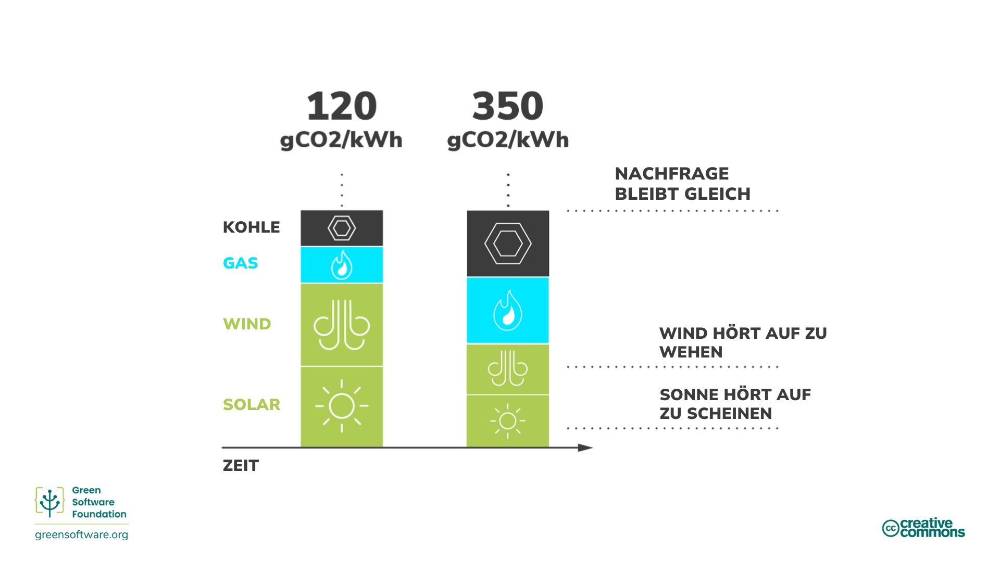
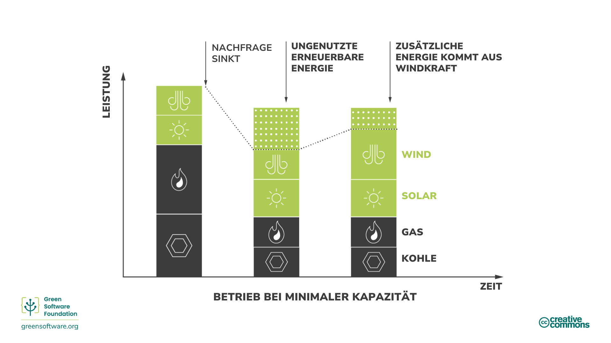
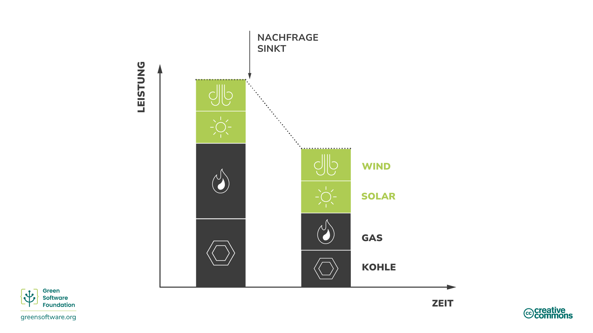
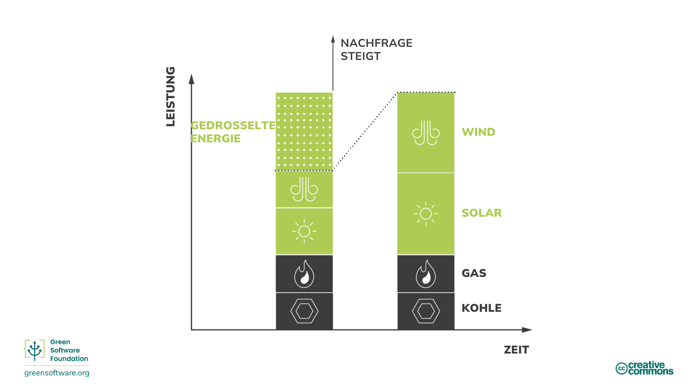
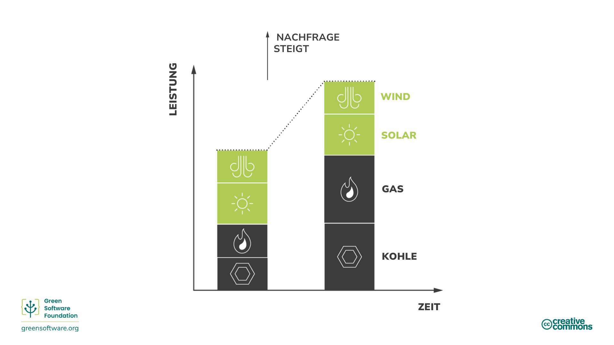
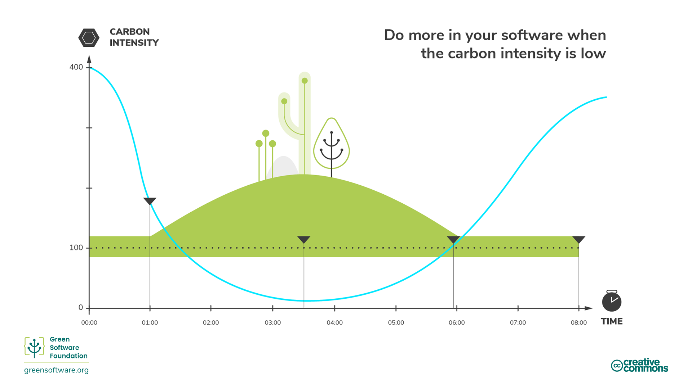

import Quiz from "/src/components/Quiz";

:::note
Dies ist eine gemeinschaftlich erstellte Übersetzung. Sie hat begrenzte Unterstützung und entspricht möglicherweise nicht der neuesten deutschen Version des Kurses.
:::

:::tip Prinzip

_Tun Sie mehr, wenn der Strom sauberer ist, und tun Sie weniger, wenn der Strom schmutziger ist._

:::

## Einleitung

Nicht jeder Strom wird auf dieselbe Weise erzeugt. An verschiedenen Orten und zu verschiedenen Zeiten wird Strom aus verschiedenen Quellen mit unterschiedlichen Kohlenstoffemissionen erzeugt. Einige Quellen, wie Wind-, Solar- oder Wasserkraft, sind saubere, erneuerbare Quellen, die wenig Kohlenstoff ausstoßen. Andererseits werden bei der Stromerzeugung aus fossilen Brennstoffen in unterschiedlichem Maße Kohlenstoffemissionen freigesetzt. So stoßen beispielsweise sowohl Gas als auch Kohle mehr Kohlenstoff aus als erneuerbare Energiequellen, aber Gaskraftwerke stoßen weniger Kohlenstoff aus als Kohlekraftwerke.

Kohlenstoffbewusstsein bedeutet, mehr zu tun, wenn mehr Energie aus kohlenstoffarmen Quellen stammt, und weniger zu tun, wenn mehr Energie aus kohlenstoffreichen Quellen stammt. 

## Schlüsselkonzepte

### Kohlenstoffintensität

Die Kohlenstoffintensität misst, wie viel Kohlenstoff (CO2e) pro verbrauchter Kilowattstunde (KWh) Strom emittiert wird. Die Standardeinheit für die Kohlenstoffintensität ist gCO2eq/kWh, also Gramm Kohlenstoff pro Kilowattstunde.

Wenn Ihr Computer direkt an einen Windpark angeschlossen ist, hätte sein Strom eine Kohlenstoffintensität von 0 gCO2eq/kWh, da ein Windpark bei der Stromerzeugung keinen Kohlenstoff ausstößt. Die meisten Menschen können sich jedoch nicht direkt an Windparks anschließen, sondern sind an Stromnetze angeschlossen, die mit Strom aus verschiedenen Quellen versorgt werden.

Sobald Sie an ein Netz angeschlossen sind, können Sie nicht mehr kontrollieren, aus welchen Quellen der Strom stammt, den Sie verbrauchen; Sie erhalten einfach eine Mischung aus allem. Ihre Kohlenstoffintensität ergibt sich also aus einer Mischung aller Stromquellen in einem Netz, sowohl der kohlenstoffärmeren als auch der kohlenstoffreicheren.

### Variabilität der Kohlenstoffintensität

Die Kohlenstoffintensität variiert je nach Standort, da einige Regionen einen Energiemix mit mehr sauberen Energiequellen haben als andere.

Die Kohlenstoffintensität ändert sich auch im Laufe der Zeit aufgrund der inhärenten Variabilität der erneuerbaren Energien, die durch die Unvorhersehbarkeit der Wetterbedingungen verursacht wird. Wenn es zum Beispiel bewölkt ist oder der Wind nicht weht, steigt die Kohlenstoffintensität, da ein größerer Teil des Stroms aus Quellen stammt, die Kohlenstoff emittieren.

### Dispatchability & Einschränkung

Die Stromnachfrage schwankt im Laufe des Tages, und das Angebot muss immer in der Lage sein, diese Nachfrage zu decken. Ein Brownout (ein Spannungsabfall im Stromnetz) tritt auf, wenn ein Versorgungsunternehmen nicht genug Strom produziert, um die Nachfrage zu decken. Produziert ein Versorgungsunternehmen dagegen mehr Strom als benötigt, werden die Sicherungen ausgelöst und es kommt zu Stromausfällen, damit die Infrastruktur nicht ausbrennt.

Es muss jederzeit ein Gleichgewicht zwischen Stromnachfrage und -angebot herrschen, und die Verantwortung dafür liegt in der Regel beim Versorgungsunternehmen.

Bei fossilen Brennstoffen wie Kohle ist es einfacher, die für diese Versorgung produzierte Energie zu steuern; dies wird als **Dispatchfähigkeit** bezeichnet. Bei erneuerbaren Energiequellen wie Windkraftanlagen lässt sich die erzeugte Energie jedoch nicht so leicht steuern (wir können nicht kontrollieren, wie stark der Wind weht). Wenn die Stromquelle mehr Strom produziert als benötigt wird, wird dieser Strom weggeworfen; dies nennt man **Curtailment**.

### Marginale Kohlenstoffintensität

Wenn Sie plötzlich mehr Strom benötigen - zum Beispiel, um ein Licht einzuschalten - kommt diese Energie aus dem Grenzkraftwerk. Das Grenzkraftwerk ist abschaltbar, was bedeutet, dass Grenzkraftwerke oft mit fossilen Brennstoffen betrieben werden.

Die marginale Kohlenstoffintensität ist die Kohlenstoffintensität des Kraftwerks, das eingesetzt werden müsste, um eine neue Nachfrage zu decken.

Fossil befeuerte Kraftwerke lassen sich nur selten auf 0 herunterfahren. Sie haben eine Mindestbetriebsschwelle, und einige lassen sich nicht skalieren; sie gelten als konstante, immer verfügbare Grundlast. Aus diesem Grund kommt es manchmal zu dem Szenario, dass wir erneuerbare Energien einschränken (wegwerfen), während wir weiterhin Energie aus fossilen Kraftwerken verbrauchen.

In diesen Situationen beträgt die marginale Kohlenstoffintensität 0 gCO2eq/kWh, da wir wissen, dass jede neue Nachfrage der erneuerbaren Energie entsprechen wird, die wir abschalten.

### Energiemärkte

Das genaue Marktmodell variiert weltweit, folgt aber im Großen und Ganzen demselben Modell.

Wenn die Nachfrage nach Strom sinkt, müssen die Versorgungsunternehmen das Angebot **reduzieren**, um Angebot und Nachfrage auszugleichen. Dies können sie auf zwei Arten tun:

1. **Weniger Energie von fossilen Kraftwerken kaufen**.

Energie aus fossilen Brennstoffen ist in der Regel am teuersten, daher ist dies die bevorzugte Methode. Dies führt direkt dazu, dass weniger fossile Brennstoffe verbrannt werden.

2. **Weniger Energie aus erneuerbaren Quellen kaufen**.
   Erneuerbare Energiequellen sind am billigsten, daher wird diese Methode nicht bevorzugt. Wenn es einer erneuerbaren Energiequelle nicht gelingt, ihren gesamten Strom zu verkaufen, muss sie den Rest wegwerfen.

Die Verringerung des Stromverbrauchs in Ihren Anwendungen kann dazu beitragen, die Kohlenstoffintensität der Energie zu senken, da zuerst die fossilen Brennstoffe reduziert werden.

Wenn die Nachfrage nach Strom steigt, müssen die Versorgungsunternehmen das Angebot erhöhen, um Angebot und Nachfrage auszugleichen. Dies können sie auf zwei Arten tun:

1. **Mehr Energie aus erneuerbaren Quellen kaufen, die derzeit gedrosselt werden**

Wenn Sie den Stromverbrauch drosseln, bedeutet das, dass Sie überschüssige Energie haben, die Sie abgeben könnten. Erneuerbare Energie ist bereits die billigste, so dass die gedrosselte erneuerbare Energie die billigste einspeisbare Energiequelle sein wird. Die Kraftwerke für erneuerbare Energien werden dann die Energie verkaufen, die sie sonst hätten abnehmen müssen.

2. **Mehr Energie aus fossilen Kraftwerken kaufen**.

Fossile Brennstoffe sind von Natur aus abschaltbar; sie können die Energieproduktion schnell erhöhen, indem sie mehr verbrennen. Allerdings kostet Kohle Geld, sodass dies die am wenigsten bevorzugte Lösung ist.

Die Energiemärkte gehören zu den komplexesten Märkten der Welt, sodass die obige Erklärung eine Vereinfachung darstellt. Es ist jedoch wichtig zu verstehen, dass unser Ziel darin besteht, Investitionen in kohlenstoffärmere Energiequellen wie erneuerbare Energien zu erhöhen und Investitionen in kohlenstoffreichere Quellen wie Kohle zu verringern. Der beste Weg, um sicherzustellen, dass das Geld in die richtige Richtung fließt, ist, dafür zu sorgen, dass Sie Strom mit der geringsten Kohlenstoffintensität verwenden.

## Wie man klimabewusster ist

:::tip

Der beste Weg, um sicherzustellen, dass Investitionen in Anlagen mit geringen Kohlenstoffemissionen fließen und nicht in Anlagen mit hohen Kohlenstoffemissionen, ist Strom zu nutzen, wenn die Kohlenstoffintenität gering ist.

:::

Zurzeit findet ein globaler Wandel statt. Überall auf der Welt werden die Stromnetze von der primären Verbrennung fossiler Brennstoffe auf Energie aus kohlenstoffärmeren Quellen wie Wind und Sonne umgestellt. Dies ist eine unserer größten Hoffnungen, unsere globalen Reduktionsziele zu erreichen. Als Praktiker für grüne Software sollten wir uns einige Möglichkeiten ansehen, wie wir dazu beitragen können, diesen Übergang zu beschleunigen.

Der primäre Antrieb für den Übergang ist eher wirtschaftlicher Natur als irgendein Nachhaltigkeitsziel. Die erneuerbaren Energien gewinnen, weil sie billiger sind und mit der Zeit immer erschwinglicher werden. Um den Übergang zu beschleunigen, müssen wir also dafür sorgen, dass Anlagen für erneuerbare Energien rentabler und Anlagen für fossile Brennstoffe weniger rentabel werden. Das geht am besten, indem wir mehr Strom aus kohlenstoffärmeren Quellen wie erneuerbaren Energien und weniger Strom aus kohlenstoffreicheren Quellen verwenden.

Die Kohlenstoffintensität ist geringer, wenn mehr Energie aus kohlenstoffärmeren Quellen stammt, und höher, wenn sie aus kohlenstoffreicheren Quellen stammt.

### Nachfrageverschiebung

Kohlenstoffbewusst zu sein bedeutet, auf Veränderungen der Kohlenstoffintensität zu reagieren, indem Sie Ihre Nachfrage erhöhen oder verringern. Wenn Ihre Arbeit es Ihnen erlaubt, flexibel zu sein, wann und wo Sie Arbeitslasten ausführen, können Sie die Nachfrage entsprechend verlagern - Strom verbrauchen, wenn die Kohlenstoffintensität niedriger ist, und die Produktion pausieren, wenn sie höher ist. So können Sie zum Beispiel ein Modell für maschinelles Lernen zu einem anderen Zeitpunkt oder in einer anderen Region mit viel geringerer Kohlenstoffintensität trainieren.

[Studien] (https://ieeexplore.ieee.org/document/6128960) zeigen, dass diese Maßnahmen je nach der Anzahl der erneuerbaren Energien, die das Netz versorgen, zu einer Kohlenstoffreduzierung von 45 % bis 99 % führen können.

Die Verlagerung der Nachfrage kann weiter in räumliche und zeitliche Verlagerung unterteilt werden. 

#### Räumliche Verlagerung

Räumliche Verlagerung bedeutet, dass Sie Ihre Berechnungen an einen anderen physischen Ort verlagern, an dem die aktuelle Kohlenstoffintensität geringer ist. Dabei kann es sich um eine Region handeln, die von Natur aus über kohlenstoffärmere Energiequellen verfügt. Zum Beispiel kann man je nach Jahreszeit in eine andere Hemisphäre ziehen, um mehr Sonnenstunden zu haben.

#### Zeitliche Verschiebung

Wenn Sie Ihre Berechnung nicht räumlich in eine andere Region verschieben können, besteht eine weitere Möglichkeit darin, sie in eine andere Zeit zu verlegen. Vielleicht später am Tag oder in der Nacht, wenn es sonniger oder windiger ist und die Kohlenstoffintensität daher geringer ist. Dies wird als zeitliche Verlagerung der Nachfrage bezeichnet. Dank der Fortschritte bei der Wettervorhersage können wir die künftige Kohlenstoffintensität recht gut vorhersagen.

Einige der größten Technologieunternehmen haben die Bedeutung des Kohlenstoffbewusstseins erkannt und setzen fortschrittliche Modellierungstechniken ein, um die Nachfrage zu verlagern.

- **Google Carbon Aware Data Centers** - Google hat ein Projekt gestartet, um [einige der Cloud-Arbeitslasten kohlenstoffbewusst zu machen] (https://blog.google/outreach-initiatives/sustainability/carbon-aware-computing-location/). Es wurden Modelle zur Vorhersage der künftigen Kohlenstoffintensität und Arbeitslast entwickelt. Sie haben dann große Arbeitslasten so gestaltet, dass mehr passiert, wenn und wo die Kohlenstoffintensität am niedrigsten ist, aber so, dass sie immer noch die erwartete Last bewältigen können.
- **Microsoft Carbon Aware Windows** - [Microsoft kündigte ein Projekt an, um Windows 11 nachhaltiger zu machen] (https://www.techradar.com/news/windows-11-is-getting-an-eco-friendly-update-but-could-microsoft-do-more). Zunächst bedeutet dies, dass Windows-Updates ausgeführt werden, wenn die Kohlenstoffintensität geringer ist.

### Demand shaping

Bedarfsverschiebung ist die Strategie, Berechnungen in Regionen oder zu Zeiten zu verlagern, in denen die Kohlenstoffintensität am geringsten ist. Die Gestaltung der Nachfrage ist eine ähnliche Strategie. Anstatt jedoch die Nachfrage in eine andere Region oder zu einer anderen Zeit zu verlagern, passen wir unsere Berechnungen an das vorhandene Angebot an.

- Wenn die Kohlenstoffintensität niedrig ist, erhöhen Sie die Nachfrage; tun Sie mehr in Ihren Anwendungen.
- Wenn die Kohlenstoffintensität hoch ist, senken Sie die Nachfrage; machen Sie weniger in Ihren Anwendungen.

Bei der Nachfragesteuerung für kohlenstoffbewusste Anwendungen geht es um das Kohlenstoffangebot. Wenn die Kohlenstoffkosten für den Betrieb Ihrer Anwendung hoch werden, passen Sie die Nachfrage an das Kohlenstoffangebot an. Dies kann automatisch geschehen, oder der Benutzer kann eine Auswahl treffen.

Der Eco-Modus ist ein Beispiel für die Gestaltung der Nachfrage. Eco-Modi sind in Alltagsgeräten wie Autos oder Waschmaschinen zu finden. Wenn sie aktiviert sind, wird ein gewisser Teil der Leistung geopfert, um weniger Ressourcen (Gas oder Strom) zu verbrauchen. Da es diesen Kompromiss mit der Leistung gibt, werden dem Benutzer die Eco-Modi immer als Wahlmöglichkeit angeboten.

Softwareanwendungen können auch über Öko-Modi verfügen, die - entweder automatisch oder mit Zustimmung des Benutzers - Entscheidungen zur Verringerung der Kohlendioxidemissionen treffen können.

Ein Beispiel hierfür ist eine Videokonferenzsoftware, die die Streaming-Qualität automatisch anpasst. Anstatt immer mit der höchstmöglichen Qualität zu streamen, reduziert sie die Videoqualität, um bei geringer Bandbreite dem Ton den Vorrang zu geben.

Ein weiteres Beispiel ist TCP/IP. Die Übertragungsgeschwindigkeit erhöht sich in Abhängigkeit von der Datenmenge, die über die Leitung übertragen wird.

Ein drittes Beispiel ist die progressive Verbesserung im Web. Das Web-Erlebnis verbessert sich in Abhängigkeit von den Ressourcen und der Bandbreite, die auf dem Gerät des Endbenutzers verfügbar sind.

Die Gestaltung der Nachfrage hängt mit einem umfassenderen Konzept der Nachhaltigkeit zusammen, nämlich der Reduzierung des Verbrauchs. Wir können viel erreichen, indem wir effizienter mit Ressourcen umgehen, aber wir müssen auch irgendwann weniger verbrauchen.

Als Praktiker von Green Software würden wir in Erwägung ziehen, einen Prozess abzubrechen, wenn die Kohlenstoffintensität hoch ist, anstatt die Nachfrage zu verlagern - die Anforderungen unserer Anwendung und die Erwartungen unserer Endnutzer zu reduzieren.

## Summary

 Kohlenstoffbewusstsein bedeutet zu verstehen, dass die Energie, die Sie verbrauchen, nicht immer die gleichen Auswirkungen in Bezug auf die Kohlenstoffintensität hat.
- Die Kohlenstoffintensität variiert je nach Zeitpunkt und Ort des Verbrauchs.
- Die Beschaffenheit von fossilen Brennstoffen und erneuerbaren Energiequellen bedeutet, dass der Verbrauch von Energie bei geringer Kohlenstoffintensität die Nachfrage nach erneuerbaren Energiequellen erhöht und den Anteil erneuerbarer Energien am Angebot steigert.
- Nachfrageverschiebung bedeutet, dass Sie Ihren Energieverbrauch an andere Orte oder zu anderen Tageszeiten verlagern, an denen die Kohlenstoffintensität geringer ist.
- Nachfragegestaltung bedeutet, dass Sie Ihren Energieverbrauch an die Schwankungen der Kohlenstoffintensität anpassen, so dass Sie in Zeiten geringer Intensität mehr und in Zeiten hoher Intensität weniger verbrauchen.

## Quiz

<Quiz
  QuizList={[
    {
      question: "Was ist Kohlenstoffintensität?",
      answers: [
        {
          text: "Die Menge an Kohlenstoff, die mit sauberen Energiequellen erzeugt wird",
          isCorrect: false,
        },
        {
          text: "Die Menge des pro Kilowattstunde erzeugten Kohlenstoffs",
          isCorrect: true,
        },
        { text: "0gCO2eq/kWh", isCorrect: false },
      ],
    },
    {
      question: "Was ist die Standardeinheit für die Kohlenstoffintensität?",
      answers: [
        { text: "gCO2eq/kWh", isCorrect: false },
        { text: "gCO2e/kWh", isCorrect: false },
        { text: "Beides der oben genannten", isCorrect: true },
      ],
    },
    {
      question: "Welche zwei Variablen beeinflussen die Kohlenstoffintensität?",
      answers: [
        { text:  "Ort und Zeit", isCorrect: true },
        { text: "Angebot und Nachfrage", isCorrect: false },
        { text: "Zeit und Nachfrage", isCorrect: false },
      ],
    },
    {
      question:
        "Welche der folgenden Aussagen über Grenzkraftwerke trifft nicht zu?",
      answers: [
        { text: "Sie sind abrufbar", isCorrect: false },
        { text: "Sie verbrennen normalerweise fossile Brennstoffe", isCorrect: false },
        {
          text: "Sie befinden sich an Orten, an denen keine sauberen Energiequellen verfügbar sind",
          isCorrect: true,
        },
      ],
    },
    {
      question: "Was ist ein Curtailment?",
      answers: [
        { text: "Überschüssiges Energieangebot", isCorrect: false },
        {
          text: "Energie, die aufgrund eines Überangebots weggeworfen wird",
          isCorrect: true,
        },
        { text: "Verringerung des Angebots zur Anpassung an die Nachfrage", isCorrect: false },
      ],
    },
    {
      question:
        "Welches der folgenden Beispiele ist kein Beispiel für kohlenstoffbewusstes Rechnen?",
      answers: [
        {
          text: "Mehr Strom verbrauchen, wenn die Kohlenstoffintensität geringer ist",
          isCorrect: false,
        },
        { text: "Umstieg auf erneuerbare Energien", isCorrect: true },
        {
          text: "Produktion pausieren, wenn die Kohlenstoffintensität höher ist",
          isCorrect: false,
        },
      ],
    },
    {
      question: "Was sind die beiden Arten der Nachfrageverlagerung (demand shifting)?",
      answers: [
        { text: "Temporär und permanent", isCorrect: false },
        { text: "Räumlich und zeitlich", isCorrect: true },
        { text: "Einschränkung und Einsetzbarkeit", isCorrect: false },
      ],
    },
    {
      question: "Was ist Demand Shaping?",
      answers: [
        {
          text: "Mehr tun, wenn die Kohlenstoffintensität niedrig ist; weniger tun, wenn die Kohlenstoffintensität hoch ist",
          isCorrect: true,
        },
        {
          text: "Mehr tun, wenn die Kohlenstoffintensität hoch ist; weniger tun, wenn die Kohlenstoffintensität niedrig ist",
          isCorrect: false,
        },
        {
          text: "Mehr tun, wenn die Kosten niedrig sind; weniger tun, wenn die Kosten hoch sind",
          isCorrect: false,
        },
      ],
    },
    {
      question: "Welcher der folgenden Punkte ist ein Beispiel für Kohlenstoffbewusstsein?",
      answers: [
        {
          text: "Eine Software zu entwickeln, die sehr geringe Emissionen erzeugt",
          isCorrect: false,
        },
        {
          text: "Einen Prozess abbrechen, wenn man weiß, dass die Kohlenstoffintensität hoch ist",
          isCorrect: true,
        },
        {
          text: "Verwendung von Cloud-Servern anstelle von internen Servern",
          isCorrect: false,
        },
      ],
    },
  ]}
/>
