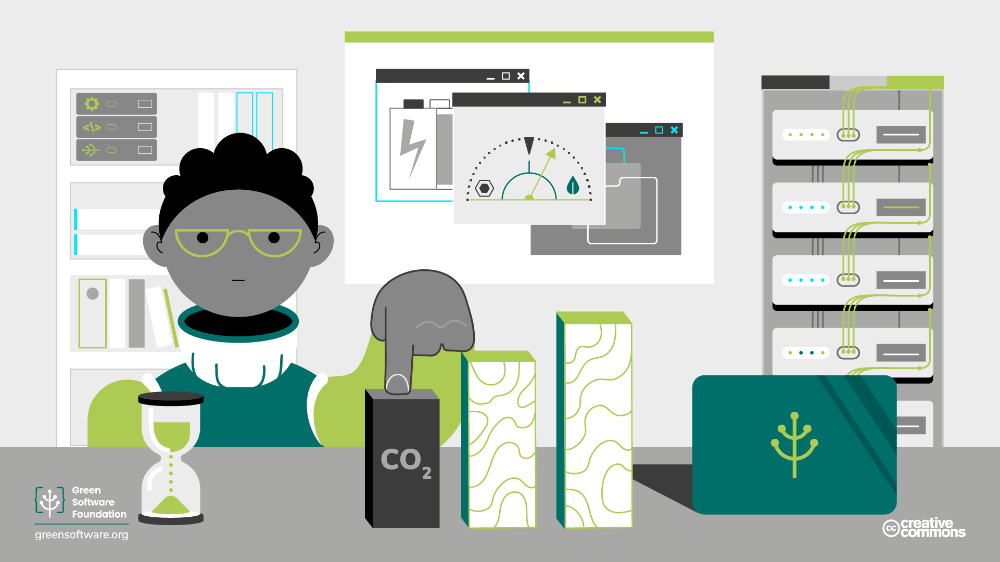

import Quiz from "/src/components/Quiz";

:::note
Dies ist eine gemeinschaftlich erstellte Übersetzung. Sie hat begrenzte Unterstützung und entspricht möglicherweise nicht der neuesten deutschen Version des Kurses.
:::

:::tip Prinzip

_Stoße die geringstmögliche Menge an Kohlenstoff aus._

:::

##  Einleitung

Das Verständnis der Auswirkungen von Treibhausgasen auf unsere Umwelt ist der Schlüssel zum Verständnis des eigenen Kohlenstoff-Fußabdrucks der Software. Sie lernen die verschiedenen Arten von Treibhausgasen kennen, die in der Umwelt vorhanden sind, wie sie emittiert und gemessen werden und was von verschiedenen Organisationen auf der ganzen Welt getan wird, um diese Emissionen zu kontrollieren und zu reduzieren.

Sie erfahren etwas über das Treibhausgasprotokoll und was es für Praktiker der grünen Software bedeutet.

## Schlüsselkonzepte

### Globale Erwärmung vs. Klimawandel

Die [globale Erwärmung](https://climate.nasa.gov/global-warming-vs-climate-change/) ist die seit der vorindustriellen Zeit (zwischen 1850 und 1900) beobachtete langfristige Erwärmung des Klimasystems der Erde, die auf menschengemachte Aktivitäten, vor allem die Verbrennung fossiler Brennstoffe, zurückzuführen ist. Unter [Klimawandel](https://climate.nasa.gov/global-warming-vs-climate-change/) versteht man langfristige Veränderungen der Temperaturen und Wettermuster. Diese Verschiebungen können natürlich sein, aber seit den 1800er Jahren sind menschliche Aktivitäten die Hauptursache für den Klimawandel.

### Klima vs. Wetter

Das Wetter bezieht sich auf die Bedingungen in der Atmosphäre in einem kurzen Zeitraum. Das Klima bezieht sich auf die Bedingungen in der Atmosphäre über lange Zeiträume hinweg. Jede Veränderung der langfristigen Bedingungen in der Atmosphäre führt auch zu Veränderungen der kurzfristigen Bedingungen. Ein offensichtlicher Vergleich ist, dass bei einem Anstieg der Durchschnittstemperatur in der Atmosphäre auch die Durchschnittstemperatur des Wetters in einer bestimmten Jahreszeit ansteigen wird. Einige Beispiele für messbare Veränderungen der Wetterbedingungen aufgrund des Klimawandels sind:

- Veränderungen im Wasserkreislauf, einschließlich der Niederschläge
- Schmelzen des Eises und der Gletscher
- Erwärmung von Land, Luft und Ozean
- Veränderungen der Meeresströmungen, des Säuregehalts und des Salzgehalts

Diese Veränderungen können zu Überschwemmungen - sowohl in Küstengebieten als auch aufgrund verstärkter Regenfälle -, Dürre, Waldbränden und häufigeren extremen Wetterbedingungen führen.

### Treibhausgase und der Treibhauseffekt

Treibhausgase sind eine Gruppe von Gasen, die die Wärme der Sonneneinstrahlung in der Erdatmosphäre zurückhalten. Diese Gase wirken wie eine Decke und erhöhen die Temperatur auf der Erdoberfläche. Dies ist ein natürliches Phänomen, das durch die vom Menschen verursachten Kohlenstoffemissionen noch beschleunigt wurde. Jetzt verändert sich das globale Klima schneller, als sich Tiere und Pflanzen anpassen können.

Treibhausgase und der Treibhauseffekt sind für alles Leben auf der Erde von entscheidender Bedeutung und stammen oft aus natürlichen Quellen wie Tieren, Vulkanen und anderen geologischen Aktivitäten. Der Treibhauseffekt ermöglicht es der Erde, eine höhere Temperatur aufrechtzuerhalten, als dies ohne Treibhausgase der Fall wäre, da sie mehr Wärme aus der Sonnenstrahlung einfangen. Wie viele andere natürliche Prozesse auf der Erde ist auch der Treibhauseffekt ein fein abgestimmtes Gleichgewicht, das durch verschiedene Faktoren gestört werden kann.

### Kohlenstoff und CO2eq

Der Begriff Kohlenstoff wird häufig als Oberbegriff für die Auswirkungen aller Arten von Emissionen und Aktivitäten auf die globale Erwärmung verwendet. CO2eq/CO2-eq/CO2e, was für Kohlenstoffäquivalent steht, ist ein Begriff, mit dem diese Auswirkungen gemessen werden können. Zum Beispiel hat 1 Tonne Methan den gleichen Erwärmungseffekt wie etwa [84 Tonnen CO2 über 20 Jahre] (https://energy.ec.europa.eu/topics/oil-gas-and-coal/methane-emissions_en), also normalisieren wir es auf 84 Tonnen CO2eq. Wir können sogar noch weiter verkürzen und nur den Begriff Kohlenstoff verwenden, der häufig für alle Treibhausgase verwendet wird.

## Überwachung des Klimawandels

Aufgrund der Auswirkungen des Klimawandels und der zunehmenden Zahl zerstörerischer Wetterereignisse hat die Weltgemeinschaft Anstrengungen unternommen, um diese Probleme anzugehen und Maßnahmen zur Kontrolle und Begrenzung der globalen Erwärmung zu ergreifen, um die Auswirkungen des Klimawandels zu mildern und umzukehren.

Das [**Klimaabkommen von Paris**] (https://unfccc.int/process-and-meetings/the-paris-agreement/the-paris-agreement) ist ein internationales Abkommen, das 2015 von 196 Parteien und den Vereinten Nationen geschlossen wurde, um den Temperaturanstieg auf der Erde zu verringern. Die Vereinbarung sieht vor, den Anstieg der globalen Durchschnittstemperatur auf 2 °C im Vergleich zum vorindustriellen Niveau zu begrenzen, wobei eine Untergrenze von 1,5 °C vorzuziehen ist. Das Abkommen wird alle fünf Jahre überprüft und stellt den Entwicklungsländern Finanzmittel zur Verfügung, um die Auswirkungen des Klimawandels abzumildern und sich auf die durch den Klimawandel verursachten Umweltauswirkungen vorzubereiten und sich an diese anzupassen. Darüber hinaus wird von jeder Vertragspartei erwartet, dass sie ihre Fortschritte durch einen national festgelegten Beitrag (Nationally Determined Contribution - NDC) aktualisiert. Das Abkommen ist derzeit von 194 Parteien unterzeichnet worden.

Das [**Rahmenübereinkommen der Vereinten Nationen über Klimaänderungen (UNFCCC)**] (https://unfccc.int/process-and-meetings/the-convention/what-is-the-united-nations-framework-convention-on-climate-change) ist eine Gruppe, die gegründet wurde, um die Stabilisierung der Treibhausgaskonzentrationen in der Atmosphäre auf einem Niveau zu erreichen, das eine gefährliche Störung des Klimasystems verhindern würde.

Die [**COP (Conference of the Parties)**](https://unfccc.int/process/bodies/supreme-bodies/conference-of-the-parties-cop) ist eine jährliche Veranstaltung, an der alle Parteien des Rahmenübereinkommens der Vereinten Nationen über Klimaänderungen teilnehmen. Auf der Konferenz werden die Fortschritte der einzelnen Vertragsparteien bei der Bekämpfung der globalen Erwärmung, die im Rahmen des Pariser Klimaabkommens vereinbart wurden, überprüft und bewertet. Die COP ist auch eine Gelegenheit für die Parteien, zusammenzukommen und Entscheidungen zu treffen, die die Auswirkungen der globalen Erwärmung verringern werden. Zu den gemeinsamen Themen gehören Strategien zur Reduzierung des Kohlenstoffs, die Finanzierung kohlenstoffarmer Strategien und die Erhaltung natürlicher Lebensräume.

Das [**IPCC (Intergovernmental Panel on Climate Change)**] (https://www.ipcc.ch/about/), das 1988 von der UNO gegründet wurde, soll Regierungen auf allen Ebenen mit wissenschaftlichen Informationen versorgen, die sie zur Entwicklung von Klimapolitiken nutzen können. Die IPCC-Berichte sind auch ein wichtiger Beitrag zu den internationalen Verhandlungen über den Klimawandel. Der IPCC ist eine Organisation von Regierungen, die Mitglieder der Vereinten Nationen oder der Weltorganisation für Meteorologie (WMO) sind. Der IPCC hat derzeit 195 Mitglieder.

Wir werden durch unsere Aktivitäten immer Kohlenstoff emittieren, aber kohlenstoffeffizient zu sein bedeutet, die Menge des pro Arbeitseinheit emittierten Kohlenstoffs zu minimieren. Wir wollen sicherstellen, dass wir für jedes Gramm Kohlenstoff, das wir in die Atmosphäre abgeben, den größtmöglichen Wert herausholen.

Im Softwarebereich besteht unsere Rolle bei der Lösung des Klimaproblems in der **Erstellung kohlenstoffeffizienter Anwendungen**. Kohlendioxid-Effizienz bedeutet, Anwendungen zu entwickeln, die Ihnen oder Ihren Nutzern den gleichen Nutzen bringen, aber weniger Kohlendioxid ausstoßen.

## Zusammenfassung

- Treibhausgase sind eine Gruppe von Gasen, die zur globalen Erwärmung beitragen. Kohlenstoff wird oft als weit gefasster Begriff verwendet, um die Auswirkungen aller Arten von Emissionen und Aktivitäten auf die globale Erwärmung zu beschreiben. CO2eq ist ein Begriff, mit dem diese Auswirkungen gemessen werden können.
- Die internationale Gemeinschaft hat sich in Gruppen wie dem UNFCCC zusammengeschlossen, um die Auswirkungen der globalen Erwärmung durch eine Verringerung der Emissionen zu begrenzen, wobei eine untere Grenze von 1,5°C angestrebt wird. Dies wurde 2015 vom UN IPCC im [Pariser Klimaabkommen] (https://unfccc.int/process-and-meetings/the-paris-agreement/the-paris-agreement) vereinbart und wird auf den regelmäßigen COP-Veranstaltungen überwacht.
- Alles, was wir tun, gibt Kohlenstoff in die Atmosphäre ab, und unser Ziel ist es, so wenig Kohlenstoff wie möglich auszustoßen. Dies ist das erste Prinzip grüner Software: Kohlenstoff-Effizienz, d. h. die geringstmögliche Menge an Kohlenstoff pro Arbeitseinheit auszustoßen.

## Quiz

<Quiz
  QuizList={[
    {
      question: "Für was steht GHG und was ist die deutsche Übersetzung??",
      answers: [
        { text: "Greenhouse gases, dt.: Treibhausgase", isCorrect: true },
        { text: "Global Heating gases, dt. Globale Heizgase: ", isCorrect: false },
        { text: "Government Health Gateway, dt. Gesundheitsportal der Regierung", isCorrect: false },
      ],
    },
    {
      question: "Wie kann man das Kohlenstoffäquivalent abkürzen?",
      answers: [
        { text: "CO2eq oder CO2e", isCorrect: false },
        { text: "Kohlenstoff oder CO2e", isCorrect: false },
        { text: "CO2eq oder Kohlenstoff", isCorrect: false },
        { text: "CO2eq oder CO2e oder Kohlenstoff", isCorrect: true },
      ],
    },
    {
      question: "Was ist der IPCC?",
      answers: [
        { text: "Internationaler Ausschuss für Klimaänderungen", isCorrect: false },
        { text: "Intergovernmental Panel on Climate Change", isCorrect: true },
        { text: "Internationaler Vorschlag zum Klimawandel", isCorrect: false },
      ],
    },
    {
      question: "Was ist COP?",
      answers: [
        { text: "Carbon Offsetting Project", isCorrect: false },
        { text: "Conference on Pollution", isCorrect: false },
        { text: "Conference of the Parties", isCorrect: true },
      ],
    },
    {
      question:
        "Welches war die im Pariser Klimaabkommen vereinbarte bevorzugte Grenze für den Temperaturanstieg?",
      answers: [
        { text: "1.5ºC", isCorrect: true },
        { text: "2ºC", isCorrect: false },
        { text: "2.5ºC", isCorrect: false },
      ],
    },
    {
      question: "Welche der folgenden Aussagen ist wahr?",
      answers: [
        {
          text: "Kurzfristige Veränderungen des Wetters deuten auf langfristige Veränderungen des Klimas hin",
          isCorrect: false,
        },
        {
          text: "Langfristige Klimaveränderungen beeinflussen kurzfristige Wetterbedingungen",
          isCorrect: true,
        },
      ],
    },
    {
      question:
        "Was war die größte Ursache für den Klimawandel in den letzten Jahren?",
      answers: [
        { text: "Natürlich auftretende Veränderungen", isCorrect: false },
        { text: "Menschliche Aktivität", isCorrect: true },
        { text: "Eine Kombination der oben genannten Faktoren", isCorrect: false },
      ],
    },
    {
      question: "Wozu brauchen wir Treibhausgase?",
      answers: [
        {
          text: "Um mehr Wärme von der Sonne einzufangen und das Leben auf der Erde zu erhalten",
          isCorrect: true,
        },
        {
          text: "Wärme von der Erde weg reflektieren",
          isCorrect: false,
        },
        { text: "Nichts, sie sind immer schädlich", isCorrect: false },
      ],
    },
  ]}
/>
