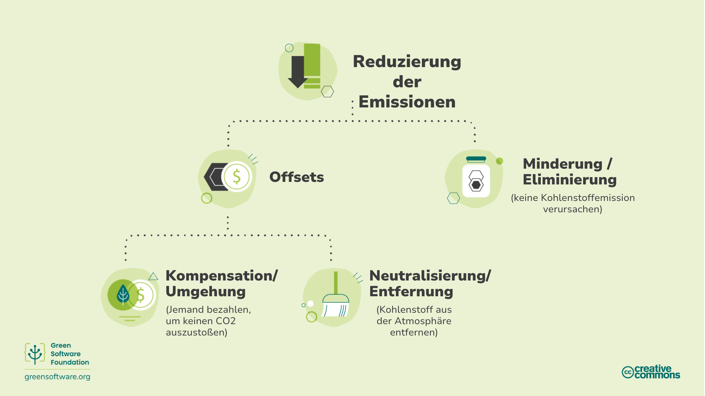
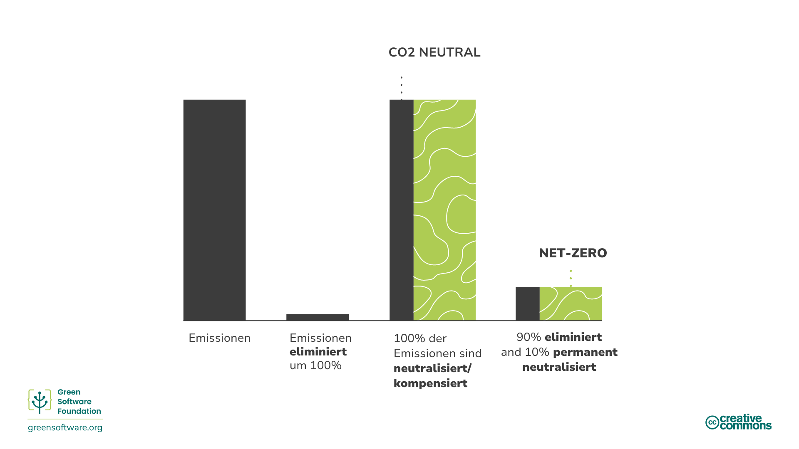
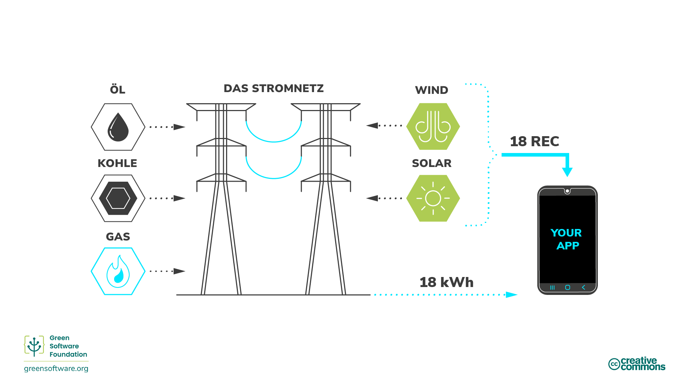
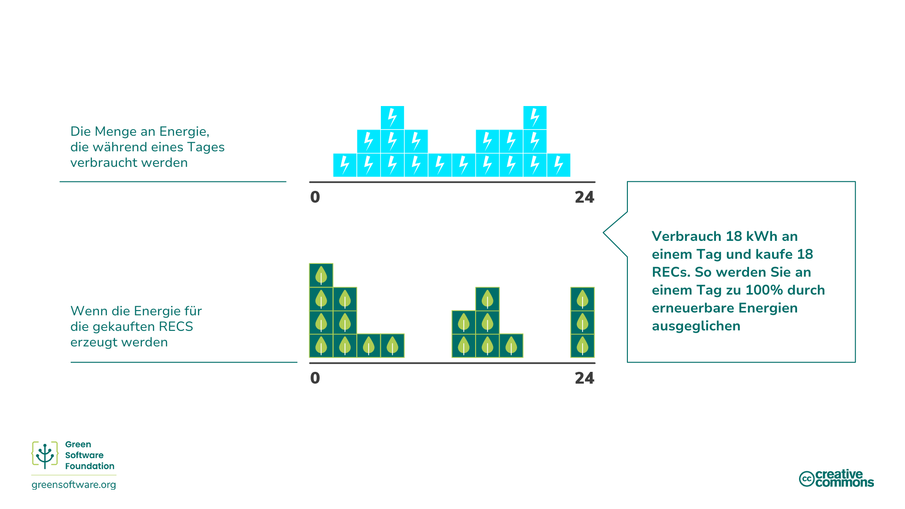
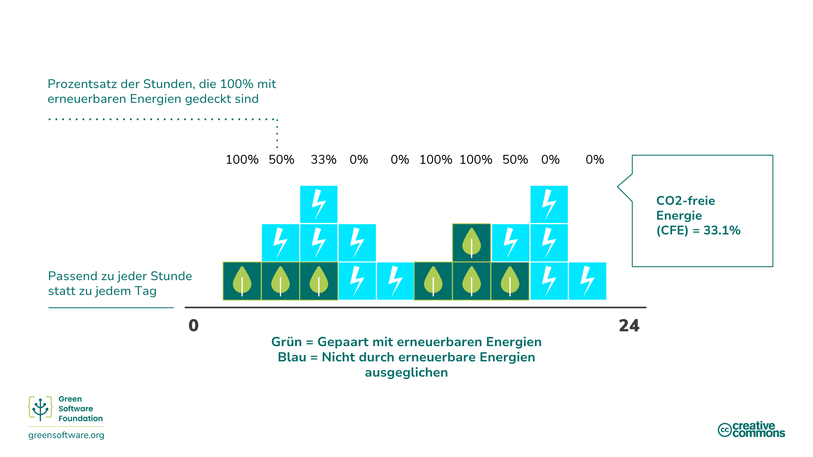

import Quiz from "/src/components/Quiz";

:::note
Dies ist eine gemeinschaftlich erstellte Übersetzung. Sie hat begrenzte Unterstützung und entspricht möglicherweise nicht der neuesten deutschen Version des Kurses.
:::

:::tip Prinzip

_Verstehen Sie den genauen Mechanismus der Kohlenstoffreduzierung._

:::

# Einleitung

In den letzten Jahren haben viele Wirtschaftsakteure versucht, verschiedene Klimaziele zu erreichen, indem sie unterschiedliche Verpflichtungen eingegangen sind.

Die Begriffe "Netto-Null", "kohlenstoffneutral", "kohlenstoffnegativ" und "klimaneutral" werden austauschbar verwendet, wobei das Hauptziel darin besteht, Kohlenstoffemissionen zu beseitigen, zu reduzieren und zu vermeiden. Da das Interesse an diesen Zielen wächst, ist es wichtig, ein gemeinsames Verständnis dafür zu haben, was sie bedeuten und wie sie mit den von uns erlernten Strategien und Messverfahren erreicht werden können.

## Methoden zur Kohlenstoffreduzierung

Es gibt viele Möglichkeiten, Emissionen zu reduzieren, aber es ist wichtig, den genauen Mechanismus der Reduzierung zu verstehen, wenn man über Reduktionsziele nachdenkt.

### Verminderung / Kohlenstoffeliminierung

Die [Science Based Targets Initiative](https://sciencebasedtargets.org/) bezieht sich auf einen Mechanismus, der als [Vermeidung](https://sciencebasedtargets.org/resources/legacy/2020/09/foundations-for-net-zero-executive-summary.pdf) bezeichnet wird, d. h. die Beseitigung von CO2-Emissionsquellen im Zusammenhang mit den Tätigkeiten und der [Wertschöpfungskette](https://www.cisl.cam.ac.uk/education/graduate-study/pgcerts/value-chain-defs) eines Unternehmens, damit diese nicht in die Atmosphäre gelangen. Die Wertschöpfungskette beschreibt das gesamte Spektrum der Aktivitäten, die zur Herstellung eines Produkts oder einer Dienstleistung erforderlich sind, von der Konzeption bis zum Vertrieb. Dazu gehört auch die Steigerung der Energieeffizienz, um einen Teil der mit der Energieerzeugung verbundenen Emissionen zu vermeiden.

Die Vermeidung allein reicht nicht aus, da es immer einige Emissionen geben wird, die aufgrund technologischer oder wirtschaftlicher Beschränkungen nicht beseitigt werden können, aber sie muss den Kern der Strategie jeder Organisation bilden, da dies ein Bereich ist, in dem sich fast jedes Unternehmen verbessern kann.

Um diese Restemissionen auszugleichen, müssen wir andere Mechanismen wie Ausgleiche, Kompensationen oder Neutralisierungen in Betracht ziehen.

### Offsets

[Offsets (Deutsch: Kompensationen)](https://www.offsetguide.org/understanding-carbon-offsets/what-is-a-carbon-offset/) sind direkte Investitionen in Projekte zur Emissionsreduzierung durch den Kauf von Kohlenstoffgutschriften auf dem freiwilligen Kohlenstoffmarkt (VCM). Der VCM ist ein dezentraler Markt, auf dem private Akteure freiwillig Emissionsgutschriften kaufen und verkaufen, die eine zertifizierte Entfernung oder Reduzierung von Treibhausgasen aus der Atmosphäre darstellen.

Um Emissionen auszugleichen, müssen Sie die entsprechende Menge an Emissionsgutschriften kaufen, um die emittierten Emissionen zu kompensieren, wobei eine Emissionsgutschrift einer Tonne absorbiertem oder reduziertem CO2 entspricht.

Diese Projekte können verschiedene positive Auswirkungen haben, vom Schutz des Ökosystems bis zur Stärkung der lokalen Gemeinschaften. Um jedoch sicherzustellen, dass diese Programme ordnungsgemäß durchgeführt werden und die gewünschte Wirkung auf die Umwelt und das Ziel der weltweiten Nettonullstellung haben, gibt es globale Standards, die sie erfüllen müssen, wie z. B. Verified Carbon Standard (VCS) und Gold Standard (GS).

#### SCI und Kompensationen

Es gibt einige Beschränkungen für Kohlenstoffkompensationen, weshalb sie bei der SCI-Bewertung einer Organisation nicht berücksichtigt werden. Stellen Sie sich z. B. zwei Anwendungen vor, die beide auf einer Cloud-Plattform laufen, die zu 100 % klimaneutral ist und zu 100 % mit erneuerbarer Energie betrieben wird. Anwendung A hat viel Zeit und Ressourcen investiert, um sicherzustellen, dass sie die Ressourcen effizient nutzt, während Anwendung B die Ressourcen sehr ineffizient nutzt. Damit der SCI eine hilfreiche Kennzahl ist, muss Anwendung A besser abschneiden als Anwendung B.

Würde der SCI die Kompensationen berücksichtigen, würden beide Anwendungen mit 0 Punkten bewertet, was nichts darüber aussagt, wie effizient sie die Ressourcen nutzen. Obwohl Anwendung B mehr Kohlenstoffmoleküle in die Atmosphäre abgibt, würde sie bei einem Wert von 0 und dem niedrigsten Wert von 0 keine weiteren Investitionen zur Verbesserung ihrer Kohlenstoffeffizienz tätigen.

Unternehmen müssen Pläne haben, wie sie Emissionen sowohl eliminieren als auch neutralisieren können, und der SCI hilft ihnen, die Eliminierung von Emissionen durch Software voranzutreiben. Dies macht die SCI zu einem wesentlichen Bestandteil jeder Netto-Null-Strategie.

### Kompensationen / Kohlenstoffvermeidung

[Kompensationen] (https://www.abatable.com/blog/carbon-removal-vs-carbon-avoidance-projects) sind Maßnahmen, die Unternehmen ergreifen, um der Gesellschaft bei der Vermeidung oder Verringerung von Emissionen außerhalb ihrer eigenen Wertschöpfungskette zu helfen. Dabei handelt es sich im Wesentlichen um Investitionen in Projekte anderer Organisationen zur Emissionsvermeidung.

Dazu gehören Maßnahmen wie:

- **Schutzmaßnahmen** - Gutschriften werden auf der Grundlage des durch den Schutz alter Bäume nicht freigesetzten Kohlenstoffs erstellt.
- **Gemeindeprojekte** - Diese Projekte helfen Gemeinden auf der ganzen Welt, vor allem unterentwickelten Gemeinden, durch die Einführung nachhaltiger Lebensmethoden.
- **Waste to energy** - Diese Projekte fangen Methan/Deponiegas in kleineren Dörfern, menschliche oder landwirtschaftliche Abfälle auf und wandeln sie in Strom um.

### Neutralisierung / Kohlenstoffentfernung

[Neutralisierungen] (https://www.abatable.com/blog/carbon-removal-vs-carbon-avoidance-projects) sind Maßnahmen, die Unternehmen ergreifen, um innerhalb oder außerhalb ihrer Wertschöpfungskette Kohlenstoff aus der Atmosphäre zu entfernen. Neutralisierungen beziehen sich auf die Entfernung und dauerhafte Speicherung von atmosphärischem Kohlenstoff, um die Auswirkungen der Freisetzung von CO2 in die Atmosphäre auszugleichen. Dazu gehören Maßnahmen wie:
- **Verbesserung der natürlichen Kohlenstoffsenken**, die CO2 aus der Atmosphäre entfernen. Zum Beispiel die Wiederaufforstung von Wäldern, da die Photosynthese auf natürliche Weise CO2 abbaut. Die Ausdehnung der Wälder bringt Herausforderungen mit sich, denn es ist wichtig, die Dynamik der landwirtschaftlichen Nutzflächen und die Nahrungsmittelversorgung an anderer Stelle nicht zu beeinträchtigen. Moderne Anbaumethoden können auch die Zeit verlängern, in der Kohlenstoff im Boden gespeichert bleibt.
- Bei der **Direkten Luftabscheidung** wird CO2 aus der Luft abgeschieden und dauerhaft gespeichert, entweder unterirdisch oder in langlebigen Produkten wie Beton.

Die Wirksamkeit dieser Methoden wird in der Regel daran gemessen, ob sie die Kohlenstoffentfernung in der erforderlichen Größenordnung und Geschwindigkeit gewährleisten können.

Bei Projekten zur Kohlenstoffentfernung ist die Dauerhaftigkeit ein entscheidender Faktor. Die Dauerhaftigkeit eines Projekts beschreibt, wie lange das Kohlendioxid aus der Atmosphäre ferngehalten wird.

Kurzfristige Dauerhaftigkeit liegt bei bis zu 100 Jahren, mittelfristige bei 100 bis 1.000 Jahren und langfristige bei mehr als 1.000 Jahren.

- Lösungen, die sich auf den natürlichen Kohlenstoffkreislauf der Erde stützen, haben eine kurzfristige Lebensdauer, die in Jahrzehnten gemessen wird. Forstwirtschaftliche Projekte haben zum Beispiel eine Lebensdauer von 40 bis 100 Jahren.
- Technische Lösungen wie die direkte Lufterfassung haben oft eine langfristige Lebensdauer, die in Jahrtausenden gemessen wird. Die direkte Luftabscheidung hat zum Beispiel eine Lebensdauer von 10.000 Jahren.
- Langfristige Projekte sind in der Regel um Größenordnungen teurer als kurzfristige Projekte. Einmal emittierter Kohlenstoff verbleibt 5.000 Jahre lang in der Atmosphäre. Um als netto null zu gelten, muss der emittierte Kohlenstoff dauerhaft entfernt werden.

Ein kurzfristiges Projekt zur Beseitigung von Kohlenstoff wird nur für 100 Jahre Kohlenstoff entfernen, danach ist er wieder in der Atmosphäre und erwärmt unseren Planeten. Dies ist einer der Gründe, warum die Reduzierung der Emissionen der Neutralisierung vorzuziehen ist. Niemals Kohlenstoff freizusetzen ist weitaus besser, als Kohlenstoff freizusetzen und dann zu versuchen, ihn 5.000 Jahre lang aus der Atmosphäre zu halten.

## Klimaverpflichtungen

Es gibt viele verschiedene Klimaschutzstrategien, zu denen sich eine Organisation verpflichten kann, von kohlenstoffneutral bis netto null. Wenn Sie die verschiedenen Bedeutungen und Auswirkungen der einzelnen Strategien verstehen, können Sie sich für die richtige Strategie für Ihre Organisation entscheiden.

### Kohlenstoffneutralität

Um Kohlenstoffneutralität zu erreichen, muss eine Organisation ihre Emissionen messen und diese dann durch Projekte zur Kohlenstoffreduzierung kompensieren. Dies kann Projekte zur Beseitigung von Kohlendioxid (Neutralisierung) und Projekte zur Vermeidung von Kohlendioxid (Kompensation) umfassen.

Kohlenstoffneutralität wird durch eine international anerkannte Norm definiert: [PAS 2060] (https://info.eco-act.com/hubfs/0%20-%20Downloads/PAS%202060/PAS%202060%20factsheet%20EN.pdf). Diese Norm empfiehlt zwar, dass eine Organisation Ziele zur Emissionsverringerung festlegt, verlangt aber nicht, dass sie ihre Emissionen reduziert. Um als kohlenstoffneutral zu gelten, kann eine Organisation also nur messen und ausgleichen, ohne Ressourcen in die Beseitigung ihrer Kohlenstoffemissionen zu investieren.

Um klimaneutral zu sein, müssen Sie die direkten Emissionen (Bereich 1 und 2) abdecken. Im Allgemeinen wird erwartet, dass Organisationen ihre Emissionen aus den Bereichen 1 und 2 sowie die Geschäftsreisen aus Bereich 3 messen und ausgleichen. Es gibt jedoch keine spezielle Vorschrift, die dies vorschreibt.

Die Klimaneutralität ist ein wichtiger erster Schritt für jede Organisation, da sie zur Messung anregt. Allerdings gibt es weltweit nicht genügend Kohlenstoffkompensationen, um die Emissionen aller Organisationen auszugleichen. Daher wird jede Strategie, die keine Emissionsminderung vorsieht, nicht skalierbar sein und der Welt nicht helfen, das im Pariser Klimaabkommen festgelegte 1,5-Grad-Ziel zu erreichen. An dieser Stelle kommt Net Zero (dt. Netto-Null) ins Spiel.

### Netto-Null

Netto-Null bedeutet, dass die Emissionen nach den neuesten Erkenntnissen der Klimawissenschaft reduziert und die verbleibenden Restemissionen durch den Abbau von Kohlenstoff (Neutralisierung) ausgeglichen werden. Netto-Null erfordert per Definition eine Emissionsreduzierung im Einklang mit einem 1,5°C-Pfad. Alle Unternehmen müssen dies tun, um bis 2050 weltweit Netto-Null-Emissionen zu erreichen.

Das entscheidende Unterscheidungsmerkmal zwischen Netto-Null und Kohlenstoffneutralität ist, dass bei Netto-Null der Schwerpunkt auf der Emissionsminderung und nicht auf Neutralisierungen und Kompensationen liegt. Ein Netto-Null-Ziel zielt darauf ab, die Emissionen zu eliminieren und nur für die verbleibenden Emissionen, die nicht eliminiert werden können, Kompensationen vorzunehmen

Der [Standard für Netto-Null](https://sciencebasedtargets.org/resources/files/foundations-for-net-zero-full-paper.pdf) wird von der [Science Based Targets initiative](https://sciencebasedtargets.org/) (SBTi) entwickelt. Nach ihren Berechnungen besteht eine 66-prozentige Wahrscheinlichkeit, die globale Erwärmung auf 1,5 °C zu begrenzen, wenn wir bis Mitte des Jahrhunderts ein Reduktionsniveau von etwa 90 % aller Treibhausgasemissionen erreichen. Um ein Netto-Null-Ziel zu erreichen, muss eine Organisation also 90 % ihrer Emissionen bis 2050 beseitigen. Die verbleibenden Emissionen können nur durch Neutralisierung und dauerhaften Kohlenstoffabbau ausgeglichen werden.

Eine Netto-Null-Strategie würde bedeuten, dass die tatsächliche Menge an Kohlenstoff in der Atmosphäre konstant bleibt.

Um ein Netto-Null-Ziel zu erreichen, müssen Sie außerdem die direkten und indirekten Emissionen, d. h. die Emissionen der Lieferkette, abdecken (Bereiche 1, 2 und 3). Daher muss Ihre gesamte Wertschöpfungskette in den Geltungsbereich Ihres Netto-Null-Ziels einbezogen werden. Dies ist von Bedeutung, da Bereich 3 oft den Großteil der Emissionen ausmacht.

#### SCI als Teil einer Netto-Null-Strategie

Der SCI ist eine Kennzahl, die speziell für die Emissionsvermeidung entwickelt wurde. Die einzige Möglichkeit, Ihre Punktzahl zu verringern, besteht darin, Zeit und Ressourcen in Maßnahmen zu investieren, die Emissionen vermeiden. Die einzigen Aktivitäten, die der SCI als Maßnahmen zur Emissionsvermeidung anerkennt, sind die Steigerung der Energieeffizienz Ihrer Anwendung, die Verbesserung der Hardware-Effizienz oder der Einsatz kohlenstoffärmerer Energiequellen. Kompensationsmaßnahmen sind ein wesentlicher Bestandteil jeder Klimastrategie; Kompensationsmaßnahmen sind jedoch keine Vermeidungsmaßnahmen und werden daher nicht in die SCI-Kennzahl einbezogen.

Jede Netto-Null-Strategie muss Pläne für die Vermeidung und Neutralisierung von Emissionen enthalten. Der SCI hilft Unternehmen, die durch Software verursachten Emissionen zu vermeiden. Dies macht den SCI zu einer wesentlichen Komponente jeder Netto-Null-Strategie.

### 100 % erneuerbar

Wenn sich Organisationen das Ziel setzen, 100 % Strom aus erneuerbaren Energien zu erzeugen, unterscheiden sie möglicherweise zwischen **angepasst durch** und **angetrieben durch** erneuerbare Energien.

**Powered by** bedeutet, dass Sie direkt von einer erneuerbaren Energiequelle, z. B. einem Staudamm, mit Strom versorgt werden. In diesem Fall können die Elektronen, die in Ihr Gerät fließen, nur aus dieser Quelle stammen. Sie können also getrost sagen, dass Sie zu 100 % aus erneuerbaren Energien versorgt werden.

Die meisten Menschen leben in einem zusammenhängenden Stromnetz, in das viele Erzeuger Strom einspeisen und viele Verbraucher Strom entnehmen. Das bedeutet, dass die Elektronen, die in Ihr Gerät kommen, eine Mischung aus allen Elektronen sind, die in das Netz gehen. Nehmen wir zum Beispiel an, dass nur 5 % des Windstroms in das Netz eingespeist werden. Sie erhalten 5 % durch Wind erzeugte Elektronen und 95 % durch fossile Brennstoffe erzeugte Elektronen.

Sie können die einzelnen Elektronen nicht verfolgen. Sobald die Elektronen aus einem Windpark im Netz sind, vermischen sie sich mit den Elektronen aus einem Kraftwerk für fossile Brennstoffe. Es gibt also keine Möglichkeit für einen Verbraucher, darauf zu bestehen, dass die von ihm verbrauchten Elektronen nur aus erneuerbaren Quellen stammen.

#### Zertifikate für erneuerbare Energien (REC)

<!--  -->

Um dieses Problem zu lösen, verkauft eine Anlage für erneuerbare Energien zwei Dinge. Die erste ist ihr Strom, den sie an ein Netz verkauft. Das zweite ist ein REC, ein [Renewable Energy Certificates](https://www.epa.gov/green-power-markets/renewable-energy-certificates-recs). 1 REC entspricht 1kWh Energie.

Wenn Sie zu 100 % mit erneuerbaren Energien versorgt werden möchten und an das Stromnetz angeschlossen sind, besteht die Lösung darin, so viele RECs zu kaufen, wie Sie verbrauchen. Wenn Sie beispielsweise jeden Tag 100 kWh Strom verbrauchen, müssen Sie 100 RECs kaufen, um zu 100 % aus erneuerbaren Energien versorgt zu werden.

Wenn sich Organisationen Ziele für 100 % erneuerbare Energien setzen, ist der Kauf von RECs auf dem Markt oft die Lösung, die sie zur Erfüllung ihrer Verpflichtungen einsetzen.

#### PPAs

Vielleicht hören Sie neben RECs auch den Begriff PPA. Ein PPA ist ein [Stromabnahmevertrag] (https://ppp.worldbank.org/public-private-partnership/sector/energy/energy-power-agreements/power-purchase-agreements), der eine weitere Möglichkeit zum Erwerb von RECs darstellt. Wenn Sie schätzen, dass Sie 500 MWh Strom pro Jahr für ein bestimmtes Rechenzentrum benötigen, könnten Sie einen PPA unterzeichnen, um 500 MWh pro Jahr von einer Anlage für erneuerbare Energien zu kaufen. Sie würden dann alle RECs erhalten, die mit diesem Kraftwerk verbunden sind.

PPAs sind in der Regel sehr langfristige Verträge. Ein Kraftwerk für erneuerbare Energien kann mit einem solchen Vertrag eine Finanzierung finden, da es bereits seit vielen Jahren einen Abnehmer für seinen Strom hat.

PPAs fördern etwas, das **Additionalität** genannt wird. Der Erwerb einer PPA fördert die Errichtung neuer Anlagen für erneuerbare Energien. PPAs sind eine Lösung, die uns in eine Zukunft führt, in der jeder Zugang zu 100 % erneuerbarer Energie hat.

### 24/7 stündlicher Abgleich

Wenn es um 100 % erneuerbare Ansprüche geht, ist die entscheidende Frage, wie granular der Abgleich ist. Summieren und verrechnen Sie jährlich, monatlich, wöchentlich, täglich oder stündlich? Diese Frage ist von entscheidender Bedeutung, denn für einen echten Übergang zu erneuerbaren Energien müssen 100 % des Stroms zu 100 % aus kohlenstoffarmen Energiequellen wie erneuerbaren Energien stammen. Dieser feinkörnige Abgleich wird oft als _[24/7 hourly matching](https://www.epa.gov/green-power-markets/247-hourly-matching-electricity)_ bezeichnet.

Die stündliche 24/7-Anpassung ist eine der vielen Strategien, die wir anwenden müssen, um den Übergang zu einem Netz, das zu 100 % aus erneuerbaren Energien gespeist wird, zu beschleunigen. So haben sich beispielsweise [Google](https://sustainability.google/progress/energy/) und [Microsoft](https://blogs.microsoft.com/blog/2021/07/14/made-to-measure-sustainability-commitment-progress-and-updates/) verpflichtet, bis 2030 einen stündlichen 24/7-Abgleich durchzuführen.

##### Täglicher vs. stündlicher Abgleich

Stellen Sie sich vor, ein Unternehmen hat eine Nachfragekurve wie diese, jedes blaue Quadrat steht für 1 kWh:

Sie haben RECs von einem Windpark gekauft, der Strom mit einer Kurve erzeugt hat, so dass jedes grüne Quadrat 1 REC darstellt. Ein Abgleich pro Tag bedeutet, dass die Organisation 18 kWh verbraucht und 18 RECs gekauft hat. Das Ergebnis ist, dass die Saldierung bei Null liegt. Sie können also sagen, dass sie **täglich zu 100 % durch erneuerbare Energien gedeckt sind**.

Wenn wir es jedoch in stündlichen Bereichen betrachten (jedes Quadrat ist hier 2 Stunden lang), sieht es etwas anders aus:

Der Gesamtenergieverbrauch beträgt immer noch 18kWh. Allerdings gibt es nur wenige Stunden am Tag, in denen wir zu 100 % durch erneuerbare Energien gedeckt sind. In manchen Stunden haben wir also viel mehr erneuerbare Energie als wir brauchen. Umgekehrt haben wir in den meisten Stunden viel weniger erneuerbare Energie als wir benötigen.

Im obigen Beispiel werden **nur 6 Stunden des Tages zu 100 % durch erneuerbare Energien gedeckt**.

#### Kohlenstofffreie Energie

Die Zahl, die wir verwenden, um zu beschreiben, wie erfolgreich wir bei der stündlichen 24/7-Anpassung sind, ist der Prozentsatz der kohlenstofffreien Energie.

Kohlenstofffreie Energie ist definiert als [der durchschnittliche Prozentsatz kohlenstofffreier Energie, der an einem bestimmten Ort stündlich verbraucht wird] (https://cloud.google.com/sustainability/region-carbon#understanding).

Für das vorherige Beispiel bedeutet dies, dass wir, wenn wir den täglichen Abgleich verwenden, zu 100 % mit erneuerbarer Energie versorgt werden. Bei einer stündlichen Messung beträgt die Übereinstimmung jedoch nur 33,1 %. **Der CFE-Prozentsatz beträgt also 33,1 %**.

#### Carbon Awareness als Teil einer 24/7-Stunden-Matching-Strategie

Kohlenstoffbewusstes Computing bedeutet, auf Signale der elektrischen Kohlenstoffintensität zu reagieren und das **Verhalten** der Software zu ändern, damit sie weniger Kohlenstoff ausstößt. Carbon Awareness hilft einer Organisation auch, ihr 24/7-Stunden-Matching-Ziel zu erreichen und ihren CFE-Anteil zu erhöhen.

Ein Beispiel für eine Verhaltensänderung ist die Verlagerung von Rechenoperationen auf eine Zeit, in der mehr erneuerbare Energie zur Verfügung steht. So kann beispielsweise der Start eines Trainingslaufs eines maschinellen Lernmodells oder sogar das Aufladen eines Laptops auf einen Zeitpunkt verschoben werden, an dem die Kohlenstoffintensität der Elektrizität geringer und das Angebot an erneuerbaren Energien höher ist.

:::tip
Kohlenstoffbewusstes Rechnen hilft Organisationen, ihren CFE-Anteil zu erhöhen.
:::

## Zusammenfassung

- Es gibt eine Reihe von Methoden, die üblicherweise angewendet werden, um den Kampf gegen den Klimawandel insgesamt zu unterstützen. Diese lassen sich in die allgemeinen Kategorien Kohlenstoffvermeidung (auch als "Abatement" bezeichnet), Kohlenstoffvermeidung (auch als "Kompensation" bezeichnet) und Kohlenstoffentfernung (auch als "Neutralisierung" bezeichnet) einteilen.
- Zu den Vermeidungsmaßnahmen gehört die Steigerung der Energieeffizienz, um einen Teil der mit der Energieerzeugung verbundenen Emissionen zu vermeiden. Die Vermeidung ist der wirksamste Weg zur Bekämpfung des Klimawandels, auch wenn eine vollständige Beseitigung des Kohlenstoffs nicht möglich ist.
- Zu den Kompensationsmaßnahmen gehören die Nutzung erneuerbarer Energiequellen, nachhaltige Lebensweisen, Recycling, das Pflanzen von Bäumen usw.
- Neutralisierung bezieht sich auf die Entfernung und dauerhafte Speicherung von atmosphärischem Kohlenstoff, um die Auswirkungen der Freisetzung von CO2 in die Atmosphäre auszugleichen. Neutralisierungen führen kurz- und mittelfristig dazu, dass der Kohlenstoff aus der Atmosphäre entfernt wird.
- Eine Organisation kann sich als kohlenstoffneutral bezeichnen, wenn ihre Gesamtemissionen durch die Summe ihrer Emissionskompensationen durch Projekte zur Kohlenstoffreduzierung ausgeglichen werden.
- Net Zero zielt darauf ab, Emissionen zu eliminieren und nur die verbleibenden Emissionen auszugleichen, die nicht eliminiert werden können, um das im Pariser Klimaabkommen festgelegte Ziel von 1,5°C zu erreichen.
- Der SCI ist sorgfältig so konzipiert, dass die Eliminierung von Emissionen durch Energieeffizienz, Hardware-Effizienz und Kohlenstoffbewusstsein die einzige Möglichkeit ist, die Punktzahl zu reduzieren. Zusammen mit einer separaten Neutralisierungsstrategie kann er die Grundlage für eine Netto-Null-Strategie für eine Organisation bilden.
- Wenn sich Organisationen das Ziel setzen, 100 % Strom aus erneuerbaren Energien zu beziehen, können sie entweder "powered by" oder "matched by" sein, wobei "powered by" bedeutet, dass die Elektronen, die in Ihr Gerät fließen, nur aus erneuerbaren Quellen stammen dürfen. Dies kann durch den Kauf von RECs als Teil einer PPA erreicht werden.
- Der 24/7-Stundenabgleich ist eine der vielen Strategien, die wir anwenden müssen, um den Übergang zu einem Netz, das zu 100 % aus erneuerbaren Energien gespeist wird, zu beschleunigen.

## Quiz

<Quiz
  QuizList={[
    {
      question: "Was sind Neutralisierungen?",
      answers: [
        {
          text: "Handlungen, die Kohlenstoff aus der Atmosphäre entfernen",
          isCorrect: true,
        },
        {
          text: "Aktionen, die Kohlenstoffemissionen reduzieren",
          isCorrect: false,
        },
        {
          text: "Handlungen, die Klimainitiativen unterstützen",
          isCorrect: false,
        },
      ],
    },
    {
      question: "Was ist ein kritischer Punkt bei der Neutralisierung?",
      answers: [
        {
          text: "Volumen der Neutralisation",
          isCorrect: false,
        },
        {
          text: "Dauerhaftigkeit der Neutralisierung",
          isCorrect: true,
        },
        {
          text: "Kosten der Neutralisierung",
          isCorrect: false,
        },
      ],
    },
    {
      question:
        "Welche Maßnahmen können Sie ergreifen, um die Kohlenstoffemissionen aus dem Energieverbrauch zu neutralisieren?",
      answers: [
        {
          text: "Natürliche Kohlenstoffsenken verstärken",
          isCorrect: false,
        },
        {
          text: "Direkte Lufterfassung",
          isCorrect: false,
        },
        {
          text: "Beides von oben",
          isCorrect: true,
        },
      ],
    },
    {
      question: "Wer ist verantwortlich für die Festlegung des Standards für Netto-Null?",
      answers: [
        {
          text: "SBTi",
          isCorrect: true,
        },
        {
          text: "STBi",
          isCorrect: false,
        },
        {
          text: "STIB",
          isCorrect: false,
        },
      ],
    },
    {
      question: "Was ist das globale Netto-Null-Ziel?",
      answers: [
        {
          text: "100 % der Emissionen bis 2050 beseitigen",
          isCorrect: false,
        },
        {
          text: "90 % der Emissionen bis 2050 beseitigen",
          isCorrect: true,
        },
        {
          text: "80 % der Emissionen bis 2050 beseitigen",
          isCorrect: false,
        },
      ],
    },
    {
      question: "Was ist das Hauptziel bei der Verminderung/Beseitigung?",
      answers: [
        {
          text: "Kompensieren der Kohlenstoffemissionen mit einem Finanzvertrag",
          isCorrect: false,
        },
        {
          text: "Kohlenstoff gar nicht erst in die Atmosphäre emittieren",
          isCorrect: true,
        },
        {
          text: "Emissionen im Zusammenhang mit dem Betrieb eines Unternehmens durch Verbesserung der Energieeffizienz reduzieren",
          isCorrect: false,
        },
      ],
    },
    {
      question: "Welches Messprotokoll oder welche Messmethode beinhaltet Offsets?",
      answers: [
        {
          text: "GHG protocol",
          isCorrect: true,
        },
        {
          text: "SCI",
          isCorrect: false,
        },
      ],
    },
    {
      question: "Was sind die Mindestkriterien für die Klimaneutralität?",
      answers: [
        {
          text: "Die Emissionen aus den Bereichen 1-3 müssen durch Neutralisierungen oder Kompensationen ausgeglichen werden",
          isCorrect: false,
        },
        {
          text: "Die Emissionen aus den Bereichen 1 und 2 müssen durch Neutralisationen oder Kompensationen ausgeglichen werden",
          isCorrect: true,
        },
        {
          text: "Die Emissionen aus den Bereichen 1-2 und Geschäftsreisen aus Bereich 3 müssen durch Neutralisierungen oder Kompensationen ausgeglichen werden",
          isCorrect: false,
        },
      ],
    },
  ]}
/>
