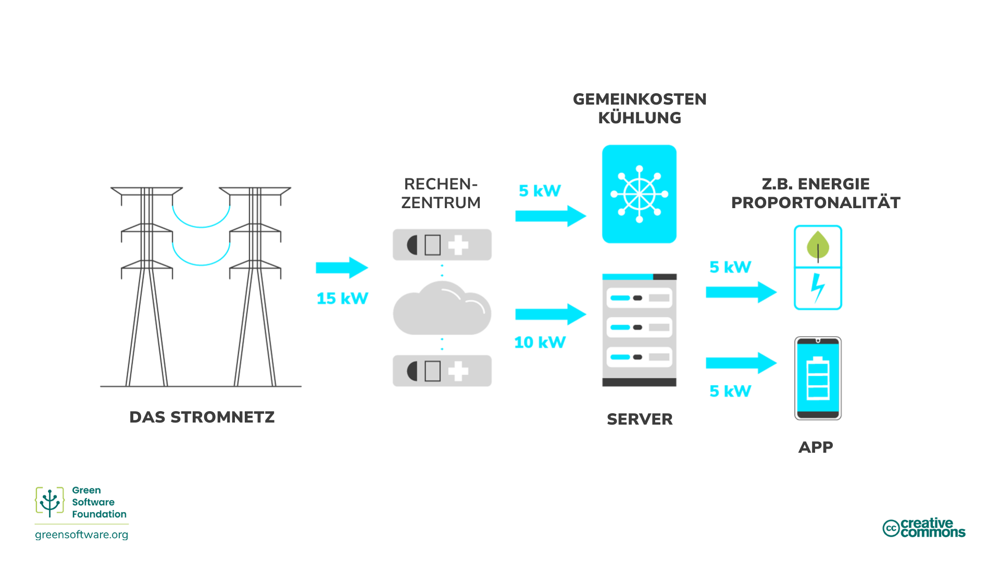
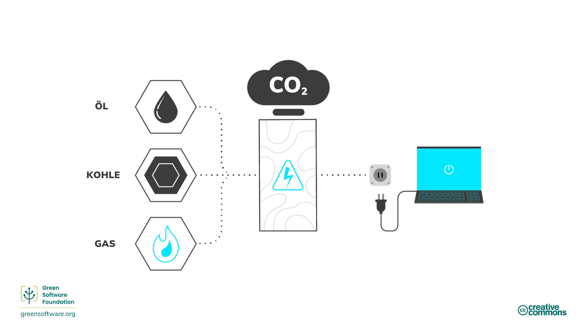
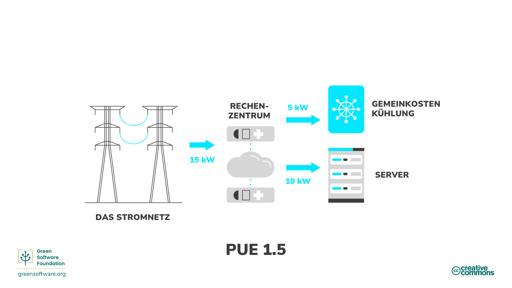
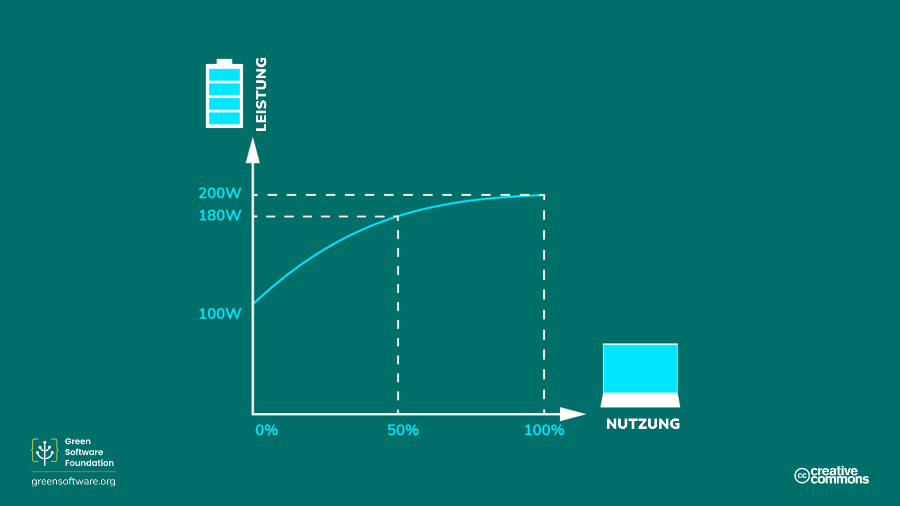

import Quiz from "/src/components/Quiz";

:::note
Dies ist eine gemeinschaftlich erstellte Übersetzung. Sie hat begrenzte Unterstützung und entspricht möglicherweise nicht der neuesten deutschen Version des Kurses.
:::

:::tip Prinzip

_Benutze die geringstmögliche Menge an Energie._

:::

## Einleitung

Energie ist die Fähigkeit, Arbeit zu verrichten. Es gibt viele verschiedene Formen von Energie, z. B. Wärme, elektrische und chemische Energie, und eine Energieart kann in eine andere umgewandelt werden. Zum Beispiel wandeln wir chemische Energie aus Kohle in elektrische Energie um. Mit anderen Worten: Elektrizität ist sekundäre Energie, die aus einer anderen Energieform umgewandelt wird. Auf diese Weise können wir uns Energie als ein Maß für die verbrauchte Elektrizität vorstellen.

Jede Software, von den Anwendungen auf Mobiltelefonen bis hin zum Training von Modellen für maschinelles Lernen, die in Rechenzentren laufen, verbraucht Strom. Eine der besten Möglichkeiten, den Stromverbrauch und die daraus resultierenden Kohlenstoffemissionen von Software zu reduzieren, besteht darin, die Anwendungen energieeffizienter zu gestalten. Doch damit endet unsere Verantwortung nicht.

Wer grüne Software entwickelt, übernimmt die Verantwortung für den Energieverbrauch seiner Produkte und entwickelt sie so, dass sie so wenig wie möglich verbrauchen. Wir sollten dafür sorgen, dass bei jedem Schritt im Prozess so wenig Abfall wie möglich entsteht und dass der größte Teil der Energie in den nächsten Schritt fließt.

Der letzte Schritt in dieser Kette ist der Endnutzer Ihres Produkts, nicht das fertige Produkt selbst. Das bedeutet, dass unser Ziel nicht einfach darin besteht, den energieeffizientesten Code oder die "grünste" Software zu entwickeln, sondern an den Endnutzer zu denken und dafür zu sorgen, dass er keine unnötigen Emissionen verursacht.

Das kann bedeuten, dass wir Aufträge zusammenfassen, um die Vorteile der Energieproportionalität zu nutzen, oder dass wir die Art und Weise ändern, wie ein Benutzer die Software nutzt. Werfen wir einen Blick auf einige dieser Konzepte und einige Möglichkeiten, wie Sie auf jeder Stufe der Kette bis hin zum Endverbraucher energieeffizienter werden können.

## Schlüsselkonzepte

### Fossile Brennstoffe und kohlenstoffreiche Energiequellen

Der meiste Strom wird durch die Verbrennung fossiler Brennstoffe [meist Kohle] erzeugt (https://ourworldindata.org/grapher/world-electricity-by-source). Fossile Brennstoffe werden aus sich zersetzenden Pflanzen und Tieren gewonnen. Diese Brennstoffe befinden sich in der Erdkruste und enthalten Kohlenstoff und Wasserstoff, die zur Energiegewinnung verbrannt werden können. Kohle, Erdöl und Erdgas sind Beispiele für fossile Brennstoffe.

Die meisten Menschen denken, dass Strom sauber ist. Wir machen uns nicht die Hände schmutzig, wenn wir etwas in die Steckdose stecken, und unsere Laptops brauchen keine Auspuffrohre. Da der meiste Strom jedoch aus der Verbrennung fossiler Brennstoffe stammt und die Energieversorgung die [wichtigste](https://www.eea.europa.eu/data-and-maps/daviz/change-of-co2-eq-emissions-2#tab-chart_4) Ursache für Kohlenstoffemissionen ist, können wir eine direkte Verbindung zwischen Strom und Kohlenstoffemissionen herstellen. In diesem Sinne kann Strom als Ersatz für Kohlenstoff betrachtet werden.

Wenn es unser Ziel ist, kohlenstoffeffizient zu sein, dann bedeutet das, dass wir auch energieeffizient sein müssen, da Energie ein Stellvertreter für Kohlenstoff ist. Das bedeutet, dass pro Arbeitseinheit so wenig Energie wie möglich verbraucht wird.

### Kohlenstoffarme Energiequellen

Saubere Energie stammt aus erneuerbaren, emissionsfreien Quellen, die bei ihrer Nutzung die Atmosphäre nicht verschmutzen und durch energieeffiziente Verfahren Energie sparen. Es gibt Überschneidungen zwischen sauberer, grüner und erneuerbarer Energie. Im Folgenden wird erläutert, wie man sie unterscheiden kann:

- **Saubere Energie** - erzeugt keine Kohlenstoffemissionen, z. B. Kernenergie.
- **Grüne Energie** - kommt aus der Natur
- **Erneuerbare Energie** - Quellen verfallen nicht, z. B. Sonne, Wind

### Energiemessung

- Energie wird in Joule (J) gemessen, der [SI]-Einheit (https://en.wikipedia.org/wiki/International_System_of_Units) für Energie.
- Die Leistung wird in Watt gemessen, wobei 1 Watt (W) einem Joule pro Sekunde entspricht.
- Ein Kilowatt (kW) entspricht also ebenfalls 1000 Joule pro Sekunde.
- Eine Kilowattstunde (kWh) ist ein Maß für die Energie (J), die einem Kilowatt Leistung in einer Stunde entspricht.

## Wie kann man die Energieeffizienz verbessern?

Die Rechenzentrumsbranche verwendet die 2006 von Green Grid entwickelte [Power Usage Effectiveness](https://datacenters.lbl.gov/sites/default/files/WP49-PUE%20A%20Comprehensive%20Examination%20of%20the%20Metric_v6.pdf) (PUE)-Metrik zur **Messung der Energieeffizienz von Rechenzentren**. Konkret geht es darum, wie viel Energie die Computerausrüstung im Vergleich zur Kühlung und zu anderen Gemeinkosten für die Unterstützung der Ausrüstung verbraucht. Wenn der PUE-Wert eines Rechenzentrums nahe bei 1,0 liegt, wird fast die gesamte Energie für die Datenverarbeitung verwendet. Liegt der PUE-Wert bei 2,0, bedeutet dies, dass für jedes verbrauchte Watt an IT-Leistung ein zusätzliches Watt an IT-Leistung für die Kühlung und Stromverteilung an die IT-Ausrüstung benötigt wird.

Man kann sich PUE auch als Multiplikator für den Energieverbrauch Ihrer Anwendung vorstellen. Wenn Ihre Anwendung beispielsweise 10 kWh verbraucht und der PUE-Wert des Rechenzentrums, in dem sie läuft, 1,5 beträgt, dann liegt der tatsächliche Verbrauch aus dem Netz bei 15 kWh: 5 kWh gehen in die Betriebskosten des Rechenzentrums, und 10 kWh gehen an die Server, auf denen Ihre Anwendung läuft.

### Energieproportionalität

Die [Energieproportionalität] (https://research.google/pubs/pub33387/), die erstmals 2007 von Google-Ingenieuren vorgeschlagen wurde, misst **das Verhältnis zwischen der von einem Computer verbrauchten Energie und der Rate, mit der nützliche Arbeit geleistet wird** (seine Auslastung).

Die Auslastung misst, wie stark die Ressourcen eines Computers genutzt werden, und wird in der Regel als Prozentsatz angegeben. Ein voll ausgelasteter Computer, der mit seiner maximalen Kapazität läuft, hat einen hohen Prozentsatz, während ein Computer im Leerlauf, der nicht ausgelastet ist, einen niedrigeren Prozentsatz hat.

Das Verhältnis zwischen Leistung und Auslastung ist nicht proportional. Mathematisch gesehen bedeutet Proportionalität zwischen zwei Variablen, dass ihre Verhältnisse gleichwertig sind. Bei 0 % Auslastung kann ein Computer beispielsweise 100 W verbrauchen, bei 50 % sind es 180 W und bei 100 % 200 W. Die Beziehung zwischen Stromverbrauch und Auslastung ist nicht linear und geht nicht durch den Ursprung.

Je mehr wir einen Computer nutzen, desto effizienter wird er bei der Umwandlung von Strom in praktische Rechenoperationen. Eine Möglichkeit zur Verbesserung der Hardware-Effizienz besteht darin, die Arbeitslast auf so wenigen Servern wie möglich auszuführen, wobei die Server mit der höchsten Auslastungsrate laufen, um die Energieeffizienz zu maximieren.

#### Statische Leistungsaufnahme

Die statische Leistungsaufnahme eines Computers ist **die Menge an Strom, die im Leerlauf verbraucht wird**. Die statische Leistungsaufnahme variiert je nach Konfiguration und Hardwarekomponenten, aber alle Teile haben eine gewisse statische Leistungsaufnahme. Dies ist einer der Gründe, warum PCs, Laptops und Endbenutzergeräte über Energiesparmodi verfügen. Wenn sich das Gerät im Leerlauf befindet, wird es irgendwann einen Ruhezustand auslösen und die Festplatte und den Bildschirm in den Ruhezustand versetzen oder sogar die Frequenz der CPU ändern. Diese Energiesparmodi sparen Strom, haben aber andere Nachteile, wie z. B. einen langsameren Neustart, wenn das Gerät wieder aufwacht.

Server sind in der Regel nicht für aggressives oder sogar minimales Energiesparen konfiguriert. Viele Anwendungsfälle, die auf Servern ablaufen, erfordern eine möglichst schnelle Gesamtkapazität, da der Server auf schnell wechselnde Anforderungen reagieren muss, was dazu führt, dass sich viele Server in Zeiten geringer Nachfrage im Leerlauf befinden. Ein ungenutzter Server verursacht Kosten sowohl durch den eingebetteten Kohlenstoff als auch durch seine ineffiziente Nutzung.

## Zusammenfassung

- Die Entwicklung einer energieeffizienten Anwendung ist also gleichbedeutend mit der Entwicklung einer kohlenstoffeffizienten Anwendung.
- Grüne Software übernimmt die Verantwortung für ihren Stromverbrauch und ist so konzipiert, dass sie so wenig wie möglich verbraucht.
- Die Quantifizierung des Energieverbrauchs einer Anwendung ist ein Schritt in die richtige Richtung, um zu überlegen, wie eine Anwendung effizienter arbeiten kann. Das Verständnis des Energieverbrauchs Ihrer Anwendung ist jedoch nicht die einzige Geschichte. Die Hardware, auf der Ihre Software läuft, verbraucht einen Teil des Stroms für betriebliche Gemeinkosten. Dies wird im Bereich der Cloud als Stromverbrauchseffizienz (PUE - Power Usage Effectiveness) bezeichnet.
- Das Konzept der Energieproportionalität fügt eine weitere Komplexitätsebene hinzu, da die Hardware bei der Umwandlung von Strom in nützliche Operationen umso effizienter wird, je mehr sie verwendet wird.
- Wenn Sie dies verstehen, können Sie besser einschätzen, wie sich Ihre Anwendung in Bezug auf den Energieverbrauch in der realen Welt verhält.

## Quiz

<Quiz
  QuizList={[
    {
      question:
        "Warum sagt man manchmal, dass Elektrizität ein Proxy für Kohlenstoff ist?",
      answers: [
        {
          text: "Elektrizität ist eine Form von Energie und alle Arten von Energie erzeugen Kohlenstoff",
          isCorrect: false,
        },
        {
          text: "Die Nutzung von Strom erzeugt Kohlenstoffemissionen",
          isCorrect: false,
        },
        {
          text: "Fossile Brennstoffe werden zur Stromerzeugung verbrannt",
          isCorrect: true,
        },
      ],
    },
    {
      question: "Was sind einige Beispiele für fossile Brennstoffe?",
      answers: [
        { text: "Kohlenstoff und Wasserstoff", isCorrect: false },
        { text: "Kohle, Öl und Erdgas", isCorrect: true },
        { text: "Beide oben genannten", isCorrect: false },
      ],
    },
    {
      question: "Was ist saubere Energie?",
      answers: [
        { text: "Energie, die aus erneuerbaren Quellen stammt", isCorrect: false },
        {
          text: "Energie, die keine Kohlenstoffemissionen verursacht",
          isCorrect: true,
        },
        { text: "Beide oben genannten", isCorrect: false },
      ],
    },
    {
      question: "Was wird mit PUE (Power Usage Effectiveness) gemessen?",
      answers: [
        { text: "Energieeffizienz von Rechenzentren", isCorrect: true },
        { text: "Energieverbrauch einer Anwendung", isCorrect: false },
        {
          text: "Menge an Energie, die in Overheads verbraucht wird, kombiniert mit der von Servern verbrauchten Energie",
          isCorrect: false,
        },
      ],
    },
    {
      question:
        "Welches der folgenden Dinge wird durch Energieproportionalität gemessen?",
      answers: [
         {
          text: "Verhältnis zwischen der Energie, die für Overheads verbraucht wird, und der Energie, die für die Server, auf denen eine Anwendung läuft, aufgewendet wird.",
          isCorrect: false,
        },
        {
          text: "Der Prozentsatz der verfügbaren Ressourcen eines Computers, der genutzt wird",
          isCorrect: false,
        },
        {
          text: "Verhältnis zwischen der von einem Computer verbrauchten Energie und der Rate, mit der nützliche Arbeit geleistet wird",
          isCorrect: true,
        },
      ],
    },
    {
      question: "Was ist die SI-Einheit der Energie?",
      answers: [
        {
          text: "Watt",
          isCorrect: false,
        },
        {
          text: "Kilowatt",
          isCorrect: false,
        },
        {
          text: "Joule",
          isCorrect: true,
        },
      ],
    },
    {
      question: "Welche Anwendung verbraucht die meiste Energie?",
      answers: [
         {
          text: "Eine Anwendung, die 20 kWh in einem Rechenzentrum mit einem PUE-Wert von 1 verbraucht",
          isCorrect: true,
        },
        {
          text: "Eine Anwendung, die 15 kWh in einem Rechenzentrum mit einer PUE von 1,2 verbraucht",
          isCorrect: false,
        },
        {
          text: "Eine Anwendung, die 10 kWh in einem Rechenzentrum mit einem PUE-Wert von 1,5 verbraucht",
          isCorrect: false,
        },
      ],
    },
    {
      question: "Was ist die statische Leistungsaufnahme?",
      answers: [
       {
          text: "Die Kohlenstoffkosten von Anwendungen, die im Standby-Modus bleiben",
          isCorrect: false,
        },
        {
          text: "Der Strom, den eine Anwendung im Leerlauf verbraucht",
          isCorrect: true,
        },
        {
          text: "Der von einer Anwendung im Eco-Modus verbrauchte Strom",
          isCorrect: false,
        },
      ],
    },
  ]}
/>
