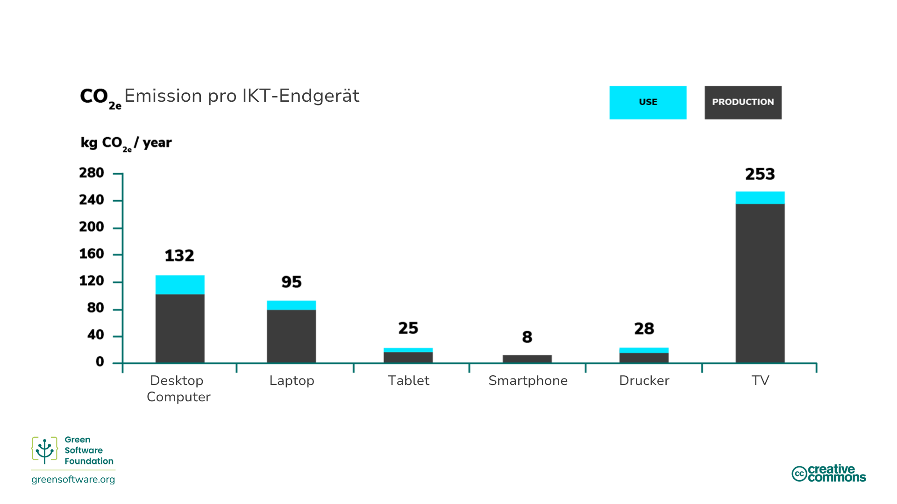
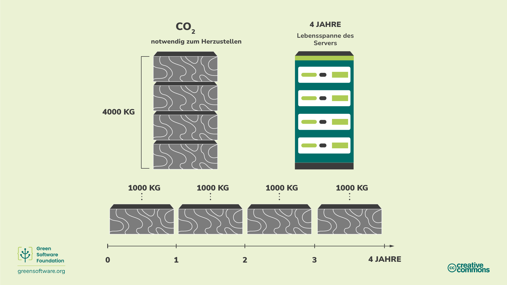
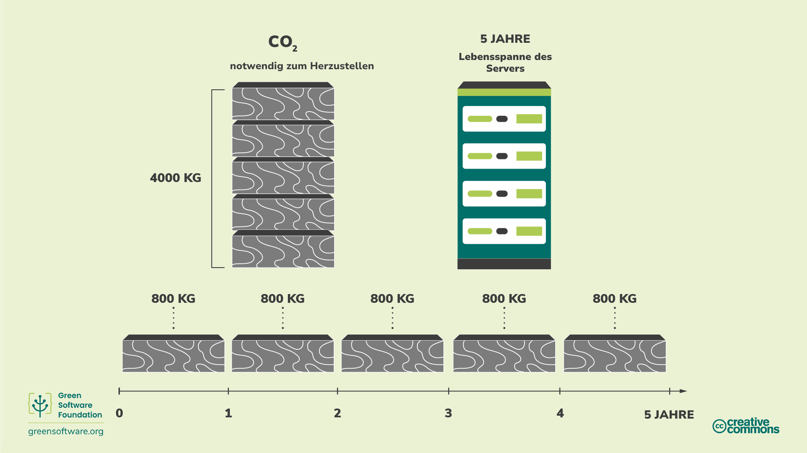
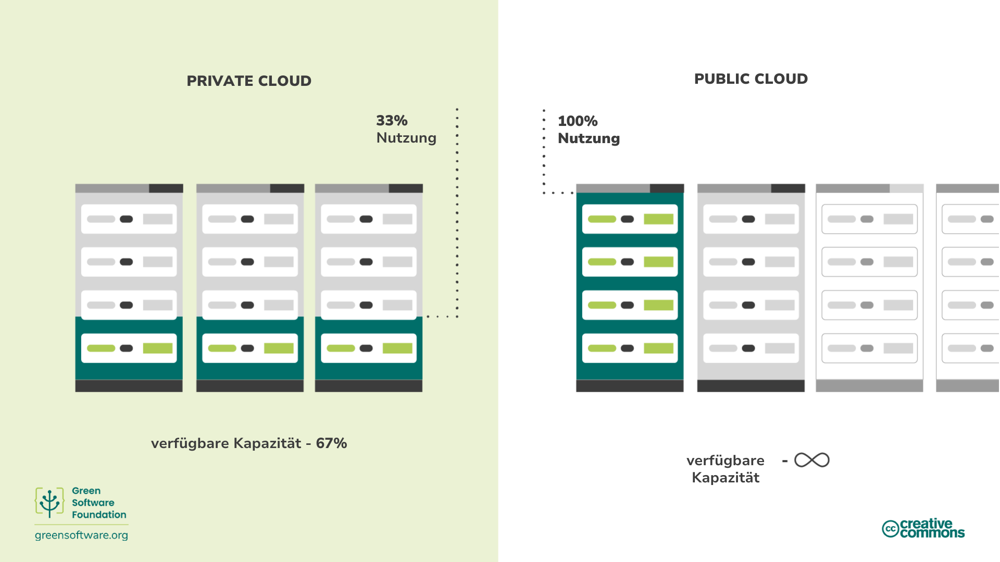

import Quiz from "/src/components/Quiz";

:::note
Dies ist eine gemeinschaftlich erstellte Übersetzung. Sie hat begrenzte Unterstützung und entspricht möglicherweise nicht der neuesten englischen Version des Kurses.
:::

:::tip Principle

_Verwenden Sie die geringstmögliche Menge an verkörpertem Kohlenstoff._

:::

## Einleitung

Die Hardware, die bei der Erstellung Ihrer Software verwendet wird, ist ein wichtiges Element, das ein Praktiker für grüne Software berücksichtigen muss.

Sie werden sehen, dass "embodied carbon" ein versteckter Kostenfaktor ist, wenn es um Hardware geht, und welche Maßnahmen Sie ergreifen können, um die Auswirkungen zu reduzieren, die die Erstellung, die Zerstörung und der Betrieb dieser Hardware mit sich bringen. Zum Beispiel durch die Verlängerung der Lebensdauer oder den Wechsel zu Cloud-Servern.

## Schlüsselkonzepte

### Verkörperter Kohlenstoff

Das Gerät, auf dem Sie dies lesen, hat bei seiner Herstellung Kohlenstoff produziert, und wenn es das Ende seiner Lebensdauer erreicht hat, wird bei seiner Entsorgung möglicherweise noch mehr Kohlenstoff freigesetzt. Embodied Carbon (auch "eingebetteter Kohlenstoff" genannt) ist die Menge an Kohlenstoffverschmutzung, die bei der Herstellung und Entsorgung eines Geräts entsteht.

Bei der Berechnung der Gesamtkohlenstoffbelastung für Computer, auf denen Software läuft, muss sowohl die mit dem Betrieb des Computers verbundene Kohlenstoffbelastung als auch der eingebettete Kohlenstoff des Computers berücksichtigt werden.

Der verkörperte Kohlenstoff variiert erheblich zwischen den einzelnen Endgeräten. Bei einigen Geräten ist der Kohlenstoffausstoß bei der Herstellung viel höher als bei der Nutzung, wie eine [Studie](https://www.ifi.uzh.ch/dam/jcr:fa4e956e-7a53-4038-98a5-00e09e2f4303/Study_Digitalization_Climate_Protection_Summary_Oct2017.pdf) der Universität Zürich zeigt. Infolgedessen können die Kosten für den verkörperten Kohlenstoff manchmal viel höher sein als die Kohlenstoffkosten für den Strom, mit dem das Gerät betrieben wird.

Jedes Gerät, auch wenn es keinen Strom verbraucht, ist für die Freisetzung von Kohlenstoff während seiner Lebensdauer verantwortlich.

### Amortisation

Eine Möglichkeit, verkörperten Kohlenstoff zu berücksichtigen, besteht darin, den Kohlenstoff über die erwartete Lebensdauer eines Geräts zu amortisieren. Nehmen wir zum Beispiel an, dass für den Bau eines Servers 4000 kg CO2eq benötigt wurden und wir erwarten, dass er vier Jahre hält. Durch die Amortisation können wir sagen, dass der Server 1000 kg CO2eq/Jahr ausstößt.

## Wie man die Effizienz der Hardware verbessern kann

Wenn wir den verkörperten Kohlenstoff berücksichtigen, ist klar, dass der Computer bereits eine Menge Kohlenstoff ausgestoßen hat, wenn wir ihn kaufen. Außerdem haben Computer eine begrenzte Lebensdauer, was bedeutet, dass sie irgendwann nicht mehr in der Lage sind, moderne Arbeitslasten zu bewältigen und ersetzt werden müssen. In diesem Sinne ist die Hardware ein Stellvertreter für Kohlenstoff, und da unser Ziel darin besteht, kohlenstoffeffizient zu sein, müssen wir auch die Hardware effizient gestalten.

Es gibt zwei Hauptansätze für die Hardware-Effizienz:

- Bei Endbenutzergeräten geht es um die **Verlängerung der Lebensdauer** der Hardware.
- Beim Cloud Computing geht es um die **Steigerung der Nutzung** des Geräts.

### Verlängerung der Lebensdauer von Hardware

Wenn wir die Lebensdauer unseres Servers um nur ein Jahr verlängern können, sinkt die Amortisationszeit von 1000 kg CO2eq/Jahr auf 800 kg CO2eq/Jahr, wie in unserem Beispiel.

Hardware wird ausgemustert, wenn sie kaputt geht oder nicht mehr in der Lage ist, moderne Arbeitslasten zu bewältigen. Natürlich wird Hardware immer irgendwann kaputt gehen, aber als Entwickler können wir Software verwenden, um Anwendungen zu erstellen, die auf älterer Hardware laufen und deren Lebensdauer verlängern.

### Steigerung der Geräteauslastung

Im Bereich der Cloud bedeutet Hardware-Effizienz meist eine höhere Auslastung der Server. Es ist besser, einen Server mit einer Auslastung von 100 % zu nutzen als 5 Server mit einer Auslastung von 20 %, da die Kosten für den gebundenen Kohlenstoff geringer sind. Genauso wie es besser ist, ein Auto zu besitzen und es jeden Tag der Woche zu benutzen, als fünf zu besitzen und jeden Tag der Woche ein anderes zu benutzen, ist es viel effizienter, Server mit ihrer vollen Kapazität zu nutzen, als mehrere mit einer geringeren Kapazität einzusetzen. Obwohl die Emissionen die gleichen sind, ist der verkörperte Kohlenstoff, der verwendet wird, viel geringer.

Der häufigste Grund für nicht ausgelastete Server ist die Berücksichtigung von Spitzenkapazitäten. Wenn die Server zu 20 % ausgelastet sind, wissen Sie, dass Sie Nachfragespitzen ohne Leistungseinbußen bewältigen können. In der Zwischenzeit ist jedoch die gesamte ungenutzte Kapazität eine Verschwendung von gebundenem Kohlenstoff. Hardware-Effizienz bedeutet, dass jedes Hardware-Gerät so lange wie möglich genutzt wird.

Dies ist einer der Hauptvorteile der öffentlichen Cloud: Sie wissen, dass der Platz vorhanden sein wird, wenn Sie die Kapazität erhöhen müssen, um den Bedarf zu decken. Da mehrere Unternehmen die öffentliche Cloud nutzen, können freie Kapazitäten immer denjenigen zur Verfügung gestellt werden, die sie benötigen, so dass keine Server ungenutzt bleiben.

Es ist wichtig zu wissen, dass die Verlagerung des Betriebs in die öffentliche Cloud nicht automatisch zu einer Reduzierung der Emissionen führt. Es gibt Ihnen lediglich die Möglichkeit, Ihre Software so umzugestalten, dass eine Reduzierung möglich ist.

## Zusammenfassung

- Der verkörperte Kohlenstoff ist die Menge an Kohlenstoffverschmutzung, die bei der Herstellung und Entsorgung eines Geräts entsteht.
- Bei der Berechnung der Gesamtkohlenstoffbelastung müssen Sie sowohl den Kohlenstoffausstoß beim Betrieb des Computers als auch den verkörperten Kohlenstoff berücksichtigen, der bei der Herstellung und Entsorgung des Geräts entsteht.
- Die Verlängerung der Lebensdauer eines Geräts bewirkt eine Amortisierung des ausgestoßenen Kohlenstoffs, so dass sich sein CO2eq/Jahr verringert.
- Cloud Computing ist energieeffizienter als ein Server vor Ort, da es sowohl die Nachfrage verlagern als auch die Nachfrage gestalten kann.

## Quiz

<Quiz
  QuizList={[
    {
      question: "Was ist verkörpertes Kohlenstoffdioxid?",
      answers: [
         {
          text: "Der Kohlenstoff, der bei der Herstellung eines Geräts freigesetzt wurde",
          isCorrect: false,
        },
        {
          text: "Die Kohlenstoffemissionen, die sowohl bei der Herstellung als auch bei der Entsorgung eines Geräts entstehen",
          isCorrect: true,
        },
        {
          text: "Die Kohlenstoffemissionen, die mit der Entsorgung eines Geräts verbunden sind",
          isCorrect: false,
        },
      ],
    },
    {
      question: "Was macht die gesamte Kohlenstoffbelastung eines Computers aus?",
      answers: [
         {
          text: "Der verkörperte Kohlenstoff des Geräts",
          isCorrect: false,
        },
        {
          text: "Die Emissionen, die beim Betrieb des Geräts entstehen",
          isCorrect: false,
        },
        {
          text: "Beide der oben genannten",
          isCorrect: true,
        },
      ],
    },
    {
      question:
        "Was sind die zwei wichtigsten Möglichkeiten, um die Hardware effizienter zu nutzen?",
      answers: [
        {
          text: "Verlängern der Lebensdauer und Reduzieren der Auslastung",
          isCorrect: false,
        },
        {
          text: "Die Lebensdauer verlängern und die Auslastung erhöhen",
          isCorrect: true,
        },
        {
          text: "Seine Lebensdauer verkürzen und seine Auslastung erhöhen",
          isCorrect: false,
        },
      ],
    },
    {
      question:
        "Wie wirkt sich die Hardware-Effizienz auf die Kohlenstoffbelastung eines Geräts aus?",
      answers: [
        {
          text: "Es eliminiert sie",
          isCorrect: false,
        },
        {
          text: "Es erhöht es",
          isCorrect: false,
        },
        {
          text: "Es verringert es",
          isCorrect: true,
        },
      ],
    },
    {
      question:
        "Wie hoch ist der amortisierte Kohlenstoff eines Geräts mit einem verkörperten Kohlenstoff von 1000 kg CO2eq und einer Lebensdauer von 5 Jahren?",
      answers: [
        {
          text: "200kg CO2eq/Jahr",
          isCorrect: true,
        },
        {
          text: "20kg CO2eq/Jahr",
          isCorrect: false,
        },
        {
          text: "200kg CO2eq",
          isCorrect: false,
        },
      ],
    },
    {
      question:
        "Welche Unterschiede gibt es zwischen einer Public Cloud und einer Private Cloud?",
      answers: [
         {
          text: "In der öffentlichen Cloud können Sie schnell skalieren",
          isCorrect: false,
        },
        {
          text: "In einer privaten Cloud müssen Sie Server unter der Kapazität laufen lassen, um Nachfragespitzen zu bewältigen",
          isCorrect: false,
        },
        {
          text: "Beides ist wahr",
          isCorrect: true,
        },
      ],
    },
    {
      question:
        "Warum ist es so wichtig, bei der Berechnung der Emissionen von Hardware den verkörperten Kohlenstoff zu berücksichtigen?",
      answers: [
        {
          text: "Der verkörperte Kohlenstoff ist manchmal für mehr Emissionen verantwortlich als der Strom, mit dem das Gerät betrieben wird",
          isCorrect: true,
        },
        {
          text: "Der verkörperte Kohlenstoff stellt einen kleinen, aber bedeutenden Anteil der Gesamtemissionen eines Geräts dar",
          isCorrect: false,
        },
        {
          text: "Verkörperter Kohlenstoff ist die einzige Emissionsquelle, die bei der Berechnung der Gesamtemissionen eines Geräts berücksichtigt werden sollte?",
          isCorrect: false,
        },
      ],
    },
  ]}
/>
