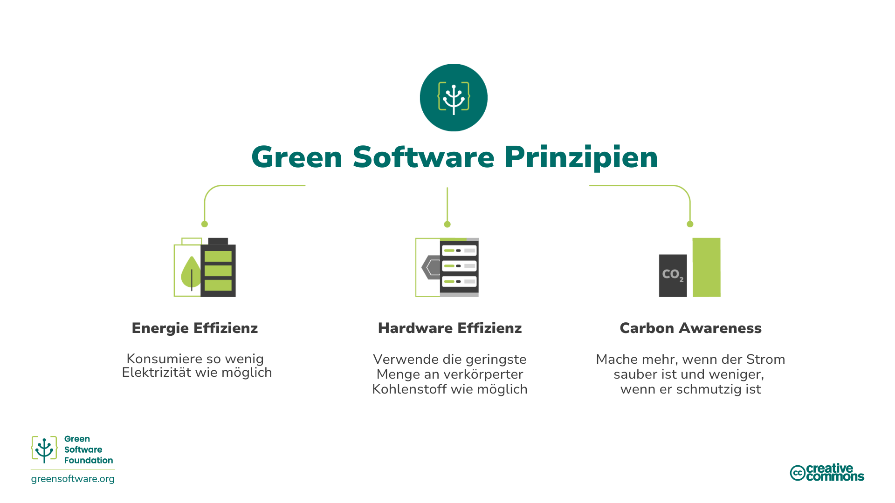
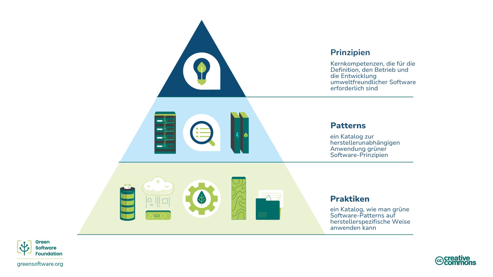

:::note
Dies ist eine von der Gemeinschaft erstellte Übersetzung. Sie hat nur begrenzte Unterstützung und entspricht möglicherweise nicht der neuesten deutschen Version des Kurses.
:::

## Was ist Green Software?

Green Software ist eine aufstrebende Disziplin an der Schnittstelle von Klimawissenschaft, Softwaredesign, Strommärkten, Hardware und dem Design von Rechenzentren.

Grüne Software ist kohlenstoffeffiziente Software, d. h. sie stößt so wenig Kohlenstoff wie möglich aus. Nur drei Aktivitäten reduzieren die Kohlenstoffemissionen von Software: Energieeffizienz, Kohlenstoffbewusstsein und Hardwareeffizienz. In dieser Schulung werden all diese Konzepte erläutert und es wird erklärt, wie sie auf Ihre Prozesse angewandt und gemessen werden können. Außerdem werden einige der internationalen Richtlinien und Organisationen vorgestellt, die diesen Bereich leiten und überwachen.

## Wer sollte dies lesen?

Jeder, der an der Erstellung, Bereitstellung oder Verwaltung von Software beteiligt ist. Durch das Studium dieser Prinzipien kann ein "grüner" Softwareentwickler Entscheidungen treffen, die einen bedeutenden Einfluss auf die Kohlenstoffbelastung seiner Anwendungen haben.

## Geschichte

Im Jahr 2019 wurden die ursprünglichen acht Prinzipien der grünen Softwareentwicklung veröffentlicht. Diese Aktualisierung der Prinzipien aus dem Jahr 2022 berücksichtigt das über die Jahre erhaltene Feedback, fasst einige Prinzipien zusammen und fügt ein neues hinzu, das sich auf das Verständnis von Klimaverpflichtungen bezieht.

## Wie wird man ein Praktiker für Green Software?

Die folgende Schulung deckt 6 Schlüsselbereiche ab, die ein Fachmann für grüne Software kennen sollte:

1. **Kohlenstoff-Effizienz**: Die geringstmögliche Menge an Kohlenstoff ausstoßen.
2. **Energie-Effizienz**: So wenig Energie wie möglich verbrauchen.
3. **Kohlenstoff-Bewusstsein**: Mehr tun, wenn der Strom sauberer ist, und weniger tun, wenn der Strom schmutziger ist.
4. **Hardware-Effizienz**: Verwenden Sie die geringstmögliche Menge an gebundenem Kohlenstoff.
5. **Messung**: Was man nicht messen kann, kann man nicht verbessern.
6. **Klimaverpflichtungen**: Verstehen Sie den genauen Mechanismus der Kohlenstoffreduzierung.

In jedem dieser Kapitel werden neue Konzepte vorgestellt und im Detail erklärt, warum sie für das Klima wichtig sind und wie Sie sie auf Ihre grünen Softwarepraktiken anwenden können.

## Prinzipien, Patterns, and Praktiken.

Die Schlüsselbereiche und Inhalte dieses Kurses beschreiben die **Prinzipien** von Green Software, eine Reihe von Kernkompetenzen, die zur Definition, Ausführung und Erstellung von Green Software erforderlich sind.

Ein Green Software-[**Pattern**] (https://patterns.greensoftware.foundation/) ist ein konkretes Beispiel für die Anwendung eines oder mehrerer Prinzipien in einem realen Beispiel. Während Prinzipien die Theorie beschreiben, die grüner Software zugrunde liegt, sind Patterns die praktischen Ratschläge, die Software-Anwender heute in ihren Software-Anwendungen verwenden können. Patterns sind herstellerunabhängig.

Eine Green Software **Praktik** ist ein Muster, das auf ein bestimmtes Produkt eines Anbieters angewandt wird und die Anwender darüber informiert, wie sie dieses Produkt nachhaltiger nutzen können. 

Praktiken sollten sich auf Muster beziehen, die sich auf Prinzipien beziehen sollten.

Die Green Software Foundation veröffentlicht auch einen [Katalog anbieterneutraler grüner Softwaremuster] (https://patterns.greensoftware.foundation/) in verschiedenen Kategorien.
 

