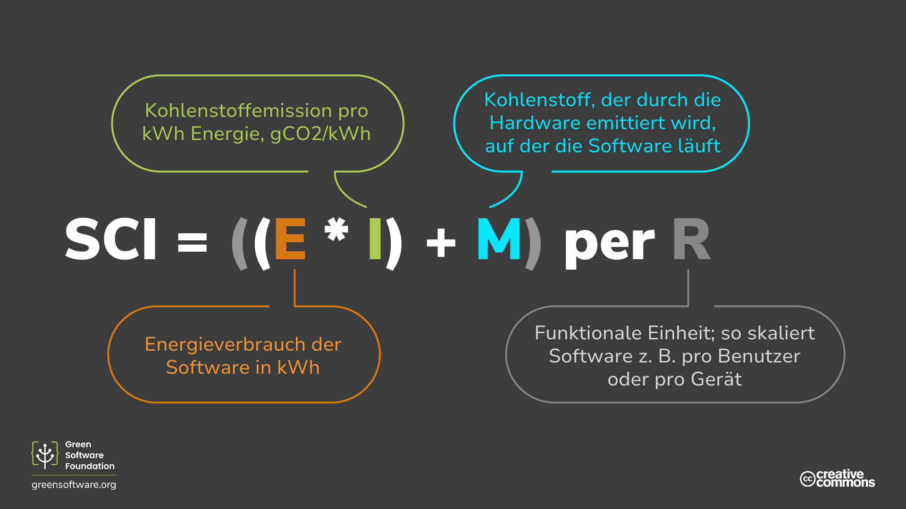

import Quiz from "/src/components/Quiz";

:::note
Dies ist eine gemeinschaftlich erstellte Übersetzung. Sie hat nur begrenzte Unterstützung und entspricht möglicherweise nicht der neuesten englischen Version des Kurses.
:::

:::tip Prinzip

_Was man nicht messen kann, kann man nicht verbessern._

:::

## Einleitung

Das Treibhausgasprotokoll (GHG) ist die am häufigsten verwendete Methode für Unternehmen, um ihre gesamten Kohlenstoffemissionen zu messen. Das Verständnis der THG-Bereiche und der Messung Ihrer Software im Vergleich zu den Industriestandards wird Ihnen dabei helfen zu erkennen, inwieweit Sie die Prinzipien von Green Software anwenden und wie weit Sie sich noch verbessern müssen.

Als Ergänzung zum GHG-Protokoll können Sie auch die Spezifikation der Software Carbon Intensity (SCI) verwenden. Während das GHG-Protokoll eine allgemeinere Messung ist, die sich für alle Arten von Organisationen eignet, ist das SCI-Protokoll speziell auf die Messung der Software-Emissionen ausgerichtet und soll Anreize für die Beseitigung dieser Emissionen schaffen.

Der GHG ist ein Protokoll zur Messung der Gesamtemissionen, der SCI ist ein Instrument, das die Beseitigung der softwarebedingten Emissionen ermöglicht.

Wir werden uns jede der Messmethoden ansehen und erklären, wie sie in beiden Fällen zu berechnen sind.

## Das GHG-Protokoll

Das [Greenhouse Gas Protocol](https://ghgprotocol.org) ist der am weitesten verbreitete und international anerkannte Standard für die Bilanzierung von Treibhausgasen. [92 %](https://ghgprotocol.org/about-us) der Fortune-500-Unternehmen verwenden das THG-Protokoll bei der Berechnung und Offenlegung ihrer Kohlenstoffemissionen.

Das GHG-Protokoll teilt die Emissionen in drei Bereiche ein:

- **Bereich 1**: Direkte Emissionen aus **Betrieben**, die dem berichtenden Unternehmen gehören oder von ihm kontrolliert werden, wie z. B. die Verbrennung von Kraftstoffen vor Ort oder der Fuhrpark.
- **Umfang 2**: Indirekte Emissionen im Zusammenhang mit der **Erzeugung von eingekaufter Energie**, z. B. Wärme und Strom.
- **Umfang 3**: Sonstige indirekte Emissionen aus allen anderen Aktivitäten, denen Sie nachgehen. Dazu gehören alle **Emissionen aus der Lieferkette eines Unternehmens;** die Geschäftsreisen der Mitarbeiter und der Strom, den die Kunden bei der Nutzung Ihres Produkts verbrauchen können.

Scope 3, manchmal auch als Emissionen der Wertschöpfungskette bezeichnet, ist die bedeutendste Emissionsquelle und für viele Organisationen am schwierigsten zu berechnen. Sie umfassen alle Aktivitäten, die zur Herstellung eines Produkts oder einer Dienstleistung erforderlich sind, von der Konzeption bis zum Vertrieb. Im Falle eines Laptops zum Beispiel emittiert jedes in der Produktion verwendete Rohmaterial bei seiner Gewinnung und Verarbeitung Kohlenstoff. Zu den Emissionen der Wertschöpfungskette gehören auch die Emissionen aus der Nutzung des Laptops, d. h. die Emissionen aus der Energie, die für den Betrieb des Laptops verwendet wird, nachdem es an einen Kunden verkauft worden ist.

Mit diesem Ansatz ist es möglich, alle Treibhausgasemissionen aller Organisationen und Personen auf der Welt zusammenzufassen und einen globalen Gesamtwert zu ermitteln.

### In welchen Bereich fällt meine Anwendung?

Wir haben bereits gesehen, wie das GHG-Protokoll uns auffordert, die Software-Emissionen nach den Bereichen 1-3 zu berechnen. Aber wie funktioniert das, wenn es um Software geht?

Die meisten Unternehmen haben viele Anwendungen, die mit unterschiedlichen Architekturen und in unterschiedlichen Umgebungen laufen. In welchen Bereich Ihre Emissionen fallen, sowohl in Bezug auf die erzeugte Energie als auch auf den verkörperten Kohlenstoff, hängt also von Ihrem spezifischen Szenario ab.

- **Für Cloud-Anwendungen, die auf eigenen Servern laufen**, fällt der Energieverbrauch Ihrer Software in den Bereich 2, und der gebundene Kohlenstoff aller Ihrer Server fällt in den Bereich 3.
- **Bei Cloud-Anwendungen, die in einer öffentlichen Cloud** laufen, fallen sowohl der Energieverbrauch Ihrer Anwendung als auch der verkörperte Kohlenstoff in den Geltungsbereich 3.
- In Szenarien, in denen **Sie eine hybride private/öffentliche Cloud-Anwendung** betreiben, fällt ein Teil der Emissionen in den Bereich 2 und ein Teil in den Bereich 3.
- In ähnlicher Weise fällt der Energieverbrauch Ihrer kundenorientierten **Front-End-Anwendung** in den Geltungsbereich 3 Ihres Unternehmens, da Ihr Kunde die Energie für den Betrieb seines Geräts kaufen wird.

Für Software, unabhängig davon, ob sie auf Ihrer eigenen, gemieteten oder von Kunden betriebenen Infrastruktur läuft, gibt es drei Parameter, die bei der Einteilung der Emissionen in Bereiche zu berücksichtigen sind:

- Wie viel Energie sie verbraucht
- Wie sauber oder schmutzig dieser Strom ist
- Wie viel Hardware benötigt wird, um zu funktionieren.

### Ist es möglich, eine Gesamtsumme für Software-Emissionen zu berechnen?

Um die Gesamtemissionen von Software zu berechnen, benötigen Sie detaillierte Daten über den Energieverbrauch, die Kohlenstoffintensität und die Hardware, auf der Ihre Software läuft. Diese Daten sind schwer zu beschaffen, selbst wenn es sich um die eigenen Closed-Source-Softwareprodukte eines Unternehmens handelt, deren Nutzung mit Hilfe von Telemetrie oder Protokollen verfolgt werden kann.

Die Entwickler von Open-Source-Software haben nicht den gleichen Überblick darüber, wie und wo ihre Software verwendet wird, wie viel Energie verbraucht wird und auf welcher Hardware.

An Open-Source-Projekten arbeiten in der Regel mehrere Personen aus verschiedenen Organisationen mit. Daher ist unklar, wer für die Berechnung der Emissionen verantwortlich sein sollte und wer für deren Beseitigung zuständig ist. Wenn man außerdem bedenkt, dass Open-Source-Software 90 % eines typischen Unternehmensstapels ausmacht, ist klar, dass ein großer Teil der Kohlenstoffemissionen nicht berücksichtigt wird.

### Sagen Gesamtbeträge alles aus?

Eine Gesamtzahl ist nur eine Kennzahl, die den Zustand einer Sache beschreibt. Um die richtigen Entscheidungen zu treffen, müssen Sie viele verschiedene Kennzahlen betrachten.

Stellen Sie sich ein Szenario vor, in dem Sie der Leiter eines Unternehmens sind und den Auftrag haben, die Emissionen Ihrer Software zu reduzieren. Sie messen die Emissionen im ersten Quartal und kommen auf eine Gesamtzahl von 34 Tonnen. Nachdem Sie einige Investitionen in Projekte zur Vermeidung von Emissionen getätigt haben, stellen Sie fest, dass die Emissionen im zweiten Quartal auf 45 Tonnen gestiegen sind. Bedeutet dies, dass Ihre Bemühungen gescheitert sind?

Nicht unbedingt. Wir wissen, dass eine Gesamtzahl für sich genommen nicht alles aussagt, und müssen andere Messgrößen heranziehen, um herauszufinden, ob ein Projekt zur Emissionsverringerung erfolgreich war. Wenn Sie zum Beispiel die Kohlenstoffintensität und den Gesamtkohlenstoffausstoß messen, könnten Sie zu einem anderen Schluss kommen. Wenn bei demselben Projekt die Kohlenstoffintensität im ersten Quartal 3,3 g CO2eq/Benutzer und im zweiten Quartal 2,9 g CO2eq/Benutzer betrug, könnten Sie das Projekt als Erfolg betrachten und weiter investieren.

Während die Gesamtzahl Sie darüber informiert, dass die Kohlenstoffemissionen Ihrer Organisation insgesamt gestiegen sind, bietet die Intensität eine umfassendere Perspektive, die Ihnen helfen würde, eine fundierte Entscheidung über das weitere Vorgehen zu treffen.

## Software Carbon Intensity Spezifikation

Die [Software Carbon Intensity (SCI)-Spezifikation] (https://grnsft.org/sci) ist eine von der Arbeitsgruppe für Standards in der Green Software Foundation entwickelte Methodik, mit der eine Softwareanwendung anhand einer Nachhaltigkeitsdimension bewertet und Maßnahmen zur Emissionsvermeidung gefördert werden sollen.

Es handelt sich dabei nicht um einen Ersatz für das GHG-Protokoll, sondern um eine zusätzliche Metrik, die Software-Teams dabei hilft zu verstehen, wie sich ihre Software in Bezug auf Kohlenstoffemissionen verhält, damit sie fundiertere Entscheidungen treffen können. Während das GHG-Protokoll die **Gesamtemissionen** berechnet, geht es beim SCI um die Berechnung der **Emissionsrate**. In der Automobilbranche entspricht der SCI eher der Messung der Kilometer pro Gallone, während das THG-Protokoll eher den gesamten Kohlenstoff-Fußabdruck eines Autoherstellers und aller von ihm jährlich produzierten Fahrzeuge darstellt.

Anstatt die Kohlenstoffemissionen von Software in die Bereiche 1-3 aufzuteilen, werden sie in **Betriebsemissionen** (Kohlenstoffemissionen aus dem Betrieb der Software) und **verkörperte Emissionen** (Kohlenstoffemissionen aus den physischen Ressourcen, die für den Betrieb der Software erforderlich sind) aufgeteilt. Außerdem handelt es sich um eine Intensität und nicht um eine Gesamtzahl, was Open-Source-Software besser berücksichtigt.

Ein wichtiger Punkt ist, dass es nicht möglich ist, die SCI-Bewertung durch den Kauf von Kompensationen in Form von Neutralisierungen, Ausgleichszahlungen oder durch die Kompensation von Strom in Form von Gutschriften für erneuerbare Energien zu verringern. Das bedeutet, dass eine Organisation, die keine Anstrengungen zur Reduzierung ihrer Emissionen unternimmt, sondern lediglich Geld für Emissionsgutschriften ausgibt, keine gute SCI-Bewertung erzielen kann.

Kompensationen sind ein wesentlicher Bestandteil jeder Klimastrategie; Kompensationen sind jedoch keine Eliminierungen und werden daher nicht in die SCI-Kennzahl einbezogen.

Wenn Sie Ihre Anwendung **energieeffizienter**, **hardwareeffizienter** oder **kohlenstoffbewusster** machen, wird sich Ihr SCI-Wert verringern. Die einzige Möglichkeit, Ihren SCI-Wert zu senken, besteht darin, Zeit oder Ressourcen in eines dieser drei Prinzipien zu investieren. Wenn Sie also den SCI als Messgröße für Ihre Softwareanwendung zusammen mit dem Treibhausgasprotokoll verwenden, werden die Investitionen in eine der drei Säulen grüner Software gefördert.

### Die SCI-Gleichung

Der SCI ist eine Methode zur Bewertung jeder Softwareanwendung, die sich nicht nur auf Cloud- oder Endbenutzeranwendungen beschränkt, sondern alle Arten von Anwendungen dazwischen umfasst. Er bietet eine gemeinsame Sprache, um zu beschreiben, wie sich Software in Bezug auf Kohlenstoffemissionen verhält und wie eine vorgeschlagene Änderung einige dieser Emissionen beseitigen könnte.

Die Gleichung zur Berechnung eines SCI-Wertes ist elegant einfach. Diese Einfachheit bedeutet, dass sie in einer Reihe von verschiedenen Szenarien angewendet werden kann.

SCI = ((E *I) + M) pro R".

E" = Von einem Softwaresystem verbrauchte Energie
I` = Standortbezogene marginale Kohlenstoffemissionen*
M` = verkörperte Emissionen eines Softwaresystems*.
R` = Funktionale Einheit (z.B. Kohlenstoff pro zusätzlichem Benutzer, API-Aufruf, ML-Job, etc)

Zusammengefasst bedeutet dies:

SCI = C pro R" (Kohlenstoff pro "R")

R" ist das Kernmerkmal des SCI und macht ihn zu einer Intensität und nicht zu einer Gesamtzahl. Dies nennen wir eine _funktionale Einheit_.

## Wie Sie Ihren SCI-Wert berechnen

Befolgen Sie diese vier Schritte, um Ihren SCI-Wert zu berechnen.

1. Entscheiden, was einbezogen werden soll

Welche Softwarekomponenten Sie in die SCI-Bewertung einbeziehen oder ausschließen, bedeutet, dass Sie die Grenzen Ihrer Software festlegen müssen; wo sie beginnt und wo sie endet.

Für jede Softwarekomponente, die Sie einbeziehen, müssen Sie ihre Auswirkungen messen. Für jede wichtige Komponente, die Sie ausschließen, müssen Sie erklären, warum.

Die SCI-Spezifikation macht derzeit keine Vorgaben, was einzubeziehen und was nicht einzubeziehen ist. Sie müssen jedoch alle unterstützenden Infrastrukturen und Systeme einbeziehen, die wesentlich zum Betrieb der Software beitragen.

Ihre SCI-Punktzahl könnte sich verringern, weil Sie die Software-Grenzen enger gezogen und mehr Software-Komponenten ausgeschlossen haben. Umgekehrt kann sich Ihre SCI-Punktzahl erhöhen, weil Sie Softwarekomponenten einbeziehen, die Sie zuvor ausgeschlossen hatten. Daher ist es wichtig, dass Sie bei der Meldung Ihres SCI-Ergebnisses, insbesondere bei einer Verbesserung des Ergebnisses, Ihre Softwareabgrenzung offenlegen.

2. Wählen Sie Ihre funktionelle Einheit

Wie wir gesehen haben, ist der SCI eher eine Rate als ein Gesamtwert und misst die Intensität der Emissionen entsprechend der gewählten funktionalen Einheit. Die Spezifikation schreibt derzeit keine funktionale Einheit vor, und es steht Ihnen frei, diejenige zu wählen, die am besten beschreibt, wie Ihre Anwendung skaliert. Wenn Ihre Anwendung beispielsweise nach der Anzahl der Benutzer skaliert, dann wählen Sie die Benutzer als funktionale Einheit.

Künftige Iterationen der SCI könnten spezifische funktionale Einheiten für verschiedene Arten von Anwendungen vorschreiben, um die Vergleichbarkeit zu erleichtern. Zum Beispiel könnten wir Streaming-Anwendungen auffordern, Minuten als funktionale Einheit zu wählen, um die Messung für alle Streaming-Anwendungen zu standardisieren.

3. Entscheiden Sie, wie Sie Ihre Emissionen messen wollen

Sie haben nun eine Liste der Softwarekomponenten, die Sie messen wollen, und die funktionale Einheit, die Sie für die Messung verwenden werden. Der nächste Schritt besteht darin, zu entscheiden, wie Sie die Emissionen jeder Softwarekomponente quantifizieren wollen.

Es gibt zwei Methoden der Quantifizierung: Messung und Berechnung.

- **Messung** bedeutet die Verwendung von Zählern in irgendeiner Form. Zum Beispiel können Sie den Energieverbrauch Ihrer Softwarekomponente mit Hilfe eines Hardwaregeräts in der Steckdose messen. Oder die Verwendung von Zählern auf der Hardware, die den Energieverbrauch direkt messen. Wenn Sie Ihre Einheiten direkt zählen können, sollten Sie den Messansatz verwenden.
- Die **Berechnung** beinhaltet indirektes Zählen, oft unter Verwendung eines Modells in irgendeiner Form. Wenn Sie beispielsweise den Energieverbrauch Ihrer Anwendung nicht direkt messen können, sondern ein Modell verwenden, das den Energieverbrauch auf der Grundlage der CPU-Auslastung schätzt, wird dies eher als Berechnung denn als Messung betrachtet.

Diese Ressourcen können Ihnen bei der Entscheidung über Mess- und Berechnungsmethoden helfen:

- Sehen Sie sich das Projekt [Software Carbon Intensity Guide] (https://sci-guide.greensoftware.foundation/) an. Dieses Projekt gibt Ratschläge für die Quantifizierung der Emissionen verschiedener Softwarekomponenten.

4. Quantifizieren Sie

Jetzt sind Sie bereit für die Ausführung. Beginnen Sie unter Anwendung der in den vorangegangenen Schritten beschriebenen Methodik mit der Quantifizierung des SCI-Wertes für jede Softwarekomponente in Ihrer Umgebung. Der SCI-Gesamtwert Ihrer Softwareanwendung ist der kombinierte Wert aller verschiedenen Komponenten.

Sie können mehrere SCI-Werte für dieselbe Anwendung berechnen. Der SCI-Wert ist eine hilfreiche Information, um zu verstehen, wie sich Ihre Anwendung in Bezug auf Kohlenstoffemissionen in verschiedenen Szenarien verhält. Eine Streaming-Anwendung könnte zum Beispiel den Kohlenstoffausstoß pro Minute als Kennzahl wählen. Sie könnte auch den Kohlenstoffausstoß pro Nutzer und Tag berechnen. Die Kennzahl Kohlenstoff pro $ Umsatz könnte eine weitere hilfreiche Dimension darstellen.

## Zusammenfassung

- Das GHG-Protokoll ist eine Metrik zur Messung der gesamten Kohlenstoffemissionen einer Organisation und wird von Organisationen in der ganzen Welt verwendet.
- Das GHG-Protokoll unterteilt die Kohlenstoffemissionen in drei Bereiche. Scope 3, auch bekannt als Emissionen der Wertschöpfungskette, bezieht sich auf die Emissionen von Organisationen, die andere in einer Kette beliefern. Auf diese Weise summieren sich die Bereiche 1 und 2 eines Unternehmens zum Bereich 3 eines anderen Unternehmens.
- Die Berechnung softwarebedingter Emissionen anhand des Treibhausgasprotokolls ist möglich, kann aber bei Open-Source-Software schwierig sein.
- Der SCI ist eine Metrik, die speziell für die Berechnung von Software-Emissionen entwickelt wurde und eher eine Rate als eine Gesamtzahl darstellt.
- Die funktionale Maßeinheit ist im SCI nicht vorgeschrieben, und Sie sollten eine wählen, die Ihrer Anwendung entspricht.

## Quiz

<Quiz
  QuizList={[
    {
      question:
        "Wie verlangt das Treibhausgasprotokoll, dass wir die Emissionen messen?",
      answers: [
        {
          text: "Durch die Unterteilung der Emissionen in drei Bereiche",
          isCorrect: true,
        },
        {
          text: "Durch die Aufteilung der Emissionen in embodied carbon und day-to-day emissions",
          isCorrect: false,
        },
        {
          text: "Durch Aufteilung der Emissionen von Anwendungen, die in der Public Cloud und in der Private Cloud laufen",
          isCorrect: false,
        },
      ],
    },
    {
      question:
        "Welcher der 3 Bereiche, die im Treibhausgasprotokoll verwendet werden, wird auch als 'Emissionen der Wertschöpfungskette' bezeichnet?",
      answers: [
        {
          text: "1",
          isCorrect: false,
        },
        {
          text: "2",
          isCorrect: false,
        },
        {
          text: "3",
          isCorrect: true,
        },
        {
          text: "1 und 2",
          isCorrect: false,
        },
        {
          text: "alle der oben genannten",
          isCorrect: false,
        },
      ],
    },
    {
      question:
        "Wenn Sie eine Cloud-Anwendung sind, in welchen Treibhausgasbereich fällt Ihr Energieverbrauch?",
      answers: [
         {
          text: "Scope 2 und 3",
          isCorrect: false,
        },
        {
          text: "Geltungsbereich 2",
          isCorrect: false,
        },
        {
          text: "Scope 3",
          isCorrect: false,
        },
        {
          text: "Hängt davon ab, ob es öffentlich, privat oder hybrid ist",
          isCorrect: true,
        },
      ],
    },
    {
      question:
        "Welches der folgenden Szenarien ist mit dem Treibhausgasprotokoll schwieriger zu messen?",
      answers: [
        {
          text: "Closed-Source-Software",
          isCorrect: false,
        },
        {
          text: "Open-Source-Software",
          isCorrect: true,
        },
        {
          text: "Beides von oben",
          isCorrect: false,
        },
      ],
    },
    {
      question: "Wofür steht das Akronym SCI?",
      answers: [
        {
          text: "Software Carbon Index",
          isCorrect: false,
        },
        {
          text: "Software Carbon Intensity",
          isCorrect: true,
        },
        {
          text: "Specific Carbon Intensity",
          isCorrect: false,
        },
      ],
    },
    {
      question: "Was bedeutet ((E*I) + M) in der SCI-Gleichung?",
      answers: [
        {
          text: "Kohlenstoff",
          isCorrect: true,
        },
        {
          text: "Energie",
          isCorrect: false,
        },
        {
          text: "Kohlenstoffintensität",
          isCorrect: false,
        },
      ],
    },
    {
      question: "Wofür steht das 'R' in der SCI-Gleichung?",
      answers: [
         {
          text: "Wiederholung",
          isCorrect: false,
        },
        {
          text: "Rate",
          isCorrect: false,
        },
        {
          text: "Funktionseinheit",
          isCorrect: true,
        },
      ],
    },
    {
      question:
        "Was sind die wichtigsten Punkte, die bei der Berechnung Ihres SCI-Scores zu beachten sind?",
      answers: [
        {
          text: "Was Sie einbeziehen müssen und welche funktionale Einheit Sie verwenden werden",
          isCorrect: false,
        },
        {
          text: "Was einzuschließen ist, welche funktionelle Einheit Sie verwenden werden und die Methode der Quantifizierung",
          isCorrect: true,
        },
        {
          text: "Was ist einzubeziehen, welche funktionale Einheit wird verwendet, welche Methode zur Quantifizierung und welcher GHG-Wert",
          isCorrect: false,
        },
      ],
    },
  ]}
/>
