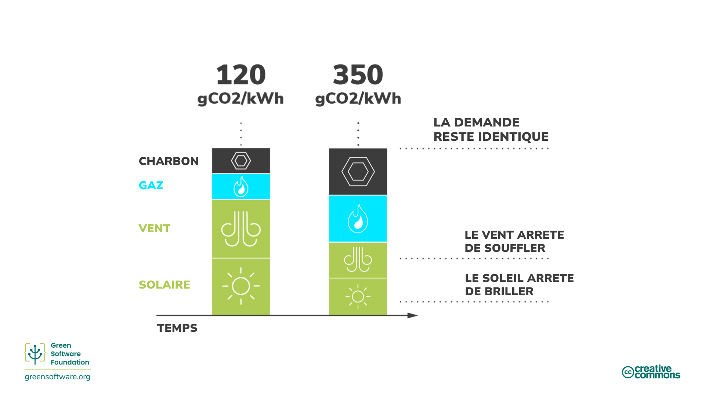
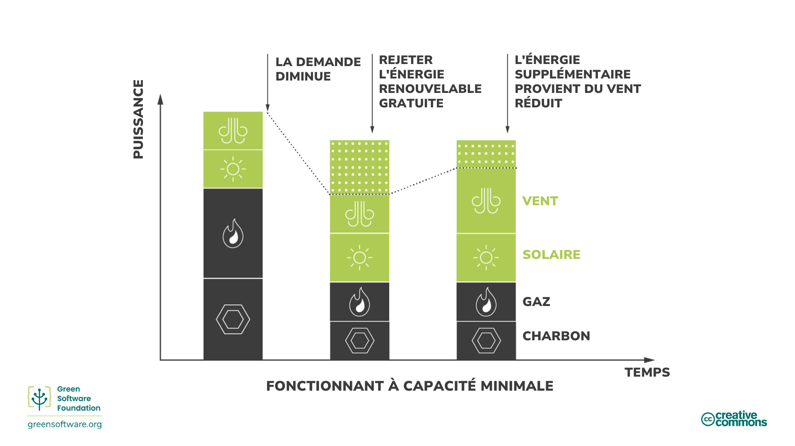
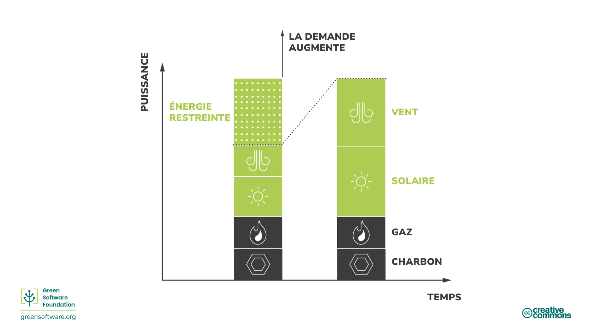
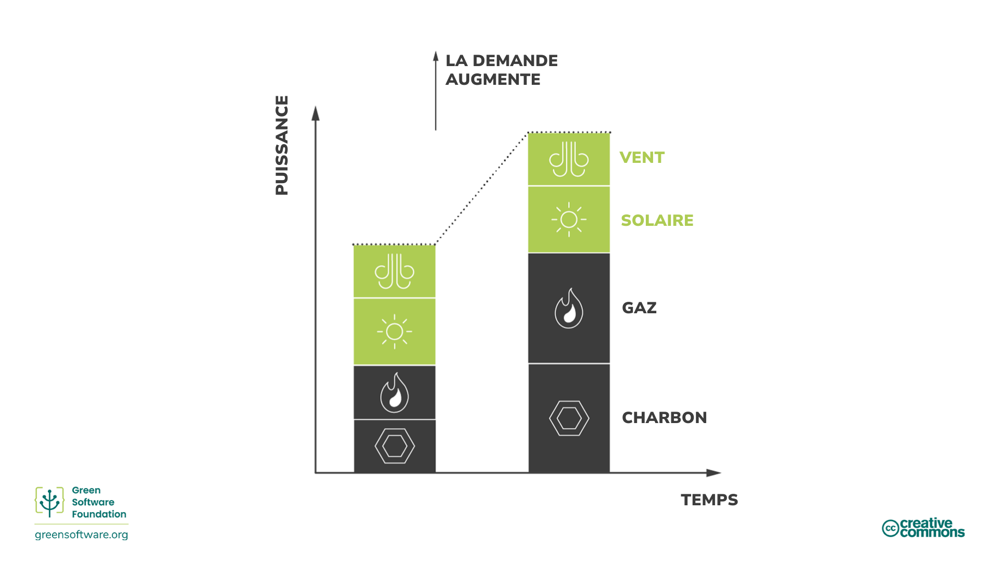
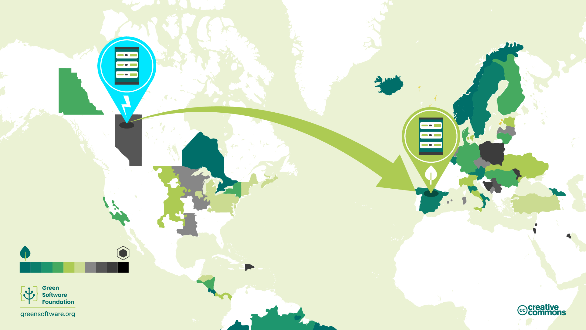
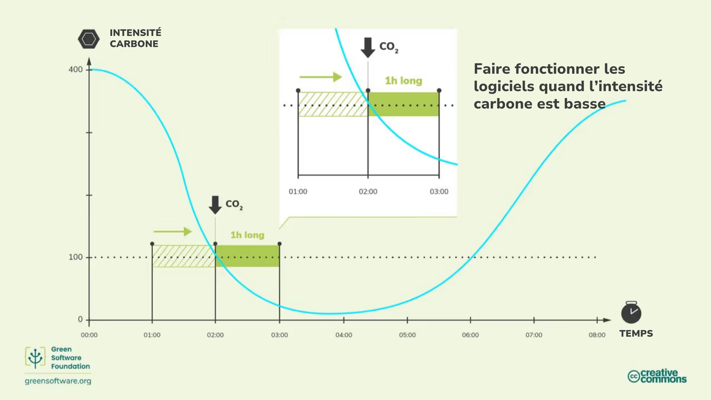

import Quiz from "/src/components/Quiz";

:::note
Il s’agit d’une traduction fournie par la communauté. Le support est limité et pourrait ne pas correspondre à la toute dernière version en anglais.
:::

:::tip Principe

_Faire plus quand l'électricité est plus propre et moins quand l'électricité est plus sale._

:::

## Introduction

Toute l'électricité n'est pas produite de la même façon. Selon le lieu et l'heure, l'électricité est produite à l’aide de différentes sources dont les émissions carbone varient. Certaines sources, comme l’énergie éolienne, solaire ou hydroélectrique sont propres et renouvelables et émettent peu de carbone. D'autre part, les sources de combustibles fossiles émettent du carbone à des degrés divers pour produire de l'électricité. Par exemple, le gaz et le charbon émettent plus de carbone que les énergies renouvelables, mais les centrales au gaz émettent moins de carbone que les centrales à charbon.

La conscience du carbone émis est l'idée de faire plus quand plus d’énergie provient de sources à faibles émissions de carbone et moins quand plus d’énergie provient de sources à forte teneur en carbone.

## Concepts clés

### Intensité carbone

L'intensité carbone mesure la quantité de carbone (CO2) émise par kilowatt-heure (KWh) d'électricité consommée. L'unité standard de l'intensité carbone est gCO2eq/kWh, ou grammes de carbone par kilowatt-heure.

Si votre ordinateur est branché directement sur un parc éolien, son électricité aurait une intensité carbone de 0 gCO2eq/kWh puisqu'un parc éolien n'émet pas de carbone pour produire cette électricité. Cependant, la plupart des gens ne peuvent pas se brancher directement sur les parcs éoliens; à la place, ils se branchent sur des réseaux électriques alimentés par de l'électricité issues de différentes sources.

Une fois sur un réseau, vous ne pouvez pas contrôler quelles sont les sources qui fournissent l'électricité que vous utilisez; vous obtenez simplement un mélange de tout. Ainsi, votre intensité carbone sera un mélange de toutes les sources d’énergie actuelles dans le réseau, autant les sources à faible émission carbone que celle à haute émission carbone.

### Variabilité de l'intensité carbone

L'intensité carbone varie en fonction du lieu car certaines régions ont un mix énergétique contenant plus d’énergies propres que d’autres.

L'intensité carbone varie aussi au fil du temps en raison de la variabilité inhérente aux énergies renouvelables causée par l’imprévisibilité des conditions météorologiques. Par exemple, quand le ciel est couvert ou que le vent ne souffle pas, l'intensité carbone s'accroie car une plus grand part d'électricité dans le mix est issue de sources qui émettent du carbone.

### Répartition & réduction

La demande en électricité varie au cours de la journée et les fournisseurs ont besoin de pouvoir toujours répondre à cette demande. Une baisse de tension (diminution du niveau de voltage dans la ligne électrique) se produit si un fournisseur ne produit pas suffisament d'électricité pour répondre à la demande. A l'inverse, si un fournisseur produit plus d'électricité que nécessaire, alors pour empêcher l'infrastructure de griller, les disjoncteurs se déclenchent et on a des pannes d'électricité.

Il est nécessaire d'avoir un équilibre entre l'offre et la demande d'électricité à tout moment et c'est généralement la responsabilite du fournisseur de service.

Dans le cas des combustibles fossiles tels que le charbon, il est plus facile de contrôler la puissance produite pour cette alimentation; c'est ce qu'on appelle la **répartition**. Cependant, dans le cas des sources d'énergies renouvelables telles que les parcs éoliens, la puissance produite ne peut pas être facilement controlée (on ne peut pas maîtriser la force du vent). Si la source d'energie produit plus d'électricité que nécessaire, cette électricité est rejetée, c'est ce qu'on appelle la **réduction**.

### Intensité carbone marginale

Si vous avez soudainement besoin d'accéder à plus de puissance électrique - par exemple, vous devez allumer une lampe - cette énergie vient de la part marginale d'une centrale electrique. Cette part marginale peut être répartie, ce qui veut dire que ces centrales électriques sont souvent alimentées par des combustibles fossiles.

L'intensité carbone marginale est l'intensité carbone de la centrale électrique qui devrait être utilisee pour répondre à toute nouvelle demande.

Les centrales électriques à base de combustibles fossiles réduisent rarement leur production à 0. Elles ont un seuil de fonctionnement minimal, et certaines ne peuvent pas s'adapter; elles ont une charge de base immuable. Pour cette raison, nous avons parfois le scénario où nous rejetons de l'énergie renouvelable tout en continuant à consommer de l'énergie issue des centrales à combustibles fossiles.

Dans ces situations, l'intensité carbone marginale sera de 0 gCO2eq/kWh puisque nous savons que toute nouvelle demande sera associée avec l'énergie renouvable que nous réduisons.

### Marchés de l'énergie

Le modèle exact du marché varie à travers le monde mais globalement suit le meme modèle.

Lorsque la demande d'électricité diminue, les fournisseurs ont besoin de **réduire** l'apport pour équilibrer l'offre et la demande. Ils peuvent le faire de deux manières:

1. **Acheter moins d'énergie des centrales à combustibles fossiles.**

L'énergie provenant des centrales à combustibles fossiles est généralement la plus chère, c'est donc la methode privilégiée. Cela se traduit directement par une consommation moindre de combustibles fossiles.

2. **Acheter moins d'énergie des sources renouvelables**.

   Les sources d'énergie renouvables étant les plus abordables, les fournisseurs préfèrent ne pas faire çà. Si une source renouvelable ne parvient pas à vendre toute son électricité, il faut se débarrasser du surplus.

Réduire la quantité d’électricité consommée dans vos applications peut aider à réduire l’intensité carbone de l’énergie, car la première chose à réduire est la quantité de combustibles fossiles.
Lorsque la demande d’électricité augmente, les fournisseurs doivent augmenter l’offre pour équilibrer l’offre et la demande. Ils peuvent le faire de deux façons :

1. **Acheter plus d’énergie à partir de sources renouvelables qui sont actuellement réduites**

Si vous limitez, cela signifie que vous avez un excès d’énergie que vous pourriez répartir. L’énergie renouvelable est déjà la moins chère, l’énergie renouvelable limitée sera la source d’énergie la moins chère que l'on puisse répartir. Les centrales renouvelables vendront alors l’énergie qu’elles auraient dû réduire.

2. **Acheter plus d’énergie des centrales à combustibles fossiles**.

Les combustibles fossiles sont intrinsèquement répartissables; ils peuvent rapidement augmenter la production d’énergie en brûlant plus de combustibles. Cependant, le charbon coûte de l’argent, c’est donc la solution la moins préférée.

Les marchés de l’énergie étant parmi les plus complexes au monde, l’explication ci-dessus est une simplification. Mais ce qu’il est important de comprendre, c’est que notre objectif est d’accroître les investissements dans les sources d’énergie à faible teneur en carbone, comme les énergies renouvelables, et de diminuer les investissements dans les sources d'énergie à plus forte teneur en carbone, comme le charbon. La meilleure façon de s’assurer que l’argent est investit dans la bonne direction est de s’assurer que vous utilisez l’électricité avec le moins d’intensité carbone.

## Comment être plus conscient de la consommation carbone

:::tip

L’utilisation de l’électricité lorsque l’intensité carbone est faible est le meilleur moyen de garantir que les investissements vont plus vers des centrales à faibles émissions de carbone et moins vers des centrales à fortes émissions de carbone.

:::

Il y a une transformation globale qui est en cours en ce moment. Partout dans le monde les réseaux électriques passent de la combustion de combustibles fossiles à l’approvisionnement en énergie à faible émission de carbone, comme l’énergie éolienne et solaire. C’est l’une de nos meilleures chances d'atteindre nos objectifs de réduction globale. En tant que professionnels du logiciel durable, voyons quelques-unes des façons dont nous pouvons aider à accélérer cette transition.

Le principal moteur de la transition est économique plutôt que tout objectif lié à la durabilité. Les énergies renouvelables sont gagnantes parce qu’elles sont moins chères et deviennent encore plus abordables au fil du temps. Donc, pour accélérer la transition, nous devons rendre les centrales renouvelables plus rentables et les centrales à combustibles fossiles moins rentables. La meilleure façon d’y parvenir est d’utiliser plus d’électricité lorsqu’elle provient de sources à faible teneur en carbone, comme les énergies renouvelables, et moins d’électricité lorsqu’elle provient de sources à plus forte teneur en carbone.

L’intensité carbone est plus faible lorsque plus d’énergie provient de sources à faible teneur en carbone et plus élevée lorsqu’elle provient de sources à plus forte teneur en carbone.

### Décalage de la demande

Être conscient du carbone signifie réagir aux changements d’intensité carbone en augmentant ou en diminuant votre demande. Si votre travail vous permet d’être flexible quant au moment et à l’endroit où vous exécutez des charges de travail, vous pouvez vous déplacer en conséquence - consommer de l’électricité lorsque l’intensité carbone est plus faible et interrompre la production lorsqu’elle est plus élevée. Par exemple, former un modèle d’apprentissage automatique à un autre moment ou dans une autre région ayant une intensité carbone beaucoup plus faible.

[Des études](https://ieeexplore.ieee.org/document/6128960) montrent que ces mesures peuvent entraîner des réductions de 45 à 99% des émissions de carbone, selon le nombre d’énergies renouvelables qui alimentent le réseau.

Le décalage de la demande peut être décomposé en décalage géographique et temporel.

#### Déplacement géographique

Le déplacement géographique consiste à déplacer votre calcul vers un autre emplacement physique où l’intensité carbone actuelle est plus basse. C’est peut-être une région qui a naturellement des sources d’énergie à plus faible teneur en carbone. Par exemple, on peut déplacer vers différents hémisphères en fonction de la saison pour avoir plus d’heures de soleil.

#### Décalage dans le temps

Si vous ne pouvez pas déplacer votre calcul spatialement vers une autre région, une autre option est de passer à un autre moment. Peut-être plus tard dans la journée ou la nuit, lorsque le temps est plus ensoleillé ou plus venteux et que, par conséquent, l’intensité carbone est plus faible, ce qu’on appelle le décalage temporel de la demande. Nous pouvons raisonnablement bien prédire l’intensité future du carbone grâce aux progrès des prévisions météorologiques.

Certaines des plus grandes entreprises technologiques ont reconnu l’importance de la conscience du carbone émis et utilisent des techniques de modélisation avancées pour mettre en œuvre le décalage de la demande.

- **Centre de données Google conscients du carbone** - Google a lancé un projet pour [sensibiliser au carbone certaines des charges de travail](https://blog.google/outreach-initiatives/sustainability/carbon-aware-computing-location/). Ils ont créé des modèles pour prédire l’intensité et la charge de travail dans le futur. Ils ont ensuite façonné des charges de travail à grande échelle afin que plus de choses se produisent quand et où l’intensité carbone est la plus faible, mais de manière à pouvoir encore gérer la charge attendue.
- **Microsoft Carbon Aware Windows** - [Microsoft a annoncé un projet pour rendre Windows 11 plus durable](https://www.techradar.com/news/windows-11-is-getting-an-eco-friendly-update-but-could-microsoft-do-more). Dans un premier temps, cela signifie exécuter des mises à jour Windows lorsque l’intensité carbone est inférieure.

### Adaptation de la demande

L'adaptation de la demande est la stratégie qui consiste à déplacer le calcul vers les régions ou les périodes où l’intensité carbone est la plus faible. Cependant, au lieu de déplacer la demande vers une région ou une heure différente, nous façonnons notre calcul pour correspondre à l’offre existante.

- Si l’intensité carbone est faible, augmentez la demande; faites plus dans vos applications.
- Si l’intensité carbone est élevée, diminuez la demande; faites moins dans vos applications.

L'adaptation de la demande pour les applications sensibles au carbone concerne l’offre de carbone. Lorsque le coût en carbone de l’exploitation de votre application devient élevé, définissez la demande en fonction de l’offre de carbone. Cela peut être géré automatiquement, ou l’utilisateur peut faire un choix.

Le mode Eco est un exemple d'adaptation de la demande. Les modes Eco se trouvent dans les appareils ménagers comme les voitures ou les machines à laver. Lorsqu’elle est activée, une partie de la performance est sacrifiée afin de consommer moins de ressources (gaz ou électricité). Parce qu’il y a ce compromis avec la performance, les modes éco sont toujours présentés à un utilisateur comme un choix.

Les applications logicielles peuvent également avoir des modes éco qui peuvent - automatiquement ou avec le consentement de l’utilisateur - prendre des décisions pour réduire les émissions de carbone.

Un logiciel de visioconférence qui ajuste automatiquement la qualité du streaming en est un exemple. Plutôt que de diffuser en continu avec la meilleure qualité possible à tout moment, il réduit la qualité vidéo pour prioriser l’audio lorsque la bande passante est faible.

Un autre exemple est le protocol TCP/IP. La vitesse de transfert augmente en réponse à la quantité de données diffusées sur le réseau.

Un troisième exemple est l’amélioration progressive avec le web. L’expérience Web s’améliore en fonction des ressources et de la bande passante disponibles sur l’appareil de l’utilisateur final.

L'adaptation de la demande est liée à un concept plus large de durabilité, qui consiste à réduire la consommation. Nous pouvons faire beaucoup en devenant plus efficaces avec les ressources, mais nous devons aussi consommer moins à un moment donné.

En tant que professionnels du logiciel durable, nous devrions envisager d’annuler un processus lorsque l’intensité carbone est élevée au lieu de décaler la demande - réduisant ainsi les exigences de notre application et les attentes de nos utilisateurs finaux.

## Synthèse

- La conscience du carbone émis signifie comprendre que l’énergie que vous consommez n’a pas toujours le même impact en termes d’intensité carbone.
- L’intensité carbone varie en fonction du moment et du lieu de consommation.
- La nature des combustibles fossiles et des sources d’énergie renouvelables signifie que la consommation d’énergie lorsque l’intensité carbone est faible augmente la demande de sources d’énergie renouvelables et augmente le pourcentage d’énergie renouvelable dans l’offre.
- Le décalage de la demande signifie déplacer votre consommation d’énergie à différents endroits ou à différents moments de la journée où l’intensité carbone est inférieure.
- Façonner la demande signifie adapter votre consommation d’énergie en fonction de la variabilité de l’intensité carbone afin de consommer plus dans les périodes de faible intensité et moins dans les périodes de forte intensité.

## Quiz

<Quiz
  QuizList={[
    {
      question: "Qu’est-ce que l’intensité carbone?",
      answers: [
        {
          text: "La quantité de carbone produite à l’aide de sources d’énergie propre",
          isCorrect: false,
        },
        {
          text: "La quantité de carbone produite par kilowatt hour",
          isCorrect: true,
        },
        { text: "0gCO2eq/kWh", isCorrect: false },
      ],
    },
    {
      question: "Quelle est l’unité standard de l'intensité carbone?",
      answers: [
        { text: "gCO2eq/kWh", isCorrect: false },
        { text: "gCO2e/kWh", isCorrect: false },
        { text: "L’und ou l’autre des réponses ci-dessus", isCorrect: true },
      ],
    },
    {
      question: "Quelles sont les deux variables qui influent sur l’intensité carbone?",
      answers: [
        { text: "L'emplacement et l'heure", isCorrect: true },
        { text: "L'offre et la demande", isCorrect: false },
        { text: "L'heure et la demande", isCorrect: false },
      ],
    },
    {
      question:
        "Lequel des énoncés suivants n’est pas vrai au sujet des centrales électriques marginales?",
      answers: [
        { text: "Elles sont dispatchable (note: trouver un autre mot)", isCorrect: false },
        { text: "Elles brûlent généralement des combustibles fossiles", isCorrect: false },
        {
          text: "Elles sont situées dans des endroits où les sources d’énergie propre ne sont pas disponibles",
          isCorrect: true,
        },
      ],
    },
    {
      question: "Qu’est-ce que la réduction?",
      answers: [
        { text: "Le surplus d’approvisionnement énergétique", isCorrect: false },
        {
          text: "L'énergie qui est jetée en raison de l’offre excédentaire",
          isCorrect: true,
        },
        { text: "Réduire l’offre pour répondre à la demande", isCorrect: false },
      ],
    },
    {
      question:
        "Lequel des exemples suivants n’est pas un exemple de calcul conscient du carbone?",
      answers: [
        {
          text: "Consommer plus d’électricité lorsque l’intensité carbone est plus faible",
          isCorrect: false,
        },
        { text: "Passer aux énergies renouvelables", isCorrect: true },
        {
          text: "Arrêter la production lorsque l’intensité carbone est plus élevée",
          isCorrect: false,
        },
      ],
    },
    {
      question: "Quels sont les deux types de décalage de la demande ?",
      answers: [
        { text: "Temporel et permanent", isCorrect: false },
        { text: "spatial et temporel", isCorrect: true },
        { text: "Réduction et répartition", isCorrect: false },
      ],
    },
    {
      question: "Qu’est-ce que l'adaptation de la demande?",
      answers: [
        {
          text: "Faites plus lorsque l’intensité carbone est faible, faites moins lorsque l’intensité carbone est élevée",
          isCorrect: true,
        },
        {
          text: "Faites plus lorsque l’intensité carbone est élevée, faites moins lorsque l’intensité carbone est faible",
          isCorrect: false,
        },
        {
          text: "Faites plus lorsque les coûts sont faibles, faites moins lorsque les coûts sont élevés",
          isCorrect: false,
        },
      ],
    },
    {
      question: "Lequel des exemples suivants est un exemple de conscience du carbone émis?",
      answers: [
        {
          text: "Créer un logiciel qui produit de très faibles émissions",
          isCorrect: false,
        },
        {
          text: "Annuler un processus lorsque vous savez que l’intensité carbone est élevée",
          isCorrect: true,
        },
        {
          text: "Utilisation de serveurs cloud au lieu de serveurs internes",
          isCorrect: false,
        },
      ],
    },
  ]}
/>
