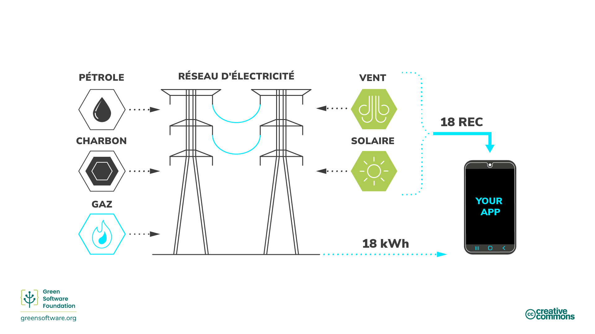
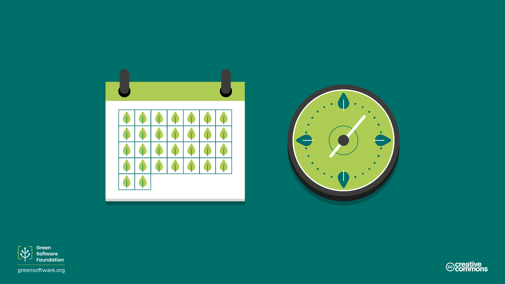
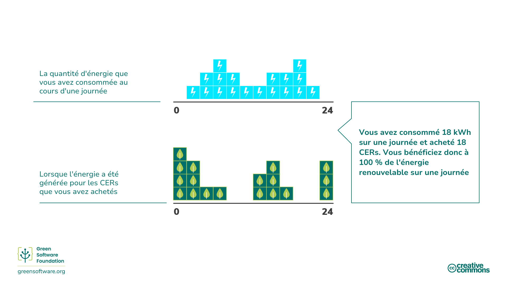
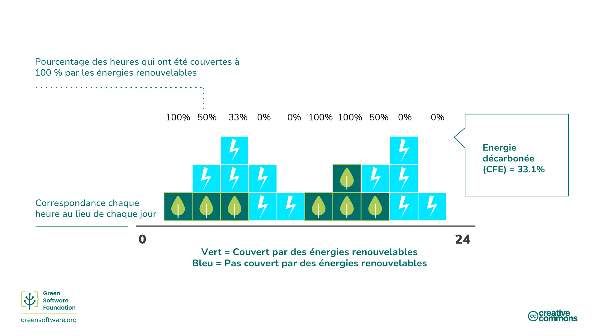
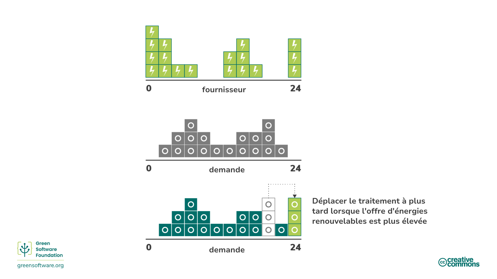

import Quiz from "/src/components/Quiz";

:::note
Il s’agit d’une traduction fournie par la communauté. Le support est limité et pourrait ne pas correspondre à la toute dernière version en anglais.
:::

:::tip Principe

_Comprendre le mécanisme exact de réduction du carbone._

:::

## Introduction

Ces dernières années, de nombreux acteurs économiques ont cherché à atteindre différents objectifs climatiques en prenant divers engagements.

Les termes "zéro émission", "neutre en carbone", "négatif en carbone" et "neutre pour le climat" ont été utilisés de façon interchangeable avec l’objectif principal d’éliminer, de réduire et de prévenir les émissions de carbone. À mesure que l’intérêt pour ces objectifs augmente, il est essentiel d’avoir une compréhension commune de ce qu’ils signifient et de la façon de les atteindre grâce aux stratégies et aux procédures de mesure que nous avons apprises.

## Méthodes de réduction du carbone

Il existe de nombreuses façons de réduire les émissions, mais il est important de comprendre le mécanisme exact de la réduction lorsque l’on pense aux objectifs de réduction.

### Réduction / élimination du carbone

L'[initiative des objectifs fondés sur la science](https://sciencebasedtargets.org/) désigne un mécanisme appelé [réduction](https://sciencebasedtargets.org/resources/legacy/2020/09/foundations-for-net-zero-executive-summary.pdf), ce qui signifie éliminer les sources d’émissions de CO2 associées aux activités d’une entreprise et [chaîne de valeur](https://www.cisl.cam.ac.uk/education/graduate-study/pgcerts/value-chain-defs) afin qu’ils n’entrent pas dans l’atmosphère. La chaîne de valeur décrit l’ensemble des activités nécessaires à la création d’un produit ou d’un service, de la conception à la distribution. Cela inclut l’augmentation de l’efficacité énergétique pour éliminer certaines des émissions associées à la production d’énergie.

La réduction des émissions ne suffit pas à elle seule, car il y aura toujours des émissions qui ne peuvent pas être éliminées en raison de contraintes technologiques ou économiques, mais elle doit être au cœur de la stratégie de chaque organisation, car c’est un domaine où presque toutes les entreprises peuvent s’améliorer.

Pour équilibrer ces émissions résiduelles, nous devons examiner d’autres mécanismes comme les compensations, les indemnisations ou les neutralisations.

### Compensations

Les [compensations](https://www.offsetguide.org/understanding-carbon-offsets/what-is-a-carbon-offset/) sont des investissements directs dans des projets de réduction des émissions par l’achat de crédits carbone sur le Marché Volontaire du Carbone (MVC). Le MVC est un marché décentralisé où les acteurs privés achètent et vendent volontairement des crédits carbone qui représentent des absorptions ou des réductions certifiées des GES de l’atmosphère.

Pour compenser les émissions, vous devez acheter le volume équivalent de crédits de carbone pour compenser ceux émis, où 1 crédit de carbone correspond à 1 tonne de CO2 absorbée ou réduite.

Divers avantages positifs peuvent découler de ces projets, de la protection des écosystèmes à l’autonomisation des communautés locales. Cependant, pour s’assurer que ces programmes sont mis en œuvre correctement et ont l’effet souhaité sur l’environnement et le but d’atteindre l'objectif mondial de zéro émission, il existe des normes mondiales qu’ils doivent respecter, telles que la Verified Carbon Standard (VCS) et la Gold Standard (GS).

#### SCI et Compensations

Il y a certaines limites aux compensations de carbone et c’est pourquoi elles ne sont pas prises en compte dans le score SCI d’une organisation. Par exemple, imaginez deux applications, toutes deux fonctionnant sur une plate-forme cloud qui est 100% compensée en carbone et égalée à 100% par de l’énergie renouvelable. L’application A a investi beaucoup de temps et de ressources pour s’assurer qu’elle utilise les ressources efficacement, tandis que l’application B utilise les ressources de manière très inefficace. Pour que le SCI soit une mesure utile, l’application A doit obtenir de meilleurs résultats que l’application B.

Si le SCI envisageait les compensations, les deux demandes obtiendraient un score de 0. Cela ne nous indiquerait rien sur l’efficacité avec laquelle elles utilisent les ressources. Bien que l’application B émette plus de molécules de carbone dans l’atmosphère, puisque son score est de 0 et que le score le plus bas est de 0, pourquoi investirait-elle davantage dans l’amélioration de son efficacité en carbone?

Les organisations doivent avoir des plans pour éliminer et neutraliser les émissions, et le SCI les aide à éliminer les émissions dues aux logiciels. Cela fait du SCI une composante essentielle de toute stratégie de neutralité carbone.

### Compensation / Réduction des émissions de carbone

Les [indemnisations](https://www.abatable.com/blog/carbon-removal-vs-carbon-avoidance-projects) sont des mesures que les entreprises prennent pour aider la société à éviter ou à réduire les émissions en dehors de leur chaîne de valeur. Il s’agit essentiellement d’investir dans les projets de réduction d’autres organisations.

Cela inclue des actions telles que:

- **Conservation** - Les crédits sont créés en fonction du carbone non libéré dans l'atmosphère grâce à la protection des vieux arbres.
- **Projets communautaires** - Ces projets aident les communautés du monde entier, principalement les moins développées, en introduisant des modes de vie durables.
- **Valorisation énergétique des déchets** - Ces projets capturent le méthane/gaz d’enfouissement dans les petits villages, les déchets humains ou agricoles, et les convertissent en électricité.

### Neutralisation / élimination du carbone

Les [neutralisations](https://www.abatable.com/blog/carbon-removal-vs-carbon-avoidance-projects) sont des mesures prisent par les entreprises pour éliminer le carbone de l’atmosphère à l’intérieur ou à l’extérieur de leur chaîne de valeur. Les neutralisations font référence à l’élimination et au stockage permanent du carbone atmosphérique pour contrebalancer l’effet de la libération de CO2 dans l’atmosphère. Cela comprend des mesures comme :

- **Améliorer les puits de carbone naturels** qui éliminent le CO2 de l’atmosphère. Par exemple, la restauration des forêts, puisque la photosynthèse élimine le CO2 naturellement. L’expansion des forêts comporte des défis, car il est essentiel de ne pas influer sur la dynamique des terres agricoles et de l’approvisionnement alimentaire par ailleurs. Les méthodes modernes d'agriculture peuvent également prolonger la durée de stockage du carbone dans le sol.
- **Le captage direct dans l’air** est le processus qui consiste à capter le CO2 de l’air et à le stocker de façon permanente, soit sous terre, soit dans des produits à longue durée de vie comme le béton.

L’efficacité de ces méthodes est généralement mesurée en fonction de leur capacité à éliminer le carbone à l’échelle et à la vitesse requises.

En ce qui concerne les projets d’élimination du carbone, la durabilité est un facteur essentiel. La durabilité d’un projet décrit la durée de conservation du dioxyde de carbone hors de l’atmosphère.

La durabilité à court terme va jusqu'à 100 ans, cella à moyen terme est de 100 à 1000 ans et cella à long terme est de plus de 1000 ans.

- Les solutions qui reposent sur le cycle naturel du carbone de la Terre ont une durabilité à court terme mesurée en décennies. Par exemple, les projets forestiers ont une durabilité de 40 à 100 ans.
- Les solutions d’ingénierie telles que la capture directe dans l'air ont souvent une durabilité à long terme mesurée en millénaires. Par exemple, la capture directe dans l'air a une durabilité de 10000 ans.
- Les projets à long terme sont généralement plus coûteux que les projets à court terme. Une fois émis, le carbone reste dans l’atmosphère pendant 5000 ans. Pour être considéré comme zéro émission, le carbone émis doit être éliminé de façon permanente.

Un projet d’élimination du carbone à court terme n’éliminera le carbone que pendant 100 ans, après quoi il sera de retour dans l’atmosphère pour réchauffer notre planète. C’est l’une des raisons pour lesquelles la réduction est préférée à la neutralisation. Il est de loin préférable de ne jamais émettre de carbone que d’essayer de le garder hors de l’atmosphère pendant 5000 ans.

## Engagements en faveur du climat

Il existe de nombreuses stratégies de réduction du carbone auxquelles une entreprise peut s’engager, de neutre en carbone à zéro émission. Comprendre les différentes significations et implications de chacun peut vous aider à décider de la bonne stratégie pour votre organisation.

### Neutralité carbone

Pour atteindre la neutralité carbone, une entreprise doit mesurer ses émissions, puis faire correspondre le total avec ses compensations grâce à des projets de réduction des émissions de carbone. Cela peut inclure des projets d’élimination du carbone (neutralisations) et des projets d’évitement du carbone (compensations).

La neutralité carbone est définie par une norme internationalement reconnue: [PAS 2060](https://info.eco-act.com/hubfs/0%20-%20Downloads/PAS%202060/PAS%202060%20factsheet%20EN.pdf). Bien que cela recommande qu’une organisation fixe des objectifs de réduction, elle n’exige pas qu’elle réduise ses émissions. Pour être considérée neutre en carbone, une organisation peut simplement mesurer et compenser sans investir des ressources dans l’élimination de ses émissions de carbone.

Pour être neutre en carbone, vous devez couvrir les émissions directes (scopes 1 et 2). On s’attend généralement à ce que les entreprises mesurent et compensent leurs scopes 1 et 2, et les voyages d’affaires à partir du scope 3. Toutefois, il n’y a pas d’exigence particulière pour inclure cela.

La neutralité carbone est une première étape importante pour toute organisation puisqu’elle encourage la mesure. Cependant, il n’y a pas suffisamment de crédits carbone dans le monde pour compenser les émissions de toutes les organisations. Par conséquent, toute stratégie qui n’inclut pas de réduction n’aidera pas le monde à atteindre l’objectif de 1,5 degré fixé par l’Accord de Paris sur le climat. C’est là que le zéro émission entre en jeu.

### Zéro émission

Le zéro émission signifie réduire les émissions selon les plus récentes données scientifiques sur le climat et équilibrer les émissions résiduelles par l’élimination du carbone (neutralisations). Le zéro émission, par définition, exige des réductions des émissions conformes à une trajectoire de 1,5°C. Toutes les entreprises doivent le faire pour atteindre l'objectif mondial de zéro émission d’ici 2050.

Le principal facteur de différenciation entre le zéro émission et la neutralité carbone est l’accent mis sur la réduction plutôt que sur les neutralisations et les compensations. Un objectif de zéro émission vise à éliminer les émissions et à utiliser uniquement la compensation pour les émissions résiduelles que l'on ne peut pas éliminer.

Le [standard pour le zéro émission](https://sciencebasedtargets.org/resources/files/foundations-for-net-zero-full-paper.pdf) est en cours d’élaboration par l'[Initiative des objectifs basés sur la science](https://sciencebasedtargets.org/) (SBTi). Ils calculent qu’il y a une probabilité de 66% de limiter le réchauffement climatique à 1,5 °C si nous atteignons un niveau de réduction d’environ 90 % de toutes les émissions de GES d’ici le milieu du siècle. Ainsi, pour atteindre un objectif de zéro émission, une organisation doit éliminer 90 % de ses émissions d’ici 2050. Les émissions restantes ne peuvent être compensées qu’en utilisant des neutralisations et des absorptions permanentes de carbone.

Une stratégie de zéro émission signifierait que la quantité réelle de carbone dans l’atmosphère demeure constante.

De plus, pour être un objectif de zéro émission, vous devez couvrir les émissions directes et indirectes, c.-à-d. les émissions de la chaîne d’approvisionnement (scopes 1, 2 et 3). Par conséquent, toute votre chaîne de valeur doit être incluse dans la portée de votre objectif de zéro émission. Ceci est significatif puisque le scope 3 représente souvent la majorité des émissions.

#### Le SCI dans le cadre de l'objectif de zéro émission

Le SCI est une mesure spécifiquement conçue pour favoriser l’élimination des émissions. La seule façon de réduire votre score est d’investir du temps et des ressources dans des actions qui éliminent les émissions. Les seules activités que le SCI reconnaît comme actions d’élimination sont de rendre votre application plus économe en énergie, plus efficace en utilisation du matériel, ou de consommer des sources d’énergie à faible teneur en carbone. Les compensations sont une composante essentielle de toute stratégie climatique; cependant, les compensations ne sont pas des éliminations et ne sont donc pas incluses dans la mesure du SCI.

Toute stratégie de zéro émission doit planifier à la fois l'élimination et la neutralisation les émissions. Le SCI aide les organisations à favoriser l’élimination des émissions dues aux logiciels, ce qui fait du SCI un élément essentiel pour toute stratégie de zéro émission.

### 100% renouvelable

Lorsque les organisations se fixent un objectif de 100 % d’énergie renouvelable, elles peuvent faire la distinction entre le fait d’être **égalées par** et*** alimentées par** des énergies renouvelables.

**Alimenté par** signifie que vous êtes alimenté directement par une source d’énergie renouvelable, par exemple un barrage hydroélectrique. Dans ce scénario, les électrons qui entrent dans votre appareil ne peuvent provenir que de cette source, vous pouvez donc dire en toute confiance que vous êtes alimenté à 100% par des énergies renouvelables.

Pour la plupart des gens, nous vivons sur un réseau interconnecté, avec de nombreux producteurs qui pompent l’électricité et de nombreux consommateurs qui consomment de l’électricité. Cela signifie que les électrons entrant dans votre appareil sont un mélange de tous les électrons entrant dans le réseau. Par exemple, supposons que le réseau ne dispose que de 5% d’énergie provenant de l'éolien. Vous obtenez 5% des électrons générés par l’énergie éolienne et 95% des électrons générés par les combustibles fossiles.

Vous ne pouvez pas suivre les électrons individuellement. Une fois que les électrons d’un parc éolien sont sur une grille, ils se mélangent tous aux électrons d’une centrale à combustibles fossiles. Il n’y a donc aucun moyen pour un consommateur d’insister pour que les électrons qu’il utilise proviennent uniquement de sources renouvelables.

#### Certificat d'énergie renouvelable (CER)

<!--  -->

Pour résoudre ce problème, une centrale renouvelable vend deux choses. La première est son électricité, qu’elle vend dans un réseau. La second est un CER, [Certificat d'énergie renouvelable](https://www.epa.gov/green-power-markets/renewable-energy-certificates-recs). 1 CER équivaut à 1kWh d'énergie.

Si vous voulez être 100% associé aux énergies renouvelables et que vous êtes sur le réseau, la solution est d’acheter suffisamment de CER pour couvrir la quantité d’électricité que vous consommez. Par exemple, si vous consommez 100 kWh d’électricité chaque jour, alors pour être 100% associé aux énergies renouvelables, vous achetez 100 CER.

Lorsque les organisations se fixent des objectifs 100% renouvelables, l’achat de CER sur le marché est la solution qu’elles utilisent souvent pour respecter leurs engagements.

#### CADER

Vous pourriez également entendre le terme CADER utilisé aux côtés du CER. Un CADER est un [Contrat d’Achat Direct d’Energie Renouvelable](https://ppp.worldbank.org/public-private-partnership/sector/energy/energy-power-agreements/power-purchase-agreements), ce qui est une autre facon d'acheter des CERs. Si vous estimez avoir besoin de 500 MWh d’électricité par an pour un centre de données particulier, vous pouvez signer un CADER pour acheter 500 MWh par an dans une usine d’énergies renouvelables. Vous auriez alors toutes les CERs associés à cette centrale.

Les CADERs sont généralement des contrats à très long terme. Une centrale d’énergies renouvelables peut trouver un financement avec l’un de ces accords puisqu’elle a déjà un acheteur pour son électricité pour de nombreuses années.

Les CADERs encouragent ce qu’on appelle **l’additionnalité**. L’achat d’un CADER stimule la création de nouvelles centrales renouvelables. Les CADERs sont une solution qui nous mène vers un avenir où tout le monde aura accès à une énergie 100% renouvelable.

### La correspondance horaire 24/7

En ce qui concerne les revendications 100% renouvelables, la question cruciale est la suivante: quelle est la granularité de l’appariement? Est-ce que vous faites la somme et la réduction annuellement, mensuellement, chaque semaine, quotidiennenement ou chaque heure? Cette question est essentielle parce que pour faire vraiment la transition vers les énergies renouvelables, nous avons besoin que 100% de l’électricité provienne de sources d’énergie à faible émission de carbone, comme les énergies renouvelables, 100% du temps. Cette correspondance granulaire fine est souvent appelée _[appariement horaire 24/7 24/7](https://www.epa.gov/green-power-markets/247-hourly-matching-electricity)_.

La correspondance horaire 24/7 est l’une des nombreuses stratégies que nous devons utiliser pour accélérer la transition vers un réseau couvert à 100% par des énergies renouvelable. Par exemple, [Google](https://sustainability.google/progress/energy/) et [Microsoft](https://blogs.microsoft.com/blog/2021/07/14/made-to-measure-sustainability-commitment-progress-and-updates/) se sont engagés tous les deux à offrir un appariement horaire 24/7 d’ici 2030.

#### Correspondance quotidienne ou horaire

Imaginez qu’une organisation ait une courbe de demande comme celle-ci, chaque carré bleu représente 1 kWh:

Ils ont acheté des CERs d’un parc éolien qui produisait de l’électricité avec une courbe, donc chaque carré vert représente 1 CER. L’appariement par jour signifie que l’entreprise a consommé 18 kWh et a acheté 18 CERs. Par conséquent, elle l'a ramené à zéro. Ils peuvent donc dire qu’ils sont **100 % associés à l’énergie renouvelable chaque jour. **

Cependant, si nous l’avions examiné au niveau de l'heure (chaque carré ici correspond à une durée de 2 heures), cela semble un peu différent :

La quantité totale d’énergie consommée est encore de 18 kWh. Cependant, il n’y a que quelques heures dans la journée où nous sommes 100% associés à l’énergie renouvelable pour cette heure. Donc, pendant quelques heures, nous avons beaucoup plus d’énergie renouvelable que ce dont nous avons besoin, et inversement, nous avons beaucoup moins d’énergie renouvelable que ce dont nous avons besoin pendant la plupart du temps.

Dans l’exemple ci-dessus, ils sont **100 % associés à l’énergie renouvelable sur une base horaire pour seulement 6 heures de la journée**.

#### Energie décarbonée

Le nombre que nous utilisons pour décrire notre succès à la correspondance horaire 24/7 est le pourcentage d’énergie décarbonée.

L’énergie décarbonée est définie comme [le pourcentage moyen d’énergie décarbonée consommée à un endroit donné sur une base horaire](https://cloud.google.com/sustainability/region-carbon#understanding).

Donc, pour l’exemple précédent, si nous mesurons en utilisant l’appariement quotidien, nous sommes 100% appariés avec l’énergie renouvelable. Cependant, nous ne sommes appariés qu’à 33,1 % si nous les mesurons à l’aide de la correspondance horaire. **Le pourcentage d’énergie décarbonée est donc de 33,1 %**.

#### La conscience du carbone émis dans le cadre d’une stratégie d’appariement horaire 24/7

Le calcul prenant conscience du carbone émis implique de répondre aux signaux électriques d’intensité carbone et de changer le **comportement** du logiciel, afin qu’il émette moins de carbone. La conscience du carbone émis aide également une organisation à atteindre son objectif d’appariement 24/7 heures sur 24 et à augmenter son pourcentage d'énergie décarbonée.

Un exemple de changement de comportement est le report d'un traitement à un moment où plus d’énergie renouvelable est disponible. Par exemple, retarder le début d’un cycle de formation d’un modèle d’apprentissage automatique, ou même reporter la recharge d’un ordinateur portable, jusqu'au moment où l’intensité carbone de l’électricité est plus faible et que l’approvisionnement en énergie renouvelable est plus important.

:::Astuce
Les logiciels ayant conscience du carbone émis aident les entreprises à augmenter leur pourcentage d'énergie décarbonée.
:::

## Synthèse

- Il existe un certain nombre de méthodologies couramment utilisées pour aider à la lutte globale contre le changement climatique. Celles-ci entrent dans les catégories générales de l’élimination du carbone (aussi appelée «réduction»), de réduction des émissions de carbone (alias «compensation») ou de l’élimination du carbone (alias «neutralisation»).
- La réduction comprend l’augmentation de l’efficacité énergétique afin d’éliminer certaines des émissions associées à la production d’énergie. La réduction est le moyen le plus efficace de lutter contre le changement climatique, bien que l’élimination complète du carbone ne soit pas possible.
- La compensation comprend l’adoption de sources d’énergie renouvelables, de mode de vie durables, de recyclage, de plantation d’arbres, etc.
- Les neutralisations font référence à l’élimination et au stockage permanent du carbone atmosphérique pour contrebalancer l’effet de la libération de CO2 dans l’atmosphère. Les neutralisations ont tendance à éliminer le carbone de l’atmosphère à court et moyen terme.
- Une entreprise peut se considérer comme neutre en carbone lorsque ses émissions totales sont égalées par le total de ses compensations d’émissions grâce à des projets de réduction du carbone
- Le zéro émission vise à éliminer les émissions et à compenser uniquement les émissions résiduelles que vous ne pouvez pas éliminer pour atteindre l’objectif de 1,5 °C fixé par l’Accord de Paris sur le climat.
- Le SCI est soigneusement conçu de sorte que l’élimination des émissions, grâce à l’efficacité énergétique, l’efficacité du matériel et la conscience du carbone émis soit le seul moyen de réduire le score. Associée à une stratégie de neutralisation distincte, elle peut constituer la base d’une stratégie de zéro émission pour une entreprise.
- Lorsque les organisations fixent un objectif de 100 % d’énergie renouvelable, elles peuvent soit être « associées » à des énergies renouvelables, soit « alimentées par », où « alimentées par » signifie que les électrons qui entrent dans votre appareil ne peuvent provenir que de sources renouvelables. Cela peut être réalisé en achetant des CERs dans le cadre d’un CADER.
- La correspondance horaire 24/7 est l’une des nombreuses stratégies que nous devons utiliser pour accélérer la transition vers un réseau 100 % renouvelable.

## Quiz

<Quiz
  QuizList={[
    {
      question: "Que sont les neutralisations?",
      answers: [
        {
          text: "Des actions qui éliminent le carbone de l’atmosphère",
          isCorrect: true,
        },
        {
          text: "Des actions qui réduisent les émissions de carbone",
          isCorrect: false,
        },
        {
          text: "Des actions qui soutiennent les initiatives climatiques",
          isCorrect: false,
        },
      ],
    },
    {
      question: "Qu’est-ce qu’une considération critique pour les neutralisations?",
      answers: [
        {
          text: "Volume de neutralisation",
          isCorrect: false,
        },
        {
          text: "Durabilité de la neutralisation",
          isCorrect: true,
        },
        {
          text: "Coût de neutralisation",
          isCorrect: false,
        },
      ],
    },
    {
      question:
        "Quelle approche pouvez-vous adopter pour neutraliser les émissions de carbone de la consommation d’énergie?",
      answers: [
        {
          text: "Améliorer les puits de carbone naturels",
          isCorrect: false,
        },
        {
          text: "Captage direct dans l’air",
          isCorrect: false,
        },
        {
          text: "Les deux éléments ci-dessus",
          isCorrect: true,
        },
      ],
    },
    {
      question: "Ce qui est responsable de l’établissement de la norme pour le zéro émission?",
      answers: [
        {
          text: "SBTi",
          isCorrect: true,
        },
        {
          text: "STBi",
          isCorrect: false,
        },
        {
          text: "STIB",
          isCorrect: false,
        },
      ],
    },
    {
      question: "Quelle est la cible mondiale du zéro émission?",
      answers: [
        {
          text: "Éliminer 100 % des émissions d’ici 2050",
          isCorrect: false,
        },
        {
          text: "Éliminer 90 % des émissions d’ici 2050",
          isCorrect: true,
        },
        {
          text: "Éliminer 80 % des émissions d’ici 2050",
          isCorrect: false,
        },
      ],
    },
    {
      question: "Quel est l’objectif principal de la réduction/élimination?",
      answers: [
        {
          text: "Compensez vos émissions de carbone grâce à un contrat financier",
          isCorrect: false,
        },
        {
          text: "Ne pas émettre de carbone dans l’atmosphère en premier lieu",
          isCorrect: true,
        },
        {
          text: "Réduire les émissions liées aux activités d’une entreprise en améliorant l’efficacité énergétique",
          isCorrect: false,
        },
      ],
    },
    {
      question: "Quel protocole ou méthode de mesure intègre des compensations?",
      answers: [
        {
          text: "Le protocole GES",
          isCorrect: true,
        },
        {
          text: "SCI",
          isCorrect: false,
        },
      ],
    },
    {
      question: "Quels sont les critères minimaux pour être neutre en carbone?",
      answers: [
        {
          text: "Les émissions des scopes 1 à 3 doivent être compensées par des neutralisations ou des compensations",
          isCorrect: false,
        },
        {
          text: "Les émissions des scopes 1 et 2 doivent être compensées par des neutralisations ou des compensations",
          isCorrect: true,
        },
        {
          text: "Les émissions des scopes 1 à 2 et les voyages d’affaires du scope 3 doivent être compensées par des neutralisations ou des compensations",
          isCorrect: false,
        },
      ],
    },
  ]}
/>
