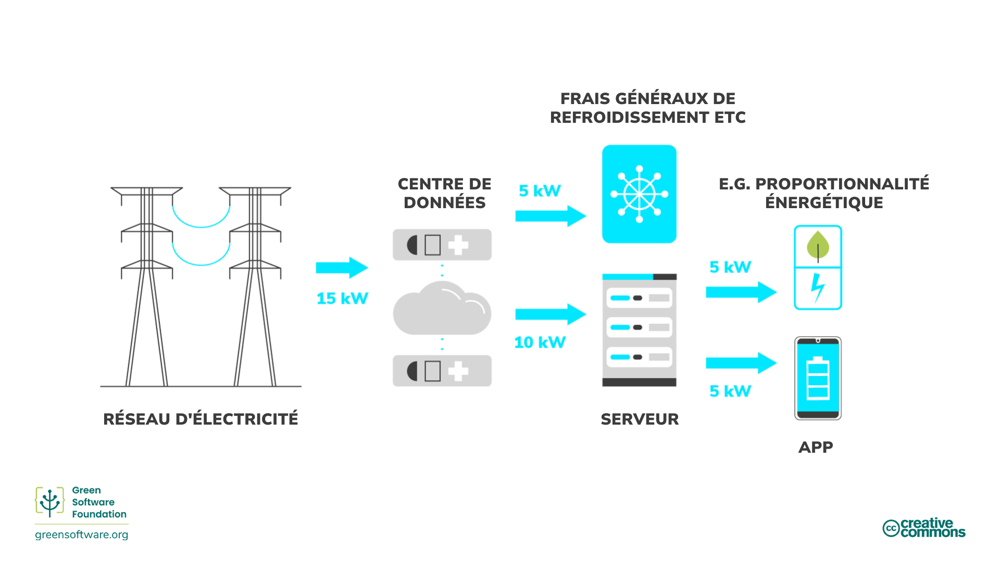
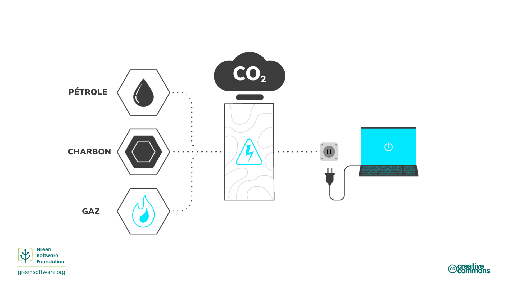
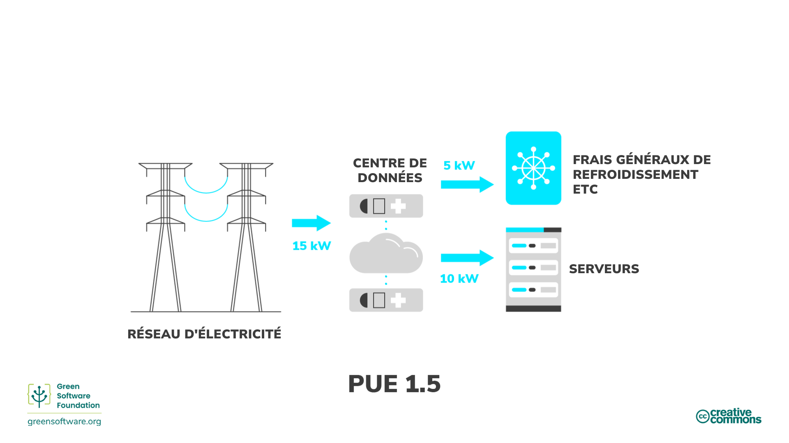
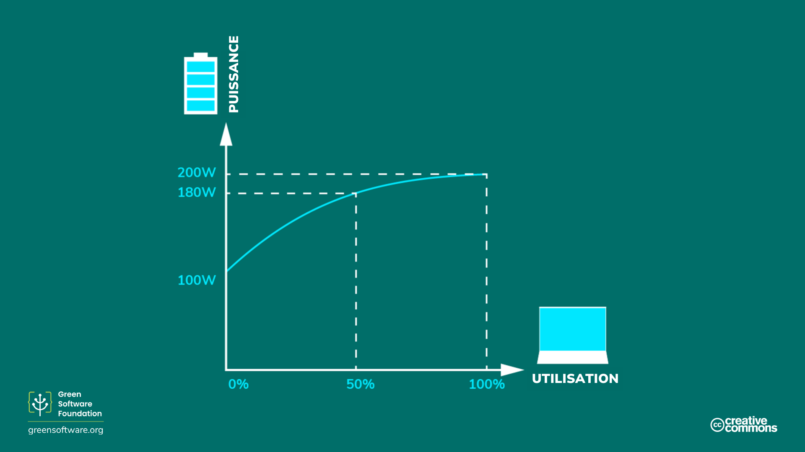

import Quiz from "/src/components/Quiz";

:::note
Il s’agit d’une traduction fournie par la communauté. Le support est limité et pourrait ne pas correspondre à la version anglaise la plus récente du cours.
:::

:::tip Principe

_Utilisez le moins d’énergie possible._

:::

## Introduction

L’énergie est la capacité de réaliser des tâches. Il existe de nombreuses formes d’énergie différentes, telles que la chaleur, l’électricité et les produits chimiques, et un type d’énergie peut être converti en un autre. Par exemple, nous convertissons l’énergie chimique du charbon en énergie électrique. En d’autres termes, l’électricité est une énergie secondaire convertie à partir d’un autre type d’énergie. En d'autres termes, nous pouvons considérer l’énergie comme une mesure de l’électricité utilisée.

Tous les logiciels, des applications fonctionnant sur des téléphones portables à la formation de modèles d’apprentissage automatique fonctionnant dans des centres de données, consomment de l’électricité. L’un des meilleurs moyens de réduire la consommation d’électricité et les émissions de carbone induites par les logiciels est de rendre les applications plus économes en énergie. Cependant, notre responsabilité ne s’arrête pas là.

Les professionnels du logiciel durable prennent la responsabilité de l’énergie consommée par leurs produits et les conçoivent pour consommer le moins possible. Nous devons nous assurer que, à chaque étape du processus, il y a le moins de gaspillage possible et que la majeure partie de l’énergie va à l’étape suivante.

La dernière étape de cette chaîne est représentée par l’utilisateur final de votre produit, pas le produit fini lui-même. Cela signifie que notre objectif n’est pas simplement de créer le code le plus éco-responsable ou le logiciel le plus « écologique », mais de penser à l’utilisateur final et comment s’assurer qu’il ne génére pas d’émissions inutiles.

Cela peut signifier regrouper des tâches pour tirer parti de la proportionnalité énergétique ou changer la façon dont un utilisateur utilise votre logiciel. Jetons un coup d’œil à certains de ces concepts et à certaines façons de devenir plus éco-responsable à chaque étape de la chaîne, jusqu’au consommateur final.

## Concepts clés

### Combustibles fossiles et sources d'énergie à haute teneur en carbone

La plupart de l’électricité est produite par la combustion de combustibles fossiles, [habituellement du charbon](https://ourworldindata.org/grapher/world-electricity-by-source). Les combustibles fossiles sont fabriqués à partir de plantes et d’animaux en décomposition. Ces combustibles se trouvent dans la croûte terrestre et contiennent du carbone et de l’hydrogène qui peuvent être brûlés pour founir de l’énergie. Le charbon, le pétrole et le gaz naturel sont des exemples de combustibles fossiles.

La plupart des gens pensent que l’électricité est propre. Nos mains ne se salissent pas lorsque nous branchons quelque chose dans une prise, et nos ordinateurs portables n’ont pas besoin de tuyaux d’échappement. Cependant, étant donné que la plupart de l’électricité provient de la combustion de combustibles fossiles et que l’approvisionnement en énergie est la [seule cause la plus importante](https://www.eea.europa.eu/data-and-maps/daviz/change-of-co2-eq-emissions-2#tab-chart_4) des émissions de carbone, nous pouvons tracer une ligne directe entre l’électricité et les émissions de carbone. En d'autres termes, l’électricité peut être considérée comme un substitut du carbone.

Si notre but est d’être économe en carbone, cela signifie que notre objectif est également d’être économe en énergie, car l’énergie est un substitut du carbone. Cela signifie utiliser le moins d’énergie possible par unité de travail.

### Sources d’énergie à faibles émissions de carbone

L’énergie propre provient de sources renouvelables à zéro émission qui ne polluent pas l’atmosphère lorsqu’elles sont utilisées et économisent l’énergie grâce à des pratiques éco-responsables. Il y a des points communs entre l’énergie propre, verte et renouvelable. Voici comment nous pouvons les différencier:

- **Énergie propre** - ne produit pas d’émissions de carbone, p. ex., nucléaire.
- **Énergie verte** - sources provenant de la nature
- **Énergie renouvelable** - sources qui n’expireront pas. Par exemple, le solaire ou l'éolien

### Mesure de l'énergie

- L’énergie est mesurée en joules (J), l’unité d’énergie internationale [SI](https://fr.wikipedia.org/wiki/Syst%C3%A8me_international_d%27unit%C3%A9s).
- La puissance est mesurée en watts, où 1 watt (W) est une unité correspondant à un joule par seconde.
- Un kilowatt (kW) est donc aussi une unité correspondant à 1000 joules par seconde.
- Un kilowattheure (kWh) est une mesure de l’énergie (J) correspondant à un kilowatt de puissance fournie pendant une heure.

## Comment améliorer l’efficacité énergétique

Maintenant que nous savons comment l’énergie est produite et le coût associé en termes d’émissions, en fonction de l’utilisation de sources d’énergie à faible ou à forte teneur en carbone, examinons quelques-unes des façons dont les professionnels du logiciel durable peuvent améliorer l’efficacité énergétique. Comprendre l’indicateur d'efficacité énergétique et la proportionnalité énergétique signifie que vous pouvez prendre de meilleures décisions afin d’utiliser l’énergie de la manière la plus efficace et avec le moins de gaspillage possible.

### Indicateur d'efficacité énergétique

L’industrie des centres de données utilise l'[indicateur d'efficacité énergétique](https://datacenters.lbl.gov/sites/default/files/WP49-PUE%20A%20Comprehensive%20Examination%20of%20the%20Metric_v6.pdf) (PUE en anglais), mis au point par Green Grid en 2006, pour **mesurer l’efficacité énergétique des centres de données**. Plus précisément, il s’agit de la quantité d’énergie utilisée par les équipements informatiques par rapport au refroidissement et aux autres frais généraux. Lorsque le PUE d’un centre de données est proche de 1,0, l’informatique utilise presque toute l’énergie. Lorsque le PUE est de 2,0, cela signifie qu’un watt supplémentaire de puissance informatique est nécessaire pour refroidir et distribuer l’énergie à l’équipement informatique pour chaque watt de puissance informatique qu’il utilise.

Une autre façon de voir le PUE est de multiplier la consommation d’énergie de votre application. Ainsi, par exemple, si votre application consomme 10 kWh et que le PUE du centre de données où elle fonctionne est de 1,5, la consommation réelle du réseau est de 15 kWh : 5kWh vont vers la surcharge opérationnelle du centre de données, et 10 kWh vont aux serveurs qui exécutent votre application.

### Proportionnalité énergétique

La [proportionnalité énergétique](https://research.google/pubs/pub33387/), proposée pour la première fois en 2007 par les ingénieurs de Google, permet de mesurer **la relation entre la puissance consommée par un ordinateur et la vitesse à laquelle le travail utile est effectué** (son utilisation).

L’utilisation mesure la quantité de ressources utilisées par un ordinateur, généralement exprimée en pourcentage. Un ordinateur utilisé entièrement et fonctionnant à sa capacité maximale a un pourcentage élevé, tandis qu’un ordinateur inactif sans utilisation a un pourcentage inférieur.

La relation entre la puissance et l’utilisation n’est pas proportionnelle. Mathématiquement parlant, la proportionnalité entre deux variables signifie que leurs rapports sont équivalents. Par exemple, à 0% d’utilisation, un ordinateur peut tirer 100W; à 50%, il tire 180W; et à 100%, il tire 200W. La relation entre la consommation d’énergie et l’utilisation n’est pas linéaire et ne traverse pas l’origine.

Pour cette raison, plus nous utilisons un ordinateur, plus il devient efficace pour convertir l’électricité en calculs informatiques utiles. Une manière d’améliorer l’efficacité du matériel est d’exécuter la charge de travail sur le moins de serveurs possible, avec les serveurs fonctionnant au taux d’utilisation le plus élevé, maximisant l’efficacité énergétique.

#### Consommation d’électricité statique

La consommation d’électricité statique d’un ordinateur est **la quantité d’électricité qui est consommée lorsqu’il est à l’état inactif**. La puissance statique varie selon la configuration et les composants matériels, mais toutes les pièces ont une puissance statique. C’est l’une des raisons pour lesquelles les PC, les ordinateurs portables et les appareils des utilisateurs finaux ont des modes d’économie d’énergie. Si l’appareil est inactif, il finira par déclencher un mode d’hibernation et mettra le disque et l’écran en veille ou changera même la fréquence du processeur. Ces modes d’économie d’énergie permettent de dépenser moins d’électricité, mais ils ont d’autres contreparties, telles qu’un redémarrage plus lent lorsque l’appareil se remet en route.

Les serveurs ne sont généralement pas configurés pour une économie d’énergie agressive ou même minimale. De nombreux cas d’utilisation exécutés sur des serveurs exigent une capacité totale aussi rapidement que possible, car le serveur doit répondre à des demandes qui évoluent rapidement, ce qui conduit à de nombreux serveurs en mode inactif pendant les périodes de faible demande. Un serveur inactif a un coût carbone lié à la fois au carbone généré lors de sa fabrication et à son utilisation inefficace.

## Synthèse

- L’électricité est un substitut au carbone, donc la construction d’une application efficace énergétiquement équivaut à la construction d’une application qui est efficace en terme de consommation carbone.
- Le logiciel durable prend la responsabilité de sa consommation d’électricité et est conçu pour consommer le moins possible.
- Quantifier la consommation d’énergie d’une application est un pas dans la bonne direction pour commencer à réfléchir à la façon dont une application peut fonctionner plus efficacement. Cependant, comprendre la consommation d’énergie de votre application n’est pas la seule chose à prendre en compte. Le matériel sur lequel tourne votre logiciel utilise une partie de l’électricité pour les frais généraux opérationnels. Cela s’appelle l’efficacité énergétique (PUE) dans le monde du cloud.
- Le concept de proportionnalité énergétique ajoute une autre couche de complexité puisque le matériel devient plus efficace, plus il est utilisé, à transformer l’électricité en opérations utiles.
- Comprendre cela donne aux professionnels du logiciel durable un meilleur aperçu de la façon dont leur application se comporte par rapport à la consommation d’énergie dans le monde réel.

## Quiz

<Quiz
  QuizList={[
    {
      question:
        "Pourquoi disons-nous parfois que l’électricité est un substitut du carbone?",
      answers: [
        {
          text: "L’électricité est une forme d’énergie et toutes les sortes d’énergie produisent du carbone",
          isCorrect: false,
        },
        {
          text: "L’utilisation de l’électricité produit des émissions de carbone",
          isCorrect: false,
        },
        {
          text: "Les combustibles fossiles sont brûlés pour produire de l’électricité",
          isCorrect: true,
        },
      ],
    },
    {
      question: "Quels sont des exemples de combustibles fossiles?",
      answers: [
        { text: "le carbone et l'hydrogène", isCorrect: false },
        { text: "Le charbon, le pétrole et le gaz naturel", isCorrect: true },
        { text: "Les deux réponses ci-dessus", isCorrect: false },
      ],
    },
    {
      question: "Qu’est-ce que l’énergie propre?",
      answers: [
        { text: "L’énergie qui provient de sources renouvelables", isCorrect: false },
        {
          text: "Une énergie qui ne produit pas d’émissions de carbone",
          isCorrect: true,
        },
        { text: "Les deux réponses ci-dessus", isCorrect: false },
      ],
    },
    {
      question: "Que mesure le PUE (indicateur d'efficacité énergétique)?",
      answers: [
        { text: "L'efficacité énergétique des centres de données", isCorrect: true },
        { text: "La consommation d’énergie d’une application", isCorrect: false },
        {
          text: "La quantité d’énergie utilisée dans les frais généraux combinée à celle consommée par les serveurs",
          isCorrect: false,
        },
      ],
    },
    {
      question:
        "Lequel des éléments suivants est mesuré par la proportionnalité énergétique?",
      answers: [
        {
          text: "La relation entre l’énergie utilisée dans les frais généraux et ce qui va vers les serveurs exécutant une application",
          isCorrect: false,
        },
        {
          text: "Le pourcentage de ressources informatiques disponibles qui sont utilisées",
          isCorrect: false,
        },
        {
          text: "La relation entre la puissance consommée par un ordinateur et la vitesse à laquelle le travail utile est effectué",
          isCorrect: true,
        },
      ],
    },
    {
      question: "Quelle est l’unité d’énergie SI ?",
      answers: [
        {
          text: "Watts",
          isCorrect: false,
        },
        {
          text: "Kilowatts",
          isCorrect: false,
        },
        {
          text: "Joules",
          isCorrect: true,
        },
      ],
    },
    {
      question: "Quelle application consomme le plus d’énergie ?",
      answers: [
        {
          text: "Une application qui consomme 20 kWh dans un centre de données avec un PUE de 1",
          isCorrect: true,
        },
        {
          text: "Une application qui consomme 15 kWh dans un centre de données avec un PUE de 1,2",
          isCorrect: false,
        },
        {
          text: "Une application qui consomme 10 kWh dans un centre de données avec un PUE de 1,5",
          isCorrect: false,
        },
      ],
    },
    {
      question: "Qu’est-ce que l’alimentation statique ?",
      answers: [
        {
          text: "Le coût carbone des applications laissées en attente",
          isCorrect: false,
        },
        {
          text: "L’électricité étant tirée par une application dans un état inactif",
          isCorrect: true,
        },
        {
          text: "L’électricité utilisée par une application en mode éco",
          isCorrect: false,
        },
      ],
    },
  ]}
/>
