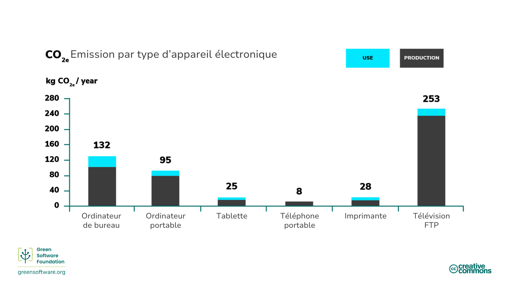
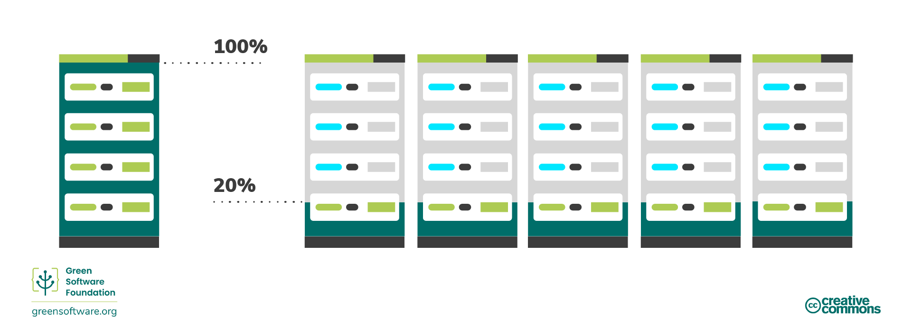
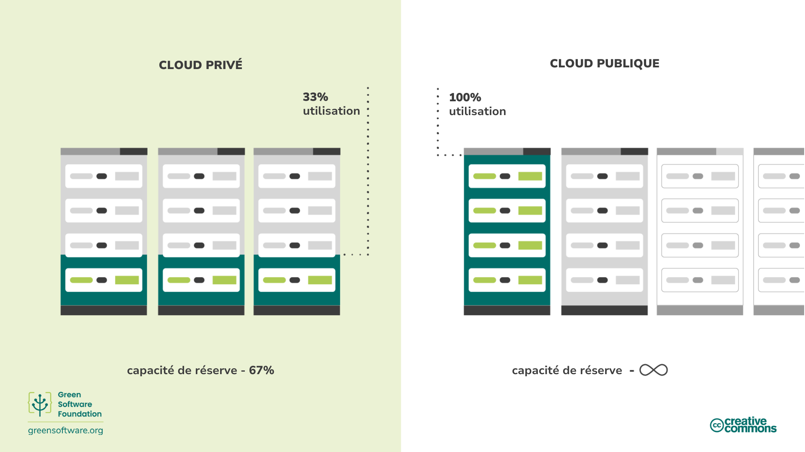

import Quiz from "/src/components/Quiz";

:::note
Il s’agit d’une traduction fournie par la communauté. Le support est limité et pourrait ne pas correspondre à la version anglaise la plus récente du cours.
:::

:::tip Principe

_Utiliser le moins de carbone incorporé possible._

:::

## Introduction

Le matériel utilisé dans le processus de création de votre logiciel est un élément important à considérer pour un professionnel du logiciel durable.

Vous verrez comment le carbone incorporé a un coût caché quand il s’agit de matériel et les différentes mesures que vous pouvez prendre pour réduire l’impact que la création, la destruction et le fonctionnement de ce matériel implique. Par exemple, étendre sa durée de vie ou passer à des serveurs dans le cloud.

## Concepts clés

### Carbone incorporé

L’appareil que vous utilisez pour lire ce document a produit du carbone lors de sa fabrication et, une fois qu’il aura atteint sa fin de vie, son élimination en libérera plus encore. Le carbone incorporé est la quantité de pollution carbone émise lors de la création et l’élimination d’un appareil.

Lors du calcul de la pollution totale en carbone pour les ordinateurs exécutant un logiciel, il faut tenir compte à la fois de la pollution associée à l’utilisation mais aussi à celle liée au carbone incorporé de cet ordinateur.

Le carbone incorporé varie considérablement entre les appareils des utilisateurs finaux. Pour certains appareils, le carbone émis pendant la fabrication est beaucoup plus élevé que celui émis pendant l’utilisation, comme l’illustre une [étude](https://www.ifi.uzh.ch/dam/jcr:fa4e956e-7a53-4038-98a5-00e09e2f4303/Study_Digitalization_Climate_Protection_Summary_Oct2017.pdf) de l’Université de Zurich. Par conséquent, le coût du carbone incorporé d'un appareil peut être parfois beaucoup plus élevé que le coût du carbone de l’électricité utilisée pour l’alimenter.

En terme de carbone incorporé, tout appareil, même celui qui ne consomme pas d’électricité, est responsable de l'émission de carbone au cours de sa durée de vie.

### Amortissement

Une façon de tenir compte du carbone incorporé est d’amortir le carbone sur la durée de vie prévue d’un appareil. Par exemple, supposons qu’il ait fallu 4000kg de CO2eq pour construire un serveur, et nous nous attendons à ce qu’il dure quatre ans. L’amortissement signifie que nous pouvons dire que le serveur émet 1000 kg CO2eq/an.

## Comment améliorer l’efficacité du matériel

Si l’on tient compte du carbone incorporé, il est clair que lorsque nous achetons un ordinateur, il a déjà émit une bonne quantité de carbone. Les ordinateurs ont également une durée de vie limitée, ce qui signifie qu’ils sont éventuellement incapables de gérer les charges de travail récentes et doivent être remplacés. En d'autres termes, le matériel est un substitut pour le carbone, et puisque notre objectif est d’être efficace sur le plan du carbone, nous devons également être efficaces sur au niveau du matériel.

Il existe deux approches principales pour l’efficacité du matériel:

- Pour les appareils des utilisateurs finaux, il s’agit de **prolonger la durée de vie** du matériel.
- Pour le cloud computing, il s’agit **d’augmenter l’utilisation** du matériel.

### Prolonger la durée de vie du matériel

Dans l’exemple que nous avons vu précédemment, si nous pouvons ajouter juste une année de plus à la durée de vie de notre serveur, alors le carbone amorti tombe de 1000kg CO2eq/an à 800kg CO2eq/an.

Le matériel est retiré lorsqu’il tombe en panne ou a du mal à gérer les charges de travail modernes. Bien sûr, le matériel finira toujours par tomber en panne, mais en tant que développeurs, nous pouvons utiliser des logiciels pour créer des applications qui fonctionnent sur du matériel plus ancien et prolonger leur durée de vie.

### Augmenter l’utilisation des appareils

Dans le cloud, l’efficacité du matériel se traduit le plus souvent par une augmentation de l’utilisation des serveurs. Il est préférable d’utiliser un serveur à 100% d’utilisation que 5 serveurs à 20% d’utilisation en raison du coût du carbone incorporé. De la même manière que posséder une voiture et l’utiliser tous les jours de la semaine est préférable à en posséder cinq et en utiliser une différente chaque jour de la semaine, il est beaucoup plus efficace d’utiliser les serveurs à leur pleine capacité plutôt que d’en employer plusieurs à une capacité moindre. Bien que les émissions soient les mêmes, le carbone incorporé utilisé est beaucoup plus faible.

La raison la plus courante d’avoir des serveurs sous-utilisés est la prise en compte des pics d'utilisation. L’exécution de serveurs à 20 % signifie que vous savez que vous serez en mesure de gérer les pics de demande sans affecter les performances. Cependant, entre-temps, toutes ces capacités inutilisées représentent le gaspillage de carbone incorporé. Être efficace sur le plan matériel signifie s’assurer que chaque périphérique matériel est utilisé le plus longtemps possible.

C’est l’un des principaux avantages du cloud public; vous savez que lorsque vous devez prendre de l’expansion, les ressources seront là pour prendre le relais. Avec plusieurs organisations partageant le même cloud public, la capacité en réserve peut toujours être mise à la disposition de quiconque en a besoin, de sorte qu’aucun serveur ne reste inactif.

Il est important de noter que le simple déplacement des opérations vers le cloud public ne réduira pas automatiquement vos émissions. Il vous donne simplement les ressources pour pouvoir ré-architecturer votre logiciel afin qu’une réduction soit possible.

## Synthèse

- Le carbone incorporé est la quantité de pollution au carbone émise lors de la création et l’élimination d’un appareil.
- Lorsque vous calculez votre pollution totale en carbone, vous devez tenir compte à la fois de ce qui est émis lors de l’utilisation de l’ordinateur et aussi du carbone incorporé associé à sa création et à son élimination.
- L’allongement de la durée de vie d’un appareil a pour effet d’amortir le carbone émis afin de réduire son CO2eq/an.
- Le cloud computing est plus économe en énergie qu’un serveur sur site car il permet le décalage ainsi que l'adaptation de la demande.

## Quiz

<Quiz
  QuizList={[
    {
      question: "Qu'est-ce que le carbone incorporé?",
      answers: [
        {
          text: "Le carbone qui a été émis lors de la création d’un appareil",
          isCorrect: false,
        },
        {
          text: "Les émissions de carbone associées à la création et à l’élimination d’un appareil",
          isCorrect: true,
        },
        {
          text: "Les émissions de carbone associées à l’élimination d’un appareil",
          isCorrect: false,
        },
      ],
    },
    {
      question: "Qu’est-ce qui compte pour la pollution carbone totale d’un ordinateur?",
      answers: [
        {
          text: "Le carbone incorporé de l'appareil",
          isCorrect: false,
        },
        {
          text: "Les émissions produites par l'utilisation de l'appareil",
          isCorrect: false,
        },
        {
          text: "Les deux réponses ci-dessus",
          isCorrect: true,
        },
      ],
    },
    {
      question:
        "Quelles sont les deux principales façons d’être plus efficace avec le matériel?",
      answers: [
        {
          text: "Prolonger sa durée de vie et réduire son utilisation",
          isCorrect: false,
        },
        {
          text: "Prolonger sa durée de vie et augmenter son utilisation",
          isCorrect: true,
        },
        {
          text: "Réduire sa durée de vie et augmenter son utilisation",
          isCorrect: false,
        },
      ],
    },
    {
      question:
        "Comment l’efficacité du matériel affecte-t-elle la pollution carbone d’un appareil?",
      answers: [
        {
          text: "Il l'élimine",
          isCorrect: false,
        },
        {
          text: "Il l'accroit",
          isCorrect: false,
        },
        {
          text: "Il la réduit",
          isCorrect: true,
        },
      ],
    },
    {
      question:
        "Quel est le carbone amorti d’un appareil avec un carbone incorporé de 1000kg CO2eq et une durée de vie de 5 ans?",
      answers: [
        {
          text: "200kg CO2eq/an",
          isCorrect: true,
        },
        {
          text: "20kg CO2eq/an",
          isCorrect: false,
        },
        {
          text: "200kg CO2eq",
          isCorrect: false,
        },
      ],
    },
    {
      question:
        "Quelles sont les différences entre avoir vos serveurs sur un cloud public et un cloud privé?",
      answers: [
        {
          text: "Sur le cloud public, vous pouvez augmenter la charge rapidement",
          isCorrect: false,
        },
        {
          text: "Sur un cloud privé, vous devez disposer de serveurs fonctionnant en dessous de leur capacité afin de répondre aux pics de demande",
          isCorrect: false,
        },
        {
          text: "Les deux réponses ci-dessus",
          isCorrect: true,
        },
      ],
    },
    {
      question:
        "Pourquoi est-il si important d’inclure le carbone incorporé dans le calcul des émissions pour le matériel?",
      answers: [
        {
          text: "Le carbone incorporé représente parfois plus d’émissions carbone que celles associees à l’électricité alimentant l’appareil",
          isCorrect: true,
        },
        {
          text: "Le carbone incorporé représente une petite mais importante proportion des émissions globales d’un appareil",
          isCorrect: false,
        },
        {
          text: "Le carbone incorporé est la seule source d’émissions dont il faut tenir compte dans le calcul des émissions globales d’un appareil",
          isCorrect: false,
        },
      ],
    },
  ]}
/>
