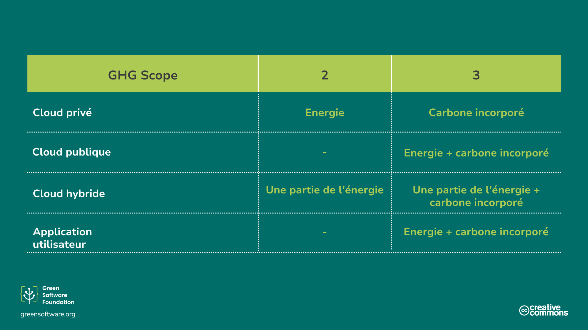
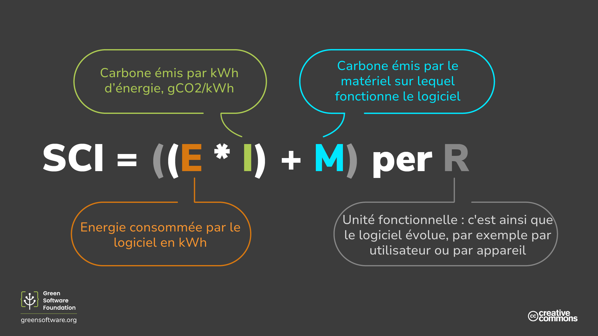

import Quiz from "/src/components/Quiz";

:::note
Il s’agit d’une traduction fournie par la communauté. Le support est limité et pourrait ne pas correspondre à la version anglaise la plus récente du cours.
:::

:::tip Principe

_Ce que vous ne pouvez pas mesurer, vous ne pouvez pas l’améliorer._

:::

## Introduction

Le protocole relatif aux gaz à effet de serre (GES) est la méthode la plus couramment utilisée par les organisations pour mesurer leurs émissions totales de carbone. Comprendre la portée des GES et la façon de mesurer votre logiciel par rapport aux normes de l’industrie vous aidera à voir dans quelle mesure vous appliquez les principes du logiciel durable et jusqu'où vous devez vous améliorer.

Pour compléter le protocole GES, vous pouvez également utiliser la spécification Intensité Carbone du Logiciel (Software Carbon Intensity - SCI). Bien que les GES soient une mesure plus générique qui convient à tous les types d’organisations, le SCI vise spécifiquement à mesurer un taux d’émissions des logiciels et est conçu pour encourager l’élimination de ces émissions.

Le GES est un protocole pour mesurer les émissions totales, le SCI est un outil pour permettre l’élimination des émissions genérées par un logiciel.

Nous examinerons chacune des méthodes de mesure et expliquerons comment calculer dans les deux cas.

## Le protocole GES

Le [protocole Gaz à effet de serre](https://ghgprotocol.org) est la norme de comptabilisation des gaz à effet de serre la plus utilisée et la plus reconnue à l’échelle internationale. [92%](https://ghgprotocol.org/about-us) des entreprises du classement Fortune 500 utilisent le protocole GES pour calculer et divulguer leurs émissions de carbone.

Le protocole GES divise les émissions en trois catégories:

- **Catégorie 1**: Les émissions directes provenant des **opérations** détenues ou contrôlées par l’organisation déclarante, comme la combustion de carburant sur place ou le parc de véhicules.
- **Catégorie 2**: Les émissions indirectes liées aux **émissions générées par l’énergie achetée**, comme le chauffage et l’électricité.
- **Catégorie 3**: Les autres émissions indirectes provenant de toutes les autres activités auxquelles vous participez. Y compris toutes les **émissions de la chaîne d’approvisionnement d’une organisation; ** les voyages d’affaires pour les employés et l’électricité que les clients peuvent consommer lorsqu’ils utilisent votre produit.

La catégorie 3, parfois appelée émissions de la chaîne de valeur, est la source d’émissions la plus importante et la plus complexe à calculer pour de nombreuses organisations. Ceux-ci englobent l’ensemble des activités nécessaires à la création d’un produit ou d’un service, de la conception à la distribution. Dans le cas d’un ordinateur portable, par exemple, chaque matière première utilisée dans sa production émet du carbone lors de son extraction et de son traitement. Les émissions de la chaîne de valeur comprennent également les émissions provenant de l’utilisation de l’ordinateur portable, c’est-à-dire les émissions provenant de l’énergie utilisée pour alimenter l’ordinateur portable après sa vente à un client.

Grâce à cette approche, il est possible de résumer toutes les émissions de GES de chaque organisation et de chaque personne dans le monde et d’atteindre un total mondial.

### Dans quelle catégorie ou champ d'application se classe mon application?

Nous avons déjà vu comment le protocole GES nous demande de répartir les émissions du logiciel selon les catégories 1 à 3. Mais comment cela fonctionne-t-il lorsqu’il s’agit de logiciels?

La plupart des organisations ont de nombreuses applications fonctionnant avec différentes architectures et dans différents environnements. À ce titre, la portée de vos émissions, tant en terme d’énergie générée que de carbone incorporé, dépend de votre propre scénario.

- **Pour les applications du cloud exécutées sur des serveurs que vous possédez**, la consommation d’énergie de votre logiciel entre dans la catégorie 2, et le carbone incorporé de tous vos serveurs entre dans la catégorie 3.
- **Pour les applications du cloud exécutées sur un cloud public**, la consommation d’énergie de votre application et le carbone incorporé entrent dans la catégorie 3.
- Dans les scénarios où **vous exécutez une application dans un cloud hybride privé/public**, une partie de ses émissions relèvera de la catégorie 2 et une autre de la catégorie 3.
- De même, pour votre **application utilisée directement par le client**, la consommation d’énergie fait partie du champ d’application 3 de votre organisation, puisque votre client achètera l’énergie nécessaire pour alimenter son appareil.

Pour les logiciels, peu importe qu’ils soient exécutés sur une infrastructure que vous possédez, louez ou que les consommateurs possèdent, il y a trois paramètres à prendre en compte pour la répartition des émissions:

- Combien d’énergie il consomme
- Quelle est la teneru en carbone de l'électricité
- Quelle est la quantité de matériel dont il a besoin pour fonctionner

### Est-il possible de calculer un total des émissions de carbone des logiciels?

Pour calculer le total des émissions de carbone des logiciels, vous devez avoir accès à des données détaillées concernant la consommation d’énergie, l’intensité carbone et le matériel sur lequel tourne votre logiciel. Il est difficile de recueillir ces données, même dans le cas des logiciels non open source d’une organisation, où ils peuvent suivre son utilisation avec la télémétrie ou les journaux d'événements.

Les mainteneurs de logiciels open source n’ont pas la même visibilité sur comment et où leurs logiciels sont utilisés, combien d’énergie est consommée et sur quel type de matériel.

Les projets open source ont généralement plusieurs contributeurs issus de diverses organisations. Par conséquent, il n’est pas clair de savoir qui devrait être responsable du calcul des émissions et qui est redevable pour leur élimination. Si l’on considère également que les logiciels libres constituent 90% d’un catalogue typique des entreprises, il est clair qu’il y aura une grande quantité d’émissions de carbone qui ne seront pas prises en compte.

###  Les totaux racontent-ils toute l’histoire?

Un total n’est qu’une mesure qui décrit l’état de quelque chose. Pour prendre les bonnes décisions, il faut examiner de nombreuses mesures différentes.

Imaginez un scénario où vous êtes le leader d’une organisation et chargé de réduire les émissions de votre logiciel. Vous mesurez les émissions au premier trimestre et vous obtenez un total de 34 tonnes. Après avoir fait quelques investissements dans des projets qui éliminent les émissions, vous constatez que pour le deuxième trimestre, les émissions sont passées à 45 tonnes. Cela signifie-t-il que vos efforts ont été vains?

Pas nécessairement. Nous savons qu’un total en soi ne dit pas tout et nous devons examiner d’autres paramètres pour déterminer si un projet de réduction des émissions a été couronné de succès. Par exemple, si vous mesuriez l’intensité carbone ainsi que le total de carbone, vous pourriez avoir une perspective différente. Dans le même projet, si l’intensité carbone était de 3,3 g CO2eq/utilisateur au premier trimestre et de 2,9 g CO2eq/utilisateur au deuxième trimestre, vous pourriez considérer le projet comme un succès et continuer à investir davantage.

Bien que le total vous ait informé que les émissions de carbone de votre organisation avaient augmenté dans l’ensemble, l’intensité a donné une vision plus complète qui vous aidera à prendre une décision plus éclairée sur la façon de procéder.

## Spécification de l’intensité carbone du logiciel

La [spécification de l’intensité carbone du logiciel (SCI en Anglais pour "Software Carbone Intensity")](https://grnsft.org/sci) est une méthodologie élaborée par le groupe de travail sur les normes de la Green Software Foundation, conçue pour évaluer une application logicielle dans une vision de durabilité et pour encourager l’action visant à éliminer les émissions.

Ce n’est pas un remplacement du protocole GES, mais une mesure supplémentaire qui aide les équipes logicielles à comprendre comment leur logiciel se comporte en termes d’émissions de carbone afin qu’elles puissent prendre des décisions plus éclairées. Bien que le protocole de GES calcule les **émissions totales**, le SCI consiste à calculer le **taux d’émissions**. Si on fait le rapprochement avec l’automobile, le SCI ressemble davantage à une mesure de kilomètre par litre et le protocole GES ressemble davantage à l’empreinte carbone totale d’un constructeur automobile et de toutes les voitures qu’il produit chaque année.

Au lieu de catégoriser les émissions de carbone des logiciels dans les catégories 1 à 3, il les catégorise dans des **émissions opérationnelles** (émissions de carbone provenant de l’exécution du logiciel) et des **émissions induites** (émissions de carbone provenant des ressources physiques requises pour exécuter le logiciel). C’est aussi un taux plutôt qu’un total, ce qui est plus inclusif des logiciels open-source.

Une chose importante à noter est qu’il n’est pas possible de réduire votre score SCI en achetant des compensations sous forme de neutralisations, d'indemnisations, ou en compensant l’électricité sous forme de crédits d’énergie renouvelable. Cela signifie qu’une organisation qui ne fait aucun effort pour réduire ses émissions mais dépense simplement de l’argent pour des crédits de carbone ne peut pas atteindre un bon score SCI.

Les compensations sont une composante essentielle de toute stratégie climatique; cependant, les compensations ne sont pas des éliminations et ne sont donc pas incluses dans la mesure SCI.

Si vous rendez votre application plus **efficace d'un point de vue énergétique et pour l'utilisation du matériel**, ou **consciente du carbone émis**, votre score SCI diminuera. La seule façon de réduire votre score SCI est d’investir du temps ou des ressources dans l’un de ces trois principes. Ainsi, l’adoption du SCI comme mesure pour votre application logicielle avec le protocole des GES stimulera l’investissement dans l’un des trois piliers du logiciel durable.

### L'équation du SCI

Le SCI est une méthode de notation de toute application logicielle, non limitée au cloud ou aux applications des utilisateurs finaux, mais à tous les types d’applications intermédiaires. Il fournit un langage commun pour décrire comment les logiciels se comportent en terme d'émissions carbone et comment un changement proposé pourrait éliminer certaines d’entre elles.

L’équation pour calculer un score SCI est élégamment simple, ce qui signifie qu’elle peut être appliquée dans un certain nombre de scénarios différents.

`SCI = ((E *I) + M) per R`

`E` = Énergie consommée par un système logiciel
`I` = Émissions marginales de carbone basées sur la localisation*
`M` = Émissions induites d’un système logiciel.*
`R` = Unité fonctionnelle (par ex. carbone par utilisateur supplémentaire, appel API, travail ML, etc.)

Ceci peut se résumer en:

`SCI = C par R` (Carbon par `R`)

`R` est la caractéristique fondamentale du SCI et la transforme en taux plutôt qu’en total. C’est ce que nous appelons une unité _fonctionnelle_.

## Comment calculer votre score SCI

Suivez ces quatre étapes pour calculer votre score SCI.

1. Décidez ce qu’il faut inclure

Quels composants logiciels inclure ou exclure dans le score SCI signifie définir les limites de votre logiciel; où il commence et où il se termine.

Pour chaque composant logiciel que vous incluez, vous devrez mesurer son impact. Pour chaque composant majeur que vous excluez, vous devez expliquer pourquoi.

À l’heure actuelle, la spécification SCI ne comporte aucune exigence quant à ce qu’il faut inclure ou non. Cependant, vous devez inclure toutes les infrastructures et tous les systèmes qui contribuent de manière significative au fonctionnement du logiciel.

Votre score SCI pourrait diminuer parce que vous avez resserré les limites de votre logiciel et exclu plus de composants logiciels. Inversement, votre score SCI peut augmenter parce que vous incluez des composants logiciels que vous aviez précédemment exclus. Par conséquent, lorsque vous déclarez votre score SCI, en particulier toute amélioration du score, il est essentiel de divulguer la limite de votre logiciel.

2. Choisissez votre unité fonctionnelle

Comme nous l’avons vu, le SCI est une intensité plutôt qu’un total et mesure l’intensité des émissions selon l’unité fonctionnelle choisie. La spécification ne prescrit pas actuellement l’unité fonctionnelle et vous êtes libre de choisir celle qui décrit le mieux la façon dont votre application évolue. Par exemple, si votre application évolue en fonction du nombre d’utilisateurs, choisissez les utilisateurs comme unité fonctionnelle.

Les itérations futures du SCI pourraient prescrire des unités fonctionnelles spécifiques pour différents types d’applications afin de faciliter la comparabilité. Par exemple, nous pourrions demander aux applications de streaming de choisir les minutes comme unité fonctionnelle afin de normaliser la mesure pour toutes les applications de streaming.

3. Décidez comment mesurer vos émissions

Vous avez maintenant une liste des composants logiciels que vous souhaitez mesurer et de l’unité fonctionnelle que vous utiliserez pour les mesurer. L’étape suivante consiste à déterminer comment quantifier les émissions de chaque composant logiciel.

Il existe deux méthodes de quantification: la mesure et le calcul.

- **La mesure** consiste a utiliser des compteurs d’une certaine forme. Par exemple, mesurez la consommation d’énergie de votre composant logiciel en utilisant un périphérique matériel dans la prise murale. Si vous pouvez compter directement vos unités, vous devriez utiliser l’approche de mesure.
- **Le calcul** implique un comptage indirect, souvent à l’aide d’un quelconque modèle. Par exemple, si vous ne pouvez pas mesurer directement la consommation d’énergie de votre application mais disposez d’un modèle qui estime la consommation d’énergie en fonction de l’utilisation du processeur, cela est considéré comme un calcul plutôt qu’une mesure.

Ces ressources peuvent vous aider à décider des méthodes de mesure et de calcul:

- Consultez le projet [Software Carbon Intensity Guide](https://sci-guide.greensoftware.foundation/). Ce projet est chargé de fournir des conseils sur la façon de quantifier les émissions de différents composants logiciels.

4. Quantifier

Maintenant, vous êtes prêt à passer à l'action. En utilisant la méthodologie décrite dans les étapes précédentes, commencez à quantifier le score SCI pour chaque composant logiciel dans votre limite. Le score SCI total de votre application logicielle est la combinaison du score des différents composants.

Vous pouvez calculer plusieurs scores SCI pour la même application. Le score SCI est une information utile pour comprendre comment votre application se comporte par rapport aux émissions de carbone dans différents scénarios. Par exemple, une application de diffusion en continu pourrait choisir le carbone par minute comme mesure, ou calculer le carbone par utilisateur par jour. La mesure du carbone par dollar de revenu pourrait donner une autre dimension utile.

## Synthèse

- Le protocole GES est une mesure pour mesurer les émissions totales de carbone d’une organisation et est utilisé par des organisations du monde entier.
- Le protocole GES place les émissions de carbone dans trois catégories. Le champ d’application 3, aussi connu sous le nom d’émissions de la chaîne de valeur, fait référence aux émissions des organisations qui approvisionnent les autres dans une chaîne. De cette façon, les champs d’application 1 et 2 d’une organisation se résument au champ d’application 3 d’une autre organisation.
- Le calcul des émissions générées par le logiciel à l’aide du protocole GES est possible, mais peut être difficile pour les logiciels libres.
- Le SCI est une mesure conçue spécifiquement pour calculer les émissions du logiciel et est un taux plutôt qu’un total.
- L’unité fonctionnelle de mesure n’est pas prescrite dans le SCI et vous devez choisir quelque chose qui reflète votre application.

## Quiz

<Quiz
  QuizList={[
    {
      question:
        "Comment le protocole sur les gaz à effet de serre nous demande-t-il de mesurer les émissions?",
      answers: [
        {
          text: "En divisant les émissions en trois champs d'application",
          isCorrect: true,
        },
        {
          text: "En divisant les émissions en carbone incorporé et en émissions quotidiennes",
          isCorrect: false,
        },
        {
          text: "En divisant les émissions des applications exécutées sur le cloud public et le cloud privé",
          isCorrect: false,
        },
      ],
    },
    {
      question:
        "Laquelle des trois catégories utilisées dans le protocole sur les GES est aussi appelée ‘émissions de la chaîne de valeur‘?",
      answers: [
        {
          text: "1",
          isCorrect: false,
        },
        {
          text: "2",
          isCorrect: false,
        },
        {
          text: "3",
          isCorrect: true,
        },
        {
          text: "1 et 2",
          isCorrect: false,
        },
        {
          text: "Toutes les réponses ci-dessus",
          isCorrect: false,
        },
      ],
    },
    {
      question:
        "Si vous êtes une application cloud, dans quelle catégorie de GES votre consommation d’énergie se situe-t-elle?",
      answers: [
        {
          text: "Catégories 2 et 3",
          isCorrect: false,
        },
        {
          text: "Catégorie 2",
          isCorrect: false,
        },
        {
          text: "Catégorie 3",
          isCorrect: false,
        },
        {
          text: "Cela dépend si c’est public, privé ou hybride",
          isCorrect: true,
        },
      ],
    },
    {
      question:
        "Lequel des scénarios suivants est le plus difficile à mesurer en utilisant le protocole GES?",
      answers: [
        {
          text: "Logiciel propriétaire",
          isCorrect: false,
        },
        {
          text: "Logiciel libre",
          isCorrect: true,
        },
        {
          text: "Les deux réponses ci-dessus",
          isCorrect: false,
        },
      ],
    },
    {
      question: "Que signifie l’acronyme SCI?",
      answers: [
        {
          text: "Software Carbon Index",
          isCorrect: false,
        },
        {
          text: "Software Carbon Intensity",
          isCorrect: true,
        },
        {
          text: "Specific Carbon Intensity",
          isCorrect: false,
        },
      ],
    },
    {
      question: "Qu'est-ce que ((E*I) + M) représente dans l'équation SCI?",
      answers: [
        {
          text: "Le carbone",
          isCorrect: true,
        },
        {
          text: "L'énergie",
          isCorrect: false,
        },
        {
          text: "L'intensité carbone",
          isCorrect: false,
        },
      ],
    },
    {
      question: "Qu'est-ce que le ‘R’ représente dans l'équation SCI?",
      answers: [
        {
          text: "La répétition",
          isCorrect: false,
        },
        {
          text: "Le taux",
          isCorrect: false,
        },
        {
          text: "Une unité fonctionnelle",
          isCorrect: true,
        },
      ],
    },
    {
      question:
        "Quelles sont les principales choses à considérer avant de calculer votre score SCI?",
      answers: [
        {
          text: "Ce qu’il faut inclure et l’unité fonctionnelle que vous utiliserez",
          isCorrect: false,
        },
        {
          text: "Ce qu’il faut inclure, l’unité fonctionnelle que vous utiliserez et la méthode de quantification",
          isCorrect: true,
        },
        {
          text: "Ce qu’il faut inclure, l’unité fonctionnelle que vous utiliserez, la méthode de quantification et le score de GES",
          isCorrect: false,
        },
      ],
    },
  ]}
/>
