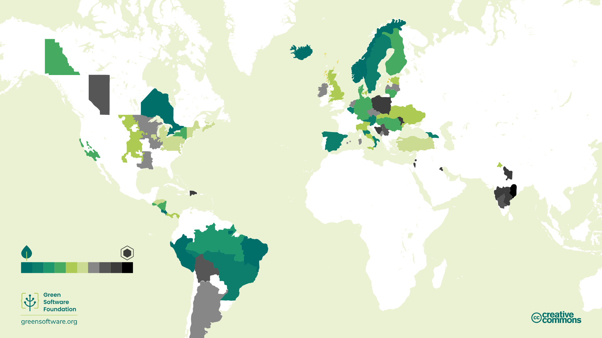
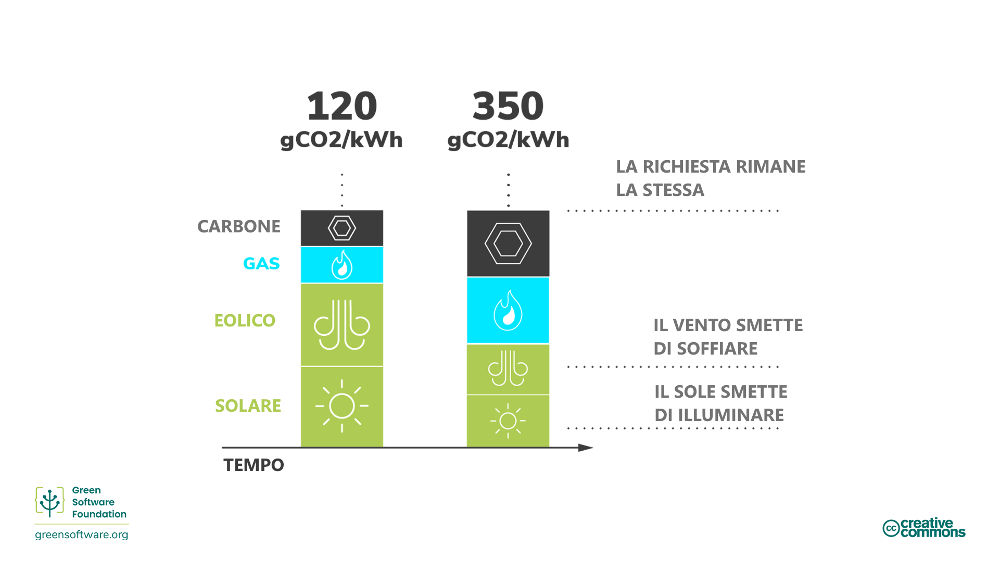
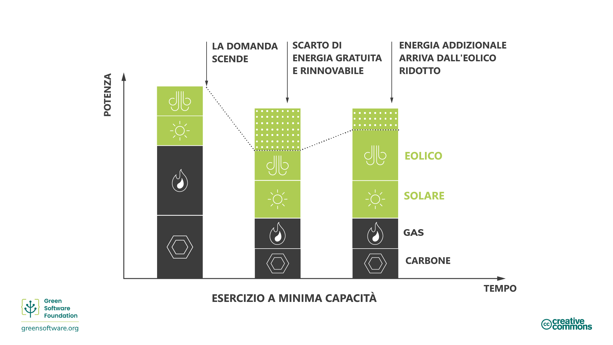
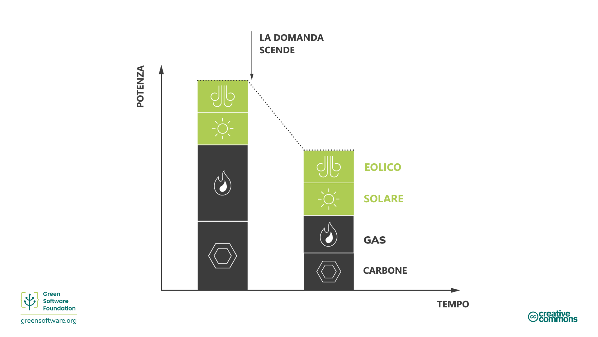
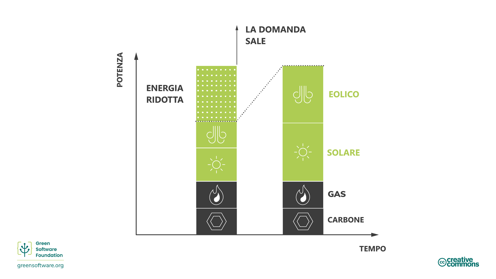
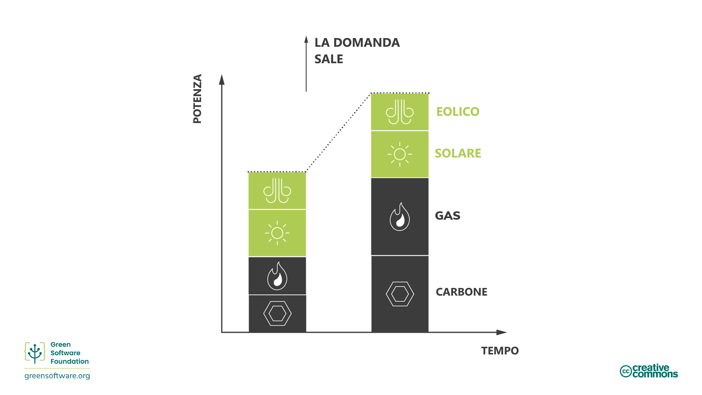
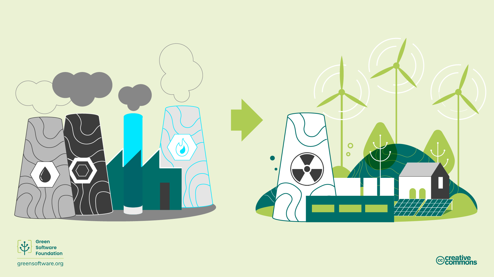
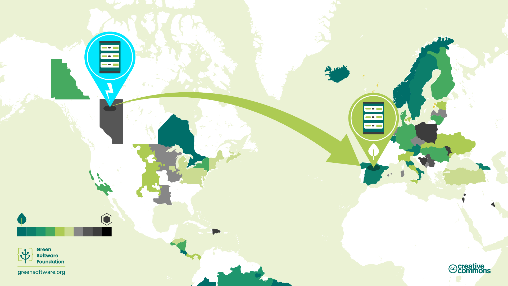
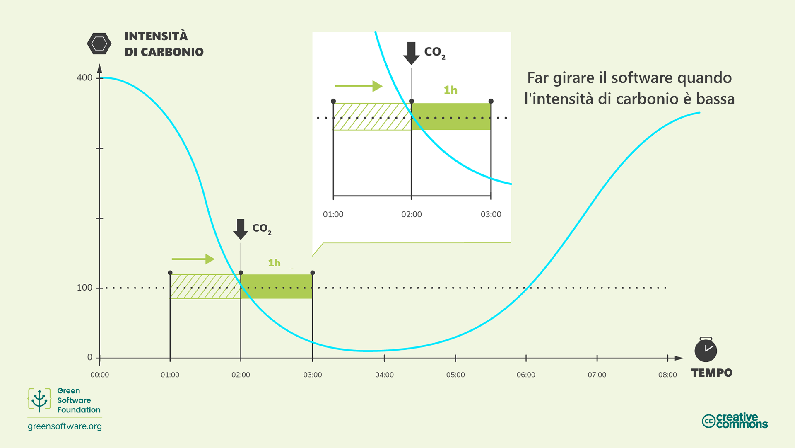
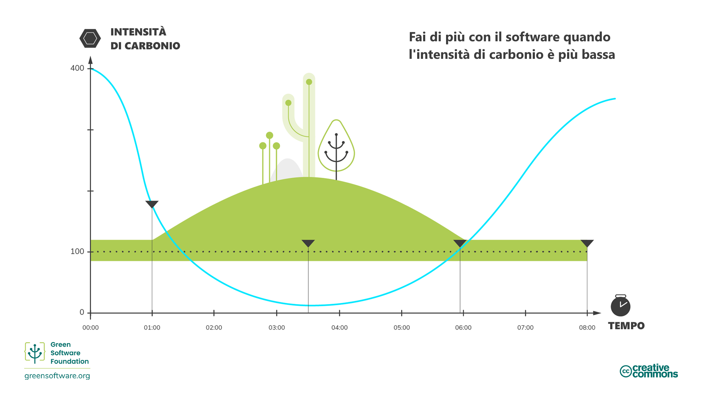

import Quiz from "/src/components/Quiz";

# Consapevolezza del carbonio

:::tip Principio

_Fare di più quando l'elettricità è più pulita e fare di meno quando l'elettricità è più sporca._

:::

## Introduzione

Non tutta l'elettricità viene prodotta nello stesso modo. In luoghi e tempi diversi, l'elettricità viene generata utilizzando una varietà di fonti con emissioni di carbonio variabili. Alcune fonti, come l'eolico, il solare o l'idroelettrico, sono fonti pulite e rinnovabili che emettono poche emissioni di carbonio. D'altro canto, le fonti di combustibili fossili emettono carbonio in misura variabile per produrre elettricità. Ad esempio, sia il gas che il carbone emettono più carbonio delle fonti rinnovabili, ma le centrali elettriche a gas emettono meno carbonio di quelle a carbone.

La consapevolezza del carbonio è l'idea di fare di più quando più energia proviene da fonti a basso contenuto di carbonio e di fare di meno quando più energia proviene da fonti ad alto contenuto di carbonio.

## Concetti chiave

### Intensità di carbonio (CI)

L'intensità di carbonio misura la quantità di carbonio (CO2e) emessa per ogni chilowattora (KWh) di elettricità consumata. L'unità standard dell'intensità di carbonio è gCO2eq/kWh, ovvero grammi di carbonio per kilowattora.

Se il vostro computer fosse collegato direttamente a un parco eolico, la sua elettricità avrebbe un'intensità di carbonio pari a 0 gCO2eq/kWh, poiché un parco eolico non emette carbonio per produrre quell'elettricità. Tuttavia, la maggior parte delle persone non può collegarsi direttamente a parchi eolici, ma si collega a reti elettriche alimentate con elettricità proveniente da varie fonti.

Una volta in rete, non è possibile controllare quali fonti forniscono l'elettricità che si sta utilizzando; si ottiene semplicemente un mix di tutto. Pertanto, l'intensità di carbonio sarà un mix di tutte le fonti di energia presenti in una rete, sia quelle a bassa emissione di carbonio che quelle a più alta emissione.

### Variabilità dell'intensità di carbonio

L'intensità di carbonio varia a seconda della località, poiché alcune regioni hanno un mix energetico che contiene più fonti di energia pulita di altre.

L'intensità di carbonio cambia anche nel tempo a causa della variabilità intrinseca dell'energia rinnovabile dovuta all'imprevedibilità delle condizioni meteorologiche. Ad esempio, quando è nuvoloso o non soffia il vento, l'intensità di carbonio aumenta perché una parte maggiore dell'elettricità nel vostro mix proviene da fonti che emettono carbonio.

### Dispacciabilità e decurtazione (curtailment)

La domanda di elettricità varia durante il giorno e l'offerta deve sempre essere in grado di soddisfare tale domanda. Un brownout (un calo del livello di tensione della linea elettrica) si verifica se un'azienda elettrica non produce abbastanza elettricità per soddisfare la domanda. Al contrario, se un'azienda elettrica produce più elettricità del necessario, per evitare che le infrastrutture si brucino, gli interruttori scattano e si verifica un blackout.

È necessario che vi sia sempre un equilibrio tra la domanda e l'offerta di energia elettrica e la responsabilità di ciò ricade solitamente sul fornitore di servizi.

Nel caso dei combustibili fossili, come il carbone, è più facile controllare l'energia prodotta per questa fornitura; questo è chiamato **dispacciamento**. Tuttavia, nel caso di fonti di energia rinnovabili come i parchi eolici, la potenza prodotta non può essere facilmente controllata (non possiamo controllare quanto soffia il vento). Se la fonte di energia produce più elettricità di quanta ne sia necessaria, quell'elettricità viene buttata via; questo si chiama **curtailment**.

### Intensità marginale di carbonio

Se improvvisamente si ha bisogno di accedere a una maggiore quantità di energia, ad esempio per accendere una luce, l'energia proviene dalla centrale elettrica marginale. La centrale elettrica marginale è dispacciabile, il che significa che le centrali elettriche marginali sono spesso alimentate da combustibili fossili.

L'intensità di carbonio marginale è l'intensità di carbonio della centrale elettrica che dovrebbe essere impiegata per soddisfare una nuova domanda.

Le centrali elettriche a combustibili fossili raramente scalano fino a 0. Hanno una soglia minima di funzionamento e alcune non scalano; sono considerate un carico di base costante e sempre attivo. Per questo motivo, a volte si verifica uno scenario in cui si riduce (si butta via) l'energia rinnovabile mentre si continua a consumare energia dalle centrali a combustibili fossili.

In queste situazioni, l'intensità marginale di carbonio sarà pari a 0 gCO2eq/kWh, poiché sappiamo che qualsiasi nuova domanda corrisponderà all'energia rinnovabile che stiamo riducendo.

### Mercati dell'energia

Il modello di mercato esatto varia in tutto il mondo, ma in linea di massima segue lo stesso modello.

Quando la domanda di elettricità diminuisce, le società di servizi devono **ridurre** l'offerta per bilanciare la domanda e l'offerta. Possono farlo in due modi:

1. **Acquistare meno energia dalle centrali a combustibili fossili.**

L'energia proveniente dalle centrali a combustibili fossili è di solito la più costosa, quindi è il metodo preferito. Ciò si traduce direttamente in un minor consumo di combustibili fossili.

2. **Acquistare meno energia da fonti rinnovabili**.
Le fonti rinnovabili sono le più economiche, quindi preferiscono non farlo. Se una fonte rinnovabile non riesce a vendere tutta la sua elettricità, deve buttare via il resto.

Ridurre la quantità di elettricità consumata nelle vostre applicazioni può contribuire a diminuire l'intensità di carbonio dell'energia, dato che la prima cosa da ridurre sono i combustibili fossili.

Quando la domanda di elettricità aumenta, le società di servizi devono aumentare l'offerta per bilanciare la domanda e l'offerta. Possono farlo in due modi:

1. **Acquistare più energia da fonti rinnovabili che al momento vengono ridotte**.

Se si sta riducendo l'energia, significa che si dispone di energia in eccesso che potrebbe essere dispacciata. L'energia rinnovabile è già la più economica, quindi l'energia rinnovabile ridotta sarà la fonte di energia dispacciabile più economica. Gli impianti rinnovabili venderanno quindi l'energia che avrebbero dovuto ridurre.

2. **Acquistare più energia dalle centrali a combustibili fossili**.

I combustibili fossili sono intrinsecamente dispacciabili; possono aumentare rapidamente la produzione di energia bruciando di più. Tuttavia, il carbone costa, quindi questa è la soluzione meno preferita.

I mercati dell'energia sono tra i più complessi al mondo, quindi la spiegazione di cui sopra è una semplificazione. Ma ciò che è importante capire è che il nostro obiettivo è aumentare gli investimenti in fonti energetiche a bassa emissione di carbonio, come le energie rinnovabili, e diminuire quelli in fonti ad alta emissione di carbonio, come il carbone. Il modo migliore per garantire che il denaro fluisca nella giusta direzione è assicurarsi di utilizzare l'elettricità con la minore intensità di carbonio.

## Come essere più consapevoli delle emissioni di carbonio

:::tip

_Utilizzare l'elettricità quando l'intensità di carbonio è bassa è il modo migliore per garantire che gli investimenti vadano verso gli impianti a bassa emissione di carbonio e lontano dagli impianti ad alta emissione di carbonio._

:::

È in corso una trasformazione globale. In tutto il mondo, le reti elettriche stanno passando dalla combustione di combustibili fossili all'approvvigionamento di energia da fonti a bassa emissione di carbonio come l'energia eolica e solare. Questa è una delle nostre migliori speranze per raggiungere gli obiettivi di riduzione globale. Come professionisti del software verde, vediamo alcuni dei modi in cui possiamo contribuire ad accelerare questa transizione.

Il motore principale della transizione è l'economia, più che gli obiettivi di sostenibilità. Le energie rinnovabili sono vincenti perché sono meno costose e diventano sempre più accessibili nel tempo. Per accelerare la transizione, quindi, dobbiamo rendere più redditizi gli impianti a fonti rinnovabili e meno redditizi quelli a combustibili fossili. Il modo migliore per farlo è utilizzare più elettricità quando proviene da fonti a basso contenuto di carbonio come le rinnovabili e meno elettricità quando proviene da fonti a più alto contenuto di carbonio.

L'intensità di carbonio è minore quando l'energia proviene da fonti a basso contenuto di carbonio e maggiore quando proviene da fonti a più alto contenuto di carbonio.

### Slittamento della domanda

Essere consapevoli delle emissioni di carbonio significa rispondere alle variazioni dell'intensità di carbonio aumentando o diminuendo la propria domanda. Se il vostro lavoro vi permette di essere flessibili con i tempi e i luoghi di esecuzione dei carichi di lavoro, potete slittarlo di conseguenza, consumando elettricità quando l'intensità di carbonio è minore e sospendendo la produzione quando è maggiore. Ad esempio, addestrando un modello di Machine Learning in un momento o in una regione diversa con un'intensità di carbonio molto più bassa.

[Studi] (https://ieeexplore.ieee.org/document/6128960) dimostrano che queste azioni possono portare a una riduzione delle emissioni di carbonio dal 45% al 99%, a seconda del numero di energie rinnovabili che alimentano la rete.

Lo spostamento della domanda può essere ulteriormente suddiviso in slittamento spaziale e temporale.

#### Slittamento spaziale

Lo slittamento spaziale significa spostare i calcoli in un altro luogo fisico in cui l'intensità di carbonio attuale è inferiore. Potrebbe trattarsi di una regione che dispone naturalmente di fonti energetiche a più basso contenuto di carbonio. Ad esempio, spostarsi in emisferi diversi a seconda della stagione per avere più ore di luce solare.

#### Slittamento temporale

Se non è possibile spostare il calcolo spazialmente in un'altra regione, un'altra opzione è quella di spostarsi in un altro momento. Magari più tardi nel giorno o nella notte, quando c'è più sole o più vento e, quindi, l'intensità di carbonio è minore. Questo si chiama spostamento temporale della domanda. Grazie ai progressi delle previsioni meteorologiche, possiamo prevedere in modo ragionevole l'intensità di carbonio futura.

Alcune delle più grandi aziende tecnologiche hanno riconosciuto l'importanza della consapevolezza delle emissioni di carbonio e stanno utilizzando tecniche di modellazione avanzate per implementare il trasferimento della domanda.

- **Google Carbon Aware Data Centers** - Google ha lanciato un progetto per [rendere alcuni dei carichi di lavoro del cloud consapevoli delle emissioni di anidride carbonica](https://blog.google/outreach-initiatives/sustainability/carbon-aware-computing-location/). Ha creato modelli per prevedere l'intensità di carbonio e il carico di lavoro di domani. Hanno quindi modellato i carichi di lavoro su larga scala in modo che avvengano di più quando e dove l'intensità di carbonio è più bassa, ma in modo tale da poter comunque gestire il carico previsto.
- **Microsoft Carbon Aware Windows** - [Microsoft ha annunciato un progetto per rendere Windows 11 più sostenibile](https://www.techradar.com/news/windows-11-is-getting-an-eco-friendly-update-but-could-microsoft-do-more). Inizialmente, ciò significa eseguire gli aggiornamenti di Windows quando l'intensità di carbonio è minore.

### Modellamento della domanda

Il demand shifting è una strategia che consiste nello spostare i calcoli in regioni o momenti in cui l'intensità di carbonio è più bassa. Il demand shaping è una strategia simile. Tuttavia, invece di spostare la domanda in una regione o in un momento diverso, modelliamo i nostri calcoli in modo che corrispondano all'offerta esistente.

- Se l'intensità di carbonio è bassa, aumentate la domanda; fate di più nelle vostre applicazioni.
- Se l'intensità di carbonio è alta, diminuite la domanda; fate di meno nella applicazioni.

Il demand shaping per le applicazioni carbon-aware riguarda l'offerta di carbonio. Quando il costo del carbonio per l'esecuzione della vostra applicazione diventa elevato, modellate la domanda in modo che corrisponda all'offerta di carbonio. Questo può avvenire automaticamente, oppure l'utente può fare una scelta.

La modalità Eco è un esempio di spostamento della domanda. Le modalità Eco sono presenti negli elettrodomestici di uso quotidiano, come le automobili o le lavatrici. Quando vengono attivate, si sacrificano alcune prestazioni per consumare meno risorse (gas o elettricità). Poiché esiste un compromesso con le prestazioni, le modalità ecologiche sono sempre presentate all'utente come una scelta.

Anche le applicazioni software possono avere modalità ecologiche che possono, automaticamente o con il consenso dell'utente, prendere decisioni per ridurre le emissioni di carbonio.

Un esempio è il software per videoconferenze che regola automaticamente la qualità dello streaming. Invece di trasmettere sempre alla massima qualità possibile, riduce la qualità video per dare priorità all'audio quando la larghezza di banda è bassa.

Un altro esempio è il TCP/IP. La velocità di trasferimento aumenta in risposta alla quantità di dati trasmessi sul filo.

Un terzo esempio è il miglioramento progressivo del web. L'esperienza web migliora in base alle risorse e alla larghezza di banda disponibili sul dispositivo dell'utente finale.

Il demand shaping è legato a un concetto più ampio di sostenibilità, ovvero la riduzione dei consumi. Possiamo ottenere molto diventando più efficienti con le risorse, ma a un certo punto dobbiamo anche consumare meno.

Come professionisti del software verde, prenderemmo in considerazione dapprima l'annullamento di un processo quando l'intensità di carbonio è elevata invece di spostare la domanda, riducendo le richieste della nostra applicazione e le aspettative dei nostri utenti finali.

## Sintesi

- Essere consapevoli delle emissioni di carbonio significa capire che l'energia consumata non ha sempre lo stesso impatto in termini di intensità di carbonio.
- L'intensità di carbonio varia a seconda del momento e del luogo in cui viene consumata.
- La natura dei combustibili fossili e delle fonti di energia rinnovabili fa sì che il consumo di energia quando l'intensità di carbonio è bassa aumenti la domanda di fonti di energia rinnovabili e aumenti la percentuale di energia rinnovabile nell'offerta.
- Spostare la domanda significa spostare il consumo di energia in luoghi o momenti della giornata in cui l'intensità di carbonio è minore.
- Demand shaping significa adattare il consumo di energia alla variabilità dell'intensità di carbonio, in modo da consumare di più nei periodi di bassa intensità e di meno nei periodi di alta intensità.

## Quiz (in inglese)

<Quiz
  QuizList={[
    {
      question: "What is carbon intensity?",
      answers: [
        {
          text: "The amount of carbon produced using clean energy sources",
          isCorrect: false,
        },
        {
          text: "The amount of carbon produced per kilowatt hour",
          isCorrect: true,
        },
        { text: "0gCO2eq/kWh", isCorrect: false },
      ],
    },
    {
      question: "What is the standard unit of carbon intensity?",
      answers: [
        { text: "gCO2eq/kWh", isCorrect: false },
        { text: "gCO2e/kWh", isCorrect: false },
        { text: "Either of the above", isCorrect: true },
      ],
    },
    {
      question: "What two variables affect carbon intensity?",
      answers: [
        { text: "Location and time", isCorrect: true },
        { text: "Supply and demand", isCorrect: false },
        { text: "Time and demand", isCorrect: false },
      ],
    },
    {
      question:
        "Which of the following is not true about marginal power plants?",
      answers: [
        { text: "They are dispatchable", isCorrect: false },
        { text: "They usually burn fossil fuels", isCorrect: false },
        {
          text: "They are located in places where clean energy sources are not available",
          isCorrect: true,
        },
      ],
    },
    {
      question: "What is curtailment?",
      answers: [
        { text: "Surplus energy supply", isCorrect: false },
        {
          text: "Energy that is thrown away due to oversupply",
          isCorrect: true,
        },
        { text: "Reducing supply to match demand", isCorrect: false },
      ],
    },
    {
      question:
        "Which of the following is not an example of carbon aware computing?",
      answers: [
        {
          text: "Consuming more electricity when the carbon intensity is lower",
          isCorrect: false,
        },
        { text: "Switching to renewable energy", isCorrect: true },
        {
          text: "Pausing production when carbon intensity is higher",
          isCorrect: false,
        },
      ],
    },
    {
      question: "What are the two types of demand shifting?",
      answers: [
        { text: "Temporal and permanent", isCorrect: false },
        { text: "Spatial and temporal", isCorrect: true },
        { text: "Curtailment and dispatchability", isCorrect: false },
      ],
    },
    {
      question: "What is demand shaping?",
      answers: [
        {
          text: "Do more when carbon intensity is low, do less when carbon intensity is high",
          isCorrect: true,
        },
        {
          text: "Do more when carbon intensity is high, do less when carbon intensity is low",
          isCorrect: false,
        },
        {
          text: "Do more when costs are low, do less when costs are high",
          isCorrect: false,
        },
      ],
    },
    {
      question: "Which of the following is an example of carbon awareness?",
      answers: [
        {
          text: "Creating a piece of software that produces very low emissions",
          isCorrect: false,
        },
        {
          text: "Canceling a process when you know carbon intensity is high",
          isCorrect: true,
        },
        {
          text: "Using cloud servers instead of in-house servers",
          isCorrect: false,
        },
      ],
    },
  ]}
/>
