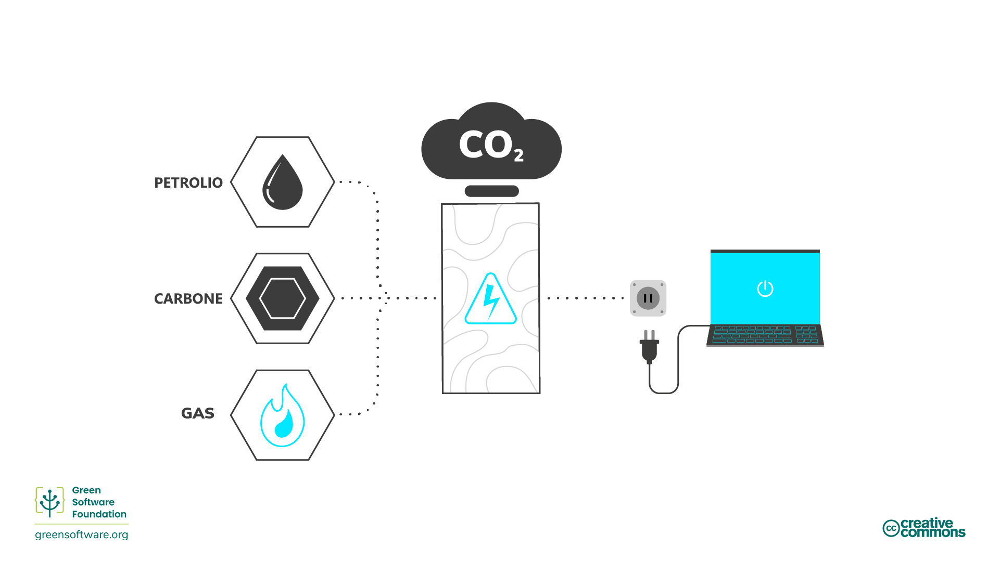

import Quiz from "/src/components/Quiz";

# Efficienza Energetica

:::tip Principio

_Utilizzare la minor quantità di energia possibile._

:::

## Introduzione

L'energia è la capacità di compiere lavoro. Esistono diverse forme di energia, come quella termica, elettrica e chimica, e un tipo di energia può essere convertito in un altro. Ad esempio, l'energia chimica del carbone viene convertita in energia elettrica. In altre parole, l'elettricità è energia secondaria convertita da un altro tipo di energia. In altre parole, l'elettricità è un'energia secondaria convertita da un altro tipo di energia.

Tutti i software, dalle applicazioni in esecuzione sui telefoni cellulari all'addestramento dei modelli di Machine Learning in esecuzione nei data center, consumano elettricità. Uno dei modi migliori per ridurre il consumo di elettricità e le conseguenti emissioni di carbonio prodotte dal software è quello di rendere le applicazioni più efficienti dal punto di vista energetico. Tuttavia, la nostra responsabilità non finisce qui.

Chi si occupa di software ecologico si assume la responsabilità dell'energia consumata dai propri prodotti e li progetta per consumarne il meno possibile. Dobbiamo assicurarci che, in ogni fase del processo, ci siano meno sprechi possibili e che la maggior parte dell'energia venga utilizzata per la fase successiva.

Il passo finale di questa catena è rappresentato dall'utente finale del prodotto, non dal prodotto finito stesso. Ciò significa che il nostro obiettivo non è semplicemente quello di realizzare il codice più efficiente dal punto di vista energetico o il software più "verde", ma di pensare all'utente finale e a come assicurarci che non crei emissioni inutili.

Ciò potrebbe significare raggruppare i lavori per sfruttare la distribuzione energetica o cambiare il modo in cui l'utente utilizza il software. Vediamo alcuni di questi concetti e alcuni modi per diventare più efficienti dal punto di vista energetico in ogni fase della catena, fino al consumatore finale.

## Concetti chiave

### Combustibili fossili e fonti di energia ad alto contenuto di carbonio

La maggior parte dell'elettricità viene prodotta bruciando combustibili fossili, [di solito carbone] (https://ourworldindata.org/grapher/world-electricity-by-source). I combustibili fossili sono prodotti dalla decomposizione di piante e animali. Questi combustibili si trovano nella crosta terrestre e contengono carbonio e idrogeno, che possono essere bruciati per ottenere energia. Il carbone, il petrolio e il gas naturale sono esempi di combustibili fossili.

La maggior parte delle persone pensa che l'elettricità sia pulita. Le nostre mani non si sporcano quando attacchiamo una spina al muro e i nostri computer portatili non hanno bisogno di tubi di scarico. Tuttavia, poiché la maggior parte dell'elettricità proviene dalla combustione di combustibili fossili e l'approvvigionamento energetico è la [singola causa più significativa](https://www.eea.europa.eu/data-and-maps/daviz/change-of-co2-eq-emissions-2#tab-chart_4) delle emissioni di carbonio; possiamo tracciare una linea diretta dall'elettricità alle emissioni di carbonio. In questi termini, l'elettricità può essere considerata una proxy del carbonio.

Se il nostro obiettivo è quello di essere efficienti dal punto di vista delle emissioni di carbonio, significa che il nostro obiettivo è anche quello di essere efficienti dal punto di vista energetico, dato che l'energia è un proxy del carbonio. Ciò significa utilizzare la minor quantità di energia possibile per unità di lavoro.

### Fonti di energia a basso contenuto di carbonio

L'energia pulita proviene da fonti rinnovabili a emissioni zero che non inquinano l'atmosfera quando vengono utilizzate e che consentono di risparmiare energia grazie a pratiche di efficienza energetica. Esistono sovrapposizioni tra energia pulita, verde e rinnovabile. Ecco come distinguerle:

- **Energia pulita** - non produce emissioni di carbonio, ad esempio il nucleare.
- **Energia verde** - proviene dalla natura
- **Energia rinnovabile** - le fonti non si esauriscono, come ad esempio l'energia solare ed eolica.

### Misura dell'energia

- L'energia si misura in joule (J), l'unità di misura dell'energia secondo il sistema internazionale [SI](https://it.wikipedia.org/wiki/Sistema_internazionale_di_unit%C3%A0_di_misura).
- La potenza si misura in watt, dove 1 watt (W) corrisponde a un joule al secondo.
- Un chilowatt (kW) è quindi anche un tasso corrispondente a 1000 joule al secondo.
- Un chilowattora (kWh) è una misura di energia (J) corrispondente a un chilowatt di potenza sostenuta per un'ora.

## Come migliorare l'efficienza energetica

Ora che sappiamo come viene prodotta l'energia e il costo associato in termini di emissioni, a seconda che si utilizzino fonti energetiche a basso o alto contenuto di carbonio, diamo un'occhiata ad alcuni modi in cui i professionisti del software verde possono migliorare l'efficienza energetica. Comprendere l'efficacia dell'utilizzo dell'energia e la proporzionalità energetica significa poter prendere decisioni migliori in termini di utilizzo dell'energia nel modo più efficiente possibile e di minori sprechi.

### Efficacia di utilizzo dell'energia

Il settore dei data center utilizza la metrica [efficacia dell'utilizzo di energia](https://datacenters.lbl.gov/sites/default/files/WP49-PUE%20A%20Comprehensive%20Examination%20of%20the%20Metric_v6.pdf) (PUE - Power Usage Effectiveness), sviluppata da Green Grid nel 2006, per **misurare l'efficienza energetica dei data center**. In particolare, si tratta della quantità di energia utilizzata dalle apparecchiature informatiche rispetto al raffreddamento e alle altre spese generali per il supporto delle apparecchiature. Quando il PUE di un data center è prossimo a 1.0, l'elaborazione utilizza quasi tutta l'energia. Quando il PUE è pari a 2.0, significa che per raffreddare e distribuire l'energia alle apparecchiature informatiche è necessario un watt aggiuntivo per ogni watt di energia informatica utilizzata.

Un altro modo per pensare al PUE è come un moltiplicatore del consumo energetico dell'applicazione. Quindi, ad esempio, se la vostra applicazione consuma 10 kWh e il PUE del data center in cui è in esecuzione è 1.5, il consumo effettivo dalla rete è di 15 kWh: 5kWh sono destinati all'overhead operativo del data center e 10 kWh sono destinati ai server che eseguono l'applicazione.

### Proporzionalità (rapporto) dell'energia

La [proporzionalità energetica] (https://research.google/pubs/pub33387/), proposta per la prima volta nel 2007 dagli ingegneri di Google, misura **il rapporto tra l'energia consumata da un computer e la velocità con cui viene svolto il lavoro utile** (il suo utilizzo).

L'utilizzo misura la quantità di risorse utilizzate da un computer, solitamente espressa in percentuale. Un computer completamente utilizzato che funziona alla sua massima capacità ha una percentuale elevata, mentre un computer inattivo senza utilizzo ha una percentuale più bassa.

La relazione tra potenza e utilizzo non è proporzionale. In termini matematici, la proporzionalità tra due variabili significa che i loro rapporti sono equivalenti. Ad esempio, con un utilizzo pari allo 0%, un computer può consumare 100 W; con un utilizzo pari al 50%, consuma 180 W; e con un utilizzo pari al 100%, consuma 200 W. La relazione tra consumo energetico e utilizzo non è lineare e non attraversa l'origine.

Per questo motivo, più utilizziamo un computer, più diventa efficiente nel convertire l'elettricità in operazioni di calcolo pratiche. Un modo per migliorare l'efficienza dell'hardware è quello di eseguire il carico di lavoro sul minor numero possibile di server, con i server che funzionano al massimo tasso di utilizzo, massimizzando l'efficienza energetica.

#### Assorbimento statico di energia

L'assorbimento statico di energia di un computer è **la quantità di elettricità assorbita quando è inattivo**. L'assorbimento di energia statica varia a seconda della configurazione e dei componenti hardware, ma tutti i componenti hanno un certo assorbimento di energia statica. Questo è uno dei motivi per cui i PC, i portatili e i dispositivi degli utenti finali dispongono di modalità di risparmio energetico. Se il dispositivo è inattivo, si attiva una modalità di ibernazione e si mettono a riposo il disco e lo schermo o si cambia la frequenza della CPU. Queste modalità di risparmio energetico consentono di risparmiare energia elettrica, ma hanno altri svantaggi, come un riavvio più lento al risveglio del dispositivo.

I server di solito non sono configurati per un risparmio energetico aggressivo o addirittura minimo. Molti casi d'uso che si svolgono sui server richiedono la capacità totale il più rapidamente possibile, perché il server deve rispondere a richieste che cambiano rapidamente, il che porta a molti server in modalità inattiva durante i periodi di bassa domanda. Un server inattivo ha un costo di carbonio sia per il carbonio incorporato che per il suo utilizzo inefficiente.

## Sintesi

- L'elettricità è una proxy del carbonio, quindi costruire un'applicazione efficiente dal punto di vista energetico equivale a costruire un'applicazione efficiente dal punto di vista del carbonio.
- Il software ecologico si assume la responsabilità del proprio consumo di elettricità ed è progettato per consumarne il meno possibile.
- Quantificare il consumo energetico di un'applicazione è un passo nella giusta direzione per iniziare a pensare a come un'applicazione possa funzionare in modo più efficiente. Tuttavia, la comprensione del consumo energetico dell'applicazione non è l'unica cosa da sapere. L'hardware su cui gira il software utilizza parte dell'elettricità per le spese generali di funzionamento. Questo aspetto è chiamato efficienza di utilizzo dell'energia (PUE) nello spazio cloud.
- Il concetto di proporzionalità energetica aggiunge un ulteriore livello di complessità, poiché l'hardware diventa più efficiente nel trasformare l'elettricità in operazioni utili quanto più viene utilizzato.
- La comprensione di questo aspetto consente ai professionisti del software verde di capire meglio come si comporta la loro applicazione rispetto al consumo di energia nel mondo reale.

## Quiz (in inglese)

<Quiz
  QuizList={[
    {
      question:
        "Why do we sometimes say that electricity is a proxy for carbon?",
      answers: [
        {
          text: "Electricity is a form of energy and all kinds of energy produces carbon",
          isCorrect: false,
        },
        {
          text: "Using electricity produces carbon emissions",
          isCorrect: false,
        },
        {
          text: "Fossil fuels are burned to produce electricity",
          isCorrect: true,
        },
      ],
    },
    {
      question: "What are some examples of fossil fuels?",
      answers: [
        { text: "Carbon and hydrogen", isCorrect: false },
        { text: "Coal, oil and natural gas", isCorrect: true },
        { text: "Both of the above", isCorrect: false },
      ],
    },
    {
      question: "What is clean energy?",
      answers: [
        { text: "Energy that comes from renewable sources", isCorrect: false },
        {
          text: "Energy that doesn’t produce carbon emissions",
          isCorrect: true,
        },
        { text: "Both the above", isCorrect: false },
      ],
    },
    {
      question: "What does PUE (power usage effectiveness) measure?",
      answers: [
        { text: "Data center energy efficiency", isCorrect: true },
        { text: "Energy consumption of an application", isCorrect: false },
        {
          text: "Amount of energy used in overheads combined with that consumed by servers",
          isCorrect: false,
        },
      ],
    },
    {
      question:
        "Which of the following is something that is measured by energy proportionality?",
      answers: [
        {
          text: "Relationship between the energy used in overheads and what goes towards the servers running an application",
          isCorrect: false,
        },
        {
          text: "The percentage of a computers available resources that are being used",
          isCorrect: false,
        },
        {
          text: "Relationship between the power consumed by a computer and the rate at which useful work is done",
          isCorrect: true,
        },
      ],
    },
    {
      question: "What is the SI unit of energy?",
      answers: [
        {
          text: "Watts",
          isCorrect: false,
        },
        {
          text: "Kilowatts",
          isCorrect: false,
        },
        {
          text: "Joules",
          isCorrect: true,
        },
      ],
    },
    {
      question: "Which application consumes the most energy?",
      answers: [
        {
          text: "An application that consumes 20kWh in a data center with a PUE of 1",
          isCorrect: true,
        },
        {
          text: "An application that consumes 15kWh in a data center with a PUE of 1.2",
          isCorrect: false,
        },
        {
          text: "An application that consumes 10kWh in a data center with a PUE of 1.5",
          isCorrect: false,
        },
      ],
    },
    {
      question: "What is static power draw?",
      answers: [
        {
          text: "The carbon cost of applications being left on standby",
          isCorrect: false,
        },
        {
          text: "The electricity being drawn by an application in an idle state",
          isCorrect: true,
        },
        {
          text: "The electricity used by an application in eco mode",
          isCorrect: false,
        },
      ],
    },
  ]}
/>
