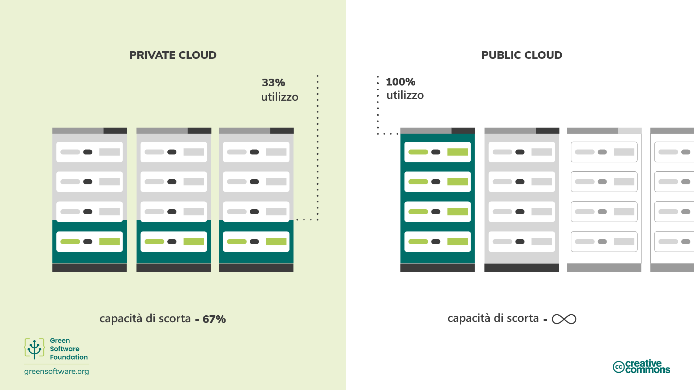

import Quiz from "/src/components/Quiz";

# Efficienza dell'hardware
> *This translation is a community translation, it has limited support and might not be up to date with the latest version in English.*
> *Questa traduzione è una traduzione community, ha un supporto limitato e potrebbe non essere aggiornata con l'ultima versione in inglese.*

:::tip Principio

_Utilizzare la minor quantità possibile di carbonio incorporato._

:::

## Introduzione

L'hardware utilizzato nel processo di creazione del software è un elemento importante da considerare per un professionista del software verde.

Vedrete come il carbonio incorporato sia un costo nascosto quando si tratta di hardware e le diverse misure che potete adottare per ridurre l'impatto che la creazione, la distruzione e il funzionamento di questo hardware comportano. Ad esempio, prolungandone la durata o passando a server cloud.

## Concetti chiave

### Carbonio incorporato

Il dispositivo che state utilizzando per leggere questo articolo ha prodotto carbonio quando è stato fabbricato e, una volta giunto a fine vita, lo smaltimento potrebbe rilasciarne altro. Il carbonio incorporato (detto anche "embedded carbon") è la quantità di inquinamento da carbonio emesso durante la creazione e lo smaltimento di un dispositivo.

Quando si calcola l'inquinamento totale da carbonio per i computer che eseguono software, si deve tenere conto sia dell'inquinamento da carbonio associato al funzionamento del computer sia del carbonio incorporato del computer.

Il carbonio incorporato varia in modo significativo tra i dispositivi degli utenti finali. Per alcuni dispositivi, il carbonio emesso durante la produzione è molto più alto di quello emesso durante l'utilizzo, come illustrato da uno [studio](https://www.ifi.uzh.ch/dam/jcr:fa4e956e-7a53-4038-98a5-00e09e2f4303/Study_Digitalization_Climate_Protection_Summary_Oct2017.pdf) dell'Università di Zurigo. Di conseguenza, il costo del carbonio incorporato può talvolta essere molto più alto del costo dell'elettricità che lo alimenta.

Se si ragiona in termini di carbonio incorporato, qualsiasi dispositivo, anche se non consuma elettricità, è responsabile del rilascio di carbonio nel corso della sua vita.

### Ammortamento

Un modo per tenere conto del carbonio incorporato è quello di ammortizzare il carbonio sulla durata di vita prevista di un dispositivo. Ad esempio, supponiamo che ci siano voluti 4000 kg di CO2eq per costruire un server e che ci aspettiamo che duri quattro anni. L'ammortamento significa che il server emette 1000 kg di CO2eq all'anno.

## Come migliorare l'efficienza dell'hardware

Se prendiamo in considerazione il carbonio incorporato, è chiaro che nel momento in cui acquistiamo un computer, questo ha già emesso una buona quantità di carbonio. Inoltre, i computer hanno una durata limitata, il che significa che alla fine non sono più in grado di gestire i carichi di lavoro moderni e devono essere sostituiti. In questi termini, l'hardware è una proxy del carbonio e, poiché il nostro obiettivo è quello di essere efficienti dal punto di vista del carbonio, dobbiamo esserlo anche dal punto di vista dell'hardware.

Esistono due approcci principali all'efficienza dell'hardware:

- Per i dispositivi degli utenti finali, si tratta di **estendere la durata di vita** dell'hardware.
- Per il cloud computing, si tratta di **aumentare l'utilizzo** del dispositivo.

### Estendere la durata di vita dell'hardware

Nell'esempio visto in precedenza, se riusciamo ad aggiungere un solo anno in più alla durata di vita del nostro server, il carbonio ammortizzato scende da 1000 kg CO2eq/anno a 800 kg CO2eq/anno.

L'hardware viene ritirato quando si rompe o fatica a gestire i carichi di lavoro moderni. Naturalmente, l'hardware si romperà sempre prima o poi ma, come sviluppatori, possiamo usare il software per creare applicazioni che funzionino su hardware più vecchi e prolungarne la durata.

### Aumento dell'utilizzo del dispositivo

Nello spazio cloud, l'efficienza dell'hardware si traduce spesso in un aumento dell'utilizzo dei server. È meglio utilizzare un server al 100% piuttosto che 5 server al 20% a causa del costo del carbonio incorporato. Così come possedere un'auto e usarla tutti i giorni della settimana è molto meglio che possederne cinque e usarne una diversa ogni giorno della settimana, è molto più efficiente usare i server alla loro massima capacità piuttosto che impiegarne diversi al di sotto della capacità. Sebbene le emissioni siano le stesse, il carbonio incarnato utilizzato è molto più basso.

Il motivo più comune per cui i server sono sottoutilizzati è quello di tenere conto della capacità di picco. Eseguire i server al 20% significa sapere che si sarà in grado di gestire i picchi di domanda senza impattare sulle prestazioni. Tuttavia, nel frattempo, tutta quella capacità di riserva che rimane inattiva rappresenta uno spreco di carbonio incorporato. Essere efficienti dal punto di vista dell'hardware significa assicurarsi che ogni dispositivo hardware venga utilizzato il più possibile e il più a lungo possibile.

Questo è uno dei principali vantaggi del cloud pubblico: si sa che quando si ha bisogno di scalare, lo spazio sarà lì a disposizione per coprire la mancanza di spazio. Grazie all'utilizzo del cloud pubblico da parte di più organizzazioni, la capacità di riserva può essere sempre messa a disposizione di chi ne ha bisogno, in modo che nessun server resti inattivo.

È importante notare che il semplice spostamento delle operazioni nel cloud pubblico non riduce automaticamente le emissioni. Semplicemente, offre lo spazio per poter riorganizzare il software in modo che sia possibile una riduzione.

## Sintesi

- Il carbonio incorporato è la quantità di inquinamento da carbonio emesso durante la creazione e lo smaltimento di un dispositivo.
- Quando si calcola l'inquinamento totale da carbonio, è necessario considerare sia quello emesso durante il funzionamento del computer, sia il carbonio incorporato associato alla sua creazione e smaltimento.
- L'estensione della durata di vita di un dispositivo ha l'effetto di ammortizzare il carbonio emesso, riducendo così il suo CO2eq/anno.
- Il cloud computing è più efficiente dal punto di vista energetico rispetto a un server on-premise, in quanto può applicare il demand shifting e il demand shaping.

## Quiz (in inglese)

<Quiz
  QuizList={[
    {
      question: "What is embodied carbon?",
      answers: [
        {
          text: "The carbon that was emitted in the creation of a device",
          isCorrect: false,
        },
        {
          text: "The carbon emissions associated with both the creation and disposal of a device",
          isCorrect: true,
        },
        {
          text: "The carbon emissions associated with the disposal of a device",
          isCorrect: false,
        },
      ],
    },
    {
      question: "What accounts for the total carbon pollution of a computer?",
      answers: [
        {
          text: "The embodied carbon of the device",
          isCorrect: false,
        },
        {
          text: "The emissions produced when running the device",
          isCorrect: false,
        },
        {
          text: "Both the above",
          isCorrect: true,
        },
      ],
    },
    {
      question:
        "What are the two key ways of being more efficient with hardware?",
      answers: [
        {
          text: "Extending its lifespan and reducing its utilization",
          isCorrect: false,
        },
        {
          text: "Extending its lifespan and increasing its utilization",
          isCorrect: true,
        },
        {
          text: "Reducing its lifespan and increasing its utilization",
          isCorrect: false,
        },
      ],
    },
    {
      question:
        "How does hardware efficiency affect the carbon pollution of a device?",
      answers: [
        {
          text: "It eliminates it",
          isCorrect: false,
        },
        {
          text: "It increases it",
          isCorrect: false,
        },
        {
          text: "It reduces it",
          isCorrect: true,
        },
      ],
    },
    {
      question:
        "What is the amortized carbon of a device with an embodied carbon of 1000kg CO2eq and a lifespan of 5 years?",
      answers: [
        {
          text: "200kg CO2eq/year",
          isCorrect: true,
        },
        {
          text: "20kg CO2eq/year",
          isCorrect: false,
        },
        {
          text: "200kg CO2eq",
          isCorrect: false,
        },
      ],
    },
    {
      question:
        "What are some of the differences between having your servers on a public cloud compared to a private cloud?",
      answers: [
        {
          text: "On the public cloud, you can scale up quickly",
          isCorrect: false,
        },
        {
          text: "On a private cloud, you need to have servers running below capacity in order to meet surges in demand",
          isCorrect: false,
        },
        {
          text: "Both the above are true",
          isCorrect: true,
        },
      ],
    },
    {
      question:
        "Why is it so important to include embodied carbon when calculating emissions for hardware?",
      answers: [
        {
          text: "Embodied carbon sometimes accounts for more emissions than the emissions from the electricity powering the device",
          isCorrect: true,
        },
        {
          text: "Embodied carbon represents a small but significant proportion of overall emissions from a device",
          isCorrect: false,
        },
        {
          text: "Embodied carbon is the only source of emissions that should be considered when calculating overall emissions for a device?",
          isCorrect: false,
        },
      ],
    },
  ]}
/>
