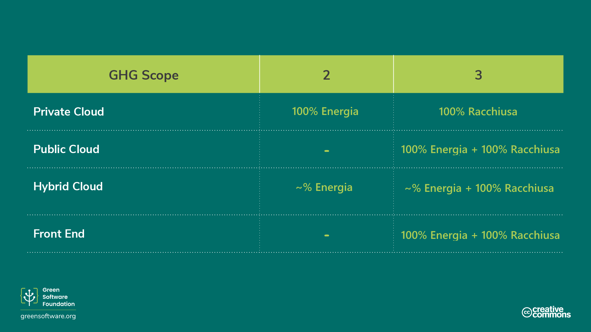
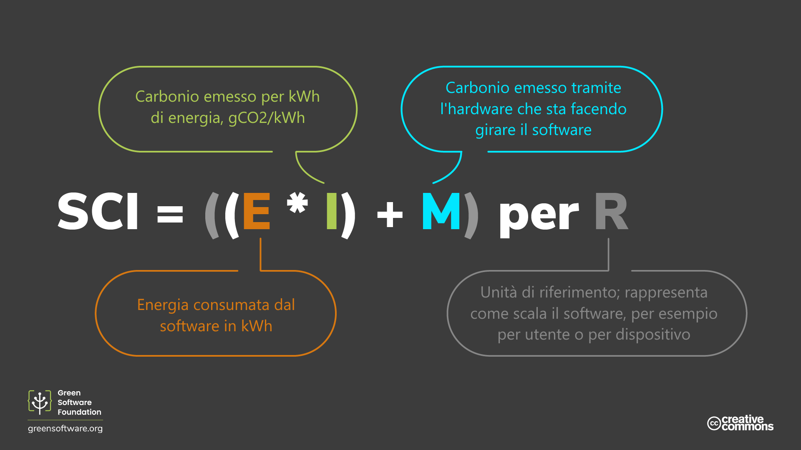

import Quiz from "/src/components/Quiz";

# Misurazione
> *This translation is a community translation, it has limited support and might not be up to date with the latest version in English.*
> *Questa traduzione è una traduzione community, ha un supporto limitato e potrebbe non essere aggiornata con l'ultima versione in inglese.*

:::tip Principio

_Ciò che non si può misurare, non si può migliorare._

:::

## Introduzione

Il protocollo sui gas serra (GHG) è il metodo più comunemente utilizzato dalle organizzazioni per misurare le proprie emissioni totali di carbonio. Comprendere gli ambiti di applicazione dei GHG e come misurare il vostro software rispetto agli standard del settore vi aiuterà a capire in che misura state applicando i principi del Green Software e quanta strada avete ancora da fare per migliorare.

A complemento del protocollo GHG, è possibile utilizzare anche la specifica Software Carbon Intensity (SCI). Mentre il GHG è una misura più generica adatta a tutti i tipi di organizzazioni, il SCI è specifico per misurare il tasso di emissioni del software e progettato per incentivare l'eliminazione di tali emissioni.

Il GHG è un protocollo per misurare le emissioni totali, il SCI è uno strumento per consentire l'eliminazione delle emissioni dovute al software.

Esamineremo ciascuna delle metodologie di misurazione e spiegheremo come calcolare in entrambi i casi.

## Il protocollo GHG

Il [protocollo sui gas serra](https://ghgprotocol.org) è lo standard di contabilizzazione dei gas serra più diffuso e riconosciuto a livello internazionale. Il [92%](https://ghgprotocol.org/about-us) delle aziende Fortune 500 utilizza il protocollo GHG per calcolare e divulgare le proprie emissioni di carbonio.

Il protocollo GHG divide le emissioni in tre ambiti:

- **Scope 1**: Emissioni dirette da **operazioni** possedute o controllate dall'organizzazione che redige il rapporto, come la combustione di carburante in loco o i veicoli della propria flotta.
- **Scope 2**: Emissioni indirette legate alla **generazione di energia acquistata**, come calore ed elettricità.
- **Scope 3**: Altre emissioni indirette derivanti da tutte le altre attività svolte. Sono incluse tutte le **emissioni derivanti dalla catena di approvvigionamento di un'organizzazione** i viaggi di lavoro dei dipendenti e l'elettricità che i clienti possono consumare quando utilizzano i vostri prodotti.

Lo Scope 3, talvolta indicato come emissioni della catena del valore, è la fonte di emissioni più significativa e più complessa da calcolare per molte organizzazioni. Comprende l'intera gamma di attività necessarie per creare un prodotto o un servizio, dalla concezione alla distribuzione. Nel caso di un computer portatile, ad esempio, ogni materia prima utilizzata per la sua produzione emette carbonio quando viene estratta e lavorata. Le emissioni della catena del valore comprendono anche le emissioni derivanti dall'uso del computer portatile, ovvero le emissioni derivanti dall'energia utilizzata per alimentare il computer portatile dopo che è stato venduto a un cliente.

Con questo approccio, è possibile sommare tutte le emissioni di gas serra di ogni organizzazione e persona nel mondo e raggiungere un totale globale.

### In quale ambito rientra la mia applicazione?

Abbiamo già visto come il protocollo GHG ci chieda di suddividere le emissioni del software secondo gli ambiti 1-3. Ma come funziona quando si tratta di software?

La maggior parte delle organizzazioni ha molte applicazioni che girano con architetture diverse e in ambienti diversi. Di conseguenza, l'ambito in cui rientrano le vostre emissioni, sia in termini di energia generata che di carbonio incorporato, dipende dal vostro scenario specifico.

- **Per le applicazioni cloud eseguite su server di proprietà dell'utente**, l'utilizzo di energia del software rientra nell'ambito 2, mentre il carbonio incorporato di tutti i server rientra nell'ambito 3.
- **Per le applicazioni cloud eseguite su un cloud pubblico**, sia l'utilizzo di energia dell'applicazione che il carbonio incarnato rientrano nell'ambito 3.
- Negli scenari in cui **si esegue un'applicazione ibrida di cloud privato/pubblico**, una parte delle sue emissioni rientra nell'ambito 2 e una parte nell'ambito 3.
- Allo stesso modo, per l'applicazione **front-end** rivolta al cliente, l'utilizzo di energia rientra nell'ambito 3 dell'organizzazione, poiché il cliente acquisterà l'energia per alimentare il proprio dispositivo.

Per il software, indipendentemente dal fatto che venga eseguito su un'infrastruttura di vostra proprietà, in affitto o di proprietà dei consumatori, ci sono tre parametri da considerare per la suddivisione delle emissioni:

- Quanta energia consumi
- Quanto pulita o sporca sia l'elettricità
- Quanto hardware abbia bisogno per funzionare

### È possibile calcolare un totale per le emissioni di carbonio del software?

Per calcolare un totale delle emissioni di carbonio del software, è necessario avere accesso a dati dettagliati sul consumo di energia, sull'intensità di carbonio e sull'hardware su cui viene eseguito il software. Si tratta di dati difficili da raccogliere, anche nel caso dei prodotti software closed-source di un'organizzazione che possono tracciarne l'utilizzo con la telemetria o i log.

I manutentori di software open-source non hanno la stessa visibilità su come e dove viene utilizzato il loro software, quanta energia viene consumata e su quale hardware.

I progetti open-source hanno in genere più collaboratori provenienti da diverse organizzazioni. Di conseguenza, non è chiaro chi debba essere responsabile del calcolo delle emissioni e chi debba eliminarle. Se si considera anche che il software open-source costituisce il 90% dello stack di un'azienda tipica, è chiaro che ci sarà una grande quantità di emissioni di carbonio non contabilizzate.

### I totali raccontano l'intera storia?

Il totale è solo una metrica che descrive lo stato di qualcosa. Per prendere le decisioni giuste, è necessario esaminare molte metriche diverse.

Immaginate uno scenario in cui siete il leader di un'organizzazione e siete incaricati di ridurre le emissioni del vostro software. Misurate le emissioni nel primo trimestre e ottenete un totale di 34 tonnellate. Dopo aver effettuato alcuni investimenti in progetti che eliminano le emissioni, scoprite che nel secondo trimestre le emissioni sono aumentate a 45 tonnellate. Questo significa che i vostri sforzi sono falliti?

Non necessariamente. Sappiamo che il totale da solo non racconta l'intera storia e dobbiamo considerare altre metriche per capire se un progetto di riduzione delle emissioni ha avuto successo. Ad esempio, se si misurasse l'intensità di carbonio oltre al totale delle emissioni, si potrebbe avere una prospettiva diversa. Nello stesso progetto, se l'intensità di carbonio è stata di 3.3g CO2eq/utente nel primo trimestre e di 2.9g CO2eq/utente nel secondo, si potrebbe considerare il progetto un successo e continuare a investire.

Mentre il totale vi informa che le emissioni di carbonio della vostra organizzazione sono aumentate nel complesso, l'intensità fornisce una prospettiva più completa che vi aiuterà a prendere una decisione più consapevole su come procedere.

## Specifica dell'intensità di carbonio del software

La specifica [Software Carbon Intensity (SCI)](https://grnsft.org/sci) è una metodologia sviluppata dal gruppo di lavoro sugli standard della Green Software Foundation, progettata per assegnare un punteggio a un'applicazione software in base a una dimensione di sostenibilità e per incoraggiare le azioni volte a eliminare le emissioni.

Non sostituisce il protocollo GHG, ma è una metrica aggiuntiva che aiuta i team di software a capire come si comporta il loro software in termini di emissioni di carbonio, in modo da poter prendere decisioni più informate. Mentre il protocollo GHG calcola le **emissioni totali**, l'SCI si occupa di calcolare il **tasso di emissioni**. In termini automobilistici, l'SCI è più simile a una misurazione delle chilometri per litro, mentre il protocollo GHG è più simile all'impronta di carbonio totale di una casa automobilistica e di tutte le sue auto prodotte ogni anno.

Invece di suddividere le emissioni di carbonio del software negli ambiti 1-3, le suddivide in **emissioni operative** (emissioni di carbonio derivanti dall'esecuzione del software) e **emissioni incorporate** (emissioni di carbonio derivanti dalle risorse fisiche necessarie per l'esecuzione del software). Si tratta inoltre di un'intensità piuttosto che di un totale, che include maggiormente il software open-source.

Una cosa importante da notare è che non è possibile ridurre il punteggio SCI acquistando compensazioni sotto forma di neutralizzazioni o compensazioni di elettricità sotto forma di crediti di energia rinnovabile. Ciò significa che un'organizzazione che non compie alcuno sforzo per ridurre le proprie emissioni ma si limita a spendere denaro in crediti di carbonio non può ottenere un buon punteggio SCI.

Le compensazioni sono una componente essenziale di qualsiasi strategia climatica; tuttavia, le compensazioni non sono eliminazioni e quindi non sono incluse nella metrica SCI.

Se la vostra applicazione diventa più **efficiente dal punto di vista energetico, dell'hardware**, o **consapevole delle emissioni di carbonio**, il vostro punteggio SCI diminuirà. L'unico modo per ridurre il punteggio SCI è investire tempo o risorse in uno di questi tre principi. Per questo motivo, l'adozione del SIC come parametro per la vostra applicazione software, insieme al protocollo GHG, spingerà a investire in uno dei tre pilastri del software verde.

### L'equazione SCI

Lo SCI è un metodo per assegnare un punteggio a qualsiasi applicazione software, non solo alle applicazioni cloud o a quelle per gli utenti finali, ma a tutti i tipi di applicazioni intermedie. Fornisce un linguaggio comune per descrivere come il software si comporta rispetto alle emissioni di anidride carbonica e come una modifica proposta potrebbe eliminarne alcune.

L'equazione per calcolare un punteggio SCI è elegantemente semplice. Questa semplicità significa che può essere applicata in diversi scenari.

`SCI = ((E * I) + M) per R`

`E` = Energia consumata da un sistema software
`I` = Emissioni marginali di carbonio basate sulla posizione
`M` = Emissioni incorporate di un sistema software.
`R` = Unità di riferimento (ad es. carbonio per utente aggiuntivo, chiamata API, lavoro ML, ecc.)

Il tutto si riassume in:

`SCI = C per R` (carbonio per `R`)

Il `R` è la caratteristica principale dell'SCI e lo trasforma in un'intensità piuttosto che in un totale. Questo è ciò che chiamiamo _unità funzionale_.

## Come calcolare il punteggio SCI

Seguite questi quattro passaggi per calcolare il vostro punteggio SCI.

1. Decidere cosa includere

Per stabilire quali componenti del software includere o escludere dal punteggio SCI è necessario definire i confini del software: dove inizia e dove finisce.

Per ogni componente software che includete, dovrete misurarne l'impatto. Per ogni componente principale che escludete, dovete spiegarne il motivo.

Le specifiche SCI non prevedono attualmente alcuna richiesta su cosa includere e cosa non includere. Tuttavia, è necessario includere tutte le infrastrutture e i sistemi di supporto che contribuiscono in modo significativo al funzionamento del software.

Il punteggio SCI potrebbe diminuire perché si sono ristretti i confini del software e si sono esclusi più componenti software. Al contrario, il punteggio SCI potrebbe aumentare perché sono stati inclusi componenti software precedentemente esclusi. Pertanto, quando si comunica il proprio punteggio SCI, e in particolare eventuali miglioramenti del punteggio, è essenziale indicare i confini del software.

2. Scegliere l'unità funzionale

Come abbiamo visto, l'SCI è un tasso piuttosto che un totale e misura l'intensità delle emissioni in base all'unità funzionale scelta. Attualmente le specifiche non prescrivono l'unità funzionale e siete liberi di scegliere quella che meglio descrive la scala della vostra applicazione. Ad esempio, se la vostra applicazione si misura in base al numero di utenti, scegliete gli utenti come unità funzionale.

Le future iterazioni dell'SCI potrebbero prescrivere unità funzionali specifiche per diversi tipi di applicazioni per favorire la comparabilità. Ad esempio, potremmo chiedere alle applicazioni di streaming di scegliere i minuti come unità funzionale per standardizzare la misurazione tra tutte le applicazioni di streaming.

3. Decidere come misurare le emissioni

Ora avete un elenco dei componenti software che volete misurare e l'unità funzionale che userete per misurarli. Il passo successivo consiste nel decidere come quantificare le emissioni di ciascun componente software.

Esistono due metodi di quantificazione: la misurazione e il calcolo.

- La **misurazione** consiste nell'utilizzo di contatori di qualche tipo. Ad esempio, misurando il consumo energetico del componente software tramite un dispositivo hardware nella presa di corrente. Oppure utilizzando contatori sull'hardware che misurano direttamente il consumo energetico. Se è possibile contare direttamente le unità, si dovrebbe utilizzare l'approccio di misurazione.
- Il **calcolo** comporta un conteggio indiretto, spesso utilizzando un modello di qualche tipo. Ad esempio, se non è possibile misurare direttamente il consumo energetico dell'applicazione, ma si dispone di un modello che stima il consumo energetico in base all'utilizzo della CPU, questo è considerato un calcolo piuttosto che una misurazione.

Queste risorse possono aiutarvi a decidere i metodi di misurazione e di calcolo:

- Il progetto [Software Carbon Intensity Data](https://sci-data.greensoftware.foundation/). Questo progetto si occupa di fornire consigli su come quantificare le emissioni dei diversi componenti software.

4. Quantificare

Ora siete pronti per l'esecuzione. Utilizzando la metodologia descritta nelle fasi precedenti, iniziate a quantificare il punteggio SCI per ogni componente software del vostro perimetro. Il punteggio SCI totale dell'applicazione software è il punteggio combinato di tutte le diverse componenti.

È possibile calcolare più punteggi SCI per la stessa applicazione. Il punteggio SCI è un'informazione utile per capire come l'applicazione si comporta rispetto alle emissioni di carbonio in diversi scenari. Ad esempio, un'applicazione di streaming potrebbe scegliere come parametro il carbonio al minuto. Potrebbe anche calcolare il carbonio per utente al giorno. La metrica del carbonio per € di entrate potrebbe fornire un'altra dimensione utile.

## Sintesi

- Il protocollo GHG è una metrica per misurare le emissioni totali di carbonio di un'organizzazione ed è utilizzato da organizzazioni di tutto il mondo.
- Il protocollo GHG suddivide le emissioni di carbonio in tre ambiti. L'ambito 3, noto anche come emissioni della catena del valore, si riferisce alle emissioni delle organizzazioni che riforniscono altre organizzazioni in una catena. In questo modo, gli ambiti 1 e 2 di un'organizzazione si sommano all'ambito 3 di un'altra.
- Calcolare le emissioni generate dal software utilizzando il protocollo GHG è possibile, ma può essere difficile per il software open-source.
- L'SCI è una metrica progettata specificamente per calcolare le emissioni del software e rappresenta un tasso piuttosto che un totale.
- L'unità di misura funzionale non è prescritta da SCI e si dovrebbe scegliere qualcosa che rifletta la propria applicazione.

## Quiz (in inglese)

<Quiz
  QuizList={[
    {
      question:
        "How does the Greenhouse Gas protocol ask us to measure emissions?",
      answers: [
        {
          text: "By dividing emissions into three scopes",
          isCorrect: true,
        },
        {
          text: "By dividing emissions into embodied carbon and day-to-day emissions",
          isCorrect: false,
        },
        {
          text: "By dividing emissions from applications running on the public cloud and the private cloud",
          isCorrect: false,
        },
      ],
    },
    {
      question:
        "Which of the 3 scopes used in the GHG protocol is also known as ‘value chain emissions’?",
      answers: [
        {
          text: "1",
          isCorrect: false,
        },
        {
          text: "2",
          isCorrect: false,
        },
        {
          text: "3",
          isCorrect: true,
        },
        {
          text: "1 and 2",
          isCorrect: false,
        },
        {
          text: "all of the above",
          isCorrect: false,
        },
      ],
    },
    {
      question:
        "If you are a cloud application, which GHG scope does your energy consumption fall into?",
      answers: [
        {
          text: "Scopes 2 and 3",
          isCorrect: false,
        },
        {
          text: "Scope 2",
          isCorrect: false,
        },
        {
          text: "Scope 3",
          isCorrect: false,
        },
        {
          text: "Depends whether it’s public, private or hybrid",
          isCorrect: true,
        },
      ],
    },
    {
      question:
        "Which of the following scenarios is more challenging to measure using the GHG protocol?",
      answers: [
        {
          text: "Closed-source software",
          isCorrect: false,
        },
        {
          text: "Open-source software",
          isCorrect: true,
        },
        {
          text: "Both of the above",
          isCorrect: false,
        },
      ],
    },
    {
      question: "What does the acronym SCI stand for?",
      answers: [
        {
          text: "Software Carbon Index",
          isCorrect: false,
        },
        {
          text: "Software Carbon Intensity",
          isCorrect: true,
        },
        {
          text: "Specific Carbon Intensity",
          isCorrect: false,
        },
      ],
    },
    {
      question: "What does ((E*I) + M) represent in the SCI equation?",
      answers: [
        {
          text: "Carbon",
          isCorrect: true,
        },
        {
          text: "Energy",
          isCorrect: false,
        },
        {
          text: "Carbon intensity",
          isCorrect: false,
        },
      ],
    },
    {
      question: "What does the ‘R’ represent in the SCI equation?",
      answers: [
        {
          text: "Repetition",
          isCorrect: false,
        },
        {
          text: "Rate",
          isCorrect: false,
        },
        {
          text: "Functional unit",
          isCorrect: true,
        },
      ],
    },
    {
      question:
        "What are the key things to consider before calculating your SCI score?",
      answers: [
        {
          text: "What to include and the functional unit you will use",
          isCorrect: false,
        },
        {
          text: "What to include, the functional unit you will use and method of quantification",
          isCorrect: true,
        },
        {
          text: "What to include, the functional unit you will use, method of quantification and GHG score",
          isCorrect: false,
        },
      ],
    },
  ]}
/>
