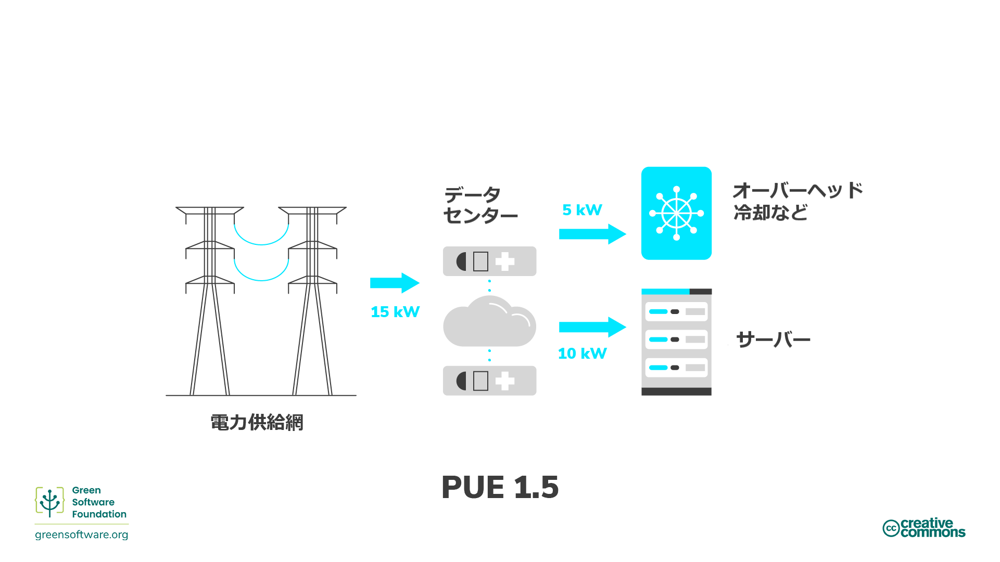

import Quiz from "/src/components/Quiz";

:::note
This is a community contributed translation. It has limited support and might not match the latest English language version of the course.
これはコミュニティによって提供された翻訳です。サポートが限定されているため、コースの最新の英語版と一致しない可能性があります。
:::

:::tip 原則

_エネルギーの使用量を可能な限り少なくする。_

:::

## はじめに

エネルギーとは、仕事をする能力です。エネルギーには、熱、電気、化学などさまざまな形態があり、ある種類のエネルギーを別のエネルギーに変換することができます。たとえば、石炭から得られる化学エネルギーを電気エネルギーに変換することができます。すなわち、電気は他のエネルギーから変換された二次エネルギーなのです。このように、エネルギーとは、使用する電気の尺度と考えることができます。

携帯電話で動作するアプリケーションから、データセンターで動作する機械学習モデルのトレーニングまで、すべてのソフトウェアが電力を消費します。ソフトウェアによる電力消費とそれに伴う炭素排出量を削減する最善の方法の1つは、アプリケーションをよりエネルギー効率の高いものにすることです。ただし、私たちの責任はそこで終わるわけではありません。

グリーンソフトウェアの実践者は、自社の製品が消費するエネルギーに責任を負い、できるだけエネルギーを消費しないように設計しています。私たちは、プロセスの各段階において、できるだけ無駄をなくし、エネルギーのほとんどが次のステップに回るようにしなければなりません。

このチェーン（連鎖）の最終ステップは、完成品そのものではなく、製品のエンドユーザーとなります。すなわち、私たちの目標は、単に最もエネルギー効率の高いコードや「最も環境に優しい」ソフトウェアを作成することではなく、エンドユーザーのことを考え、エンドユーザーが不必要な排出物を出さないようにする方法を考えることなのです。

これは、エネルギーの比例性を利用して作業をまとめて処理することや、ユーザーによるソフトウェアの使用方法を変えることを意味します。ここでは、これらのコンセプトと、最終消費者に至るまでのチェーンの各段階でエネルギー効率を高めるための方法を紹介します。

## キーコンセプト

### 化石燃料と高炭素エネルギー源

ほとんどの電気は、化石燃料[通常は石炭](https://ourworldindata.org/grapher/world-electricity-by-source)を燃やすことで生産されています。化石燃料は、動植物を分解して作られます。これらの燃料は地殻中に存在し、炭素と水素を含み、燃やしてエネルギーとすることができます。石炭、石油、天然ガスなどは化石燃料の例です。

ほとんどの人が電気はクリーンだと考えています。壁に何かを差し込むときに手が汚れることはありませんし、ノートパソコンに排気管は必要ありません。しかし、ほとんどの電気は化石燃料を燃やして作られ、エネルギー供給が炭素排出の[最も大きな](https://www.eea.europa.eu/data-and-maps/daviz/change-of-co2-eq-emissions-2#tab-chart_4)原因であることから、電気と炭素排出を直接結びつけることができるのです。これらの観点から、電気は炭素の代理と考えることができます。

私たちの目標が炭素効率を高めることであるならば、エネルギーは炭素の代理であるため、エネルギー効率を高めることも目標であることになります。これは、作業単位当たりのエネルギー使用量を可能な限り最小限に抑えることを意味します。

### 低炭素なエネルギー源

クリーンエネルギーは、再生可能で、使用時に大気を汚染しないゼロエミッションのエネルギー源から得られ、エネルギー効率の高い実践を通じてエネルギーを節約することができます。クリーンエネルギー、グリーンエネルギー、再生可能エネルギーには重なる点があります。ここでは、それらを区別する方法を説明します。

- **クリーンエネルギー** - 原子力など、炭素放出がないもの
- **グリーンエネルギー** - 自然界からの資源
- **再生可能エネルギー** - 太陽光や風力など、発生源は枯渇しない

### エネルギー測定

- エネルギーは、[SI](https://en.wikipedia.org/wiki/International_System_of_Units)単位であるジュール（J）で測定されます。
- 電力はワットで測定され、1ワット（W）は1秒当たり1ジュールに相当します。
- したがって、1キロワット（kW）は、1秒当たり1000ジュールに相当します。
- 1キロワット時（kWh）は、1キロワットの電力を1時間維持した場合のエネルギー（J）です。

## エネルギー効率を高めるには

エネルギーがどのように生産されるか、また低炭素エネルギー源と高炭素エネルギー源のどちらを使用するかによって、排出量という観点から関連するコストがわかるので、グリーンソフトウェアの実践者がエネルギー効率を改善する方法をいくつか見てみましょう。電力利用効果とエネルギー比例性を理解することは、エネルギーを最も効率的に使用し、無駄を省くという点で、より良い意思決定を行うことができるということです。

### 電力使用効率

データセンター業界は、2006年にグリーングリッドが開発した[電力使用効率](https://datacenters.lbl.gov/sites/default/files/WP49-PUE%20A%20Comprehensive%20Examination%20of%20the%20Metric_v6.pdf)（PUE）指標を用いて、**データセンターのエネルギー効率を測定**しています。具体的に言えばこれは、コンピューティング機器をサポートする冷却などのオーバーヘッドと比較して、コンピューティング機器がどの程度のエネルギーを使用するかということと関連します。データセンターのPUEが1.0に近い場合、コンピューティングがほぼすべてのエネルギーを使用していることになります。PUEが2.0の場合、IT機器が1ワットのIT電力を使用するごとに、冷却と配電のために1ワットのIT電力が追加で必要になることを意味します。

PUEをアプリケーションのエネルギー消費量の乗数として考える方法もあります。たとえば、アプリケーションの消費電力が10kWhで、それが稼働しているデータセンターのPUEが1.5である場合、送電網からの実際の消費電力は15kWhということになります。5kWhはデータセンターの運用オーバーヘッドに充てられ、10kWhはアプリケーションを実行するサーバーに充てられます。

### エネルギー比例性

[エネルギー比例性](https://research.google/pubs/pub33387/)は、2007年にGoogleのエンジニアが初めて提唱したもので、**コンピューターが消費する電力と有用な仕事をする割合（その利用率）との関係**を測定するものです。

利用率は、コンピューターのリソースがどの程度使用されているかを測定するもので、通常はパーセントで表されます。最大容量で稼働しているフル稼働のコンピューターは高いパーセンテージを示し、活用されていないアイドル状態のコンピューターは低いパーセンテージを示します

電力と利用率は比例しません。数学的に言えば、2つの変数の間の比例性は、それらの比率が等しいことを意味します。たとえば、利用率が0%の場合は100W、50％の場合は180W、100％の場合は200Wの電力を消費する可能性があります。消費電力と利用率の関係は直線的ではなく、原点を通ることはありません。

このため、コンピューターを利用すればするほど、電力を実際のコンピューティング操作に変換する際の効率が高くなります。ハードウェアの効率を高める方法の1つは、できるだけ少ないサーバーでワークロードを実行し、サーバーの稼働率を最高に高めてエネルギー効率を最大化することです。

#### 静的な電力消費

コンピューターの静的電力消費とは、**アイドル状態のときにどれだけの電力を消費するかということ**です。静的な電力消費は構成やハードウェアコンポーネントによって異なりますが、すべての部品が何らかの静的電力消費状態となります。これは、PCやノートPC、エンドユーザー機器に省電力モードが備わっている理由の1つです。デバイスがアイドル状態であれば、やがて休止モードを発動してディスクや画面をスリープ状態にしたり、CPUの周波数を変更したりもします。これらの省電力モードは電力を節約できますが、デバイスがウエイクアップした（目覚めた）ときの再起動が遅くなるなど、他のトレードオフがあります。

サーバーは通常、積極的な節電、あるいは最小限の節電のために構成されてはいません。サーバー上で動作する多くのユースケースは、急速に変化する需要に対応する必要があるため、できるだけ早く総容量を確保する必要があり、その結果、需要の少ない時に多くのサーバーがアイドルモードになります。アイドル状態のサーバーは、エンベッディッド炭素（embedded carbon）と非効率的な利用の双方による炭素コストが発生します。

## まとめ

- 電気は炭素の代理であるため、エネルギー効率の良いアプリケーションを構築することは、炭素効率の良いアプリケーションを構築することになります。
- グリーンソフトウェアは、電力消費に対して責任を負い、電力消費を最小限に抑えるように設計されています。
- アプリケーションのエネルギー消費を定量化することは、アプリケーションをより効率的に動作させる方法を考え始める上での正しい方向への一歩となります。ただし、アプリケーションのエネルギー消費を理解することだけが重要なわけではありません。ソフトウェアが実行されているハードウェアは、電力の一部を運用上のオーバーヘッドに使用します。これは、クラウド空間における電力使用効率（PUE）と呼ばれます。
- ハードウェアは使用すればするほど電気を効率よく使えるようになるため、エネルギー比例性の概念がさらに複雑さを増します。
- このことを理解することで、グリーンソフトウェアの実践者は、自身のアプリケーションが現実世界においてエネルギー消費に関してどのような挙動を示すかについて、より深い洞察を得ることができます。

## クイズ

<Quiz
  QuizList={[
    {
      question:
        "電気は炭素の代理であると言われることがあるのはなぜでしょうか？",
      answers: [
        {
          text: "電気はエネルギーの一種であり、あらゆるエネルギーが炭素を発生させるから",
          isCorrect: false,
        },
        {
          text: "電気を使用すると炭素を排出させるから",
          isCorrect: false,
        },
        {
          text: "化石燃料を燃やすと電気が発生するから",
          isCorrect: true,
        },
      ],
    },
    {
      question: "化石燃料の例として、どのようなものがありますか？",
      answers: [
        { text: "炭素や水素", isCorrect: false },
        { text: "石炭・石油・天然ガス", isCorrect: true },
        { text: "上記の双方", isCorrect: false },
      ],
    },
    {
      question: "クリーンエネルギーとは何でしょうか？",
      answers: [
        { text: "再生可能な資源に由来するエネルギー", isCorrect: false },
        {
          text: "炭素を排出しないエネルギー",
          isCorrect: true,
        },
        { text: "上記の双方", isCorrect: false },
      ],
    },
    {
      question: "電力使用効率（PUE）は何を測定するものでしょうか？",
      answers: [
        { text: "データセンターのエネルギー効率", isCorrect: true },
        { text: "アプリケーションのエネルギー消費量", isCorrect: false },
        {
          text: "オーバーヘッドで使用されるエネルギー量とサーバーが消費するエネルギー量を合わせたもの",
          isCorrect: false,
        },
      ],
    },
    {
      question:
        "エネルギー比例性によって測定されるものは、次のうちどれでしょうか？",
      answers: [
        {
          text: "オーバーヘッドで使用されるエネルギーと、アプリケーションを実行するサーバーに充てられるエネルギーとの関係",
          isCorrect: false,
        },
        {
          text: "コンピューターの使用可能なリソースのうち、使用されているリソースの割合",
          isCorrect: false,
        },
        {
          text: "コンピューターが消費する電力と、有用な作業が実施される割合との関係",
          isCorrect: true,
        },
      ],
    },
    {
      question: "エネルギーのSI単位とは何ですか？",
      answers: [
        {
          text: "ワット",
          isCorrect: false,
        },
        {
          text: "キロワット",
          isCorrect: false,
        },
        {
          text: "ジュール",
          isCorrect: true,
        },
      ],
    },
    {
      question: "最もエネルギーを消費しているのはどのアプリケーションですか？",
      answers: [
        {
          text: "PUEが1のデータセンターで20kWhを消費するアプリケーション",
          isCorrect: true,
        },
        {
          text: "PUEが1.2のデータセンターで15kWhを消費するアプリケーション",
          isCorrect: false,
        },
        {
          text: "PUEが1.5のデータセンターで10kWhを消費するアプリケーション",
          isCorrect: false,
        },
      ],
    },
    {
      question: "静的消費電力とは？",
      answers: [
        {
          text: "待機状態にあるアプリケーションの炭素コスト",
          isCorrect: false,
        },
        {
          text: "アイドル状態のアプリケーションが消費する電力",
          isCorrect: true,
        },
        {
          text: "エコモードのアプリケーションが使用する電力",
          isCorrect: false,
        },
      ],
    },
  ]}
/>
