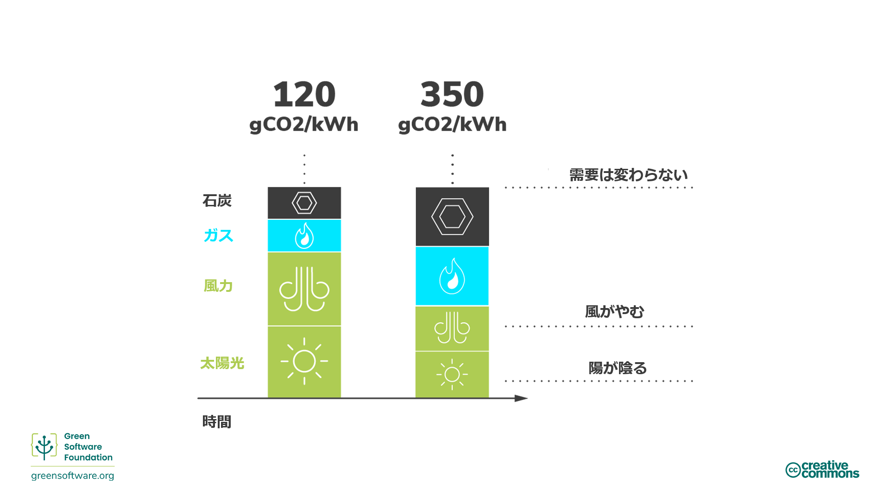
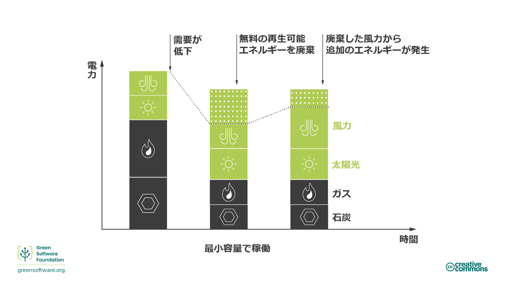
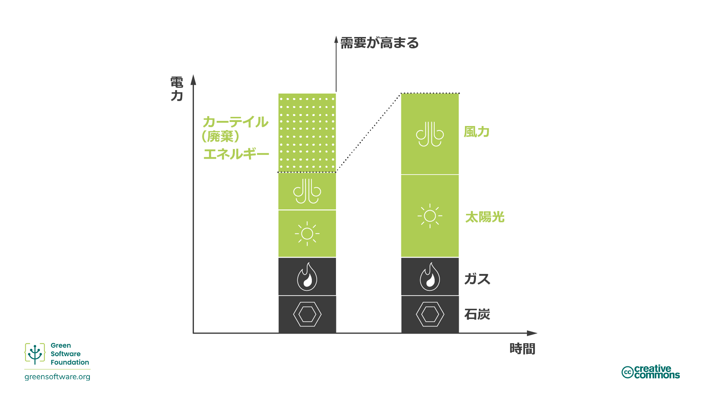
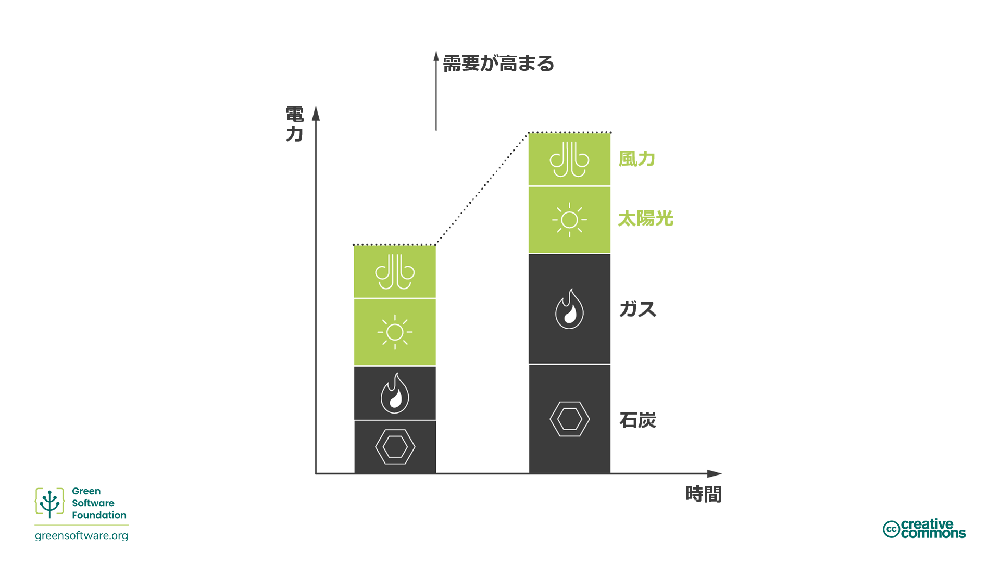
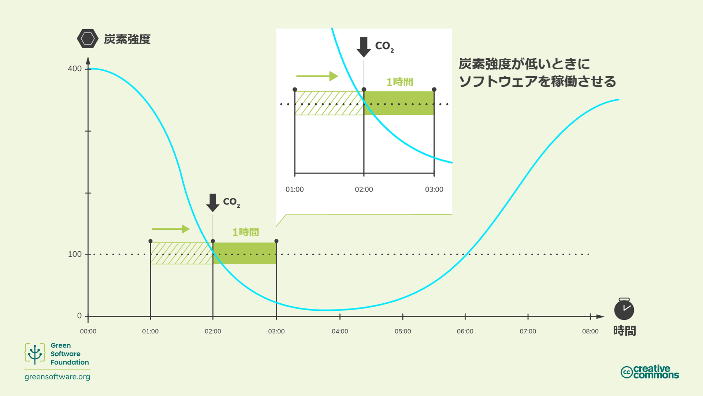
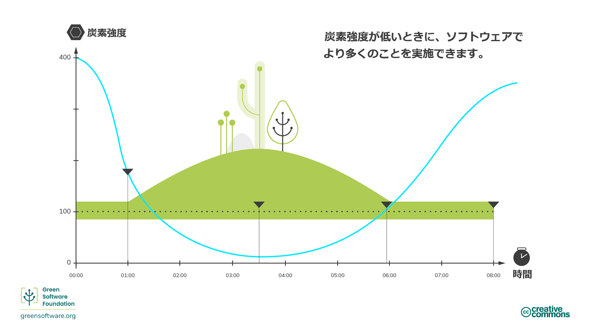

import Quiz from "/src/components/Quiz";

# カーボン アウェアネス（炭素に対する意識）

:::tip 原則

_電気がクリーンなときはより多く、電気が汚れているときはより少なく消費する。_

:::

## はじめに

すべての電気が同じ方法で生産されるわけではありません。電気は、さまざまな場所や時間で、さまざまな源を使用して生成され、炭素排出量もさまざまです。風力、太陽光、水力など幾つかの資源は、炭素をほとんど排出しないクリーンで再生可能な資源です。一方、化石燃料源は、程度の差こそあれ、電気を作る際に炭素を排出します。たとえば、ガスも石炭も再生可能エネルギーよりも炭素排出量が多いのですが、ガスを燃やす発電所は石炭を燃やす発電所よりも炭素排出量が少ないのです。

カーボン アウェアネス（炭素に対する意識）とは、より多くのエネルギーが低炭素源から得られる場合は活動を増やし、より多くのエネルギーが高炭素源から得られる場合は活動を減らす、という考え方です。

## キーコンセプト

### 炭素強度

炭素強度とは、消費した電力1キロワット時（KWh）当たりで排出される炭素（CO2e）の量を測定するものです。炭素強度の標準単位はgCO2eq/kWh、すなわち1キロワット時当たりの炭素のグラム数です

あなたのコンピューターが風力発電所に直接接続されている場合、風力発電所はその電力を生成する際に炭素を排出しないため、その電力の炭素強度は0 gCO2eq/kWhとなります。ただし、ほとんどの人々は風力発電所に直接接続することはできず、代わりに、さまざまな源から電力が供給される送電網に接続しています。

ひとたび送電網に接続されると、使用する電力を供給する源を選択することはできず、すべてがミックスされた電力を供給されるだけです。したがって、炭素強度は、送電網内のすべての電源（低炭素電源と高炭素電源の両方）をミックスしたものになるのです。

### 炭素強度のばらつき

地域によっては、よりクリーンなエネルギー源を含むエネルギーミックスを採用しているため、炭素強度は地域によって異なります。

また、炭素強度は、気象条件の予測不可能性によって引き起こされる再生可能エネルギー固有の変動性により、時間の経過とともに変化します。たとえば、曇っているときや風が吹いていないときは、炭素を排出する源からの電力がミックスに占める割合が多くなるため、炭素強度が増加します。

### ディスパッチャビリティ（制御能力）とカーテイルメント

電力需要は1日の中で変化し、その需要を満たすために常に供給が必要です。電力会社が需要に見合うだけの電力を生産していない場合、ブラウンアウト（送電線の電圧レベル低下）が発生します。逆に、電力会社が必要以上に電力を生産すると、インフラの焼失を防ぐためにブレーカーが落ち、停電になります。

電力の需要と供給は常にバランスが必要であり、その責任は通常、電力会社にあります。

石炭などの化石燃料の場合、供給のために生産する電力を制御することが容易であり、これを**ディスパッチャビリティ（制御能力）**といいます。しかし、風力発電などの再生可能な電源の場合、発電量を簡単に制御することはできません（風が吹く量を制御することはできません）。電源が必要以上に電気を生成すると、その電気を廃棄することになります。これを**カーテイルメント**といいます。

### マージナル炭素強度(marginal carbon intensity)

たとえば、電気をつけるなど、急に多くの電力を必要とする場合、そのエネルギーはマージナル発電所（marginal power plant）から供給されます。マージナル発電所は制御能力があり（ディスパッチャブルである）、すなわち化石燃料を動力源とすることが多いのです。

マージナル炭素強度とは、新たな需要を満たすために発電所が採用しなければならない炭素強度のことです。

化石燃料を使用する発電所は、0までスケールダウンすることはほとんどありません。化石燃料発電所は、最低限機能する閾値があり、中にはスケーリングしないものもあります。それらは、一貫して常時稼働するベースロードと考えられています。そのため、再生可能エネルギーをカーテイルする（廃棄する）一方で、化石燃料の発電所からエネルギーを消費するというシナリオが出てくる場合があります。

このような状況では、新たな需要はカーテイル（廃棄）する再生可能エネルギーに匹敵することがわかっているため、マージナル炭素強度は0gCO2eq/kWhとなります。

### エネルギー市場

正確な市場モデルは世界各地で異なりますが、大まかには同じモデルを踏襲しています。

電力需要が減ると、電力会社は供給量を**減らして**、供給量と需要を均衡させる必要があります。その際に電力会社は、次の2つの方法のいずれかを用いることができます。

1. **化石燃料プラントから購入するエネルギーを減らす。**

化石燃料プラントからのエネルギーは通常最も高価であるため、この方法が好まれます。これは、化石燃料の燃焼量を減らすことに直結します。

2. **再生可能資源からのエネルギー購入を減らす。**
   再生可能資源は最も安価であるため、電力会社はこの方法を好みません。再生可能資源の場合、電力をすべて販売できなかったときに、残りの電力を廃棄しなければなりません。

まず削減されるのが化石燃料であるため、アプリケーションで消費される電力量を削減することで、エネルギーの炭素強度を減らすことができます。

電力需要が高まると、電力会社は供給量を増やして需要と供給のバラスンスをとる必要があります。その際に電力会社は、次の2つの方法のいずれかを用いることができます。

1. **現在削減している再生可能資源からのエネルギーの購入を増やす。**

カーテイル（廃棄）しているということは、配電できるエネルギーが余っているということです。再生可能エネルギーはすでに最も安価であるため、カーテイルされた再生可能エネルギーは最も安価な供給可能エネルギー源となります。再生可能エネルギー発電所は、カーテイル（廃棄）しなければならなかったであろうエネルギーを販売することになります。

2. **化石燃料発電所からより多くのエネルギーを購入する。**

化石燃料は本質的にディスパッチャブル（制御可能）であり、より多く燃やすことですぐにエネルギー生産量を増やすことができます。ただし、石炭はコストがかかるため、これは最も望ましくない解決策です。

エネルギー市場は世界で最も複雑な市場の1つであるため、上記の説明は簡略化したものです。しかし、理解しておくべき重要なことは、私たちの目標は再生可能エネルギーのような低炭素エネルギー源への投資を増やし、石炭のような高炭素資源への投資を減らすことである、ということです。お金が正しい方向に流れるようにするための最善の方法は、炭素強度が最も低い電気を使うようにすることです。

## カーボン アウェアネス（炭素に対する意識）を高めるには

:::tip ヒント

炭素強度が低いときに電気を使用することは、投資を低炭素排出発電所へと向かわせ、高炭素排出発電所から遠ざかるための最善の方法です。

:::

今、世界的な変革が起きています。世界中の電力供給網は、化石燃料の燃焼を主とするものから、風力や太陽光などの低炭素源からのエネルギー調達に変化しつつあります。これは、世界的な削減目標を達成するための私たちの最大の希望の1つです。グリーンソフトウェアの実践者として、その移行を加速させるために私たちができる方法を幾つか見てみましょう。

この移行の主な推進力は、持続可能性目標よりも、むしろ経済的な目標です。再生可能エネルギーが勝っているのは、価格が安く、時の経過とともにさらに手頃な価格になるからです。したがって、移行を加速させるためには、再生可能エネルギー発電所の収益性を高め、化石燃料発電所の収益性を抑える必要があります。そのための最善の方法は、再生可能エネルギーのような低炭素資源から得られる電気をより多く使用し、高炭素資源から得られる電気の使用を減らすことです。

炭素強度は、より多くのエネルギーが低炭素源由来である場合に低く、高炭素源由来である場合に高くなります。

### 需要シフト

カーボン アウェアネス（炭素に対する意識）とは、需要を増加または低減することによって炭素強度の変化に対応することを意味します。あなたの仕事が時間や場所に応じて柔軟に作業量を変えることができるものであれば、炭素強度が低いときは電力を消費し、炭素強度が高いときは生産を休止するなど、臨機応変に対応することができます。たとえば、炭素強度がはるかに低い別の時間帯または地域で機械学習モデルをトレーニングすることができます。

[複数の研究](https://ieeexplore.ieee.org/document/6128960)によると、これらの取り組みによって、送電網に電力を供給する再生可能エネルギーの数に応じて炭素を45％～99％削減できる可能性があります。

需要のシフトは、さらに空間的なシフトと時間的なシフトに分けることができます。

#### 空間的シフト

空間的シフトとは、目下の炭素強度がより低い物理的な場所にコンピュータを移動させることを意味します。そのような場所として、低炭素エネルギー源が自然に存在している地域などがあります。たとえば、より多くの日照時間を確保するために、季節に応じて別の半球に移動するなどの方法があります。

#### 時間的シフト

もし、コンピューターのタスクを空間的に他の地域に移動させることができない場合は、もう1つの選択肢として、他の時間帯にシフトすることもできます。おそらく、日中や夜の遅い時間帯は、日差しが強かったり、風が強かったりするため、炭素強度が低くなります。これを時間的需要シフトといいます。天気予報の進歩により、将来の炭素強度をかなり正確に予測することができます。

大手テクノロジー企業の中には、カーボン アウェアネス（炭素に対する意識）の重要性を認識し、高度なモデリング技術を駆使して需要シフトを実践しているところもあります。

- **Googleカーボン アウェア データセンター** - Googleは、[クラウドワークロードの一部をカーボン アウェアにする（炭素に対する意識を高める）](https://blog.google/outreach-initiatives/sustainability/carbon-aware-computing-location/)ためのプロジェクトを立ち上げました。Google社は、明日の炭素強度と作業負荷を予測するモデルを作成しました。次いで同社は、大規模な作業負荷を、炭素強度が最も低い時間帯や場所でより多く発生させ、なおかつ予想される負荷に対応できるような形態にしました。
- **Microsoft Carbon Aware Windows** - [マイクロソフトは、Windows 11をより持続可能なものにするためのプロジェクトを発表しました。](https://www.techradar.com/news/windows-11-is-getting-an-eco-friendly-update-but-could-microsoft-do-more)まずこれは、炭素強度が低い時間帯にWindowsのアップデートを実行するということです。

### 需要形成

需要シフトとは、炭素強度が最も低い地域や時間帯にコンピューターのタスクを移動させる戦略です。需要形成も同様の戦略です。しかし私たちは、需要を別の地域や時間帯に移動させるのではなく、既存の供給に合わせてコンピューターのタスクを設定しています。

- 炭素強度が低い場合は、需要を増やします。アプリケーションでさらに多くのことを実行できます。
- 炭素強度が高い場合は、需要を減らします。アプリケーションでの作業を減らします。

炭素を意識したアプリケーションの需要形成は、炭素供給の問題です。アプリケーションの実行にかかる炭素コストが高くなった場合は、炭素の供給量に見合った需要を形成します。これは自動的に行われることもあれば、ユーザーが選択することもあります。

エコモードは需要シフトの一例です。エコモードは、自動車や洗濯機など身近な家電製品に搭載されています。エコモードが起動すると、資源（ガスや電気）の消費を減らすために、ある程度のパフォーマンスが犠牲になります。このようにパフォーマンスとのトレードオフがあるため、エコモードは常に選択肢としてユーザーに表示されます。

ソフトウェア アプリケーションにはエコモードがあり、自動的またはユーザーの同意を得て、炭素排出量を削減するための決定を下すことができます。

その一例が、ストリーミングの品質を自動的に調整するビデオ会議ソフトです。常に最高品質でストリーミングするのではなく、帯域が少ないときは映像品質を落として音声を優先させるのです。

また、TCP/IPもその一例です。転送速度は、データが通信回線を通じて送信される量に比例して速くなります。

3つ目の例は、Webによるプログレッシブ エンハンスメントです。エンドユーザーのデバイス（端末）で利用可能なリソースや帯域幅に応じて、ウェブ体験が向上します。

需要形成は、持続可能性におけるより広い概念である「消費を減らす」ことと関連しています。資源の効率化を図ることで多くのことを実現できますが、ある時点では消費量を減らすことも必要です。

私たちは、グリーンソフトウェアの実践者として、炭素強度が高い場合は、需要シフトの代わりにプロセスをキャンセルすることを検討し、私たちのアプリケーションの需要やエンドユーザーの期待度を減らしています。

## まとめ

- カーボン アウェアネス（炭素に対する意識）とは、消費するエネルギーが、炭素強度の観点から必ずしも同じ影響を及ぼすとは限らないことを理解することです。
- 炭素強度は、炭素が消費される時間帯や場所によって異なります。
- 化石燃料と再生可能エネルギーの性質上、炭素強度が低いときにエネルギーを消費すると、再生可能エネルギー源の需要が高まり、供給に占める再生可能エネルギーの割合が高くなります。
- 需要シフトとは、エネルギー消費を炭素強度の低い場所や時間帯に移動させることを意味します。
- 需要形成とは、炭素強度の変動に合わせてエネルギー消費を調整することで、炭素強度が低い時期には消費量を増やし、炭素強度が高い時期には消費量を減らすことを意味します。

## クイズ

<Quiz
  QuizList={[
    {
      question: "炭素強度とは？",
      answers: [
        {
          text: "クリーンエネルギー源を使用して生産される炭素の量",
          isCorrect: false,
        },
        {
          text: "1キロワット時あたりに発生する炭素の量",
          isCorrect: true,
        },
        { text: "0gCO2eq/kWh", isCorrect: false },
      ],
    },
    {
      question: "炭素強度の標準的な単位は何ですか？",
      answers: [
        { text: "gCO2eq/kWh", isCorrect: false },
        { text: "gCO2e/kWh", isCorrect: false },
        { text: "上記の双方", isCorrect: true },
      ],
    },
    {
      question: "炭素強度に影響を与える2つの変数とは？",
      answers: [
        { text: "場所と時間帯", isCorrect: true },
        { text: "供給と需要", isCorrect: false },
        { text: "時間帯と需要", isCorrect: false },
      ],
    },
    {
      question:
        "マージナル発電所について、間違っているのは次のうちどれですか？",
      answers: [
        { text: "ディスパッチャブル（制御可能）である", isCorrect: false },
        { text: "通常化石燃料を燃やす", isCorrect: false },
        {
          text: "クリーンエネルギー源が利用できない場所に設置されている",
          isCorrect: true,
        },
      ],
    },
    {
      question: "カーテイルメントとは何ですか？",
      answers: [
        { text: "余剰エネルギー供給", isCorrect: false },
        {
          text: "供給過剰が理由で廃棄されるエネルギー",
          isCorrect: true,
        },
        { text: "需要に併せて供給を減らすこと", isCorrect: false },
      ],
    },
    {
      question:
        "次のうち、カーボン アウェア コンピューティング（炭素を意識したコンピューターの使用）の例でないものはどれですか？",
      answers: [
        {
          text: "炭素強度が低いときほど電力を消費する",
          isCorrect: false,
        },
        { text: "再生可能エネルギーへの切替", isCorrect: true },
        {
          text: "炭素強度が高くなると生産を停止する",
          isCorrect: false,
        },
      ],
    },
    {
      question: "2種類の需要シフトとは？",
      answers: [
        { text: "一時的および永久的なもの", isCorrect: false },
        { text: "空間的および時間的", isCorrect: true },
        { text: "カーテイルメント（廃棄）とディスパッチャビリティ（制御可能性）", isCorrect: false },
      ],
    },
    {
      question: "需要形成とは？",
      answers: [
        {
          text: "炭素強度が低いときはより多くの作業を行い、炭素強度が高いときは作業量を減らす",
          isCorrect: true,
        },
        {
          text: "炭素強度が高いときはより多くの作業を行い、炭素強度が低いときは作業量を減らす",
          isCorrect: false,
        },
        {
          text: "コストが低いときはより多くの作業を行い、コストが高いときは作業量を減らす",
          isCorrect: false,
        },
      ],
    },
    {
      question: "次のうち、カーボンアウェアネスの例はどれでしょうか？",
      answers: [
        {
          text: "排出量が非常に少ないソフトウェアを製造する",
          isCorrect: false,
        },
        {
          text: "炭素強度が高いことが判明したプロセスをキャンセルする",
          isCorrect: true,
        },
        {
          text: "社内サーバーの代わりにクラウドサーバーを利用する",
          isCorrect: false,
        },
      ],
    },
  ]}
/>
