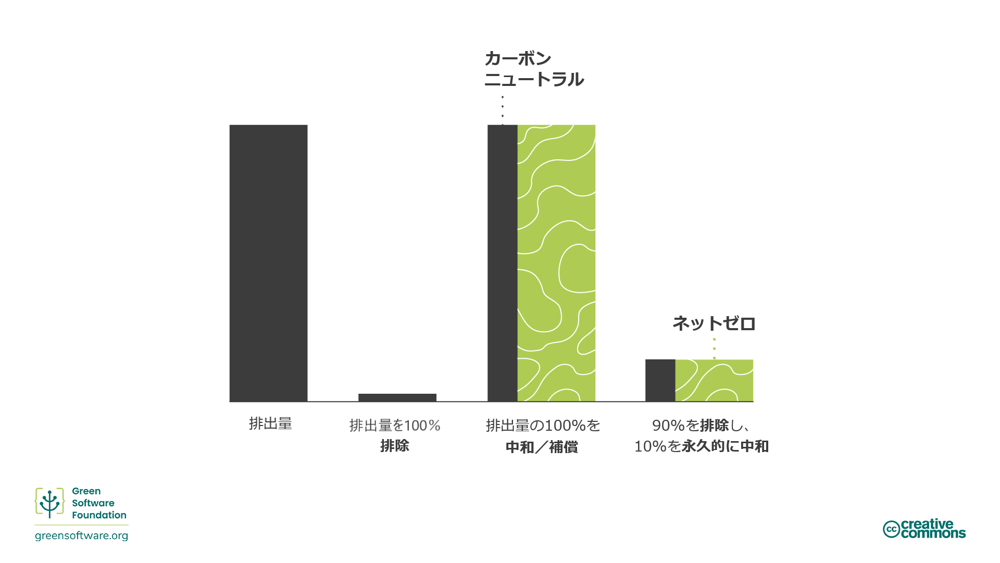
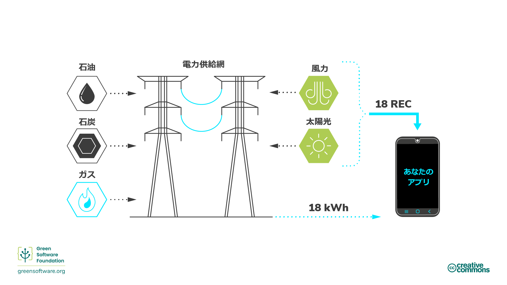
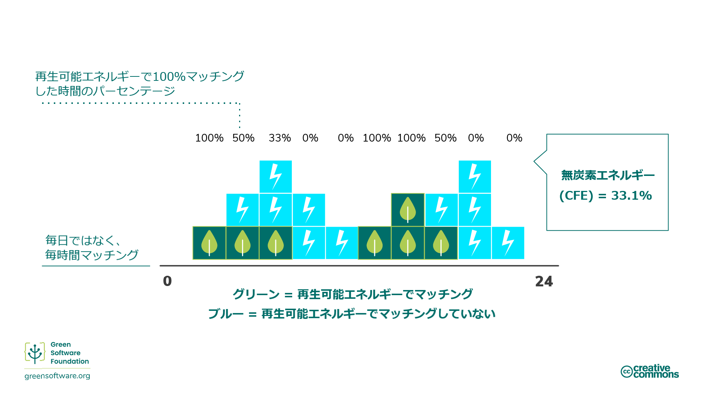

import Quiz from "/src/components/Quiz";

# 気候変動への取り組み

:::tip 原則

_炭素削減のメカニズムを正確に理解する。_

:::

## はじめに

近年、多くの事業者がさまざまな取り組みを通じて、さまざまな気候目標を達成しようとしています。

「ネットゼロ」、「カーボンニュートラル」、「カーボンネガティブ」、「クライメートニュートラル」という用語は、炭素排出を除去、削減、防止することを主な目的として、互換的に使用されています。これらの目標への関心が高まる中、それらの意味するところや、これまで学んできた戦略や測定手順を通じてそれらを達成する方法について、共通の理解を持つことが不可欠です。

## 炭素削減の手法

排出量を削減する方法はたくさんありますが、削減目標を考える際には、削減のメカニズムを正確に理解することが重要です。

### 削減（アベイトメント） / 炭素排除

[科学に基づく目標設定イニシアチブ](https://sciencebasedtargets.org/)Science Based Targets Initiative(SBTi)は、[削減（abatement）](https://sciencebasedtargets.org/resources/legacy/2020/09/foundations-for-net-zero-executive-summary.pdf)と呼ばれるメカニズムを指し、これは、企業の事業運営や[バリューチェーン](https://www.cisl.cam.ac.uk/education/graduate-study/pgcerts/value-chain-defs)に伴うCO2 排出源を大気中に放出しないように排除することを意味します。バリューチェーンとは、製品やサービスを生み出すために必要な、構想から流通までのあらゆる活動のことを指します。これには、エネルギー効率を高めて、エネルギー生成に伴う排出の一部を除去することが含まれます。

技術的または経済的な制約が原因で排除できない排出量が常にあるため、削減だけでは十分ではありませんが、削減はほとんどすべての企業が改善できる領域であるため、すべての組織の戦略の中核をなすものでなければなりません。

これらの残留排出量のバランスをとるためには、オフセット、補償、中和など、他のメカニズムに着目する必要があります。

### オフセット（相殺）

[オフセット](https://www.offsetguide.org/understanding-carbon-offsets/what-is-a-carbon-offset/)とは、自主的炭素市場（VCM）でカーボンクレジットを購入し、排出削減プロジェクトに直接投資することです。VCMは、民間事業者が自主的に、大気中のGHGの除去または削減を認証するカーボンクレジットを売買する分散型市場です。

排出量を相殺するには、排出量を補うために同量のカーボンクレジットを購入する必要があり、1カーボンクレジットは、1トンのCO2吸収または削減に相当します。

これらのプロジェクトからは、生態系の保護から地域コミュニティの活性化まで、さまざまなメリットが得られます。ただし、これらのプログラムが正しく実施され、環境に望ましい効果をもたらし、世界的ネットゼロの達成を目指すためには、検証済み炭素基準（VCS）やゴールドスタンダード（GS）といった、満たさなければならない世界基準があります。

#### SCIとオフセット

カーボンオフセットにはいくつかの制限があるため、組織のSCIスコアでは考慮されていません。たとえば、100％カーボンオフセットされ、100％再生可能エネルギーでまかなわれているクラウドプラットフォーム上で動作する2つのアプリケーションを想像してみてください。アプリケーションAは、リソースを効率的に使用するために多大な時間とリソースを投入していますが、アプリケーションBは非常に非効率的にリソースを使用しています。SCIが有用な指標となるためには、アプリケーションAがアプリケーションBよりも良いスコアを獲得する必要があります。

SCIがオフセットを考慮した場合、いずれのアプリケーションもスコアは0になります。これでは、それらがリソースをどれだけ効率的に使用しているかがわかりませんアプリケーションBは、より多くの炭素分子を大気中に排出していますが、そのスコアは0であり、最低スコアは0であるため、なぜ炭素効率を改善するためにさらに投資するのでしょうか。

組織は、排出量の排除と中和の両方について計画を立てる必要があり、SCIは、ソフトウェアによる排出量の排除を推進するのに役立ちます。そのため、SCIはネットゼロ戦略にとって不可欠な要素となっています。

### 補償 / 炭素回避

[補償](https://www.abatable.com/blog/carbon-removal-vs-carbon-avoidance-projects)とは、企業が自体のバリューチェーンの外で、社会が排出を回避または削減できるようにする行動です。これは、基本的に他の組織の削減プロジェクトに投資することです。

たとえば以下のような行動があります。

- **保全** - 老木を保護することで排出されなかった炭素に基づいてクレジットを創出する。
- **コミュニティ プロジェクト** - これらのプロジェクトは、持続可能な生活方法を導入することで、世界中のコミュニティ、主に未開発のコミュニティを支援します。
- **廃棄物をエネルギーへ** - これらのプロジェクトは、小規模な村落、人間または農業の廃棄物に含まれるメタン/埋立ガスを回収し、電気に変換します。

### 中和 / 炭素除去

[中和](https://www.abatable.com/blog/carbon-removal-vs-carbon-avoidance-projects)とは、企業が自身のバリューチェーン内またはバリューチェーン外で大気中の炭素を除去するためにとる行動のことです。中和とは、CO2を大気中に放出した場合の影響を相殺するために、大気中の炭素を除去して永久に貯蔵することです。たとえば以下のような行動があります。

- 大気中のCO2を除去する**天然の炭素吸収源を強化する**。たとえば森林再生、これは光合成がCO2を自然に除去するからです。森林の拡大には、他の場所の農地や食料供給の動態に影響を及ぼさないようにすることが不可欠であるという課題があります。現代の農法は、炭素が土壌に蓄積される期間を長くすることもできます。
- Direct Air Capture（**直接空気捕捉**）は、空気中からCO2を捕捉し、地下またはコンクリートなどの長寿命製品に永久的に貯蔵する方法です。

これらの方法の有効性は、通常、必要な規模と速度で炭素除去を実現できるかに基づいて評価されます。

炭素除去プロジェクトの場合、耐久性が重要視されます。プロジェクトの耐久性とは、二酸化炭素をどれだけの期間にわたって大気から遮断できるかを表します。

短期耐久性は100年まで、中期耐久性は100年～1,000年、長期耐久性は1,000年以上の耐久性です

- 地球の自然な炭素循環に依存するソリューションには、数十年という短期的な耐久性しかありません。たとえば、林業プロジェクトの耐久性は、40年から100年です。
- Direct Air Captureなどの工学的なソリューションは、多くの場合、千年単位という長期の耐久性があります。たとえば、Direct Air Captureの耐久性は10,000年です。
- 一般的に、長期的なプロジェクトは、短期的なプロジェクトよりも桁違いに費用がかかります。一度排出された炭素は、5,000年もの間、大気中に存在し続けます。ネットゼロとみなされるためには、排出された炭素を永久に除去する必要があります。

短期的な炭素除去プロジェクトでは、炭素を除去できるのは100年間だけで、その後はまた大気中に戻って地球を温暖化させます。これは、中和よりも削減が好まれる理由の1つです。炭素を放出しない方が、炭素を放出してから5,000年間大気中に放出しないようにするよりもはるかに良いのです。

## 気候変動への取り組み

カーボンニュートラルからネットゼロまで、組織が取り組むことができる気候変動低減戦略は多岐にわたります。それぞれの意味や影響の違いを理解することで、自身の組織に適した戦略を決定することができます。

### カーボンニュートラル

カーボンニュートラルを達成するためには、組織は排出量を測定し、その合計と、炭素削減プロジェクトによる排出量オフセットとを一致させる必要があります。これは、炭素除去プロジェクト（中和）と炭素回避プロジェクト（補償）を含む場合があります。

カーボンニュートラルは、国際的に認められた基準で定義されています。すなわち[PAS 2060](https://info.eco-act.com/hubfs/0%20-%20Downloads/PAS%202060/PAS%202060%20factsheet%20EN.pdf)です。これは、組織が削減目標を設定することを推奨するものですが、排出量削減を要求するものではありません。したがって、カーボンニュートラルとみなされるためには、組織は炭素排出量の削減に資源を投入することなく、測定とオフセットだけを行えばよいのです。

カーボンニュートラルになるためには、直接排出（スコープ1と2）をカバーする必要があります。一般的に組織は、スコープ1と2からの排出量と、スコープ3からのビジネストラベル排出量を測定してオフセットすることが期待されています。ただし、それを含めるための具体的な要件はありません。

カーボンニュートラルは、測定を奨励するものであるため、どのような組織にとっても重要な第一歩です。しかし、すべての組織の排出量を相殺できるほどのカーボンオフセットは、世界には存在しません。したがって、削減を含まない戦略はどのようなものであれ、パリ気候協定が設定した1.5°C目標を世界が達成することに役立ちません。そこで登場するのが、ネットゼロです。

### ネットゼロ

ネットゼロとは、最新の気候科学に基づいて排出量を削減し、炭素除去（中和）によって残りの残留排出量のバランスをとることを意味します。ネットゼロは、定義上、1.5°Cの進路に沿った排出削減を要求します。2050年までに世界の排出量を実質ゼロにするためには、すべての企業がネットゼロを実行する必要があります。

ネットゼロとカーボンニュートラルの決定的な違いは、ネットゼロが中和や補償ではなく、削減に重点を置いている点です。ネットゼロ目標は、排出量を除去し、除去できない残留排出量に対してのみオフセットを使用することを目指します。

[ネットゼロの基準](https://sciencebasedtargets.org/resources/files/foundations-for-net-zero-full-paper.pdf)は、[科学に基づく目標設定イニシアチブ（SBTi）](https://sciencebasedtargets.org/)によって策定されています。今世紀半ばまでに全GHG排出量の約90％を削減するレベルに達した場合、地球温暖化を1.5°Cに抑制できる確率は66％であるとの試算があります。したがって、ネットゼロの目標を達成するためには、2050年までに組織の排出量を90％削減する必要があります。残りの排出量は、中和や永久炭素除去を利用してオフセットするしかありません。

ネットゼロ戦略とは、大気中の実際の炭素量が一定のままであることを意味します。

また、ネットゼロ目標を達成するためには、直接および間接的、すなわちサプライチェーン排出量（スコープ1、2、3）をカバーする必要があります。そのため、バリューチェーン全体をネットゼロ目標のスコープ（範囲）に含める必要があります。これは重要なことであり、なぜならば、スコープ3は排出量の大半を占めることが多いからです。

#### ネットゼロ戦略の一環としてのSCI

SCIは、特に排出量削減を推進するために設計された指標です。スコアを下げる唯一の方法は、排出量を削減する活動に時間と資源を投じることです。SCIが除去活動として認識する活動は、アプリケーションのエネルギー効率化、ハードウェアの効率化、低炭素エネルギー源の消費のみです。オフセットはあらゆる気候変動対策に不可欠な要素ですが、オフセットは排除ではないため、SCI指標には含まれません。

ネットゼロ戦略では、排出量を排除するだけでなく、中和する方法も計画する必要があります。SCIは、ソフトウェアに起因する排出の排除を推進する組織を支援しています。そのため、SCIはネットゼロ戦略にとって不可欠な要素となっています。

### 100％再生可能

組織が再生可能エネルギー100％の目標を設定する場合、再生可能エネルギーで**マッチングさせること**と、再生可能エネルギーで**電力供給すること**とを区別することがあります。

「**電力供給する**」とは、水力ダムなどの再生可能な電源から直接電力を供給することを意味します。このシナリオでは、デバイスに流れ込む電気はその供給源だけから由来するため、100％再生可能エネルギーで動いていると自信を持って言えるのです。

ほとんどの人々が相互接続された送電網で生活しており、多くの生産者が電力を供給し、多くの消費者が電力を取り出しています。このことは、あなたのデバイスに入る電気が、送電網に入るすべての電気の混合物であることを意味します。たとえば、送電網の風力供給が5％しかないとします。その場合、風力発電の電気を5％、化石燃料発電の電気を95％得ていることになります。

個々の電子を追跡することはできません。風力発電所からの電気が送電網に到達すると、化石燃料発電所からの電気と混ざり合います。したがって、消費者は使用している電気が再生可能資源からのみ由来していると主張することはできないのです。

#### 再生可能エネルギー証書 (REC)

<!--  -->

この問題を解決するために、再生可能エネルギー プラントは、2つのものを販売しています。1つは電力で、送電網を介して販売します。もう1つは、RECすなわち[再生可能エネルギー証書](https://www.epa.gov/green-power-markets/renewable-energy-certificates-recs)です。1RECは1kWhのエネルギーに相当します。

再生可能エネルギーによる100%のマッチングを望み、かつ電力網に接続している場合は、消費する電力量に見合うだけのRECを購入することが解決策となります。たとえば、あなたが毎日100kWhの電力を消費する場合、再生可能エネルギーによって100％マッチングさせるためには、100のRECを購入する必要があります。

組織が100％再生可能目標を設定した場合、市場でRECを購入することが、その目標を達成するためによく採用される解決策です。

#### PPA

また、RECと並んでPPAという用語も耳にすることがあります。PPAとは[Power Purchase Agreement（電力購入契約）](https://ppp.worldbank.org/public-private-partnership/sector/energy/energy-power-agreements/power-purchase-agreements)のことで、これもRECを購入する方法の1つです。あるデータセンターに年間500MWhの電力が必要であると見積もった場合、再生可能エネルギー発電所から年間500MWhを購入するPPAに署名することができます。そうすれば、その発電所と関連するすべてのRECを入手することができます。

PPAは通常、超長期契約です。再生可能エネルギー発電所は、長年にわたり電力の買い手をすでに持っているため、それらの契約のいずれかで資金を調達することができるのです。

PPAは**追加性（additionality）**と呼ばれるものを奨励しています。PPAを購入することで、新しい再生可能エネルギー発電所の設立を後押しします。PPAは、誰もが100％再生可能エネルギーにアクセスできる、私たちを未来に導くソリューションです。

### 24時間365日のマッチング

100%再生可能エネルギーという主張に関して重要な問題は、マッチングの精度がどの程度かということです。年単位、月単位、週単位、日単位、時間単位で合計し、相殺するのでしょうか？この問題は極めて重要であり、なぜなら、本当の意味で再生可能エネルギーへの移行を実現するには、常に100％の電力を再生可能エネルギーのような低炭素エネルギー源から得る必要があるからです。このような細かなマッチングは、一般的に_[24時間365日マッチング](https://www.epa.gov/green-power-markets/247-hourly-matching-electricity)_と呼ばれています。

24時間365日マッチングは、100％再生可能エネルギーによる送電網への移行を加速させるために採用すべき多くの戦略の1つです。たとえば、[Google](https://sustainability.google/progress/energy/)と[Microsoft](https://blogs.microsoft.com/blog/2021/07/14/made-to-measure-sustainability-commitment-progress-and-updates/)は、2030年までに24時間365日マッチングを実現することを公約しています。

#### 毎日と毎時のマッチング

ある組織の需要曲線が次のようなものであると仮定してください。青い四角はそれぞれ1kWhを表すものとします。

その組織は、曲線的に発電する風力発電所からRECを購入しているため、緑の四角はそれぞれ1つのRECを表します。日ごとのマッチングとは、その組織が18kWhを消費し、18のRECを購入したことを意味します。その結果、正味でゼロになりました。したがってその組織は、**毎日再生可能エネルギーによって100％マッチングしている**と言うことができます。

ただし、時間単位（ここでは各四角形が2時間に相当）で見ると、少し異なって見えます。

総エネルギー消費量は、依然として18kWhです。ただし、1日の中で、再生可能エネルギーで100％マッチングする時間はほんの数時間です。そのため、数時間にわたって、必要以上の再生可能エネルギーが供給されることになります。逆に、得られる再生可能エネルギーは、ほとんどの時間帯において、必要な量よりもはるかに少ないのです。

上記の例では、**1日のうち6時間だけ、時間単位で再生可能エネルギーにより100％マッチングしている**ことになります。

#### カーボンフリー エネルギー

24時間365日のマッチングにどの程度成功しているかを表す数字が、カーボンフリー エネルギーのパーセンテージです。

カーボンフリー エネルギーの定義は、[特定の場所で時間単位で消費される無炭素エネルギーの平均パーセンテージ](https://cloud.google.com/sustainability/region-carbon#understanding)です。

したがって、先ほどの例では、毎日のマッチングで測定した場合、再生可能エネルギーで100％マッチングしていることになります。ただし、時間ごとのマッチングを用いて測定した場合、33.1％のマッチングにとどまっています。**したがって、CFE（カーボンフリー エネルギー比率）比率は33.1％となります。**

#### 24時間365日のマッチング戦略の一環としてのカーボン アウェアネス

カーボン アウェアな（炭素に対する意識の高い）コンピューティング（コンピュータ使用）とは、電気的な炭素強度信号に反応し、ソフトウェアの**動作**を変更して、炭素排出量を減らします。また、カーボン アウェアネスは、24時間365日のマッチング目標を達成し、CFE比率を高めるのにも役立ちます。

動作変化の一例として、再生可能エネルギーがより多く利用できる時間帯にコンピュータ使用をシフトさせることが挙げられます。たとえば、機械学習モデルのトレーニング開始を遅らせたり、ノートパソコンの充電を遅らせたりして、電力の炭素強度が低く、再生可能エネルギーの供給量が多い時間帯にシフトさせます。

:::tip ヒント
カーボンアウェア・コンピューティング（炭素に対する意識の高いコンピュータ使用）は、組織のCFEパーセンテージを高めるのに役立ちます。
:::

## まとめ

- 気候変動への対抗全般に役立ち、一般的に適用されている手法が多数あります。これらは一般的に、炭素除去（elimination）（削減（abatement）ともいう）、炭素回避（補償（compensating）ともいう）、炭素除去（removal）（中和（neutralizing）ともいう）に分類されます。
- アベイトメント（削減）は、エネルギー効率を高めて、エネルギー生成に伴う排出の一部を除去することも含みます。炭素を完全に除去することは不可能ですが、アベイトメント（削減）は気候変動に対抗する最も効果的な方法です。
- 補償は、再生可能エネルギー源の導入、持続可能な生活習慣、リサイクル、植樹などを含みます。
- 中和とは、CO2を大気中に放出した場合の影響を相殺するために、大気中の炭素を除去して永久に貯蔵することです。中和は、短中期的に大気中の炭素を除去する傾向があります。
- 総排出量と炭素削減プロジェクトによる排出オフセット量の合計がマッチ（一致）している組織は、カーボンニュートラルな組織であるといえます。
- ネットゼロは、排出量をゼロにし、パリ気候協定で設定された1.5°C目標を達成する際に除去できない残留排出量だけを相殺することを目的としています。
- SCIは、エネルギー効率、ハードウェア効率およびカーボンアウェアネスによって排出量を除去することが、スコアを下げる唯一の方法であることを考慮して慎重に設計されています。別の中和戦略と組み合わせることで、組織のネットゼロ戦略の基礎を形成できます。
- 組織が再生可能エネルギー100％の目標を設定する場合、再生可能エネルギーによる「マッチング」または「電力供給」のいずれかであり、「再生可能エネルギーによる「電力供給」は、デバイスに流入する電子が再生可能エネルギー源からしか得られないことを意味します。これは、PPAの一環としてRECを購入することで実現できます。
- 24時間365日マッチングは、100％再生可能エネルギーによる送電網への移行を加速させるために採用すべき多くの戦略の1つです。

## クイズ

<Quiz
  QuizList={[
    {
      question: "中和とは何ですか？",
      answers: [
        {
          text: "大気中から炭素を除去する行動",
          isCorrect: true,
        },
        {
          text: "炭素排出量を削減する行動",
          isCorrect: false,
        },
        {
          text: "気候変動への取り組みを支える行動",
          isCorrect: false,
        },
      ],
    },
    {
      question: "中和の重要な考慮事項とは？",
      answers: [
        {
          text: "中和量",
          isCorrect: false,
        },
        {
          text: "中和の耐久性",
          isCorrect: true,
        },
        {
          text: "中和のコスト",
          isCorrect: false,
        },
      ],
    },
    {
      question:
        "エネルギー消費に伴う炭素の排出を中和するために、どのようなアプローチが可能ですか？",
      answers: [
        {
          text: "自然の炭素吸収源を強化する",
          isCorrect: false,
        },
        {
          text: "直接空気捕捉",
          isCorrect: false,
        },
        {
          text: "上記の双方",
          isCorrect: true,
        },
      ],
    },
    {
      question: "ネットゼロの基準設定に責任を負っているのは？",
      answers: [
        {
          text: "SBTi",
          isCorrect: true,
        },
        {
          text: "STBi",
          isCorrect: false,
        },
        {
          text: "STIB",
          isCorrect: false,
        },
      ],
    },
    {
      question: "ネットゼロ世界目標とは？",
      answers: [
        {
          text: "2050年までに排出量を100%排除する。",
          isCorrect: false,
        },
        {
          text: "2050年までに排出量を90%排除する。",
          isCorrect: true,
        },
        {
          text: "2050年までに排出量を80%排除する。",
          isCorrect: false,
        },
      ],
    },
    {
      question: "アベイトメント（削減）/排除の主な目的は何ですか？",
      answers: [
        {
          text: "金融契約によるカーボン排出量のオフセット（相殺）",
          isCorrect: false,
        },
        {
          text: "第一に大気中に炭素を排出しないこと",
          isCorrect: true,
        },
        {
          text: "エネルギー効率の改善により、企業の事業活動に伴う排出量を削減する",
          isCorrect: false,
        },
      ],
    },
    {
      question: "オフセットを取り入れた測定プロトコルまたは測定方法はどれですか？",
      answers: [
        {
          text: "GHGプロトコル",
          isCorrect: true,
        },
        {
          text: "SCI",
          isCorrect: false,
        },
      ],
    },
    {
      question: "カーボンニュートラルであるための最低限の基準とは？",
      answers: [
        {
          text: "スコープ1～3からの排出を、中和または補償により相殺しなければならない。",
          isCorrect: false,
        },
        {
          text: "スコープ1および2からの排出を、中和または補償により相殺しなければならない。",
          isCorrect: true,
        },
        {
          text: "スコープ1～2からの排出量とスコープ3からのビジネストラベル排出量を、中和または補償によって相殺しなければならない。",
          isCorrect: false,
        },
      ],
    },
  ]}
/>
