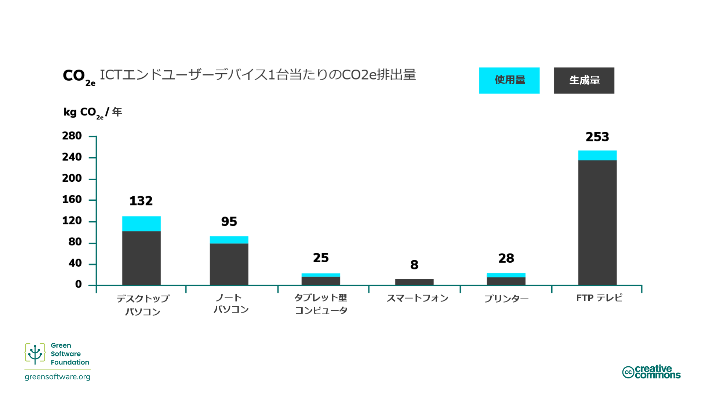
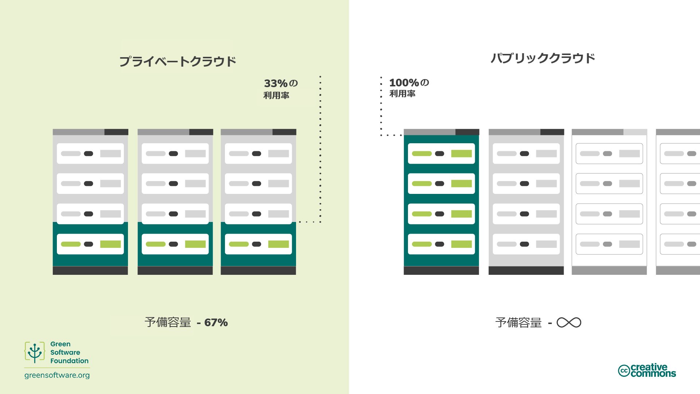

import Quiz from "/src/components/Quiz";

# ハードウェアの効率性

:::tip 原則

_エンボディドカーボンの使用量を最小限に抑える_

:::

## はじめに

ソフトウェアの製造過程で使用するハードウェアは、グリーンソフトウェア実践者にとって考慮すべき重要な要素です。

ハードウェアに関しては、エンボディドカーボンが目に見えないコストであり、ハードウェアの製造、破壊、稼働に伴う影響を減らすためのさまざまな対策があることを知ることができます。たとえば、ハードウェアの寿命の延長やクラウドサーバーへの切り替えなどです。

## キーコンセプト

### エンボディドカーボン

これを読むために使用しているデバイスは、製造時に炭素を発生させ、寿命に達して廃棄されることでさらに炭素を発生させる可能性があります。エンボディドカーボン（「embedded carbon」とも呼ばれる）とは、デバイスの製造と廃棄の際に排出される炭素汚染量のことです。

ソフトウェアを実行しているコンピューターの炭素汚染総量を計算する場合、コンピューターの動作に伴う炭素汚染とコンピューターのエンボディドカーボンの双方を考慮する必要があります。

エンボディドカーボンは、エンドユーザーのデバイスごとに大きく異なります。チューリッヒ大学の研究で示されているように、一部のデバイスの場合、製造時に排出される炭素は、使用時に排出される炭素よりもはるかに多くなります。その結果、エンボディドカーボンのコストが、電力の炭素コストよりもはるかに高くなることがあります。

エンボディドカーボンの観点から考えると、たとえ電気を消費しないデバイスであっても、その寿命にわたって炭素排出の原因となります。

### 償却

エンボディドカーボンに配慮する方法として、デバイスの想定寿命にわたって炭素を償却する方法があります。たとえば、サーバーを構築するのに4000kgのCO2eqを消費し、その寿命が4年間と仮定します。償却とは、サーバーが年間1000kgのCO2eqを排出すると言えることを意味します。

## ハードウェアの効率を改善するには

エンボディドカーボンを考慮した場合、コンピューターを購入するまでに、コンピューターはすでにかなりの炭素を排出していることは明らかです。コンピューターの寿命は限られているため、いずれは最新のワークロードに対応できなくなり、買い替えが必要になります。これらの観点から、ハードウェアは炭素の代理であり、炭素効率を上げることが私たちの目標である以上、ハードウェアの効率も上げなければなりません。

ハードウェアの効率化には、大きく分けて2つのアプローチがあります。

- エンドユーザーのデバイスの場合、ハードウェアの**寿命を延ばす**こと
- クラウドコンピューティングの場合、デバイスの**利用率を上げる**こと

### ハードウェアの長寿命化

先ほどの例で言えば、サーバーの寿命をあと1年延ばすことができれば、償却炭素量は1000kg CO2eq/年から800kg CO2eq/年に減少します。

ハードウェアは、故障したり、最新のワークロードを処理できなくなったりすると、寿命です。もちろん、ハードウェアはいずれ必ず故障しますが、開発者としては、ソフトウェアを使用して古いハードウェアで動作するアプリケーションを構築し、ハードウェアの寿命を延ばすことができるのです。

### デバイスの稼働率を高める

クラウド空間では、ハードウェアの効率化はほとんどの場合、サーバーの稼働率増加につながります。エンボディドカーボンのコストを考えると、20%の稼働率で5台のサーバーを使用するよりも、100%の稼働率で1台のサーバーを使用する方が良いのです。車を5台持っていて毎日違う車を使用するよりも、1台持っていて毎日使用する方がずっと良いのと同じように、サーバーも複数台を容量未満で使用するよりも、フル稼働させた方がずっと効率が良いのです。排出量は同じでも、使用されるエンボディドカーボンはずっと少なくなります。

サーバーを十分に稼働させない一般的な理由は、ピーク容量を考慮するからです。20%でサーバーを稼働させるということは、パフォーマンスに影響を及ぼすことなく、需要のピークに対応できることを意味します。しかし、その一方で、アイドル状態にあるすべての予備容量は、エンボディドカーボンの浪費を意味します。ハードウェアの効率化とは、すべてのハードウェアデバイスをできるだけ長く、できるだけ多く活用することを意味します。

これはパブリッククラウドの主な利点の1つで、スケールアップする必要がある場合には、不足を補うためにスペースが確保されていることはご承知の通りです。複数の組織がパブリッククラウドを利用することで、必要な人がいつでも空き容量を利用できるようになり、サーバーのアイドル状態がなくなります。

注意しなければならないのは、単にオペレーションをパブリッククラウドに移行するだけでは、排出量を自動的に減らすことはできないということです。パブリッククラウドは単に、削減が可能なようにソフトウェアを再設計できるスペースを提供するだけです。

## まとめ

- エンボディドカーボンとは、デバイスの製造と廃棄の際に排出される炭素汚染量のことです。
- 総炭素汚染量を計算する際には、コンピューターの動作時に排出される炭素と、コンピューターの製造と廃棄に伴うエンボディドカーボンの両方を考慮する必要があります。
- デバイスの寿命を延ばすことで、排出される炭素を償却し、年間のCO2eqを削減する効果があります。
- クラウドコンピューティングは、デマンドシフト（需要シフト）やデマンドシェーピング（需要形成）を適用できるため、オンプレミス・サーバー（on-premise server）よりもエネルギー効率が高くなります。

## クイズ

<Quiz
  QuizList={[
    {
      question: "エンボディドカーボンとは？",
      answers: [
        {
          text: "デバイスの製造時に排出された炭素",
          isCorrect: false,
        },
        {
          text: "デバイスの製造と廃棄に伴う炭素排出量",
          isCorrect: true,
        },
        {
          text: "デバイスの廃棄に伴う炭素排出量",
          isCorrect: false,
        },
      ],
    },
    {
      question: "コンピューターの総炭素汚染は、何が原因でしょうか？",
      answers: [
        {
          text: "デバイスのエンボディドカーボン",
          isCorrect: false,
        },
        {
          text: "デバイスの稼働時に発生する排出量",
          isCorrect: false,
        },
        {
          text: "上記の双方",
          isCorrect: true,
        },
      ],
    },
    {
      question:
        "ハードウェアの効率を高める2つのポイントとは？",
      answers: [
        {
          text: "寿命の延長と使用頻度を減らすこと",
          isCorrect: false,
        },
        {
          text: "寿命の延長と、使用頻度を増やすこと",
          isCorrect: true,
        },
        {
          text: "寿命の短縮と、使用頻度を増やすこと",
          isCorrect: false,
        },
      ],
    },
    {
      question:
        "ハードウェアの効率は、デバイスの炭素汚染にどのような影響を及ぼしますか？",
      answers: [
        {
          text: "前者は後者を除去する。",
          isCorrect: false,
        },
        {
          text: "前者は後者を増加させる。",
          isCorrect: false,
        },
        {
          text: "前者は後者を減少させる。",
          isCorrect: true,
        },
      ],
    },
    {
      question:
        "エンボディドカーボンが1000kg CO2eqで、寿命が5年のデバイスの償却炭素量はいくらでしょうか？",
      answers: [
        {
          text: "200kg CO2eq/年",
          isCorrect: true,
        },
        {
          text: "20kg CO2eq/年",
          isCorrect: false,
        },
        {
          text: "200kg CO2eq",
          isCorrect: false,
        },
      ],
    },
    {
      question:
        "サーバーをパブリッククラウド上に置く場合と、プライベートクラウド上に置く場合とを比較して、どのような違いがあるでしょうか？",
      answers: [
        {
          text: "パブリッククラウドでは、素早くスケールアップする（機能を高める）ことができる。",
          isCorrect: false,
        },
        {
          text: "プライベートクラウドでは、需要の急増に対応するために、サーバーを容量未満で稼働させる必要がある。",
          isCorrect: false,
        },
        {
          text: "上記のいずれも正しい。",
          isCorrect: true,
        },
      ],
    },
    {
      question:
        "ハードウェアの排出量を計算する際に、エンボディドカーボンを含めることがなぜそれほど重要なのでしょうか？",
      answers: [
        {
          text: "エンボディドカーボンの排出量は、デバイスの電力使用による排出量よりも多い場合があるから。",
          isCorrect: true,
        },
        {
          text: "エンボディドカーボンは、デバイスからの排出量全体のうち、少ないながらも重要な割合を占めるから。",
          isCorrect: false,
        },
        {
          text: "エンボディドカーボンは、デバイスの総排出量を計算する際に考慮すべき唯一の排出源であるから。",
          isCorrect: false,
        },
      ],
    },
  ]}
/>
