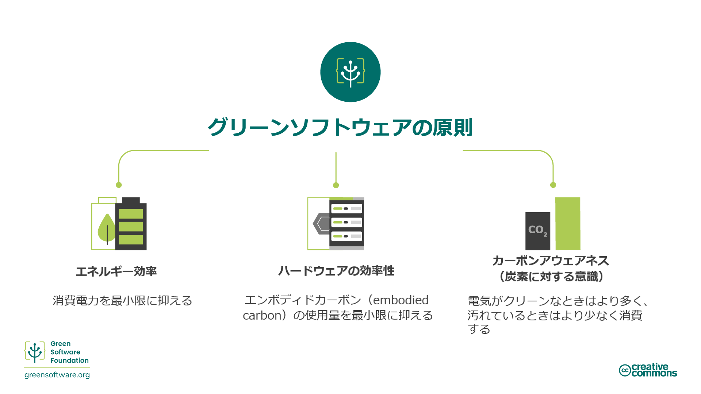
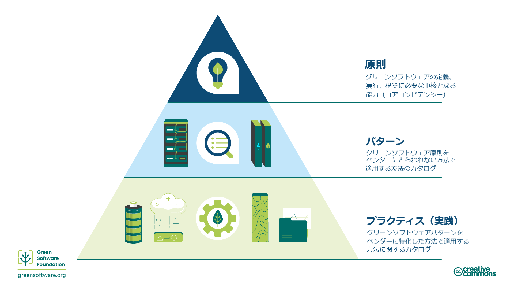

:::note
This is a community contributed translation. It has limited support and might not match the latest English language version of the course.
これはコミュニティによって提供された翻訳です。サポートが限定されているため、コースの最新の英語版と一致しない可能性があります。
:::

## グリーンソフトウェアとは？

グリーンソフトウェアは、気候科学、ソフトウェア設計、電力市場、ハードウェアおよびデータセンター設計が交差する新興分野です。

グリーンソフトウェアとは、炭素効率の高いソフトウェアであり、炭素の排出が最小限のソフトウェアを意味します。ソフトウェアの炭素排出量を削減できる活動は、エネルギー効率、カーボン アウェアネス（炭素に対する意識）およびハードウェア効率の3つだけです。このトレーニングでは、それらすべての概念、それらを自身のプロセスに適用する方法、それらを測定する方法、さらにはこの領域をガイドし監視する国際的なガイドラインや組織について説明します。

## 対象となる読者

ソフトウェアの構築、展開または管理のプロセスに携わっているすべての人。これらの原則を学ぶことで、グリーンソフトウェア実践者は、自身のアプリケーションの炭素汚染に有意義な影響を及ぼす決定を下すことができます

## 沿革

2019年に、グリーンソフトウェア工学の原点となる8つの原則が発表されました。この2022年版の原則は、長年にわたって寄せられたフィードバックをもとに、いくつかの原則を統合し、気候変動への取り組みの理解に関する新たな原則を追加しました。

## グリーンソフトウェア実践者になるには

以下のトレーニングでは、グリーンソフトウエア実践者が知っておくべき6つの重要な領域について説明します。

1. **炭素効率**: 炭素の排出を可能な限り少なくする。
2. **エネルギー効率**: エネルギーの使用量を可能な限り少なくする。
3. **カーボン アウェアネス**: 電気がクリーンなときはより多く、電気が汚れているときはより少なく消費する。
4. **ハードウェアの効率**: エンボディド カーボンの使用量を最小限に抑える。
5. **測定**: 測定できないものは改善できない。
6. **気候変動への取り組み**: 炭素削減のメカニズムを正確に理解する。

これらの各章では、いくつかの新しい概念を紹介し、それが気候の観点から重要である理由と、それらをグリーンソフトウェアの実践にどのように適用できるかを詳しく説明します。

## 原則、パターン、そして実践

このコースの主要な分野と内容は、グリーンソフトウェアの**原則**と、グリーンソフトウェアを定義、実行、構築するために必要な中核となる能力についての説明です。

グリーンソフトウェア[**パターン**](https://patterns.greensoftware.foundation/)は、1つまたは複数の原則を実際の例でどのように適用するかを示す具体例です。原則がグリーンソフトウェアを支える理論を説明しているのに対して、パターンはソフトウェア実践者が今日のソフトウェア・アプリケーションで使用できる実践的なアドバイスです。パターンはベンダー中立的（vendor-neutral）です。

グリーンソフトウェア・**プラクティス（実践）**とは、特定のベンダーの製品に適用されるパターンであり、その製品をより持続可能な方法で使用する方法を実践者に提供します。

プラクティスはパターンを参照し、パターンは原則を参照すべきものです。

また、Green Software Foundationは、さまざまなカテゴリーにわたる[ベンダー中立的なグリーンソフトウェア パターンのカタログ](https://patterns.greensoftware.foundation/)も発行しています。
 

