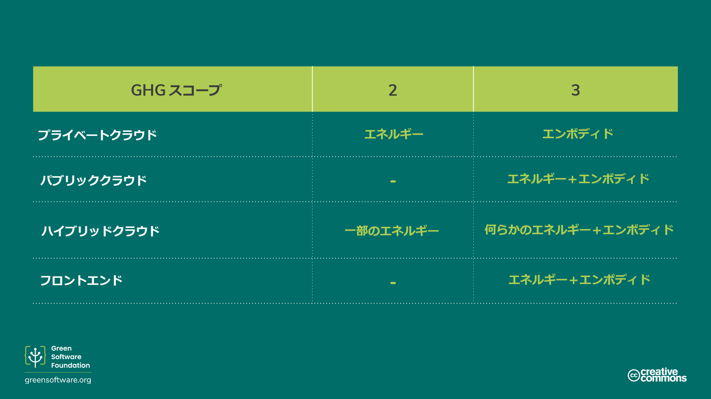

import Quiz from "/src/components/Quiz";

# 測定

:::tip 原則

_測定できないものは改善できない。_

:::

## はじめに

温室効果ガス（GHG）プロトコルは、組織が総炭素排出量を測定する際に最も一般的に使用している方法です。GHGのスコープ（範囲）を理解し、業界標準に照らして自身のソフトウェアを測定する方法を理解することで、グリーンソフトウェアの原則をどの程度適用できているか、またどの程度改善しなければならないかを確認することができます。

GHGプロトコルを補完するために、ソフトウェア炭素強度（SCI）仕様を用いることも可能です。GHGはあらゆる種類の組織に適する汎用的な尺度であるのに対して、SCIはソフトウェアの排出率を測定することに特化しており、これらの排出量の削減にインセンティブを与えるように設計されています。

GHGは総排出量を測定するためのプロトコルであり、SCIはソフトウェアによる排出の排除を可能にするツールです。

それぞれの測定方法に着目して、それぞれの計算方法を説明します。

## GHGプロトコル

[温室効果ガスプロトコル](https://ghgprotocol.org)は、最も広く使用され、国際的に認められている温室効果ガス計算基準です。フォーチュン500社の[92%](https://ghgprotocol.org/about-us)が、炭素排出量の計算と公表の際にGHGプロトコルを使用しています。

GHGプロトコルでは、排出量を3つのスコープに分類しています。

- **スコープ１**: 現場での燃料燃焼や車両など、報告組織が所有または管理している**オペレーション**からの直接排出量。
- **スコープ２**: 熱や電気など、**購入したエネルギーからの排出発生**と関連する間接的な排出量。
- **スコープ３**: その他、従事しているあらゆる活動からの間接的な排出量。**組織のサプライチェーンからのあらゆる排出量**を含み、従業員の出張や、顧客が製品を使用する際に消費する電力など、すべての排出を含みます。

スコープ3は、バリューチェーン排出量と呼ばれることもあり、多くの組織にとって最も重要な排出源であり、計算が最も複雑です。これらは、製品やサービスの構想から流通まで、製品やサービスの創造に必要なあらゆる活動を包含しています。たとえばノートパソコンの場合、その製造に使用されるすべての原材料は、抽出・加工される際に炭素を排出します。バリューチェーン排出量には、ノートパソコンの使用による排出量も含まれます。すなわち、ノートパソコンが顧客に販売された後、稼働するために使用されたエネルギーからの排出量も含まれます。

このアプローチを通じて、世界中のあらゆる組織や個人が排出するGHGを集計し、グローバルな総量を算出することが可能になります。

### 私のアプリケーションはどのスコープに該当するのでしょうか？

GHGプロトコルはスコープ1〜3に従ってソフトウェアの排出量を分類することを求めていることを、すでに見てきました。しかし、ソフトウェアの場合はどうなのでしょうか

ほとんどの組織において、さまざまなアーキテクチャやさまざまな環境で動作する多くのアプリケーションがあります。したがって、特定のシナリオに応じて、生成されたエネルギーとエンボディドカーボンの双方の観点から、排出量が該当するスコープ（範囲）が決定します。

- **自身で所有しているサーバー上で動作するクラウドアプリケーションの場合**、ソフトウェアのエネルギー使用量はスコープ2に該当し、すべてのサーバーのエンボディドカーボンはスコープ3に該当します。
- **パブリッククラウド上で動作するクラウドアプリケーションの場合**、アプリケーションのエネルギー使用量も、エンボディドカーボンも、スコープ3に該当します。
- **プライベートクラウドとパブリッククラウドのハイブリッドアプリケーションを稼働**させているシナリオでは、その排出量の一部はスコープ2に、他の一部はスコープ3に該当します。
- 同様に、顧客向けの**フロントエンド・アプリケーション**の場合、顧客がデバイスに電力を供給するためにエネルギーを購入するため、エネルギー使用量は組織のスコープ3に該当します。

ソフトウェアの場合、自身が所有しているインフラ、レンタルしているインフラ、消費者が所有しているインフラのいずれで実行されているかにかかわらず、排出量を分類する際に考慮すべき3つのパラメータがあります。

- どれくらいのエネルギーを消費するか
- その電気がどれだけクリーンか、又は汚れているか
- 機能するためにどれだけのハードウェアが必要か

### ソフトウェアの炭素排出量の合計を算出することは可能でしょうか？

ソフトウェアの炭素排出量の合計を算出するには、エネルギー消費量、炭素強度およびソフトウェアが実行されているハードウェアに関する詳細なデータにアクセスする必要があります。これは、テレメトリやログで使用状況を追跡できる組織独自のクローズドソース・ソフトウェア製品の場合であっても、データを収集するのが困難です。

オープンソース・ソフトウェアのメンテナ－（保守管理者）は、自分たちのソフトウェアがどこでどのように使用され、どれだけのエネルギーが消費され、どのハードウェアで使用されているのかを、同じように可視化することはできません。

オープンソースプロジェクトには、通常、複数の組織から複数の貢献者が参加しています。その結果、誰が排出量の計算に責任を負うのか、また誰が排出量の削減に責任を負うのかが不明確になります。また、オープンソース・ソフトウェアが一般的なエンタープライズスタックの90％を占めていることを考えると、考慮されていない大量の炭素排出があることは明らかです。

### 合計はすべてを物語っているのでしょうか？

合計は、何かの状態を説明する1つの指標に過ぎません。正しい判断を下すためには、さまざまな指標に着目する必要があります。

あなたが組織のリーダーで、ソフトウェアの排出量削減を任されているシナリオを想像してみてください。第1四半期に排出量を測定し、合計34トンとなったとします。排出量を削減するプロジェクトに投資した結果、第2四半期までに排出量が45トンに増加したことが判明したとします。これは、あなたの取り組みが失敗したことを意味するでしょうか？

必ずしもそうではありません。合計だけではすべてがわかるわけではないため、排出量削減プロジェクトが成功したかを判断するには、他の指標を確認する必要があることがわかっています。たとえば、炭素総量だけでなく、炭素強度も測定した場合、別の視点が得られるかもしれません。同じプロジェクトにおいて、第1四半期の炭素強度が3.3g CO2eq/ユーザー、第2四半期の炭素強度が2.9g CO2eq/ユーザーであった場合、あなたはプロジェクトが成功したと考え、さらに投資を継続するかもしれません。

合計量は、自身の組織の炭素排出量が全体的に増加したことを示した一方で、炭素強度は、今後の方針を決定するのに役立つ、より完全な見通しを示しました

## ソフトウェア炭素強度仕様

[ソフトウェア炭素強度（SCI）仕様](https://grnsft.org/sci)は、グリーンソフトウェア財団の標準作業部会が開発した手法で、ソフトウェアアプリケーションを持続可能性の側面に沿って採点し、排出量ゼロに向けた行動を促すように設計されています。

SCI仕様はGHGプロトコルに代わるものではありませんが、ソフトウェアチームが自分たちのソフトウェアが二酸化炭素排出量の面でどのように動作するかを理解し、より多くの情報に基づく意思決定を行えるようにするための追加指標です。GHGプロトコルが**総排出量を計算**するのに対して、SCIは**排出率**を計算します。自動車でいえば、SCIは1ガロン当たりの走行距離のようなもので、GHGプロトコルは自動車メーカーが毎年生産するすべての自動車のカーボンフットプリントのようなものです。

それは、ソフトウェアの炭素排出量をスコープ1～3に分類する代わりに、**運用排出量**（ソフトウェアの実行による炭素排出量）と**エンボディドカーボン排出量**（ソフトウェアの実行に必要な物理的資源からの炭素排出量）に分類します。またそれは、合計ではなく強度なので、オープンソース・ソフトウェアをより包括します。

注意すべき重要なことは、中和や補償という形でオフセットを購入したり、再生可能エネルギークレジットという形で電力を相殺したりすることによって、SCIスコアを下げることはできないということです。これは、排出量削減の努力を怠り、カーボンクレジットにお金をかけるだけの組織は良好なSCIスコアを達成できないことを意味します。

オフセットはあらゆる気候変動対策に不可欠な要素ですが、オフセットは排除ではないため、SCI指標には含まれません

アプリケーションの**エネルギー効率、ハードウェア効率**、または**カーボンアウェアネス**を向上させると、SCIスコアは下がるでしょう。SCIスコアを下げるには、これら3つの原則のいずれかに時間や資源を投じるしかないのです。そのため、GHGプロトコルとともにSCIをソフトウェアアプリケーションの指標として採用することは、グリーンソフトウェアの3本柱の1つへの投資を促進することになります。

### SCI方程式

SCIは、クラウドやエンドユーザーアプリケーションに限らず、その中間に位置するあらゆるソフトウェアアプリケーションを採点する方法です。SCIは、ソフトウェアが炭素排出においてどのように振る舞うか、また、提案された変更がどのように炭素排出を除去するかを説明する共通言語を提供します。

SCIスコアの計算式は、非常にシンプルです。このシンプルさは、SCIスコア計算式をさまざまなシナリオで応用できることを意味します。

`SCI = ((E *I) + M) per R`

`E` = ソフトウェアシステムが消費するエネルギー 
`I` = 場所に基づく限界炭素排出量*
`M` = ソフトウェアシステムのエンボディドカーボン排出量。*
`R` = 機能単位（例：追加ユーザー当たり、APIコール当たり、MLジョブ当たりの炭素など）

これをまとめると次のようになります。

`SCI = C/R` (1`R`当たりの炭素)

`R`はSCIの中核的な特性であり、SCIを合計ではなく強度に変換します。これが、_機能単位_と呼ばれるものです。

## SCIスコアの算出方法

以下の4つのステップで、SCIスコアを算出します

1. 何を含めるかを決定する

SCIスコアにどのようなソフトウェアコンポーネントを含めるか、または除外するかは、ソフトウェアの境界、すなわち、どこで始まり、どこで終わるかを定義することを意味します。

含めたすべてのソフトウェアコンポーネントの影響を測定する必要があります。除外した主なコンポーネントについては、除外した理由を説明する必要があります。

SCI仕様は、現在、何を含めて、何を除外すべきかについて要求していません。ただし、ソフトウェアの動作に大きく貢献するサポートインフラやサポートシステムもすべて含める必要があります。

ソフトウェア境界を厳格に設定し、より多くのソフトウェアコンポーネントを除外した場合は、SCIスコアが下がる可能性があります。逆に、以前に除外したソフトウェアコンポーネントを含めることで、SCIスコアが上がる可能性もあります。したがって、SCIスコア、特にスコアの改善を報告する場合は、ソフトウェアの境界を明らかにすることが不可欠です。

2. 機能単位を選択する

これまで見てきたように、SCIは合計ではなく比率であり、選択した機能単位に応じて排出の強度を測定するものです。現在、仕様では機能単位を規定しておらず、アプリケーションのスケーリング方法に最も適したものを自由に選択することができます。たとえば、アプリケーションがユーザー数に応じてスケール（拡大/縮小）する場合、機能単位としてユーザーを選択します。

SCIの今後の改訂では、比較しやすくするために、異なるタイプのアプリケーションに対して特定の機能単位を規定する可能性があります。たとえば、すべてのストリーミングアプリケーションにわたって測定を標準化するために、ストリーミングアプリケーションの機能単位として分単位を選択するよう要求する場合があります。

3. 排出量を測定する方法を決定する

これであなたは、測定したいソフトウェアコンポーネントと、それらを測定する際に使用する機能単位のリストを手に入れました。次のステップは、各ソフトウェアコンポーネントの排出量をどのように定量化するかを決定することです。

定量化の方法には、測定と計算の2つがあります。

- **測定**では、何らかの形式のカウンターを使用します。たとえば、ハードウェアデバイスをコンセントに挿して、ソフトウェアコンポーネントのエネルギー消費量を測定します。あるいは、エネルギー消費を直接測定するハードウェア上のカウンターを使用することもあります。単位を直接カウントすることができるのであれば、測定アプローチを使用すべきでしょう。
- **計算**には間接的なカウントがあり、多くの場合、何らかの形式のモデルを使用します。たとえば、アプリケーションのエネルギー消費を直接測定することができず、代わりにCPUの使用率からエネルギー消費量を推定するモデルがある場合、これは測定ではなく計算とみなされます。

これらのリソースは、測定方法や計算方法を決定する際に役立ちます。

- [ソフトウェア炭素強度ガイド](https://sci-guide.greensoftware.foundation/)のプロジェクトをご覧ください。このプロジェクトは、さまざまなソフトウェアコンポーネントの排出量を定量化する方法についてアドバイスを提供する役割を担っています。

4. 定量化する

これで準備は完了です。前のステップで説明した手法を使用して、境界内の各ソフトウェアコンポーネントのSCIスコアの定量化を開始します。ソフトウェアアプリケーションの合計SCIスコアは、さまざまなコンポーネントすべてのスコアを合計したものです。

同じアプリケーションに対して、複数のSCIスコアを計算することができます。SCIスコアは、さまざまなシナリオにおいて、アプリケーションが炭素排出に関してどのように動作するかを理解するのに役立つ情報です。たとえば、ストリーミングアプリケーションは、1分当たりの炭素数を指標として選択する場合があります。またストリーミングアプリケーションは、1日当たりのユーザーごとの炭素量を計算する場合もあります。収益1ドル当たりの炭素数という指標は、もう1つの有用な側面を示すかもしれません。

## まとめ

- GHGプロトコルは、組織の総炭素排出量を測定するための指標で、世界中の組織で使用されています。
- GHGプロトコルでは、炭素排出量を3つのスコープに分類しています。スコープ3は、バリューチェーン排出量とも呼ばれ、チェーン内の他の組織に供給する組織からの排出量を指します。このように、ある組織のスコープ1および2を合計すると、別の組織のスコープ3になります。
- GHGプロトコルを使用してソフトウェアによる排出量を計算することは可能ですが、オープンソースソフトウェアの場合は難しいかもしれません。
- SCIは、ソフトウェアの排出量を計算するために特別に設計された指標で、合計ではなく比率です。
- 機能的な測定単位はSCIで規定されていないため、あなたのアプリケーションを反映するものを選択する必要があります。

## クイズ

<Quiz
  QuizList={[
    {
      question:
        "温室効果ガスプロトコルは、どのように排出量を測定するように求めていますか？",
      answers: [
        {
          text: "排出量を3つのスコープに分類することによって。",
          isCorrect: true,
        },
        {
          text: "排出量をエンボディドカーボンと日常的な排出量に分類することによって。",
          isCorrect: false,
        },
        {
          text: "パブリッククラウドとプライベートクラウドで動作するアプリケーションからの排出を分類することによって。",
          isCorrect: false,
        },
      ],
    },
    {
      question:
        "GHGプロトコルで使用される3つのスコープのうち、「バリューチェーン排出量」としても知られているのはどれですか？",
      answers: [
        {
          text: "1",
          isCorrect: false,
        },
        {
          text: "2",
          isCorrect: false,
        },
        {
          text: "3",
          isCorrect: true,
        },
        {
          text: "1と2",
          isCorrect: false,
        },
        {
          text: "上記のすべて",
          isCorrect: false,
        },
      ],
    },
    {
      question:
        "クラウドアプリケーションの場合、そのエネルギー消費はどのGHGスコープに該当するでしょうか。",
      answers: [
        {
          text: "スコープ2および3",
          isCorrect: false,
        },
        {
          text: "スコープ2",
          isCorrect: false,
        },
        {
          text: "スコープ3",
          isCorrect: false,
        },
        {
          text: "パブリック、プライベート、ハイブリッドのいずれであるかによって異なる",
          isCorrect: true,
        },
      ],
    },
    {
      question:
        "次のシナリオのうち、GHGプロトコルを使用して測定することがより難しいのはどれですか？",
      answers: [
        {
          text: "クローズドソース・ソフトウェア",
          isCorrect: false,
        },
        {
          text: "オープンソース・ソフトウェア",
          isCorrect: true,
        },
        {
          text: "上記の双方",
          isCorrect: false,
        },
      ],
    },
    {
      question: "SCIとは、何の頭字語でしょうか？",
      answers: [
        {
          text: "ソフトウェア・カーボン・インデックス",
          isCorrect: false,
        },
        {
          text: "ソフトウェア炭素強度",
          isCorrect: true,
        },
        {
          text: "比炭素強度",
          isCorrect: false,
        },
      ],
    },
    {
      question: "SCI方程式において、（（E*I）＋M）は何を表しますか？",
      answers: [
        {
          text: "炭素",
          isCorrect: true,
        },
        {
          text: "エネルギー",
          isCorrect: false,
        },
        {
          text: "炭素強度",
          isCorrect: false,
        },
      ],
    },
    {
      question: "SCI方程式で「R」は何を表しますか？",
      answers: [
        {
          text: "繰り返し",
          isCorrect: false,
        },
        {
          text: "比率",
          isCorrect: false,
        },
        {
          text: "機能単位",
          isCorrect: true,
        },
      ],
    },
    {
      question:
        "SCIスコアを算出する前に考慮すべきポイントとは？",
      answers: [
        {
          text: "含めるべきものと、使用する機能単位",
          isCorrect: false,
        },
        {
          text: "含めるべきもの、使用する機能単位および定量化の方法",
          isCorrect: true,
        },
        {
          text: "含めるべきもの、使用する機能単位、定量化の方法およびGHGスコア",
          isCorrect: false,
        },
      ],
    },
  ]}
/>
