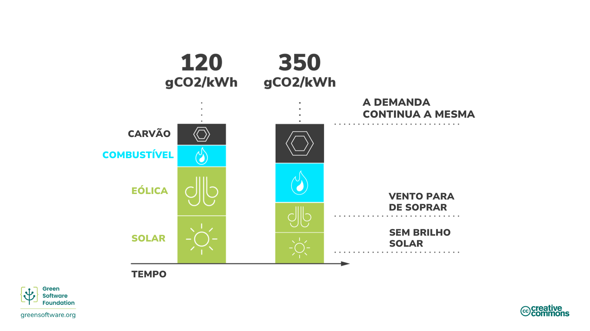
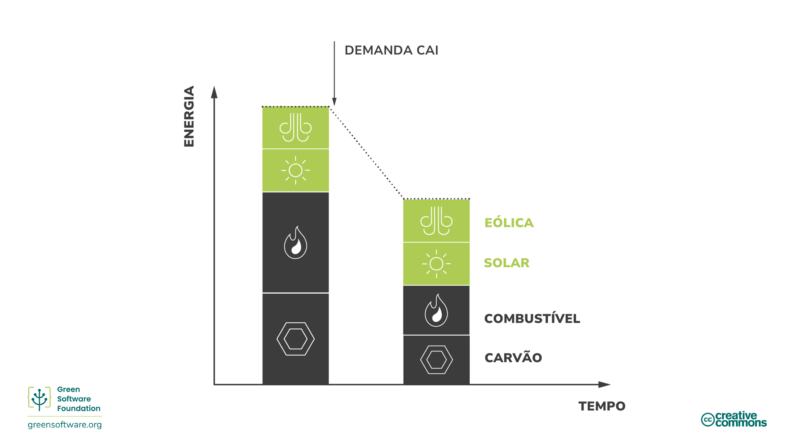
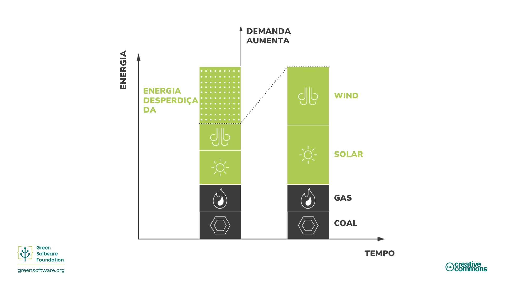
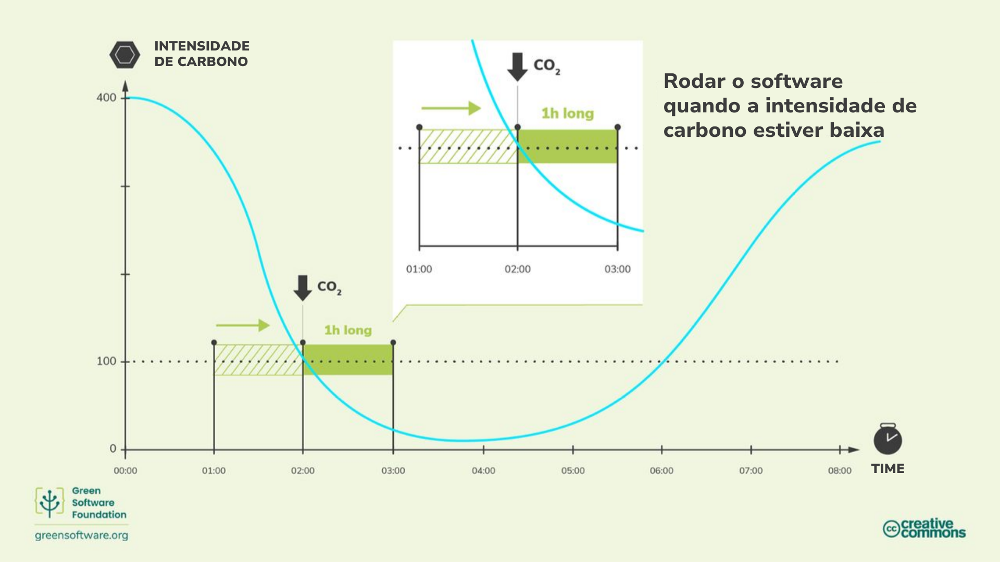
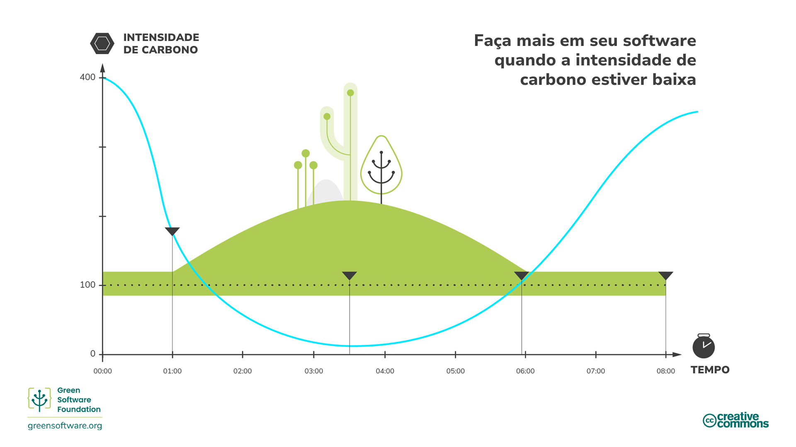
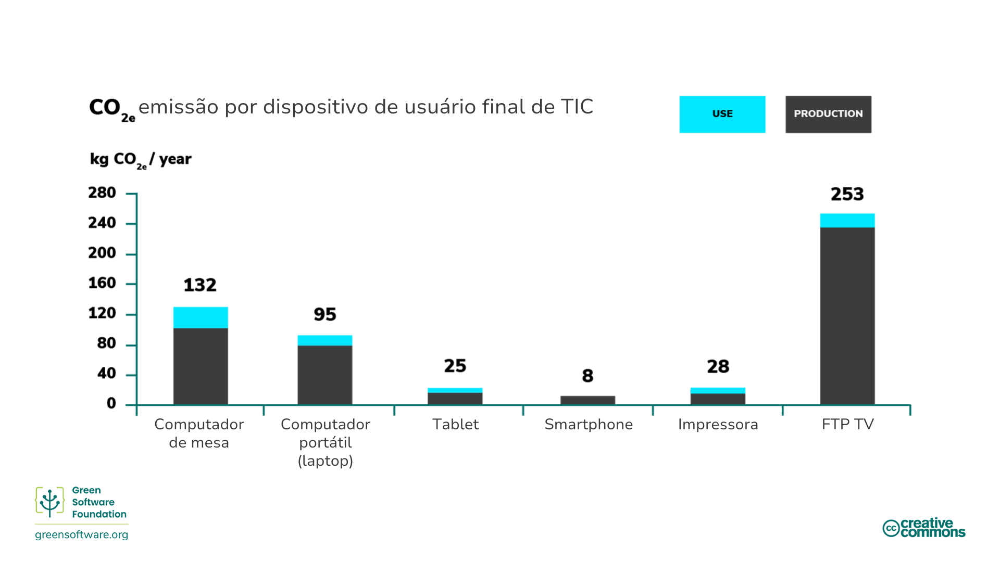

import Quiz from "/src/components/Quiz";

:::note Nota
Esta é uma tradução contribuída pela comunidade. Ela tem suporte limitado e pode não corresponder à versão mais recente do curso em inglês.
:::

:::tip Princípio

_Faça mais quando a eletricidade for mais limpa e menos quando a eletricidade for mais suja._

:::

## Introdução

Nem toda eletricidade é produzida da mesma forma. Em diferentes locais e épocas, a eletricidade é gerada usando uma variedade de fontes com emissões de carbono variáveis. Algumas fontes, como eólica, solar ou hidrelétrica, são fontes limpas e renováveis ​​que emitem pouco carbono. Por outro lado, fontes de combustíveis fósseis emitem carbono em graus variados para produzir eletricidade. Por exemplo, tanto o gás quanto o carvão emitem mais carbono do que fontes renováveis, mas usinas de energia a gás emitem menos carbono do que usinas de energia a carvão.

A conscientização sobre o carbono é a ideia de fazer mais quando mais energia vem de fontes de baixo carbono e fazer menos quando mais energia vem de fontes de alto carbono.

## Conceitos Chave

### Intensidade de Carbono

A intensidade de carbono mede quanto carbono (CO2e) é emitido por quilowatt-hora (KWh) de eletricidade consumida. A unidade padrão de intensidade de carbono é gCO2eq/kWh, ou gramas de carbono por quilowatt-hora.

Se seu computador estiver conectado diretamente a um parque eólico, sua eletricidade teria uma intensidade de carbono de 0 gCO2eq/kWh, já que um parque eólico não emite carbono para produzir essa eletricidade. No entanto, a maioria das pessoas não pode se conectar diretamente a parques eólicos; em vez disso, elas se conectam a redes elétricas abastecidas com eletricidade de várias fontes.

Uma vez em uma rede, você não pode controlar quais fontes fornecem a eletricidade que está usando; você simplesmente obtém uma mistura de tudo. Portanto, sua intensidade de carbono será uma mistura de todas as fontes de energia atuais em uma rede, tanto as fontes de baixo quanto as de alto carbono.

### Variabilidade da intensidade de carbono

A intensidade de carbono varia de acordo com a localização, já que algumas regiões têm uma mistura de energia contendo mais fontes de energia limpa do que outras.

A intensidade de carbono também muda ao longo do tempo devido à variabilidade inerente da energia renovável causada pela imprevisibilidade das condições climáticas. Por exemplo, quando está nublado ou o vento não está soprando, a intensidade de carbono aumenta, pois mais eletricidade em sua mistura vem de fontes que emitem carbono.

### Disponibilidade e redução

A demanda por eletricidade varia durante o dia, e o fornecimento sempre precisa ser capaz de atender a essa demanda. Um apagão (uma queda no nível de voltagem da linha de energia) ocorre se uma concessionária não produz eletricidade suficiente para atender à demanda. Por outro lado, se uma concessionária produz mais eletricidade do que o necessário, para impedir que a infraestrutura queime, os disjuntores disparam e temos apagões.

É preciso haver um equilíbrio entre a demanda e o fornecimento de eletricidade o tempo todo, e a responsabilidade por isso geralmente recai sobre o fornecedor de serviços públicos.

No caso de combustíveis fósseis, como o carvão, é mais fácil controlar a energia produzida para esse fornecimento; isso é chamado de **disponibilidade**. No entanto, no caso de fontes de energia renováveis, como parques eólicos, a energia produzida não pode ser facilmente controlada (não podemos controlar a intensidade do vento). Se a fonte de energia produz mais eletricidade do que o necessário, essa eletricidade é jogada fora; isso é chamado de **corte**.

### Intensidade marginal de carbono

Se de repente você precisar acessar mais energia – por exemplo, precisar acender uma luz – essa energia vem da usina marginal. A central eléctrica marginal é despachável, o que significa que as centrais eléctricas marginais são frequentemente alimentadas por combustíveis fósseis.

A intensidade marginal de carbono é a intensidade de carbono da central eléctrica que teria de ser utilizada para satisfazer qualquer nova procura.

As centrais eléctricas alimentadas por combustíveis fósseis raramente chegam a 0. Têm um limite mínimo de funcionamento e algumas não conseguem escalar; elas são consideradas uma carga base consistente e sempre ativa. Por causa disso, às vezes temos o cenário em que restringimos (jogamos fora) a energia renovável enquanto ainda consumimos energia de usinas movidas a combustíveis fósseis.

Nessas situações, a intensidade marginal de carbono será de 0 gCO2eq/kWh, pois sabemos que qualquer nova demanda corresponderá à energia renovável que estamos restringindo.

### Mercados de energia

O modelo exato de mercado varia ao redor do mundo, mas segue amplamente o mesmo modelo.

Quando a demanda por eletricidade cai, as concessionárias precisam **reduzir** o fornecimento para equilibrar a oferta e a demanda. Elas podem fazer isso de duas maneiras:

1. **Comprar menos energia de usinas de combustíveis fósseis.**

Energia de usinas de combustíveis fósseis é geralmente a mais cara, então este é o método preferido. Isso se traduz diretamente em queimar menos combustíveis fósseis.

2. **Comprar menos energia de fontes renováveis**.
Fontes renováveis ​​são as mais baratas, então eles preferem não fazer isso. Se uma fonte renovável não consegue vender toda a sua eletricidade, ela tem que jogar o resto fora.

Reduzir a quantidade de eletricidade consumida em suas aplicações pode ajudar a diminuir a intensidade de carbono da energia, visto que a primeira coisa a ser reduzida são os combustíveis fósseis.

Quando a demanda por eletricidade aumenta, as concessionárias precisam aumentar o fornecimento para equilibrar a oferta e a demanda. Elas podem fazer isso de duas maneiras:

1. **Comprar mais energia de fontes renováveis ​​que estão atualmente sendo restringidas**

Se você está restringindo, significa que você tem excesso de energia que poderia despachar. A energia renovável já é a mais barata, então a energia renovável restringida será a fonte de energia distribuível mais barata. As usinas renováveis ​​venderão então a energia que teriam que restringir.

2. **Comprar mais energia de usinas de combustíveis fósseis**.

Os combustíveis fósseis são inerentemente distribuíveis; eles podem aumentar rapidamente a produção de energia queimando mais. No entanto, o carvão custa dinheiro, então esta é a solução menos preferida.

Os mercados de energia é um dos mercados mais complexos do mundo, então a explicação acima é uma simplificação. Mas o que é importante entender é que nosso objetivo é aumentar o investimento em fontes de energia de menor carbono - como as renováveis - e diminuir o investimento em fontes de maior carbono - como o carvão. A melhor maneira de garantir que o dinheiro flua na direção certa é certificar-se de usar eletricidade com a menor intensidade de carbono.
## Como ter mais consciência em relação ao Carbono

:::tip Dica

Usar eletricidade quando a intensidade de carbono é baixa é a melhor maneira de garantir que os investimentos fluam para usinas de baixa emissão de carbono e para longe de usinas de alta emissão de carbono.

:::

Há uma transformação global acontecendo agora. Em todo o mundo, as redes elétricas estão mudando de queima primária de combustíveis fósseis para obtenção de energia de fontes de baixo carbono, como eólica e solar. Esta é uma das nossas melhores esperanças para atingir nossas metas globais de redução. Como praticantes de software verde, vamos ver algumas das maneiras pelas quais podemos ajudar a acelerar essa transição.

O principal impulsionador da transição é econômico, e não qualquer meta de sustentabilidade. As energias renováveis ​​estão vencendo porque são mais baratas e estão ficando ainda mais acessíveis com o tempo. Então, para ajudar a acelerar a transição, precisamos tornar as usinas renováveis ​​mais lucrativas e as usinas de combustíveis fósseis menos lucrativas. A melhor maneira de fazer isso é usar mais eletricidade quando ela vem de fontes de baixo carbono, como renováveis, e menos eletricidade quando ela vem de fontes de alto carbono.

A intensidade do carbono é menor quando mais energia vem de fontes de baixo carbono e maior quando vem de fontes de alto carbono.

### Mudança de demanda

Estar ciente do carbono significa responder a mudanças na intensidade do carbono aumentando ou diminuindo sua demanda. Se seu trabalho permite que você seja flexível com quando e onde você executa cargas de trabalho, você pode mudar de acordo - consumindo eletricidade quando a intensidade do carbono é menor e pausando a produção quando é maior. Por exemplo, treinar um modelo de Machine Learning em um momento ou região diferente com intensidade de carbono muito menor.

[Estudos](https://ieeexplore.ieee.org/document/6128960) mostram que essas ações podem resultar em reduções de carbono de 45% a 99%, dependendo do número de fontes de energia renováveis ​​que alimentam a rede.

A mudança de demanda pode ser ainda mais dividida em mudança espacial e temporal.

#### Deslocamento espacial

Deslocamento espacial significa mover sua computação para outro local físico onde a intensidade de carbono atual é menor. Pode ser uma região que naturalmente tem fontes de energia de carbono mais baixas. Por exemplo, mover para hemisférios diferentes dependendo da estação para mais horas de luz solar.

#### Mudança temporal

Se você não puder mudar sua computação espacialmente para outra região, outra opção que você tem é mudar para outro horário. Talvez mais tarde no dia ou noite, quando estiver mais ensolarado ou ventoso e, portanto, a intensidade de carbono for menor. Isso é chamado de mudança de demanda temporal. Podemos prever a intensidade futura de carbono razoavelmente bem por meio de avanços na previsão do tempo.

Algumas das maiores empresas de tecnologia reconheceram a importância da conscientização sobre o carbono e estão usando técnicas avançadas de modelagem para implementar a mudança de demanda.

- **Google Carbon Aware Data Centers** - O Google lançou um projeto para [tornar algumas das cargas de trabalho da nuvem carbono-suficientes](https://blog.google/outreach-initiatives/sustainability/carbon-aware-computing-location/). Eles criaram modelos para prever a intensidade de carbono e a carga de trabalho de amanhã. Eles então moldaram cargas de trabalho em larga escala para que mais acontecesse quando e onde a intensidade de carbono fosse menor, mas de tal forma que ainda pudessem lidar com a carga esperada.
- **Microsoft Carbon Aware Windows** - [A Microsoft anunciou um projeto para tornar o Windows 11 mais sustentável](https://www.techradar.com/news/windows-11-is-getting-an-eco-friendly-update-but-could-microsoft-do-more). Inicialmente, isso significa executar atualizações do Windows quando a intensidade de carbono for menor.

### Modelagem da demanda

Mudança de demanda é a estratégia de mover a computação para regiões ou momentos em que a intensidade de carbono é menor. Modelagem da demanda é uma estratégia semelhante. No entanto, em vez de mover a demanda para uma região ou momento diferente, moldamos nossa computação para corresponder à oferta existente.

- Se a intensidade de carbono for baixa, aumente a demanda; faça mais em seus aplicativos.
- Se a intensidade de carbono for alta, diminua a demanda; faça menos em seus aplicativos.

A modelagem da demanda para aplicativos com consciência de carbono tem tudo a ver com o fornecimento de carbono. Quando o custo de carbono para executar seu aplicativo se torna alto, molde a demanda para corresponder ao fornecimento de carbono. Isso pode acontecer automaticamente, ou o usuário pode fazer uma escolha.

O modo Eco é um exemplo de modelagem da demanda. Os modos Eco são encontrados em aparelhos do dia a dia, como carros ou máquinas de lavar. Quando ativados, uma certa quantidade de desempenho é sacrificada para consumir menos recursos (gás ou eletricidade). Como há essa troca com o desempenho, os modos eco são sempre apresentados ao usuário como uma escolha.

Os aplicativos de software também podem ter modos eco que podem - automaticamente ou com o consentimento do usuário - tomar decisões para reduzir as emissões de carbono.

Um exemplo disso é o software de videoconferência que ajusta a qualidade do streaming automaticamente. Em vez de transmitir na mais alta qualidade possível o tempo todo, ele reduz a qualidade do vídeo para priorizar o áudio quando a largura de banda é baixa.

Outro exemplo é o TCP/IP. A velocidade de transferência aumenta em resposta à quantidade de dados transmitidos pelo fio.

Um terceiro exemplo é o aprimoramento progressivo com a web. A experiência na web melhora dependendo dos recursos e da largura de banda disponíveis no dispositivo do usuário final.

A modelagem da demanda está relacionada a um conceito mais amplo em sustentabilidade, que é reduzir o consumo. Podemos conseguir muito nos tornando mais eficientes com recursos, mas também precisamos consumir menos em algum momento.

Como praticantes de Software Verde, consideraríamos cancelar um processo quando a intensidade de carbono for alta em vez de mudar a demanda - reduzindo as demandas de nossa aplicação e as expectativas de nossos usuários finais.

## Resumo

- Conscientização sobre o carbono significa entender que a energia que você consome nem sempre tem o mesmo impacto em termos de intensidade de carbono.
- A intensidade do carbono varia dependendo do tempo e do local em que é consumida.
- A natureza dos combustíveis fósseis e das fontes de energia renováveis ​​significa que consumir energia quando a intensidade de carbono é baixa aumenta a demanda por fontes de energia renováveis ​​e aumenta a porcentagem de energia renovável no fornecimento.
- Mudança de demanda significa mover seu consumo de energia para diferentes locais ou horários do dia em que a intensidade de carbono é menor.
- Modelagem da demanda significa adaptar seu consumo de energia em torno da variabilidade da intensidade de carbono para consumir mais em períodos de baixa intensidade e menos em períodos de alta intensidade.
## Quiz

<Quiz
  QuizList={[
    {
      question: "O que é intensidade de carbono?",
      answers: [
        {
          text: "A quantidade de carbono produzida usando fontes de energia limpa",
          isCorrect: false,
        },
        {
          text: "A quantidade de carbono produzida por quilowatt-hora",
          isCorrect: true,
        },
        { text: "0gCO2eq/kWh", isCorrect: false },
      ],
    },
    {
      question: "Qual é a unidade padrão de intensidade de carbono?",
      answers: [
        { text: "gCO2eq/kWh", isCorrect: false },
        { text: "gCO2e/kWh", isCorrect: false },
        { text: "Qualquer um dos itens acima", isCorrect: true },
      ],
    },
    {
      question: "Quais são as duas variáveis ​​que afetam a intensidade do carbono??",
      answers: [
        { text: "Localização e hora", isCorrect: true },
        { text: "Oferta e procura", isCorrect: false },
        { text: "Tempo e demanda", isCorrect: false },
      ],
    },
    {
      question:
        "Qual das seguintes opções não é verdadeira sobre as usinas de energia marginais??",
      answers: [
        { text: "Eles são distribuíveis", isCorrect: false },
        { text: "Eles geralmente queimam combustíveis fósseis", isCorrect: false },
        {
          text: "Eles estão localizados em locais onde fontes de energia limpa não estão disponíveis",
          isCorrect: true,
        },
      ],
    },
    {
      question: "O que é redução?",
      answers: [
        { text: "Excedente de fornecimento de energia", isCorrect: false },
        {
          text: "Energia desperdiçada devido ao excesso de oferta",
          isCorrect: true,
        },
        { text: "Reduzir a oferta para corresponder à procura", isCorrect: false },
      ],
    },
    {
      question:
        "Qual das seguintes opções não é um exemplo de computação com consciência de carbono??",
      answers: [
        {
          text: "Consumir mais eletricidade quando a intensidade de carbono é menor",
          isCorrect: false,
        },
        { text: "Mudança para energia renovável", isCorrect: true },
        {
          text: "Interromper a produção quando a intensidade de carbono é maior",
          isCorrect: false,
        },
      ],
    },
    {
      question: "Quais são os dois tipos de mudança de demanda?",
      answers: [
        { text: "Temporal e permanente", isCorrect: false },
        { text: "Espacial e temporal", isCorrect: true },
        { text: "Restrição e distribuibilidade", isCorrect: false },
      ],
    },
    {
      question: "O que é modelagem de demanda?",
      answers: [
        {
          text: "Faça mais quando a intensidade de carbono for baixa, faça menos quando a intensidade de carbono for alta",
          isCorrect: true,
        },
        {
          text: "Faça mais quando a intensidade de carbono for alta, faça menos quando a intensidade de carbono for baixa",
          isCorrect: false,
        },
        {
          text: "Faça mais quando os custos são baixos, faça menos quando os custos são altos",
          isCorrect: false,
        },
      ],
    },
    {
      question: "Qual dos seguintes é um exemplo de conscientização sobre o carbono??",
      answers: [
        {
          text: "Criando um software que produz emissões muito baixas",
          isCorrect: false,
        },
        {
          text: "Cancelar um processo quando você sabe que a intensidade de carbono é alta",
          isCorrect: true,
        },
        {
          text: "Usando servidores em nuvem em vez de servidores internos",
          isCorrect: false,
        },
      ],
    },
  ]}
/>
