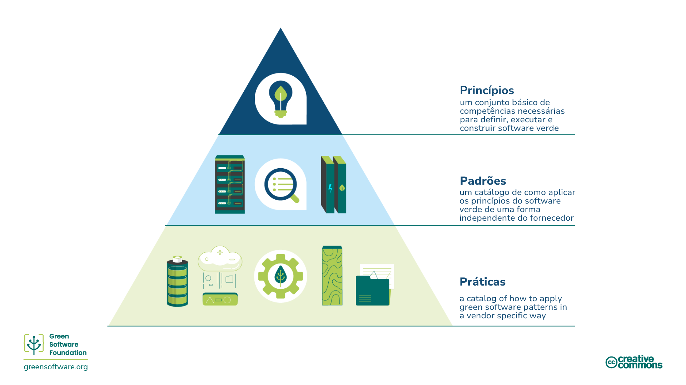

:::note Nota
Esta é uma tradução feita pela comunidade. Ela tem suporte limitado e pode não corresponder à versão mais recente do curso em inglês.
:::

## O que é programação verde?

Programação verde é uma disciplina emergente na interseção entre ciência climática, software design, mercado de eletricidade, hardware e design de data centers.

Programação verde é eficiência ao gerar gás carbônico. Isso significa gerar a menor emissão de gases possível. Há somente três formas de reduzir a emissão de gases: eficiência energética, conscientização da emissão de gases carbônicos e eficiência de hardware. Este treinamento irá explicar todos estes conceitos, como aplicá-los aos seus processos e como os medir. Assim como fornecerá guias e diretrizes internacionais de organizações que orientam e monitoram este tema.

## Quem deve ler este guia?

Qualquer pessoa envolvida nos processos de construção, entrega ou gerência de aplicativos. Ao estudar estes princípios, um "green software practitioner" poderá tomar decisões importantes que terão impacto na redução de poluição por gás carbônico de suas aplicações.

## História

Em 2019 os oito princípios originais para o desenvolvimento verde de software foram lançados. Em 2022 houve atualização destes princípios, baseado em opiniões recebidas ao longo dos anos, unificando alguns princípios e adicionando novos relacionados ao entendimento do compromentimento climático.

## Como se tornar um green software practitioner

O treinamento a seguir cobre seis áreas chave que um green software practtioner deve conhecer:

1. **Eficiência de Carbono**: A menor emissão de carbono possível.
2. **Eficiência de energia**: Usar a menor quantidade de energia possível.
3. **Conscientização sobre carbono**: Faça mais quando a energia é limpa e menos quando a energia não é.
4. **Eficiência de Hardware**: Usar a menor quantidade de carbono incorpoado possível.
5. **Medição**: O que não pode ser medido, não pode ser melhorado.
6. **Comprometimento climático**: Entender o exato mecanismo de redução de carbono.

Cada um destes capítulos introduzirão novos conceitos e explicarão em detalhes porque são importantes no que diz respeito ao clima, e como você pode aplicar estes conceitos às suas práticas de software verde.

## Princípios, Padrões e Práticas.

As áreas chave deste curse e seus conteúdos descrevem os **princípios** do software verde, um conjunto básico de competências necessárias para definir, rodar e construir software verde.

Um [**padrão**](https://patterns.greensoftware.foundation/) de software verde é um exemplo específico de como aplicar um ou mais princípios no mundo real. Enquanto os princípios descrevem a teoria que sustenta o software verde, os padrões são os conselhos práticos que os profissionais de software podem usar em seus aplicativos de software hoje. Os padrões são neutros em relação ao fornecedor.

Uma **prática** de software verde é um padrão aplicado a um produto específico de alguma marca e informa os profissionais sobre como usar aquele produto de uma forma mais sustentável.

Práticas farão referência aos padrões que, por sua vez, farão referência aos princípios.

A green software foundation também publica um [catálogo de padrões neturos de software verde em relação a fornecedores](https://patterns.greensoftware.foundation/) através de várias categorias.
 
