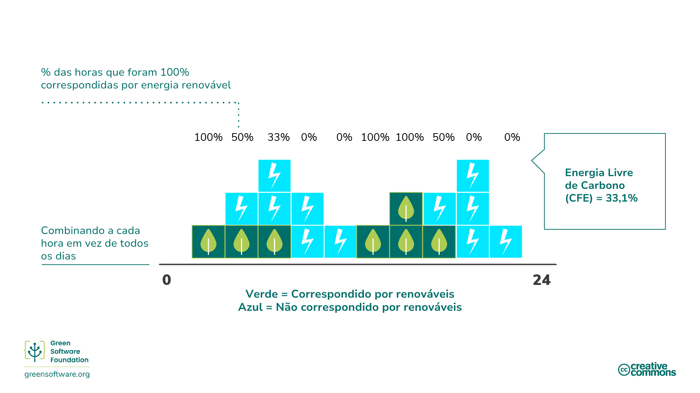
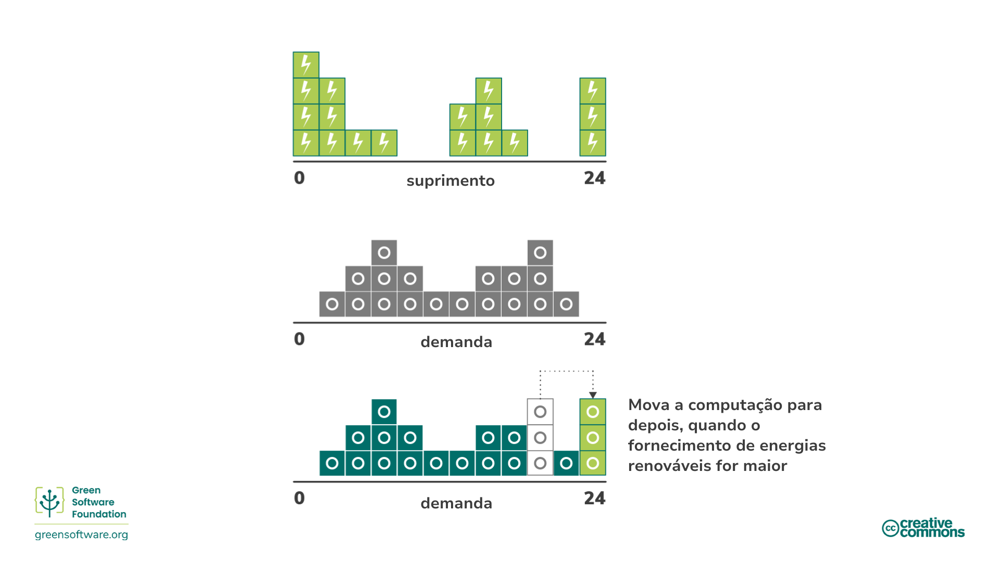

import Quiz from "/src/components/Quiz";

:::note
Esta é uma tradução feita pela comunidade. Ela tem suporte limitado e pode não corresponder à versão mais recente do curso em inglês.
:::

:::tip Principle

_Entenda o mecanismo exato da redução de carbono._

:::

## Introdução

Nos últimos anos, muitos atores econômicos buscaram atingir diferentes metas climáticas ao assumir vários compromissos.

Os termos "net zero", "carbono neutro", "carbono negativo" e "clima neutro" têm sido usados ​​de forma intercambiável com o objetivo principal de remover, reduzir e prevenir emissões de carbono. À medida que o interesse nessas metas cresce, é essencial ter um entendimento comum do que elas significam e como alcançá-las por meio das estratégias e procedimentos de medição que aprendemos.

## Metodologias de redução de carbono

Existem muitas maneiras de reduzir emissões, mas é importante entender o mecanismo exato da redução ao pensar em metas de redução.

### Abatimento/Eliminação de Carbono

A [Science Based Targets Initiative](https://sciencebasedtargets.org/) se refere a um mecanismo chamado [abatimento](https://sciencebasedtargets.org/resources/legacy/2020/09/foundations-for-net-zero-executive-summary.pdf), que significa eliminar fontes de emissões de CO2 associadas às operações e [cadeia de valor](https://www.cisl.cam.ac.uk/education/graduate-study/pgcerts/value-chain-defs) de uma empresa para que elas não entrem na atmosfera. A cadeia de valor descreve toda a gama de atividades necessárias para criar um produto ou serviço, desde a concepção até a distribuição. Isso inclui aumentar a eficiência energética para eliminar algumas das emissões associadas à geração de energia.

A redução não é suficiente por si só, pois sempre haverá algumas emissões que não podem ser eliminadas devido a restrições tecnológicas ou econômicas, mas deve formar o cerne da estratégia de cada organização, pois é uma área em que quase todas as empresas podem melhorar.

Para equilibrar essas emissões residuais, precisamos olhar para outros mecanismos, como compensações ou neutralizações.

### Compensações

[Compensações](https://www.offsetguide.org/understanding-carbon-offsets/what-is-a-carbon-offset/) são investimentos diretos em projetos de redução de emissões por meio da compra de créditos de carbono no mercado voluntário de carbono (VCM). O VCM é um mercado descentralizado onde atores privados compram e vendem voluntariamente créditos de carbono que representam remoções ou reduções certificadas de GEEs da atmosfera.

Para compensar emissões, você precisa comprar o volume equivalente de créditos de carbono para compensar os emitidos, onde 1 crédito de carbono corresponde a 1 tonelada de CO2 absorvido ou reduzido.

Vários benefícios positivos podem advir desses projetos, desde a proteção do ecossistema até o empoderamento de comunidades locais. No entanto, para garantir que esses programas sejam implementados corretamente e tenham o efeito desejado no meio ambiente e o objetivo de atingir o zero líquido mundial, existem padrões globais que eles devem atender, como o Verified Carbon Standard (VCS) e o Gold Standard (GS).

#### SCI e compensações

Existem algumas limitações para compensações de carbono e é por isso que elas não são consideradas na pontuação SCI de uma organização. Por exemplo, imagine dois aplicativos, ambos em execução em uma plataforma de nuvem que é 100% compensada em carbono e 100% correspondida por energia renovável. O aplicativo A investiu tempo e recursos significativos para garantir que está usando os recursos de forma eficiente, enquanto o aplicativo B usa os recursos de forma muito ineficiente. Para que o SCI seja uma métrica útil, o aplicativo A precisa pontuar melhor do que o aplicativo B.

Se o SCI considerasse compensações, ambos os aplicativos pontuariam 0. Isso não nos diria nada sobre a eficiência com que estão usando os recursos. Embora o aplicativo B esteja emitindo mais moléculas de carbono na atmosfera, já que sua pontuação é 0 e a pontuação mais baixa é 0, por que ele faria mais investimentos para melhorar sua eficiência de carbono?

As organizações precisam ter planos sobre como eliminar e neutralizar as emissões e o SCI as ajuda a impulsionar a eliminação de emissões devido ao software. Isso torna o SCI um componente essencial de qualquer estratégia de net-zero.

### Compensação / Evitação de Carbono

[Compensações](https://www.abatable.com/blog/carbon-removal-vs-carbon-avoidance-projects) são ações que as empresas tomam para ajudar a sociedade a evitar ou reduzir emissões fora de sua cadeia de valor. Isso é essencialmente investir em projetos de redução de outras organizações.

Isso inclui ações como:

- **Conservação** - Créditos são criados com base no carbono não liberado pela proteção de árvores velhas.
- **Projetos Comunitários** - Esses projetos ajudam comunidades em todo o mundo, principalmente as não desenvolvidas, introduzindo métodos de vida sustentáveis.
- **Resíduos para energia** - Esses projetos capturam metano/gás de aterro em vilas menores, resíduos humanos ou agrícolas e os convertem em eletricidade.

### Neutralização/Remoção de Carbono

[Neutralizações](https://www.abatable.com/blog/carbon-removal-vs-carbon-avoidance-projects) são ações que as empresas tomam para remover carbono da atmosfera dentro ou além de sua cadeia de valor. Neutralizações referem-se à remoção e armazenamento permanente de carbono atmosférico para contrabalançar o efeito da liberação de CO2 na atmosfera. Isso inclui ações como:

- **Aprimorar sumidouros naturais de carbono** que removem CO2 da atmosfera. Por exemplo, restauração florestal, já que a fotossíntese remove CO2 naturalmente. A expansão florestal traz desafios, pois é essencial não impactar a dinâmica das terras agrícolas e o suprimento de alimentos em outros lugares. Os métodos agrícolas modernos também podem prolongar o tempo que o carbono permanece armazenado no solo.
- **Captura direta de ar** é o processo de capturar CO2 do ar e armazená-lo permanentemente, seja no subsolo ou em produtos de longa duração, como concreto.

A eficácia desses métodos é normalmente medida com base em se eles podem fornecer remoção de carbono na escala e velocidade necessárias.

Quando se trata de projetos de remoção de carbono, a durabilidade é uma consideração crítica. A durabilidade de um projeto descreve por quanto tempo o dióxido de carbono será mantido longe da atmosfera.

A durabilidade de curto prazo é de até 100 anos, a de médio prazo é de 100 a 1.000 anos e a de longo prazo é de mais de 1.000 anos.

- Soluções que dependem do ciclo natural do carbono da Terra têm durabilidade de curto prazo medida em décadas. Por exemplo, projetos florestais têm durabilidade de 40 a 100 anos.
- Soluções de engenharia, como captura direta de ar, geralmente têm durabilidade de longo prazo medida em milênios. Por exemplo, a captura direta de ar tem durabilidade de 10.000 anos.
- Projetos de longo prazo são normalmente ordens de magnitude mais caros do que projetos de curto prazo. Uma vez emitido, o carbono permanece na atmosfera por 5.000 anos. Para ser considerado líquido zero, o carbono que foi emitido precisa ser removido permanentemente.

Um projeto de remoção de carbono de curto prazo removerá carbono somente por 100 anos, após os quais ele estará de volta à atmosfera, aquecendo nosso planeta. Esta é uma das razões pelas quais a redução é preferível à neutralização. Nunca liberar carbono é muito melhor do que liberar carbono e então tentar mantê-lo fora da atmosfera por 5.000 anos.

## Compromissos climáticos

Existem muitas estratégias diferentes de redução climática com as quais uma organização pode se comprometer, de carbono neutro a líquido zero. Entender os diferentes significados e implicações de cada uma pode ajudar você a decidir sobre a estratégia certa para sua organização.

### Carbono Neutro

Para atingir a neutralidade de carbono, uma organização deve medir suas emissões e, em seguida, corresponder o total às suas compensações de emissões por meio de projetos de redução de carbono. Isso pode incluir projetos de remoção de carbono (neutralizações) e projetos de prevenção de carbono (compensações).

A neutralidade de carbono é definida por um padrão reconhecido internacionalmente: [PAS 2060](https://info.eco-act.com/hubfs/0%20-%20Downloads/PAS%202060/PAS%202060%20factsheet%20EN.pdf). Embora isso recomende que uma organização estabeleça metas de redução, não exige que ela reduza suas emissões. Portanto, para ser considerada neutra em carbono, uma organização pode apenas medir e compensar sem investir recursos na eliminação de suas emissões de carbono.

Para ser neutra em carbono, você deve cobrir emissões diretas (escopo 1 e 2). A expectativa geral é que as organizações meçam e compensem seus escopos 1 e 2 e viagens de negócios do escopo 3. No entanto, não há um requisito específico para incluir isso.

Carbono neutro é um primeiro passo significativo para qualquer organização, pois incentiva a medição. No entanto, não há compensações de carbono suficientes no mundo para compensar as emissões de todas as organizações. Portanto, qualquer estratégia que não inclua redução não escalará ou ajudará o mundo a atingir a meta de 1,5 grau definida pelo Acordo Climático de Paris. É aqui que o net zero entra em jogo.

### Net Zero

Net zero significa reduzir as emissões de acordo com a ciência climática mais recente e equilibrar as emissões residuais restantes por meio de remoções de carbono (neutralizações). Net zero, por definição, requer reduções de emissões alinhadas a um caminho de 1,5 °C. Todas as empresas devem fazer isso para atingir emissões globais líquidas zero até 2050.

O diferenciador crítico entre net zero e carbono neutro é o foco do net zero na redução em vez de neutralizações e compensações. Uma meta net zero visa eliminar emissões e usar apenas a compensação para as emissões residuais que você não pode eliminar

O [padrão para net zero](https://sciencebasedtargets.org/resources/files/foundations-for-net-zero-full-paper.pdf) está sendo desenvolvido pela [iniciativa Science Based Targets](https://sciencebasedtargets.org/) (SBTi). Eles calculam que há uma probabilidade de 66% de limitar o aquecimento global a 1,5 °C se atingirmos um nível de redução de cerca de 90% de todas as emissões de GEE até meados do século. Portanto, para atingir uma meta líquida zero, uma organização precisa eliminar 90% de suas emissões até 2050. As emissões restantes só podem ser compensadas usando neutralizações e remoções permanentes de carbono.

Uma estratégia líquida zero significaria que a quantidade real de carbono na atmosfera permanece constante.

Além disso, para ser uma meta líquida zero, você deve cobrir emissões diretas e indiretas, ou seja, emissões da cadeia de suprimentos (escopos 1, 2 e 3). Portanto, toda a sua cadeia de valor precisa ser incluída no escopo da sua meta líquida zero. Isso é significativo, pois o escopo 3 geralmente representa a maioria das emissões.

#### SCI como parte de uma estratégia Net-Zero

O SCI é uma métrica projetada especificamente para impulsionar a eliminação de emissões. A única maneira de reduzir sua pontuação é investir tempo e recursos em ações que eliminem emissões. As únicas atividades que o SCI reconhece como ações de eliminação são tornar seu aplicativo mais eficiente em termos de energia, mais eficiente em hardware ou consumir fontes de energia de baixo carbono. As compensações são um componente essencial de qualquer estratégia climática; no entanto, as compensações não são eliminações e, portanto, não estão incluídas na métrica SCI.

Qualquer estratégia net-zero precisa ter planos de como eliminar e neutralizar as emissões. O SCI ajuda as organizações a impulsionar a eliminação de emissões devido ao software. Isso torna o SCI um componente essencial de qualquer estratégia net-zero.

### 100% renovável

Quando as organizações definem uma meta de 100% de energia renovável, elas podem distinguir entre ser **combinado por** vs. **alimentado por** renováveis.

**Alimentado por** significa que você é alimentado diretamente por uma fonte de energia renovável, digamos, uma represa hidrelétrica. Nesse cenário, os elétrons que fluem para o seu dispositivo só podem vir dessa fonte, então você pode dizer com segurança que é 100% alimentado por renováveis.

Para a maioria das pessoas, vivemos em uma rede interconectada, com muitos produtores injetando eletricidade e muitos consumidores retirando eletricidade. Isso significa que os elétrons que entram no seu dispositivo são uma mistura de todos os elétrons que entram na rede. Por exemplo, suponha que a rede tenha apenas 5% de fornecimento eólico. Você está recebendo 5% de elétrons gerados pelo vento e 95% de elétrons gerados por combustíveis fósseis.

Você não pode rastrear elétrons individuais. Uma vez que os elétrons de um parque eólico estão em uma rede, todos eles se misturam com os elétrons de uma usina de combustível fóssil. Portanto, não há como um consumidor insistir que os elétrons que ele usa venham apenas de fontes renováveis.

#### Certificados de Energia Renovável (REC)

<!--  -->

Para resolver esse problema, uma usina renovável vende duas coisas. A primeira é sua eletricidade, que ela vende para uma rede. A segunda é um REC, um [Certificado de Energia Renovável](https://www.epa.gov/green-power-markets/renewable-energy-certificates-recs). 1 REC é igual a 1 kWh de energia.

Se você quer ser 100% correspondido por energia renovável e está na rede, a solução é comprar RECs suficientes para cobrir a quantidade de eletricidade que você consome. Por exemplo, se você consome 100 kWh de eletricidade todos os dias, então para ser 100% correspondido por renováveis, você compra 100 RECs.

Quando as organizações definem metas de 100% renováveis, comprar RECs no mercado é a solução que elas geralmente empregam para cumprir seus compromissos.

#### PPAs

Você também pode ouvir o termo PPA usado junto com RECs. Um PPA é um [Contrato de Compra de Energia](https://ppp.worldbank.org/public-private-partnership/sector/energy/energy-power-agreements/power-purchase-agreements), que é outra maneira de comprar RECs. Se você estima que precisa de 500 MWh de eletricidade por ano para um determinado data center, você pode assinar um PPA para comprar 500 MWh por ano de uma usina renovável. Você então obteria todos os RECs associados a esta usina de energia.

Os PPAs são tipicamente contratos de muito longo prazo. Uma usina renovável pode encontrar financiamento com um desses acordos, pois já tem um comprador para sua eletricidade há muitos anos.

Os PPAs incentivam algo chamado **adicionalidade**. A compra de um PPA impulsiona a criação de novas usinas renováveis. Os PPAs são uma solução que nos leva a um futuro onde todos têm acesso a energia 100% renovável.

### Correspondência horária 24/7

Quando se trata de reivindicações 100% renováveis, a questão crítica é: qual é a granularidade da correspondência? Você soma e liquida anualmente, mensalmente, semanalmente, diariamente ou por hora? Essa questão é essencial porque, para realmente fazer a transição para a energia renovável, precisamos que 100% da energia venha de fontes de energia de baixo carbono, como renováveis, 100% do tempo. Essa correspondência granular fina é frequentemente chamada de _[correspondência horária 24/7](https://www.epa.gov/green-power-markets/247-hourly-matching-electricity)_.

A correspondência horária 24/7 é uma das muitas estratégias que precisamos empregar para ajudar a acelerar a transição para uma rede 100% renovável. Por exemplo, [Google](https://sustainability.google/progress/energy/) e [Microsoft](https://blogs.microsoft.com/blog/2021/07/14/made-to-measure-sustainability-commitment-progress-and-updates/) se comprometeram a fazer correspondências horárias 24 horas por dia, 7 dias por semana, até 2030.

#### Correspondência diária vs horária

Imagine que uma organização tenha uma curva de demanda como esta, cada quadrado azul representa 1 kWh:

Eles compraram RECs de um parque eólico que gerou eletricidade com uma curva, então cada quadrado verde representa 1 REC. Correspondência por dia significa que a organização consumiu 18 kWh e comprou 18 RECs. Como resultado, eles chegaram a zero. Então eles podem dizer que estão **100% correspondidos por energia renovável diariamente.**

No entanto, se olharmos para isso em intervalos de hora em hora (cada quadrado aqui tem 2 horas de duração), então parece um pouco diferente:

A quantidade total de energia consumida ainda é de 18 kWh. No entanto, há apenas algumas horas no dia em que somos 100% correspondidos por energia renovável para aquela hora. Então, por algumas horas, temos muito mais energia renovável do que precisamos. Por outro lado, temos muito menos energia renovável do que precisamos para a maioria das horas.

No exemplo acima, eles são **100% correspondidos por energia renovável em uma base horária por apenas 6 horas do dia**.

#### Energia sem carbono

O número que usamos para descrever o quão bem-sucedidos somos na correspondência 24/7 por hora é a porcentagem de energia sem carbono.

Energia sem carbono é definida como [a porcentagem média de energia sem carbono consumida em um local específico por hora](https://cloud.google.com/sustainability/region-carbon#understanding).

Então, para o exemplo anterior, se medido usando correspondência diária, estamos 100% correspondidos com energia renovável. No entanto, estamos apenas 33,1% correspondidos se medidos usando correspondência por hora. **A porcentagem de CFE é, portanto, 33,1%**.

#### Conscientização sobre carbono como parte de uma estratégia de correspondência 24/7 por hora

A computação com consciência de carbono envolve responder a sinais de intensidade de carbono elétrico e mudar o **comportamento** do software, para que ele emita menos carbono. A conscientização sobre carbono também ajuda uma organização a atingir sua meta de correspondência 24/7 por hora e aumentar sua porcentagem de CFE.

Um exemplo de mudança de comportamento é deslocar a computação para um momento em que mais energia renovável esteja disponível. Por exemplo, atrasar o início de uma execução de treinamento de um modelo de aprendizado de máquina, ou mesmo atrasar o carregamento de um laptop, para quando a intensidade de carbono da eletricidade for menor e o fornecimento de energia renovável for maior.

:::tip Dica
A computação com consciência de carbono ajuda as organizações a aumentar sua porcentagem de CFE.
:::

## Resumo

- Há uma série de metodologias comumente aplicadas para ajudar na luta geral contra as mudanças climáticas. Elas se enquadram nas categorias gerais de eliminação de carbono (também conhecida como "abatimento"), prevenção de carbono (também conhecida como "compensação") ou remoção de carbono (também conhecida como "neutralização").
- A redução inclui o aumento da eficiência energética para eliminar algumas das emissões associadas à geração de energia. A redução é a maneira mais eficaz de combater as mudanças climáticas, embora a eliminação completa do carbono não seja possível.
- A compensação inclui a adoção de fontes de energia renováveis, práticas de vida sustentáveis, reciclagem, plantio de árvores etc.
- As neutralizações referem-se à remoção e armazenamento permanente de carbono atmosférico para contrabalançar o efeito da liberação de CO2 na atmosfera. As neutralizações tendem a remover o carbono da atmosfera no curto e médio prazo.
- Uma organização pode se autodenominar Carbon Neutral quando suas emissões totais são equiparadas ao total de suas compensações de emissões por meio de projetos de redução de carbono
- O Net Zero visa eliminar emissões e compensar apenas as emissões residuais que você não pode eliminar para atingir a meta de 1,5 °C definida pelo Acordo Climático de Paris.
- O SCI é cuidadosamente projetado para que a eliminação de emissões, por meio da eficiência energética, eficiência de hardware e conscientização sobre carbono, seja a única maneira de reduzir a pontuação. Junto com uma estratégia de neutralização separada, pode formar a base de uma estratégia net-zero para uma organização.
- Quando as organizações definem uma meta de 100% de energia renovável, elas podem ser "equiparadas por" ou "alimentadas por" renováveis, onde "alimentadas por" significa que os elétrons que fluem para seu dispositivo só podem vir de fontes renováveis. Isso pode ser alcançado comprando RECs como parte de um PPA.
- A correspondência 24 horas por dia, 7 dias por semana, é uma das muitas estratégias que precisamos empregar para ajudar a acelerar a transição para uma rede 100% alimentada por energia renovável.

## Quiz

<Quiz
  QuizList={[
    {
      question: "What are neutralisations?",
      answers: [
        {
          text: "Actions that remove carbon from the atmosphere",
          isCorrect: true,
        },
        {
          text: "Actions that reduce carbon emissions",
          isCorrect: false,
        },
        {
          text: "Actions that support climate initiatives",
          isCorrect: false,
        },
      ],
    },
    {
      question: "What is a critical consideration for neutralizations?",
      answers: [
        {
          text: "Volume of neutralization",
          isCorrect: false,
        },
        {
          text: "Durability of neutralization",
          isCorrect: true,
        },
        {
          text: "Cost of neutralization",
          isCorrect: false,
        },
      ],
    },
    {
      question:
        "What approach can you take to neutralize carbon emissions from energy consumption?",
      answers: [
        {
          text: "Enhance natural carbon sinks",
          isCorrect: false,
        },
        {
          text: "Direct air capture",
          isCorrect: false,
        },
        {
          text: "Both of the above",
          isCorrect: true,
        },
      ],
    },
    {
      question: "What is responsible for setting the standard for net zero?",
      answers: [
        {
          text: "SBTi",
          isCorrect: true,
        },
        {
          text: "STBi",
          isCorrect: false,
        },
        {
          text: "STIB",
          isCorrect: false,
        },
      ],
    },
    {
      question: "What is the net-zero global target?",
      answers: [
        {
          text: "Eliminate 100% of emissions by 2050",
          isCorrect: false,
        },
        {
          text: "Eliminate 90% of emissions by 2050",
          isCorrect: true,
        },
        {
          text: "Eliminate 80% of emissions by 2050",
          isCorrect: false,
        },
      ],
    },
    {
      question: "What is the primary goal with abatement/elimination?",
      answers: [
        {
          text: "Offset your carbon emissions using a financial contract",
          isCorrect: false,
        },
        {
          text: "Not emitting carbon into the atmosphere in the first place",
          isCorrect: true,
        },
        {
          text: "Reduce emissions related to a company’s operations by improving energy efficiency",
          isCorrect: false,
        },
      ],
    },
    {
      question: "Which measurement protocol or method incorporates offsets?",
      answers: [
        {
          text: "GHG protocol",
          isCorrect: true,
        },
        {
          text: "SCI",
          isCorrect: false,
        },
      ],
    },
    {
      question: "What is the minimum criteria for being carbon neutral?",
      answers: [
        {
          text: "Emissions from scopes 1-3 must be offset by neutralizations or compensations",
          isCorrect: false,
        },
        {
          text: "Emissions from scopes 1 and 2 must be offset by neutralizations or compensations",
          isCorrect: true,
        },
        {
          text: "Emissions from scopes 1-2 and business travel from scope 3 must be offset by neutralizations or compensations",
          isCorrect: false,
        },
      ],
    },
  ]}
/>
