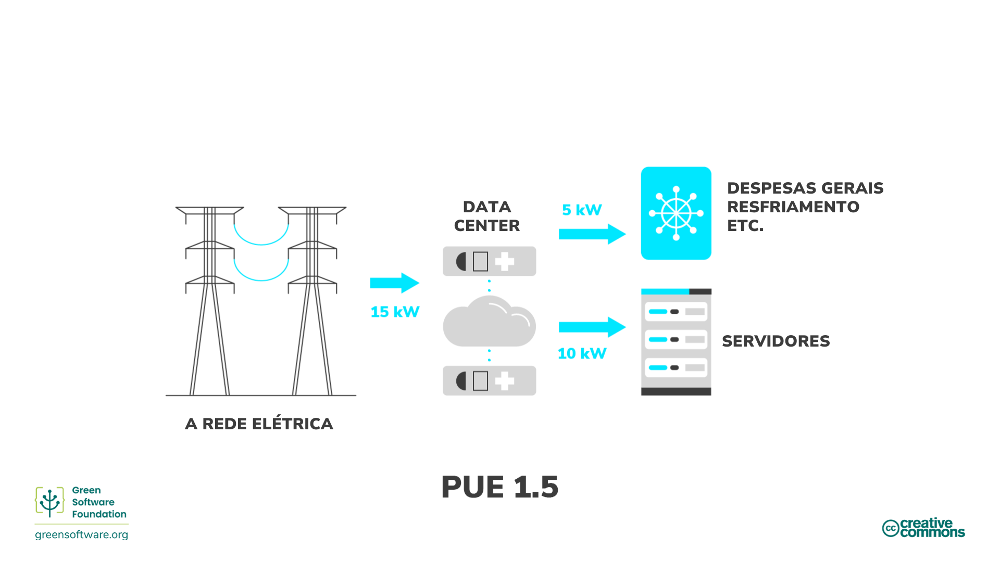

import Quiz from "/src/components/Quiz";

:::note Nota
Esta é uma tradução feita pela comunidade. Ela tem suporte limitado e pode não corresponder à versão mais recente do curso em inglês.
:::

:::tip Princípio

_Use a menor quantidade de energia possível._

:::

## Introdução

Energia é a capacidade de fazer trabalho. Existem muitas formas diferentes de energia, como calor, elétrica e química, e um tipo de energia pode ser convertido em outro. Por exemplo, convertemos energia química do carvão em energia elétrica. Em outras palavras, eletricidade é energia secundária convertida de outro tipo de energia. Dessa forma, podemos pensar em energia como uma medida da eletricidade usada.

Todos os softwares, desde os aplicativos em execução em celulares até o treinamento de modelos de Machine Learning em execução em data centers, consomem eletricidade. Uma das melhores maneiras de reduzir o consumo de eletricidade e as emissões de carbono subsequentes feitas pelo software é tornar os aplicativos mais eficientes em termos de energia. No entanto, não é aí que nossa responsabilidade termina.

Os praticantes de software verde assumem a responsabilidade pela energia consumida por seus produtos e os projetam para consumir o mínimo possível. Devemos garantir que, em cada etapa do processo, haja o mínimo de desperdício possível e que a maior parte da energia vá para a próxima etapa.

A etapa final desta cadeia é representada pelo usuário final do seu produto, não pelo produto acabado em si. Isso significa que nosso objetivo não é simplesmente fazer o código mais eficiente em termos de energia ou o software mais "verde", mas pensar no usuário final e em como garantir que ele não esteja criando emissões desnecessárias.

Isso pode significar agrupar tarefas para aproveitar a proporcionalidade de energia ou mudar como um usuário usa seu software. Vamos dar uma olhada em alguns desses conceitos e algumas maneiras pelas quais você pode se tornar mais eficiente em termos de energia em cada estágio da cadeia, até o consumidor final.

## Conceitos-chave

### Combustíveis fósseis e fontes de energia com alto teor de carbono

A maior parte da eletricidade é produzida pela queima de combustíveis fósseis, [geralmente carvão](https://ourworldindata.org/grapher/world-electricity-by-source). Os combustíveis fósseis são feitos a partir da decomposição de plantas e animais. Esses combustíveis são encontrados na crosta terrestre e contêm carbono e hidrogênio, que podem ser queimados para obter energia. Carvão, petróleo e gás natural são exemplos de combustíveis fósseis.

A maioria das pessoas acha que a eletricidade é limpa. Nossas mãos não ficam sujas quando conectamos algo na parede, e nossos laptops não precisam de canos de exaustão. No entanto, como a maior parte da eletricidade vem da queima de combustíveis fósseis e o fornecimento de energia é a [única mais significativa](https://www.eea.europa.eu/data-and-maps/daviz/change-of-co2-eq-emissions-2#tab-chart_4) causa das emissões de carbono, podemos traçar uma linha direta da eletricidade para as emissões de carbono. Nesses termos, a eletricidade pode ser considerada um proxy para o carbono.

Se nossa meta é sermos eficientes em carbono, então isso significa que nossa meta também é sermos eficientes em energia, já que a energia é um proxy para o carbono. Isso significa usar a menor quantidade de energia possível por unidade de trabalho.

### Fontes de energia de baixo carbono

A energia limpa vem de fontes renováveis, de emissão zero, que não poluem a atmosfera quando usadas e economizam energia por meio de práticas de eficiência energética. Há sobreposições entre energia limpa, verde e renovável. Veja como podemos diferenciá-las:

- **Energia limpa** - não produz emissões de carbono, por exemplo, nuclear.
- **Energia verde** - fontes da natureza
- **Energia renovável** - fontes que não expiram, por exemplo, solar, eólica

### Medição de energia

- A energia é medida em joules (J), a unidade [SI](https://en.wikipedia.org/wiki/International_System_of_Units) de energia.
- A potência é medida em watts, onde 1 watt (W) é uma taxa correspondente a um joule por segundo.
- Um quilowatt (kW) é, portanto, também uma taxa correspondente a 1000 joules por segundo.
- Um quilowatt-hora (kWh) é uma medida de energia (J) correspondente a um quilowatt de potência sustentada por uma hora.

## Como melhorar a eficiência energética

Agora que sabemos como a energia é produzida e o custo associado em termos de emissões, com base no uso de fontes de energia de baixo ou alto carbono, vamos dar uma olhada em algumas das maneiras como os profissionais de software verde podem melhorar a eficiência energética. Entender a eficácia do uso de energia e a proporcionalidade de energia significa que você pode tomar melhores decisões em termos de como usar a energia da maneira mais eficiente possível e desperdiçar menos.

### Eficiência do uso de energia

O setor de data center usa a métrica [eficácia do uso de energia](https://datacenters.lbl.gov/sites/default/files/WP49-PUE%20A%20Comprehensive%20Examination%20of%20the%20Metric_v6.pdf) (PUE), desenvolvida pela Green Grid em 2006, para **medir a eficiência energética do data center**. Especificamente, isso se relaciona a quanta energia o equipamento de computação usa em comparação com o resfriamento e outras despesas gerais que dão suporte ao equipamento. Quando o PUE de um data center está próximo de 1,0, a computação está usando quase toda a energia. Quando o PUE é 2,0, isso significa que um watt adicional de energia de TI é necessário para resfriar e distribuir energia para o equipamento de TI para cada watt de energia de TI que ele usa.

Outra maneira de pensar no PUE é como um multiplicador do consumo de energia do seu aplicativo. Então, por exemplo, se seu aplicativo consumiu 10 kWh e o PUE do data center onde ele está sendo executado é 1,5, então o consumo real da rede é de 15 kWh: 5 kWh vão para a sobrecarga operacional do data center e 10 kWh vão para os servidores que estão executando seu aplicativo.

### Proporcionalidade de energia

[Proporcionalidade de energia](https://research.google/pubs/pub33387/), proposta pela primeira vez em 2007 por engenheiros do Google, mede **a relação entre a energia consumida por um computador e a taxa na qual o trabalho útil é feito** (sua utilização).

A utilização mede quanto dos recursos de um computador são usados, geralmente dado como uma porcentagem. Um computador totalmente utilizado, funcionando em sua capacidade máxima, tem uma porcentagem alta, enquanto um computador ocioso sem utilização tem uma porcentagem menor.

A relação entre potência e utilização não é proporcional. Matematicamente falando, a proporcionalidade entre duas variáveis ​​significa que suas proporções são equivalentes. Por exemplo, com 0% de utilização, um computador pode consumir 100 W; com 50%, consome 180 W; e com 100%, consome 200 W. A relação entre consumo de energia e utilização não é linear e não cruza a origem.

Por isso, quanto mais utilizamos um computador, mais eficiente ele se torna na conversão de eletricidade em operações práticas de computação. Uma maneira de melhorar a eficiência do hardware é executar a carga de trabalho no menor número possível de servidores, com os servidores executando na maior taxa de utilização, maximizando a eficiência energética.

#### Consumo de energia estática

O consumo de energia estática de um computador é **quanta eletricidade é consumida quando em estado ocioso**. O consumo de energia estática varia de acordo com a configuração e os componentes de hardware, mas todas as peças têm algum consumo de energia estática. Esta é uma das razões pelas quais PCs, laptops e dispositivos de usuário final têm modos de economia de energia. Se o dispositivo estiver ocioso, ele eventualmente acionará um modo de hibernação e colocará o disco e a tela em modo de espera ou até mesmo alterará a frequência da CPU. Esses modos de economia de energia economizam eletricidade, mas têm outras compensações, como uma reinicialização mais lenta quando o dispositivo desperta.

Os servidores geralmente não são configurados para economia de energia agressiva ou mesmo mínima. Muitos casos de uso em execução em servidores exigem capacidade total o mais rápido possível porque o servidor precisa responder a demandas que mudam rapidamente, o que leva muitos servidores a modos ociosos durante períodos de baixa demanda. Um servidor ocioso tem um custo de carbono tanto do carbono incorporado quanto de sua utilização ineficiente.

## Resumo

- A eletricidade é um proxy para o carbono, então construir um aplicativo que seja energeticamente eficiente é equivalente a construir um aplicativo que seja carbonicamente eficiente.
- O software verde assume a responsabilidade pelo seu consumo de eletricidade e é projetado para consumir o mínimo possível.
- Quantificar o consumo de energia de um aplicativo é um passo na direção certa para começar a pensar sobre como um aplicativo pode operar de forma mais eficiente. No entanto, entender o consumo de energia do seu aplicativo não é a única história. O hardware em que seu software está sendo executado usa parte da eletricidade para sobrecarga operacional. Isso é chamado de eficiência no uso de energia (PUE) no espaço da nuvem.
- O conceito de proporcionalidade de energia adiciona outra camada de complexidade, pois o hardware se torna mais eficiente em transformar eletricidade em operações úteis quanto mais é usado.
- Entender isso dá aos profissionais de software verde uma melhor visão de como seu aplicativo se comporta em relação ao consumo de energia no mundo real.

## Questionário

<Quiz
  QuizList={[
    {
      question:
        "Por que às vezes dizemos que a eletricidade é um substituto do carbono??",
      answers: [
        {
          text: "A eletricidade é uma forma de energia e todos os tipos de energia produzem carbono",
          isCorrect: false,
        },
        {
          text: "O uso de eletricidade produz emissões de carbono",
          isCorrect: false,
        },
        {
          text: "Os combustíveis fósseis são queimados para produzir eletricidade",
          isCorrect: true,
        },
      ],
    },
    {
      question: "Quais são alguns exemplos de combustíveis fósseis?",
      answers: [
        { text: "Carbono e hidrogênio", isCorrect: false },
        { text: "Carvão, petróleo e gás natural", isCorrect: true },
        { text: "Ambos os itens acima", isCorrect: false },
      ],
    },
    {
      question: "O que é energia limpa?",
      answers: [
        { text: "Energia proveniente de fontes renováveis", isCorrect: false },
        {
          text: "Energia que não produz emissões de carbono",
          isCorrect: true,
        },
        { text: "Ambos os itens acima", isCorrect: false },
      ],
    },
    {
      question: "O que mede a PUE (eficácia do uso de energia)?",
      answers: [
        { text: "Eficiência energética do data center", isCorrect: true },
        { text: "Consumo de energia de uma aplicação", isCorrect: false },
        {
          text: "Quantidade de energia usada em despesas gerais combinada com a consumida pelos servidores",
          isCorrect: false,
        },
      ],
    },
    {
      question:
        "Qual das seguintes opções é algo que é medido pela proporcionalidade de energia?",
      answers: [
        {
          text: "Relação entre a energia usada em overheads e o que vai para os servidores que executam uma aplicação",
          isCorrect: false,
        },
        {
          text: "A porcentagem de recursos disponíveis de um computador que estão sendo usados",
          isCorrect: false,
        },
        {
          text: "Relação entre a energia consumida por um computador e a taxa na qual o trabalho útil é realizado",
          isCorrect: true,
        },
      ],
    },
    {
      question: "Qual é a unidade SI de energia?",
      answers: [
        {
          text: "Watts",
          isCorrect: false,
        },
        {
          text: "Kilowatts",
          isCorrect: false,
        },
        {
          text: "Joules",
          isCorrect: true,
        },
      ],
    },
    {
      question: "Qual aplicativo consome mais energia?",
      answers: [
        {
          text: "Uma aplicação que consome 20 kWh em um data center com um PUE de 1",
          isCorrect: true,
        },
        {
          text: "Uma aplicação que consome 15 kWh em um data center com um PUE de 1.2",
          isCorrect: false,
        },
        {
          text: "Uma aplicação que consome 10 kWh em um data center com um PUE de 1.5",
          isCorrect: false,
        },
      ],
    },
    {
      question: "O que é consumo de energia estática?",
      answers: [
        {
          text: "O custo de carbono das aplicações deixadas em espera",
          isCorrect: false,
        },
        {
          text: "A eletricidade sendo consumida por um aplicativo em estado ocioso",
          isCorrect: true,
        },
        {
          text: "A eletricidade usada por um aplicativo no modo eco",
          isCorrect: false,
        },
      ],
    },
  ]}
/>
