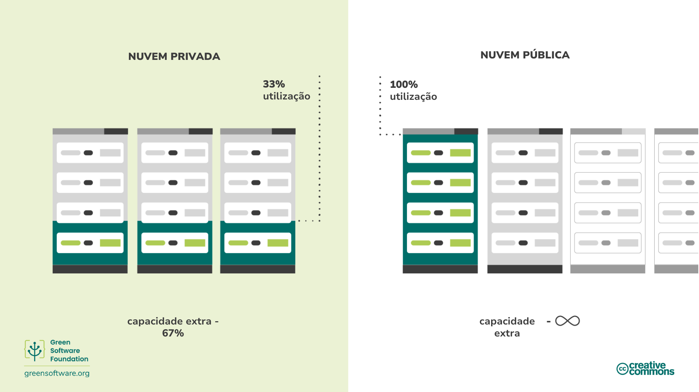

import Quiz from "/src/components/Quiz";

:::note Nota
Esta é uma tradução feita pela comunidade. Ela tem suporte limitado e pode não corresponder à versão mais recente do curso em inglês.
:::

:::tip Princípios

_Use a menor quantidade possível de carbono incorporado._

:::

## Introdução

O hardware usado no processo de criação do seu software é um elemento importante a ser considerado por um praticante de Software Verde.

Você verá como o carbono incorporado é um custo oculto quando se trata de hardware e as diferentes medidas que você pode tomar para reduzir o impacto que a criação, destruição e execução deste hardware envolve. Por exemplo, estendendo sua vida útil ou mudando para servidores em nuvem.

## Conteitos-chave

### Carbono incorporado

O dispositivo que você está usando para ler isso produziu carbono quando foi fabricado e, uma vez que ele chega ao fim da vida útil, descartá-lo pode liberar mais. Carbono incorporado (também conhecido como "carbono incorporado") é a quantidade de poluição de carbono emitida durante a criação e descarte de um dispositivo.

Ao calcular a poluição total de carbono para computadores que executam software, tanto a poluição de carbono associada à execução do computador quanto o carbono incorporado do computador devem ser contabilizados.

O carbono incorporado varia significativamente entre os dispositivos do usuário final. Para alguns dispositivos, o carbono emitido durante a fabricação é muito maior do que o emitido durante o uso, conforme ilustrado por um [estudo](https://www.ifi.uzh.ch/dam/jcr:fa4e956e-7a53-4038-98a5-00e09e2f4303/Study_Digitalization_Climate_Protection_Summary_Oct2017.pdf) da Universidade de Zurique. Como resultado, o custo do carbono incorporado pode, às vezes, ser muito maior do que o custo do carbono da eletricidade que o alimenta.

Ao pensar em termos de carbono incorporado, qualquer dispositivo, mesmo um que não consuma eletricidade, é responsável pela liberação de carbono ao longo de sua vida útil.

### Amortização

Uma maneira de contabilizar o carbono incorporado é amortizar o carbono ao longo da vida útil esperada de um dispositivo. Por exemplo, suponha que levou 4000 kg de CO2eq para construir um servidor, e esperamos que ele dure quatro anos. Amortização significa que podemos dizer que o servidor emite 1000 kg de CO2eq/ano.

## Como melhorar a eficiência do hardware

Se levarmos em conta o carbono incorporado, fica claro que, quando compramos um computador, ele já emitiu uma boa quantidade de carbono. Os computadores também têm uma vida útil limitada, o que significa que eventualmente não conseguem lidar com cargas de trabalho modernas e precisam ser substituídos. Nesses termos, o hardware é um proxy para o carbono e, como nossa meta é sermos eficientes em carbono, também devemos ser eficientes em hardware.

Há duas abordagens principais para a eficiência do hardware:

- Para dispositivos de usuário final, é **estender a vida útil** do hardware.
- Para computação em nuvem, é **aumentar a utilização** do dispositivo.

### Estendendo a vida útil do hardware

No exemplo que vimos anteriormente, se pudermos adicionar apenas mais um ano à vida útil do nosso servidor, o carbono amortizado cai de 1000 kg CO2eq/ano para 800 kg CO2eq/ano.

O hardware é aposentado quando quebra ou tem dificuldade para lidar com cargas de trabalho modernas. Claro, o hardware sempre vai quebrar eventualmente, mas, como desenvolvedores, podemos usar software para construir aplicativos que rodam em hardware mais antigo e estendem sua vida útil.

### Aumento da utilização do dispositivo

No espaço da nuvem, a eficiência do hardware geralmente se traduz em um aumento na utilização de servidores. É melhor usar um servidor com 100% de utilização do que 5 servidores com 20% de utilização por causa do custo do carbono incorporado. Da mesma forma que possuir um carro e usá-lo todos os dias da semana é muito melhor do que possuir cinco e usar um diferente a cada dia da semana, é muito mais eficiente usar servidores em sua capacidade máxima do que empregar vários abaixo da capacidade. Embora as emissões sejam as mesmas, o carbono incorporado que é usado é muito menor.

O motivo mais comum para ter servidores subutilizados é para que a capacidade máxima seja contabilizada. Executar servidores a 20% significa que você sabe que será capaz de lidar com picos de demanda sem impactar o desempenho. No entanto, enquanto isso, toda essa capacidade ociosa ali parada representa carbono incorporado desperdiçado. Ser eficiente em hardware significa garantir que cada dispositivo de hardware esteja sendo utilizado o máximo possível pelo maior tempo possível.

Esta é uma das principais vantagens da nuvem pública; você sabe que quando precisar aumentar a escala, o espaço estará lá para compensar a folga. Com várias organizações fazendo uso da nuvem pública, a capacidade ociosa sempre pode ser disponibilizada para quem precisar, para que nenhum servidor fique ocioso.

É importante observar que simplesmente mover as operações para a nuvem pública não reduzirá automaticamente suas emissões. Ela simplesmente lhe dá o espaço para poder reestruturar seu software para que uma redução seja possível.

## Resumo

- Carbono incorporado é a quantidade de poluição de carbono emitida durante a criação e descarte de um dispositivo.
- Ao calcular sua poluição total de carbono, você deve considerar tanto o que é emitido ao executar o computador quanto o carbono incorporado associado à sua criação e descarte.
- Estender a vida útil de um dispositivo tem o efeito de amortizar o carbono emitido para que seu CO2eq/ano seja reduzido.
- A computação em nuvem é mais eficiente em termos de energia do que um servidor local, pois pode aplicar mudança de demanda, bem como modelagem de demanda.

## Questionário

<Quiz
  QuizList={[
    {
      question: "O que é carbono incorporado?",
      answers: [
        {
          text: "O carbono que foi emitido na criação de um dispositivo",
          isCorrect: false,
        },
        {
          text: "As emissões de carbono associadas à criação e ao descarte de um dispositivo",
          isCorrect: true,
        },
        {
          text: "As emissões de carbono associadas ao descarte de um dispositivo",
          isCorrect: false,
        },
      ],
    },
    {
      question: "O que é responsável pela poluição total de carbono de um computador?",
      answers: [
        {
          text: "O carbono incorporado no dispositivo",
          isCorrect: false,
        },
        {
          text: "As emissões produzidas durante o funcionamento do dispositivo",
          isCorrect: false,
        },
        {
          text: "Ambas respostas acima",
          isCorrect: true,
        },
      ],
    },
    {
      question:
        "Quais são as duas principais maneiras de ser mais eficiente com hardware?",
      answers: [
        {
          text: "Prolongando sua vida útil e reduzindo sua utilização",
          isCorrect: false,
        },
        {
          text: "Prolongando sua vida útil e aumentando sua utilização",
          isCorrect: true,
        },
        {
          text: "Reduzindo sua vida útil e aumentando sua utilizaçãof",
          isCorrect: false,
        },
      ],
    },
    {
      question:
        "Como a eficiência do hardware afeta a poluição de carbono de um dispositivo?",
      answers: [
        {
          text: "Eliminando",
          isCorrect: false,
        },
        {
          text: "Aumentando",
          isCorrect: false,
        },
        {
          text: "Reduzindo",
          isCorrect: true,
        },
      ],
    },
    {
      question:
        "Qual é o carbono amortizado de um dispositivo com um carbono incorporado de 1000 kg CO2eq e uma vida útil de 5 anos?",
      answers: [
        {
          text: "200kg CO2eq/ano",
          isCorrect: true,
        },
        {
          text: "20kg CO2eq/ano",
          isCorrect: false,
        },
        {
          text: "200kg CO2eq",
          isCorrect: false,
        },
      ],
    },
    {
      question:
        "Quais são algumas das diferenças entre ter seus servidores em uma nuvem pública em comparação com uma nuvem privada?",
      answers: [
        {
          text: "Na nuvem pública, você pode aumentar a escala rapidamente",
          isCorrect: false,
        },
        {
          text: "Em uma nuvem privada, você precisa ter servidores funcionando abaixo da capacidade para atender a picos de demanda",
          isCorrect: false,
        },
        {
          text: "Ambas estão corretas",
          isCorrect: true,
        },
      ],
    },
    {
      question:
        "Por que é tão importante incluir o carbono incorporado ao calcular as emissões de hardware?",
      answers: [
        {
          text: "O carbono incorporado às vezes é responsável por mais emissões do que as emissões da eletricidade que alimenta o dispositivo",
          isCorrect: true,
        },
        {
          text: "O carbono incorporado representa uma proporção pequena, mas significativa, das emissões globais de um dispositivo",
          isCorrect: false,
        },
        {
          text: "O carbono incorporado é a única fonte de emissões que deve ser considerada ao calcular as emissões gerais de um dispositivo?",
          isCorrect: false,
        },
      ],
    },
  ]}
/>
