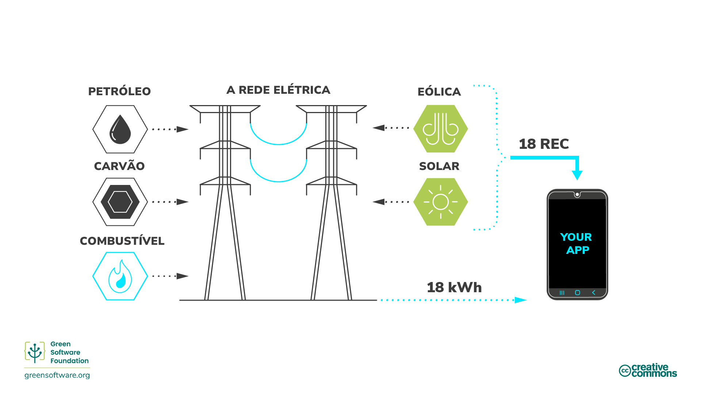

import Quiz from "/src/components/Quiz";

:::note Nota
Esta é uma tradução feita pela comunidade. Ela tem suporte limitado e pode não corresponder à versão mais recente do curso em inglês.
:::

:::tip Princípios

_O que você não pode medir, você não pode melhorar._

:::

## Introdução

O protocolo de Gases de Efeito Estufa (GEE) é o método mais comumente usado para organizações medirem suas emissões totais de carbono. Entender os escopos de GEE e como medir seu software em relação aos padrões da indústria ajudará você a ver até que ponto você está aplicando os princípios do Software Verde e até onde precisa ir para melhorar.

Para complementar o protocolo de GEE, você também pode usar a especificação Software Carbon Intensity (SCI). Enquanto o GEE é uma medição mais genérica adequada para todos os tipos de organizações, o SCI é especificamente para medir uma taxa de emissões de software e projetado para incentivar a eliminação dessas emissões.

O GEE é um protocolo para medir emissões totais, o SCI é uma ferramenta para permitir a eliminação de emissões impulsionadas por software.

Analisaremos cada uma das metodologias de medição e explicaremos como calcular em ambos os casos.

## O protocolo GEE

O [protocolo de gases de efeito estufa](https://ghgprotocol.org) é o padrão de contabilidade de gases de efeito estufa mais amplamente utilizado e reconhecido internacionalmente. [92%](https://ghgprotocol.org/about-us) das empresas da Fortune 500 usam o protocolo GEE ao calcular e divulgar suas emissões de carbono.

O protocolo GEE divide as emissões em três escopos:

- **Escopo 1**: Emissões diretas de **operações** de propriedade ou controladas pela organização relatora, como combustão de combustível no local ou veículos da frota.
- **Escopo 2**: Emissões indiretas relacionadas à **geração de emissões de energia comprada**, como calor e eletricidade.
- **Escopo 3**: Outras emissões indiretas de todas as outras atividades em que você está envolvido. Incluindo todas as **emissões da cadeia de suprimentos de uma organização;** viagens de negócios para funcionários e a eletricidade que os clientes podem consumir ao usar seu produto.

O Escopo 3, às vezes chamado de emissões da cadeia de valor, é a fonte mais significativa de emissões e a mais complexa de calcular para muitas organizações. Elas abrangem toda a gama de atividades necessárias para criar um produto ou serviço, da concepção à distribuição. No caso de um laptop, por exemplo, toda matéria-prima usada em sua produção emite carbono ao ser extraída e processada. As emissões da cadeia de valor também incluem emissões do uso do laptop, ou seja, as emissões da energia usada para alimentar o laptop depois que ele foi vendido a um cliente.

Por meio dessa abordagem, é possível somar todas as emissões de GEE de cada organização e pessoa no mundo e chegar a um total global.

### Em qual escopo meu aplicativo se enquadra?

Já vimos como o protocolo GEE nos pede para dividir as emissões de software de acordo com os escopos 1-3. Mas como isso funciona quando se trata de software?

A maioria das organizações tem muitos aplicativos em execução com diferentes arquiteturas e em diferentes ambientes. Como tal, o escopo em que suas emissões se enquadram, tanto em termos de energia gerada quanto de carbono incorporado, depende do seu cenário específico.

- **Para aplicativos de nuvem em execução em servidores de sua propriedade**, o uso de energia do seu software se enquadra no escopo 2, e o carbono incorporado de todos os seus servidores se enquadra no escopo 3.
- **Para aplicativos de nuvem em execução em uma nuvem pública**, tanto o uso de energia do seu aplicativo quanto o carbono incorporado se enquadram no escopo 3.
- Em cenários em que **você está executando um aplicativo de nuvem privada/pública híbrida**, parte de suas emissões se enquadrará no escopo 2 e parte se enquadrará no escopo 3.
- Da mesma forma, para seu **aplicativo front-end** voltado para o cliente, o uso de energia se enquadra no escopo 3 da sua organização, já que seu cliente comprará a energia para alimentar seu dispositivo.

Para software, independentemente de ser executado em infraestrutura de sua propriedade, alugada ou de propriedade dos consumidores, há três parâmetros a serem considerados para dividir as emissões:

- Quanta energia ele consome
- Quão limpa ou suja é essa eletricidade
- Quanto hardware ele precisa para funcionar

### É possível calcular um total de emissões de carbono de software?

Para calcular um total de emissões de carbono de software, você precisa ter acesso a dados detalhados sobre o consumo de energia, intensidade de carbono e hardware em que seu software está sendo executado. Esses são dados desafiadores de coletar, mesmo no caso de produtos de software de código fechado de uma organização, onde eles podem rastrear seu uso com telemetria ou logs.

Os mantenedores de software de código aberto não têm a mesma visibilidade sobre como e onde seu software é usado, quanta energia é consumida e em qual hardware.

Os projetos de código aberto geralmente têm vários colaboradores de várias organizações. Como resultado, não está claro quem deve ser responsável por calcular as emissões, bem como quem é responsável por eliminá-las. Quando você também considera que o software de código aberto compõe 90% de uma pilha empresarial típica, fica claro que haverá uma grande quantidade de emissões de carbono que não são contabilizadas.

### Os totais contam toda a história?

Um total é apenas uma métrica que descreve o estado de algo. Para tomar as decisões certas, você precisa analisar muitas métricas diferentes.

Imagine um cenário em que você é o líder de uma organização e encarregado de reduzir as emissões do seu software. Você mede as emissões no Q1 e chega a um total de 34 toneladas. Depois de fazer alguns investimentos em projetos que eliminam emissões, você descobre que no Q2 as emissões aumentaram para 45 toneladas. Isso significa que seus esforços falharam?

Não necessariamente. Sabemos que um total por si só não conta toda a história e deve analisar outras métricas para descobrir se um projeto de redução de emissões foi bem-sucedido. Por exemplo, se você mediu a intensidade de carbono, bem como o total de carbono, você pode chegar a uma perspectiva diferente. No mesmo projeto, se a intensidade de carbono fosse 3,3 g CO2eq/usuário no Q1 e 2,9 g CO2eq/usuário no Q2, você pode considerar o projeto um sucesso e continuar a investir mais.

Enquanto o total informou que as emissões de carbono da sua organização aumentaram no geral, a intensidade deu uma perspectiva mais completa que o ajudaria a tomar uma decisão mais informada sobre como proceder.

## Especificação de Intensidade de Carbono de Software

A [especificação de Intensidade de Carbono de Software (SCI)](https://grnsft.org/sci) é uma metodologia desenvolvida pelo Standards Working Group na Green Software Foundation, projetada para pontuar um aplicativo de software em uma dimensão de sustentabilidade e incentivar ações para eliminar emissões.

Não é uma substituição para o protocolo GEE, mas uma métrica adicional que ajuda as equipes de software a entender como seu software se comporta em termos de emissões de carbono para que possam tomar decisões mais informadas. Enquanto o protocolo GEE calcula as **emissões totais**, o SCI é sobre calcular a **taxa de emissões**. Em termos automotivos, o SCI é mais como uma medição de milhas por galão e o protocolo GEE é mais como a pegada de carbono total de um fabricante de automóveis e todos os seus carros que eles produzem a cada ano.

Em vez de agrupar as emissões de carbono do software nos escopos 1-3, ele as agrupa em **emissões operacionais** (emissões de carbono da execução do software) e **emissões incorporadas** (emissões de carbono dos recursos físicos necessários para executar o software). Também é uma intensidade em vez de um total, o que é mais inclusivo para software de código aberto.

Uma coisa importante a ser observada é que não é possível reduzir sua pontuação SCI comprando compensações na forma de neutralizações, compensações ou compensando eletricidade na forma de créditos de energia renovável. Isso significa que uma organização que não faz esforços para reduzir suas emissões, mas simplesmente gasta dinheiro em créditos de carbono, não pode atingir uma boa pontuação SCI.

As compensações são um componente essencial de qualquer estratégia climática; no entanto, as compensações não são eliminações e, portanto, não estão incluídas na métrica SCI.

Se você tornar seu aplicativo mais **eficiente em energia, eficiente em hardware** ou **consciente em carbono**, sua pontuação SCI diminuirá. A única maneira de reduzir sua pontuação SCI é investir tempo ou recursos em um desses três princípios. Dessa forma, adotar o SCI como uma métrica para seu aplicativo de software, juntamente com o protocolo GEE, impulsionará o investimento em um dos três pilares do software verde.
### A equação SCI

O SCI é um método de pontuação de qualquer aplicativo de software, não limitado apenas a aplicativos de nuvem ou de usuário final, mas todos os tipos de aplicativos intermediários. Ele fornece uma linguagem comum para descrever como o software se comporta em relação às emissões de carbono e como uma mudança proposta pode eliminar algumas delas.

A equação para calcular uma pontuação SCI é elegantemente simples. Essa simplicidade significa que ela pode ser aplicada em vários cenários diferentes.

`SCI = ((E *I) + M) por R`

`E` = Energia consumida por um sistema de software
`I` = Emissões marginais de carbono baseadas na localização*
`M` = Emissões incorporadas de um sistema de software.*
`R` = Unidade funcional (por exemplo, carbono por usuário adicional, chamada de API, trabalho de ML, etc.)

Isso se resume a:

`SCI = C por R` (Carbono por `R`)

`R` é a característica central do SCI e o transforma em uma intensidade em vez de um total. Isso é o que chamamos de _unidade funcional_.

## Como calcular sua pontuação SCI

Siga estas quatro etapas para calcular sua pontuação SCI.

1. Decida o que incluir

Quais componentes de software incluir ou excluir na pontuação SCI significa definir os limites do seu software; onde ele começa e onde ele termina.

Para cada componente de software que você incluir, você precisará medir seu impacto. Para cada componente principal que você excluir, você precisa explicar o porquê.

A especificação SCI não faz nenhuma exigência sobre o que incluir e o que não incluir. No entanto, você deve incluir toda a infraestrutura e sistemas de suporte que contribuem significativamente para a operação do software.

Sua pontuação SCI pode diminuir porque você estreitou seu limite de software e excluiu mais componentes de software. Por outro lado, sua pontuação SCI pode aumentar porque você está incluindo componentes de software que você excluiu anteriormente. Portanto, quando você relata sua pontuação SCI, especialmente quaisquer melhorias na pontuação, é essencial divulgar seu limite de software.

2. Escolha sua unidade funcional

Como vimos, o SCI é uma taxa em vez de um total e mede a intensidade das emissões de acordo com a unidade funcional escolhida. A especificação atualmente não prescreve a unidade funcional e você é livre para escolher a que melhor descreve como seu aplicativo é dimensionado. Por exemplo, se seu aplicativo for dimensionado pelo número de usuários, escolha usuários como sua unidade funcional.

Iterações futuras do SCI podem prescrever unidades funcionais específicas para diferentes tipos de aplicativos para ajudar na comparabilidade. Por exemplo, podemos pedir que aplicativos de streaming escolham minutos como sua unidade funcional para padronizar a medição em todos os aplicativos de streaming.

3. Decida como medir suas emissões

Agora você tem uma lista dos componentes de software que deseja medir e a unidade funcional que usará para medi-los. A próxima etapa é decidir como você quantificará as emissões de cada componente de software.

Existem dois métodos de quantificação: medição e cálculo.

- **Medição** é usar contadores de alguma forma. Por exemplo, medir o consumo de energia do seu componente de software usando um dispositivo de hardware na tomada da parede. Ou usar contadores em hardware que medem diretamente o consumo de energia. Se você puder contar suas unidades diretamente, deverá usar a abordagem de medição.
- **Cálculo** envolve contagem indireta, geralmente usando um modelo de alguma forma. Por exemplo, se você não puder medir diretamente o consumo de energia do seu aplicativo, mas tiver um modelo que estima o consumo de energia com base na utilização da CPU, isso é considerado cálculo em vez de medição.

Esses recursos podem ajudar você a decidir sobre métodos de medição e cálculo:

- Veja o projeto [Software Carbon Intensity Guide](https://sci-guide.greensoftware.foundation/). Este projeto é responsável por fornecer conselhos sobre como quantificar as emissões de diferentes componentes de software.

4. Quantificar

Agora você está pronto para executar. Usando a metodologia descrita nas etapas anteriores, comece a quantificar a pontuação SCI para cada componente de software em seu limite. Sua pontuação SCI total do seu aplicativo de software é a pontuação combinada de todos os diferentes componentes.

Você pode calcular várias pontuações SCI para o mesmo aplicativo. A pontuação SCI é uma informação útil para entender como seu aplicativo se comporta em relação às emissões de carbono em diferentes cenários. Por exemplo, um aplicativo de streaming pode escolher carbono por minuto como uma métrica. Ele também pode calcular o carbono por usuário por dia. A métrica de carbono por $ receita pode dar outra dimensão útil.

## Resumo

- O protocolo GEE é uma métrica para medir as emissões totais de carbono de uma organização e é usado por organizações em todo o mundo.
- O protocolo GEE coloca as emissões de carbono em três escopos. O escopo 3, também conhecido como emissões da cadeia de valor, refere-se às emissões de organizações que fornecem a outras em uma cadeia. Dessa forma, os escopos 1 e 2 de uma organização serão somados ao escopo 3 de outra organização.
- Calcular emissões orientadas por software usando o protocolo GEE é possível, mas pode ser difícil para software de código aberto.
- O SCI é uma métrica projetada especificamente para calcular emissões de software e é uma taxa em vez de um total.
- A unidade funcional de medida não é prescrita no SCI e você deve escolher algo que reflita sua aplicação.

## Questionário

<Quiz
  QuizList={[
    {
      question:
        "Como o protocolo de gases de efeito estufa nos pede para medir as emissões?",
      answers: [
        {
          text: "Ao dividir as emissões em três âmbitos",
          isCorrect: true,
        },
        {
          text: "Ao dividir as emissões em carbono incorporado e emissões do dia a dia",
          isCorrect: false,
        },
        {
          text: "Ao dividir as emissões de aplicações executadas na nuvem pública e na nuvem privada",
          isCorrect: false,
        },
      ],
    },
    {
      question:
        "Qual dos 3 escopos usados ​​no protocolo de GEE também é conhecido como “emissões da cadeia de valor”?",
      answers: [
        {
          text: "1",
          isCorrect: false,
        },
        {
          text: "2",
          isCorrect: false,
        },
        {
          text: "3",
          isCorrect: true,
        },
        {
          text: "1 e 2",
          isCorrect: false,
        },
        {
          text: "Todas acima",
          isCorrect: false,
        },
      ],
    },
    {
      question:
        "Se você tem um aplicativo em nuvem, em qual escopo de GEE seu consumo de energia se enquadra?",
      answers: [
        {
          text: "Escopos 2 e 3",
          isCorrect: false,
        },
        {
          text: "Escopo 2",
          isCorrect: false,
        },
        {
          text: "Escopo 3",
          isCorrect: false,
        },
        {
          text: "Depende se é público, privado ou híbrido",
          isCorrect: true,
        },
      ],
    },
    {
      question:
        "Qual dos seguintes cenários é mais desafiador de medir usando o protocolo de GEE?",
      answers: [
        {
          text: "Software de código fechado",
          isCorrect: false,
        },
        {
          text: "Software de código aberto",
          isCorrect: true,
        },
        {
          text: "Ambos",
          isCorrect: false,
        },
      ],
    },
    {
      question: "O que significa a sigla SCI?",
      answers: [
        {
          text: "Software Carbon Index",
          isCorrect: false,
        },
        {
          text: "Software Carbon Intensity",
          isCorrect: true,
        },
        {
          text: "Specific Carbon Intensity",
          isCorrect: false,
        },
      ],
    },
    {
      question: "O que ((E*I) + M) representa na equação SCI?",
      answers: [
        {
          text: "Carbono",
          isCorrect: true,
        },
        {
          text: "Energia",
          isCorrect: false,
        },
        {
          text: "Intensidade de carbono",
          isCorrect: false,
        },
      ],
    },
    {
      question: "O que o ‘R’ representa na equação SCI?",
      answers: [
        {
          text: "Repetitção",
          isCorrect: false,
        },
        {
          text: "Avaliar",
          isCorrect: false,
        },
        {
          text: "Unidade funcional",
          isCorrect: true,
        },
      ],
    },
    {
      question:
        "Quais são os principais pontos a serem considerados antes de calcular sua pontuação SCI?",
      answers: [
        {
          text: "O que incluir e a unidade funcional que você usará",
          isCorrect: false,
        },
        {
          text: "O que incluir, a unidade funcional que você usará e o método de quantificação",
          isCorrect: true,
        },
        {
          text: "O que incluir, a unidade funcional que você usará, método de quantificação e pontuação de GEE",
          isCorrect: false,
        },
      ],
    },
  ]}
/>
