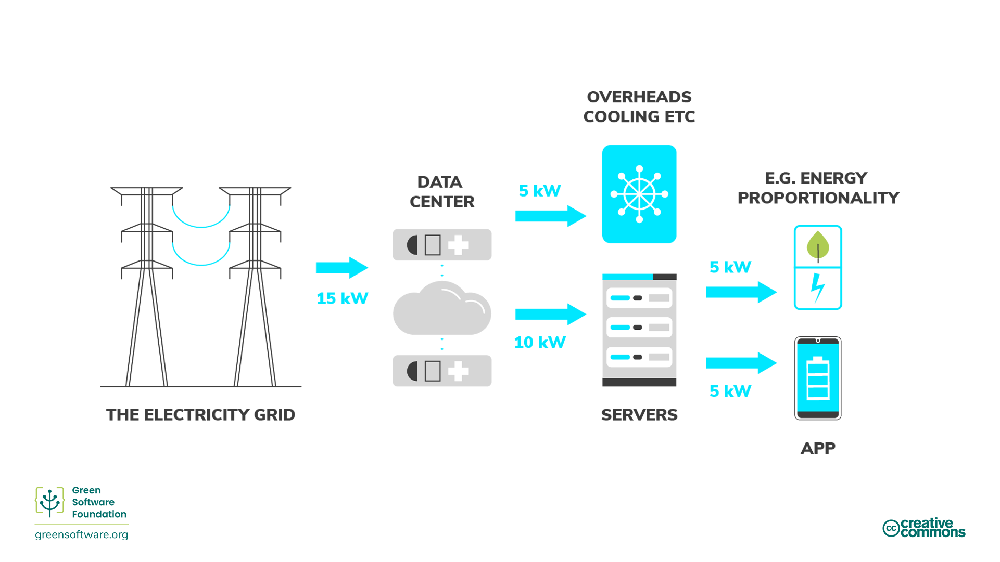

import Quiz from "/src/components/Quiz";

:::note
This is a community contributed translation. It has limited support and might not match the latest English language version of the course.
这是社区贡献的翻译。它的支持有限，可能与课程的最新英语版本不匹配
:::

:::tip 原则

_尽可能使用最少的能源_

:::

## 简介

能量是做功的能力。它有多种不同形式，例如热能、电能和化学能等，而且一种能量可以转换为另一种能量。例如，我们将煤中的化学能转化为电能。换言之，电能是由另一种能源类型转化而来的二次能源。因此，我们可以用能源消耗来度量耗电量。

从手机上运行的应用程序到数据中心运行的机器学习模型训练，所有的软件都会消耗电能。减少软件产生的电能消耗和随之而来的碳排放的最佳方法之一是使应用程序更加节能。然而，我们的责任不止于此。

绿色软件实践者对其产品所消耗的能源负责，并将产品设计得消耗尽可能少的能源。 我们应该确保过程中的每一步都尽可能减少浪费，使大部分能量用于下一步。

该链条中的最后一步是产品的终端用户，而不是完成的产品本身。这意味着我们的目标不仅仅是生产最节能的代码或“最绿色”的软件，而是考虑终端用户以及如何确保他们不会产生非必要的排放。

这可能需要将工作批量处理来获得能源比例优势，或者改变用户使用软件的方式。让我们来看看其中的一些概念以及一些可以在供应链的每个阶段（直至最终消费者）提高能源效率的方法。

## 关键概念

### 化石燃料和高碳能源

大部分电能是通过燃烧化石燃料产生的，[通常是煤](https://ourworldindata.org/grapher/world-electricity-by-source)。化石燃料是由动植物的残骸形成的。这些燃料存在于地壳中，含有碳和氢，可以燃烧产生能量。常见的化石燃料包括煤、石油和天然气。

大多数人认为电能是清洁的。我们的手不会在拔插插头时变脏，我们的笔记本电脑也不需要排气管。然而，由于大部分电能来自于燃烧化石燃料，而能源供应是碳排放[最主要的](https://www.eea.europa.eu/data-and-maps/daviz/change-of-co2-eq-emissions -2#tab-chart_4)起因，我们可以将电能与碳排放直接关联起来。就这些方面而言，电能可以被看作是碳的代表。

如果我们的目标是提高碳效率，那就意味着我们的目标也是提高能源效率，因为能源是碳的代表。这意味着每单位的工作要使用尽可能少的能源。

### 低碳能源

清洁能源是可再生、零排放的能源，在使用时不会污染大气，并通过节能实践节约能源。清洁能源、绿色能源和可再生能源之间存在重叠。 我们可以通过下列方式区分它们：

- **清洁能源** - 不产生碳排放，例如核能。
- **绿色能源** - 源自大自然。
- **可再生能源** - 来源不会耗尽，例如太阳能，风能。

### 能量计量

- 能量的计量单位是焦耳 （J），即[国际单位制](https://en.wikipedia.org/wiki/International_System_of_Units)的能量单位。
- 功率的计量单位是瓦特，1 瓦特（W）相当于每秒 1 焦耳的速率。
- 千瓦（kW）相当于每秒 1000 焦耳的速率。
- 千瓦时（kWh）是能量（J）的计量单位，相当于 1 千瓦功率持续 1 小时。

## 如何提高能源效率

现在我们知道了能源的生产方式以及相关的排放成本（根据使用的是低碳还是高碳能源），让我们来看看绿色软件实践者可以用于提高能源效率的一些方法。了解电力使用效率和能源比例意味着你可以做出更好的决策，以尽可能有效的方式使用能源并减少浪费。

### 电力使用效率

数据中心行业会使用[电力使用效率](https://datacenters.lbl.gov/sites/default/files/WP49-PUE%20A%20Compressive%20Examination%20of%20the%20Metric_v6.pdf)（PUE）指标，该指标由 Green Grid 于 2006 年提出，用于**度量数据中心能源效率**。具体来说，它涉及计算设备使用的能源多少与支持这些设备的冷却和其它开销相比有多大关系。当数据中心的 PUE 接近 1.0 时，计算几乎消耗了所有能源。当 PUE 为 2.0 时，意味着IT设备每使用 1 瓦电力，还需要额外的1瓦电力来冷却 IT 设备和向其分配电力。

另一种看待 PUE 的方式是将其视为应用程序能耗的乘数。举例来说，如果你的应用程序消耗了 10 kWh，并且运行该应用程序的数据中心的 PUE 为 1.5，则电网的实际消耗量为 15 kWh：5 kWh 用于数据中心的运营开销，10 kWh 用于运行应用程序的服务器。

### 能源比例

[能源比例](https://research.google/pubs/pub33387/)由 Google 工程师于 2007 年首次提出，用来度量**计算机消耗的功率与完成有效工作的比率（其利用率）之间的关系** 。

利用率测量的是计算机资源被使用的程度，通常以百分比的形式给出。一台被充分使用、以最大容量运转的计算机具有较高的利用率，而一台没有被使用的空闲计算机的利用率较低。

功率和利用率之间不成正比关系。 在数学层面，两变量成正比意味着它们的比值恒定。例如，在利用率为 0% 时，一台计算机可以消耗 100W；在 50% 时，消耗 180W；在 100% 时，消耗 200W。功耗和利用率之间的关系不是线性的，也不通过原点。

因此，计算机的利用率越高，它将电能转化为实际计算操作的效率就越高。提高硬件效率的一种方法是将工作负载运行在尽可能少的服务器上，使服务器以最高利用率运行，从而最大化能源效率。

#### 静态功耗

计算机的静态功耗是**在空闲状态下消耗的电量**。 静态功耗因配置和硬件组件而异，但所有部件都有一定的静态功耗。这是 PC、笔记本电脑和终端设备具有省电模式的原因之一。如果设备空闲，它最终会触发休眠模式，使磁盘和屏幕进入睡眠状态，甚至会改变 CPU 的频率。这些省电模式可以节约电力，但也有所牺牲，例如设备唤醒时重启较慢。

人们配置服务器时通常不会考虑积极的节能，甚至最低程度的节能都没有。许多在服务器上运行的用例都需要能尽快获得全部容量，因为服务器需要响应快速变化的需求，这导致许多服务器在低需求期间处于空闲模式。闲置服务器的碳成本由隐含碳和低效利用而产生。

## 总结

- 电能是碳的代表，因此构建节能的应用程序相当于构建低碳的应用程序。
- 绿色软件对其电能消耗负责，并旨在尽可能少地消耗电能。
- 量化应用程序的能耗是朝着正确方向迈出的一步，让人们开始思考应用程序如何更有效地运行。然而，要了解的不只是应用程序的能耗。用于运行软件的硬件会将部分电能用于运营开销。这在云领域中称为电力使用效率（PUE）。
- 能源比例的概念又增加了一层复杂性，因为硬件的利用率越高，它将电能转化为有用操作的效率就越高。
- 了解这些可以让绿色软件实践者更好地理解他们的应用程序如何影响现实世界中的能源消耗。

## Quiz

<Quiz
  QuizList={[
    {
      question:
        "Why do we sometimes say that electricity is a proxy for carbon?",
      answers: [
        {
          text: "Electricity is a form of energy and all kinds of energy produces carbon",
          isCorrect: false,
        },
        {
          text: "Using electricity produces carbon emissions",
          isCorrect: false,
        },
        {
          text: "Fossil fuels are burned to produce electricity",
          isCorrect: true,
        },
      ],
    },
    {
      question: "What are some examples of fossil fuels?",
      answers: [
        { text: "Carbon and hydrogen", isCorrect: false },
        { text: "Coal, oil and natural gas", isCorrect: true },
        { text: "Both of the above", isCorrect: false },
      ],
    },
    {
      question: "What is clean energy?",
      answers: [
        { text: "Energy that comes from renewable sources", isCorrect: false },
        {
          text: "Energy that doesn’t produce carbon emissions",
          isCorrect: true,
        },
        { text: "Both the above", isCorrect: false },
      ],
    },
    {
      question: "What does PUE (power usage effectiveness) measure?",
      answers: [
        { text: "Data center energy efficiency", isCorrect: true },
        { text: "Energy consumption of an application", isCorrect: false },
        {
          text: "Amount of energy used in overheads combined with that consumed by servers",
          isCorrect: false,
        },
      ],
    },
    {
      question:
        "Which of the following is something that is measured by energy proportionality?",
      answers: [
        {
          text: "Relationship between the energy used in overheads and what goes towards the servers running an application",
          isCorrect: false,
        },
        {
          text: "The percentage of a computers available resources that are being used",
          isCorrect: false,
        },
        {
          text: "Relationship between the power consumed by a computer and the rate at which useful work is done",
          isCorrect: true,
        },
      ],
    },
    {
      question: "What is the SI unit of energy?",
      answers: [
        {
          text: "Watts",
          isCorrect: false,
        },
        {
          text: "Kilowatts",
          isCorrect: false,
        },
        {
          text: "Joules",
          isCorrect: true,
        },
      ],
    },
    {
      question: "Which application consumes the most energy?",
      answers: [
        {
          text: "An application that consumes 20kWh in a data center with a PUE of 1",
          isCorrect: true,
        },
        {
          text: "An application that consumes 15kWh in a data center with a PUE of 1.2",
          isCorrect: false,
        },
        {
          text: "An application that consumes 10kWh in a data center with a PUE of 1.5",
          isCorrect: false,
        },
      ],
    },
    {
      question: "What is static power draw?",
      answers: [
        {
          text: "The carbon cost of applications being left on standby",
          isCorrect: false,
        },
        {
          text: "The electricity being drawn by an application in an idle state",
          isCorrect: true,
        },
        {
          text: "The electricity used by an application in eco mode",
          isCorrect: false,
        },
      ],
    },
  ]}
/>
