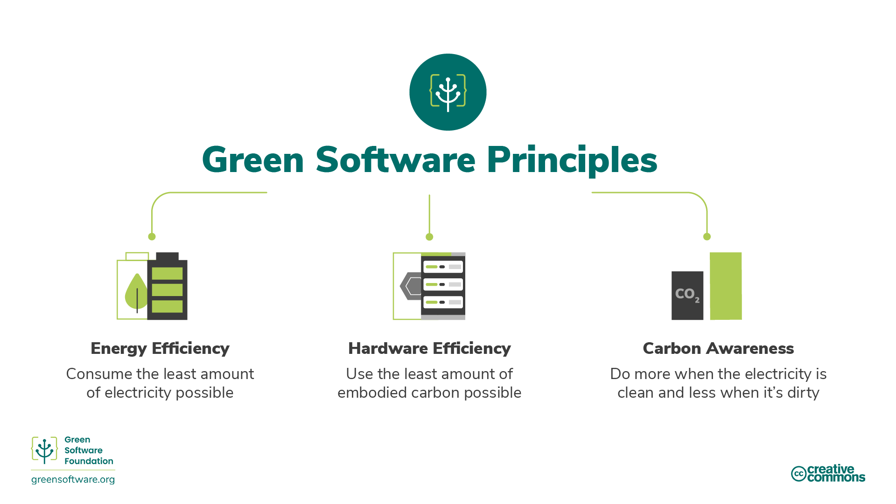

# 简介

## 什么是绿色软件？

绿色软件是处于气候科学、软件设计、电力市场、硬件和数据中心设计的交叉领域的新兴学科。

绿色软件指碳效率高的软件，即尽可能减少碳排放的软件。而能源效率、 碳意识和硬件效率，是仅有的三项能够减少软件碳排放的举措。本培训将解释以上全部的概念、如何在您的流程中落地这些举措以及如何衡量它们的效果，此外培训还会解释指导和监督绿色软件领域的一些国际准则与组织。

## 谁应该阅读本文？

任何参与构建、部署或管理软件的人员。通过学习这些原则，绿色软件从业者能够做出对其应用程序的碳污染有重大影响的决策。

## 历史

2019年，我们发布了绿色软件工程最初的八项原则。2022年，我们对绿色软件工程原则进行了更新，采纳了近年来收到的反馈，合并了一些原则，并增加了关于理解气候承诺的原则。

## 如何成为绿色软件从业者

接下来的培训涵盖绿色软件从业者应了解的 6 个关键领域：

1. **碳效率**：尽可能减少碳排放
2. **能源效率**：使用尽可能少的能源
3. **碳意识**：当电力清洁时多做，当电力污浊时少做
4. **硬件效率**：使用尽可能少的隐含碳
5. **测量**：无法测量的东西就无法改进
6. **气候承诺**：理解减碳的确切机制

每一章都将介绍一些新概念，并详细解释为什么它们对气候重要，以及如何将它们应用到您的绿色软件实践中。

## 原则、模式、实践

本课程重点描述了绿色软件**原则**，即定义、运行和构建绿色软件所需的一组核心能力。

绿色软件[**模式**](https://patterns.greensoftware.foundation/)是如何在现实世界实例中应用一项或多项原则的具体示例。原则描述了支撑绿色软件的理论，而模式则是软件从业者在其目前的软件应用中落地的实用建议。模式与供应商无关。

绿色软件**实践**是应用于特定供应商产品的模式，它告知从业者如何以更可持续的方式使用该产品。

实践应参照模式，而模式应参照原则。

此外，绿色软件基金会还发布了覆盖不同类别的[与供应商无关的绿色软件模式目录](https://patterns.greensoftware.foundation/)。
 
